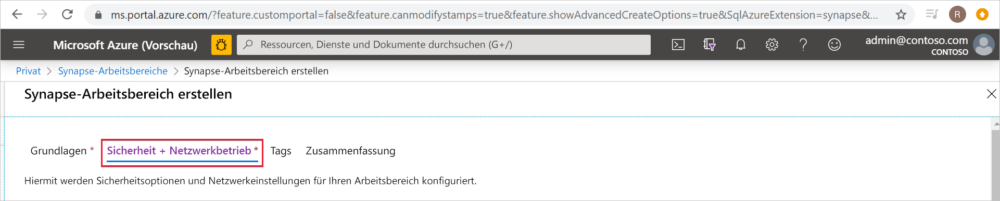
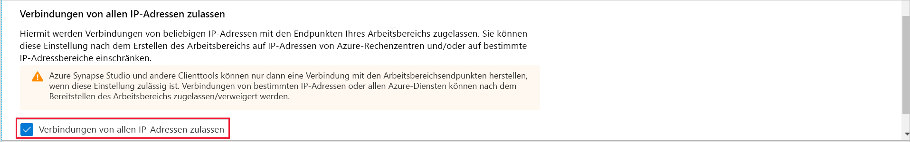
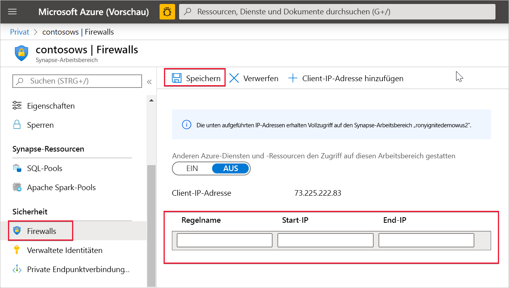

# Azure Synapse Analytics: IP-Firewallregeln

In diesem Artikel werden IP-Firewallregeln erläutert, und Sie erfahren, wie Sie diese in Azure Synapse Analytics konfigurieren.

## IP-Firewallregeln

IP-Firewallregeln gewähren oder verweigern den Zugriff auf Ihren Synapse-Arbeitsbereich basierend auf der IP-Quelladresse der jeweiligen Anforderung. Sie können IP-Firewallregeln für Ihren Arbeitsbereich konfigurieren. Auf Arbeitsbereichsebene konfigurierte IP-Firewallregeln gelten für alle öffentlichen Endpunkte des Arbeitsbereichs (dedizierte SQL-Pools, serverloser SQL-Pool und Entwicklung).

## Erstellen und Verwalten von IP-Firewallregeln

Es gibt zwei Möglichkeiten, um einem Synapse-Arbeitsbereich IP-Firewallregeln hinzuzufügen. Um eine IP-Firewall zu Ihrem Arbeitsbereich hinzuzufügen, wählen Sie **Sicherheit + Netzwerk** aus, und aktivieren beim Erstellen des Arbeitsbereichs die Option **Verbindungen von allen IP-Adressen zulassen**.

Sie können einem Synapse-Arbeitsbereich auch nach der Erstellung IP-Firewallregeln hinzufügen. Wählen Sie dazu im Azure-Portal im Bereich **Sicherheit** die Option **Firewalls** aus. Um eine neue IP-Firewallregel hinzuzufügen, geben Sie einen Namen sowie eine Start-IP-Adresse und eine End-IP-Adresse an. Wenn Sie abschließend **Speichern** aus.

## Herstellen einer Verbindung mit Synapse aus dem eigenen Netzwerk

Sie können über Synapse Studio eine Verbindung mit Ihrem Synapse-Arbeitsbereich herstellen. Sie können auch SQL Server Management Studio (SSMS) verwenden, um eine Verbindung mit den SQL-Ressourcen (dedizierte SQL-Pools und serverloser SQL-Pool) in Ihrem Arbeitsbereich herzustellen.

Stellen Sie sicher, dass die Firewall in Ihrem Netzwerk und auf Ihrem lokalen Computer ausgehende TCP-Kommunikation für Synapse Studio über die TCP-Ports 80, 443 und 1443 zulässt.

Sie müssen auch die ausgehende Kommunikation über den UDP-Port 53 für Synapse Studio zulassen. Um eine Verbindung mithilfe von Tools wie SSMS oder Power BI herzustellen, müssen Sie die ausgehende Kommunikation über den TCP-Port 1433 zulassen.

Wenn Sie die standardmäßige Richtlinieneinstellung für die Umleitung von Verbindungen verwenden, müssen Sie möglicherweise die ausgehende Kommunikation über weitere Ports zulassen. Mehr über Verbindungsrichtlinien erfahren Sie [hier](../../azure-sql/database/connectivity-architecture.md#connection-policy).

## Nächste Schritte

Erstellen eines [Azure Synapse-Arbeitsbereichs](../quickstart-create-workspace.md)

Erstellen eines Azure Synapse-Arbeitsbereichs mit einem [verwalteten virtuellen Arbeitsbereichsnetzwerk](./synapse-workspace-managed-vnet.md)