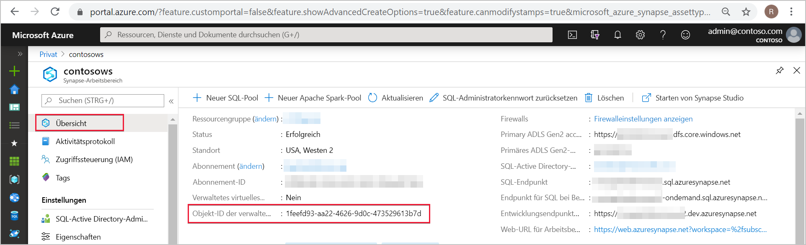
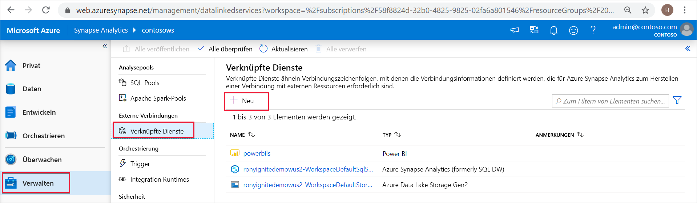
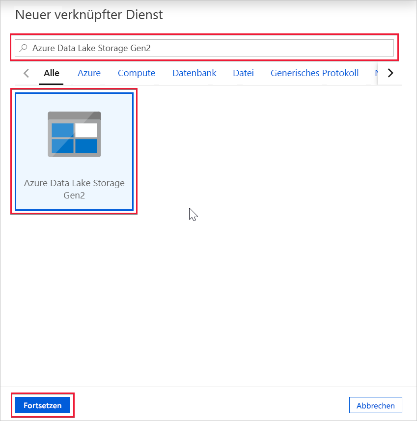
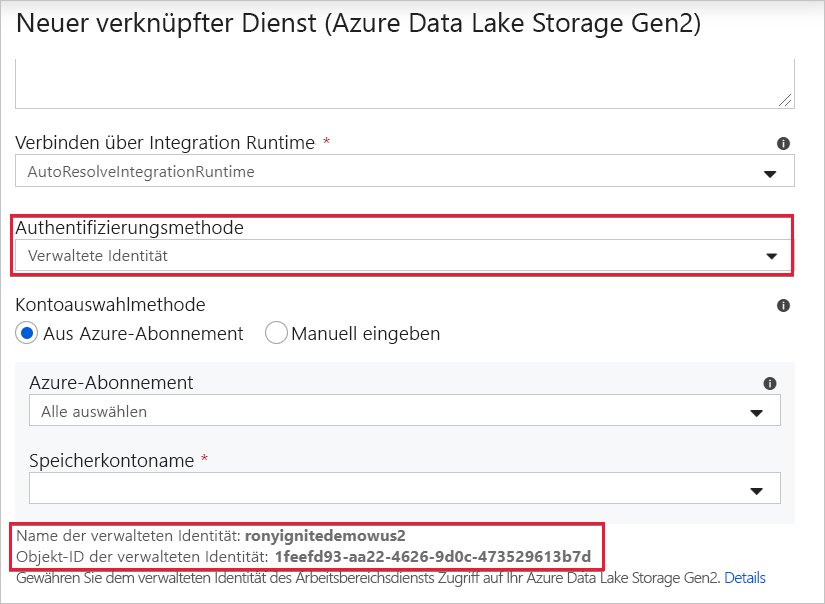

# Azure Synapse-Arbeitsbereich – verwaltete Identität

In diesem Artikel lernen Sie das Konzept der verwalteten Identität im Azure Synapse-Arbeitsbereich kennen.

## Verwaltete Identitäten

Eine verwaltete Identität für Azure-Ressourcen ist ein Feature von Azure Active Directory. Dieses Feature stellt für Azure-Dienste eine automatisch verwaltete Identität in Azure AD bereit. Sie können die Funktion „Verwaltete Identität“ verwenden, um sich bei jedem Dienst zu authentifizieren, der die Azure AD-Authentifizierung unterstützt.

„Verwaltete Identitäten für Azure-Ressourcen“ ist der neue Name für den Dienst, der früher als „Verwaltete Dienstidentität“ (Managed Service Identity, MSI) bezeichnet wurde. Weitere Informationen finden Sie unter [Verwaltete Identitäten](../../active-directory/managed-identities-azure-resources/overview.md).

## Azure Synapse-Arbeitsbereich – verwaltete Identität

Ein systemseitig zugewiesene verwaltete Identität wird für Ihren Azure Synapse-Arbeitsbereich erstellt, wenn Sie diesen Arbeitsbereich anlegen.

>[!NOTE]
>Diese verwaltete Identität für den Arbeitsbereich wird im Rest dieses Dokuments als „verwaltete Identität“ bezeichnet.

Azure Synapse verwendet die verwaltete Identität zum Integrieren von Pipelines. Der Lebenszyklus der verwalteten Identität ist direkt an den Azure Synapse-Arbeitsbereich geknüpft. Wenn Sie den Azure Synapse-Arbeitsbereich löschen, wird auch die verwaltete Identität bereinigt.

Die verwaltete Identität des Arbeitsbereichs benötigt Berechtigungen zum Ausführen von Vorgängen in den Pipelines. Sie können die Objekt-ID oder den Namen Ihres Azure Synapse-Arbeitsbereichs verwenden, um die verwaltete Identität zu suchen, wenn Sie Berechtigungen erteilen.

## Abrufen der verwalteten Identität im Azure-Portal

Sie können die verwaltete Identität im Azure-Portal abrufen. Öffnen Sie Ihren Azure Synapse-Arbeitsbereich im Azure-Portal, und wählen Sie im linken Navigationsbereich **Übersicht** aus. Die Objekt-ID der verwalteten Identität wird im Hauptbildschirm angezeigt.

Die Informationen zur verwalteten Identität werden auch angezeigt, wenn Sie einen verknüpften Dienst erstellen, der die Authentifizierung der verwalteten Identität über Azure Synapse Studio unterstützt.

Starten Sie **Azure Synapse Studio**, und wählen Sie im linken Navigationsbereich die Registerkarte **Verwalten** aus. Wählen Sie dann **Verknüpfter Dienst** aus, und klicken Sie auf die Option **+ Neu**, um einen neuen verknüpften Dienst zu erstellen.

Geben Sie im Fenster **Neuer verknüpfter Dienst** den Text *Azure Data Lake Storage Gen2* ein. Wählen Sie aus der Liste darunter den Ressourcentyp **Azure Data Lake Storage Gen2** aus, und klicken Sie auf **Weiter**.

Wählen Sie im nächsten Fenster **Verwaltete Identität** als **Authentifizierungsmethode** aus. Der **Name** und die **Objekt-ID** der verwalteten Identität werden angezeigt.

## Nächste Schritte

Informieren Sie sich ausführlicher über das [Erteilen von Berechtigungen für die verwaltete Identität des Azure Synapse-Arbeitsbereichs](./how-to-grant-workspace-managed-identity-permissions.md).
