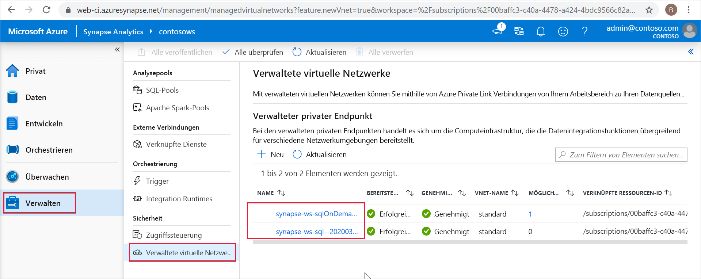

# Verwaltete private Endpunkte in Synapse

In diesem Artikel erfahren Sie mehr über verwaltete private Endpunkte in Azure Synapse Analytics.

## Verwaltete private Endpunkte

Bei verwalteten privaten Endpunkten handelt es sich um private Endpunkte, die in einem verwalteten virtuellen Netzwerk erstellt werden, das Ihrem Azure Synapse-Arbeitsbereich zugeordnet ist. Mit verwalteten privaten Endpunkten wird eine private Verbindung mit Azure-Ressourcen hergestellt. Azure Synapse verwaltet diese privaten Endpunkte für Sie. Sie können verwaltete private Endpunkte über Ihren Azure Synapse-Arbeitsbereich erstellen, um auf Azure-Dienste (z. B. Azure Storage oder Azure Cosmos DB) und von Azure gehostete Kunden- bzw. Partnerdienste zuzugreifen.

Bei Verwendung von verwalteten privaten Endpunkten verläuft der Datenverkehr zwischen Ihrem Azure Synapse-Arbeitsbereich und anderen Azure-Ressourcen ausschließlich über das Microsoft-Backbone-Netzwerk. Verwaltete private Endpunkte dienen als Schutz vor Datenexfiltration. Für einen verwalteten privaten Endpunkt wird eine private IP-Adresse aus Ihrem verwalteten virtuellen Netzwerk genutzt, um den Azure-Dienst, mit dem Ihr Azure Synapse-Arbeitsbereich kommuniziert, auf effektive Weise in Ihr virtuelles Netzwerk einzubinden. Verwaltete private Endpunkte werden nicht dem gesamten Dienst zugeordnet, sondern nur einer bestimmten Ressource in Azure. Kunden können die Konnektivität auf eine bestimmte Ressource beschränken, die von Ihrer Organisation genehmigt wurde. 

Weitere Informationen finden Sie in der [Dokumentation zu Private Link](../../private-link/index.yml).

>[!IMPORTANT]
>Verwaltete private Endpunkte werden nur in Azure Synapse-Arbeitsbereichen mit einem verwalteten virtuellen Arbeitsbereichsnetzwerk unterstützt.

>[!NOTE]
>Beim Erstellen eines Azure Synapse-Arbeitsbereichs können Sie angeben, dass diesem ein verwaltetes virtuelles Netzwerk zugeordnet werden soll. Wenn Sie die Zuordnung eines verwalteten virtuellen Netzwerks zu Ihrem Arbeitsbereich auswählen, können Sie auch angeben, dass der ausgehende Datenverkehr Ihres Arbeitsbereichs nur an genehmigte Ziele fließen darf. Sie müssen verwaltete private Endpunkte für diese Ziele erstellen. 

Wenn Sie einen verwalteten privaten Endpunkt in Azure Synapse erstellen, wird eine Verbindung mit einem privaten Endpunkt mit dem Status „Ausstehend“ erstellt. Ein Genehmigungsworkflow wird gestartet. Der Besitzer der Ressource für private Links ist für die Genehmigung oder Ablehnung der Verbindung verantwortlich. Wenn der Besitzer die Verbindung genehmigt, wird der private Link eingerichtet. Wenn der Besitzer die Verbindung jedoch nicht genehmigt, wird der private Link nicht eingerichtet. In beiden Fällen wird der verwaltete private Endpunkt mit dem Status der Verbindung aktualisiert. Nur ein verwalteter privater Endpunkt im genehmigten Zustand kann verwendet werden, um Datenverkehr an die Ressource für die private Verbindung zu senden, die mit dem verwalteten Endpunkt verknüpft ist.

## Verwaltete private Endpunkte für einen dedizierten SQL-Pool und einen serverlosen SQL-Pool

Dedizierter SQL-Pool und serverloser SQL-Pool sind Analysefunktionen in Ihrem Azure Synapse-Arbeitsbereich. Diese Funktionen nutzen eine mehrinstanzenfähige Infrastruktur, die nicht im [verwalteten virtuellen Arbeitsbereichsnetzwerk](./synapse-workspace-managed-vnet.md) bereitgestellt wird.

Bei der Erstellung eines Arbeitsbereichs erstellt Azure Synapse zwei verwaltete private Endpunkte: einen für den dedizierten SQL-Pool und einen für den serverlosen SQL-Pool. 

Diese beiden verwalteten privaten Endpunkte werden in Synapse Studio aufgeführt. Wählen Sie für die Anzeige in Studio im linken Navigationsbereich **Verwalten** und anschließend **Verwaltete private Endpunkte** aus.

Der verwaltete private Endpunkt für den SQL-Pool heißt *synapse-ws-sql--\<workspacename\>* und der für den serverlosen SQL-Pool *synapse-ws-sqlOnDemand--\<workspacename\>* .

Diese beiden verwalteten privaten Endpunkte werden automatisch für Sie erstellt, wenn Sie Ihren Azure Synapse-Arbeitsbereich erstellen. Diese Endpunkte werden Ihnen nicht in Rechnung gestellt.

## Nächste Schritte

Weitere Informationen finden Sie im Artikel [Erstellen eines verwalteten privaten Endpunkts zu Ihrer Datenquelle (Vorschau)](./how-to-create-managed-private-endpoints.md).