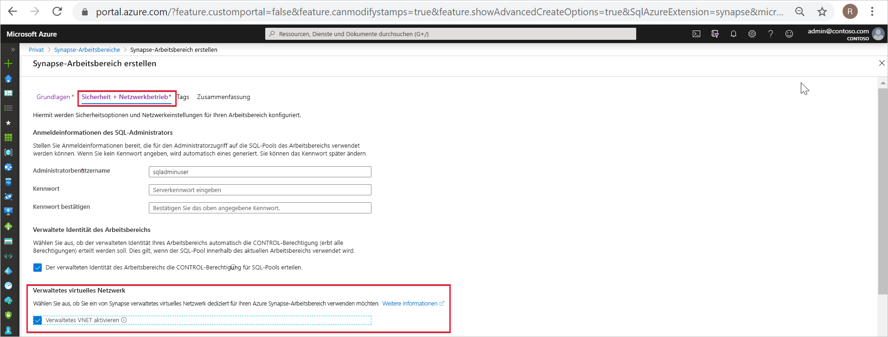
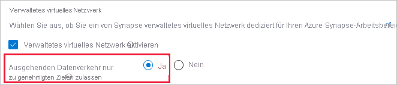
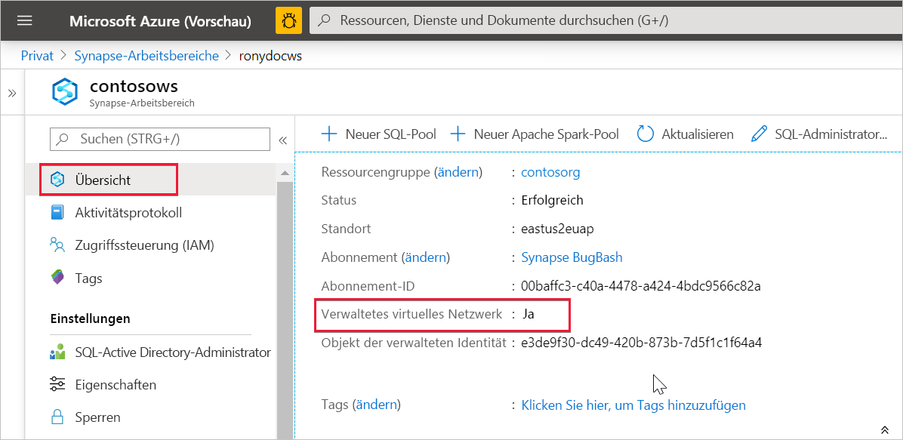

# Azure Synapse Analytics: verwaltetes virtuelles Netzwerk

Dieser Artikel enthält Informationen zum verwalteten virtuellen Netzwerk in Azure Synapse Analytics.

## Verwaltetes virtuelles Arbeitsbereichsnetzwerk

Bei der Erstellung Ihres Azure Synapse-Arbeitsbereichs können Sie ihn mit einem virtuellen Microsoft Azure-Netzwerk verknüpfen. Das mit Ihrem Arbeitsbereich verknüpfte virtuelle Netzwerk wird von Azure Synapse verwaltet. Dieses virtuelle Netzwerk wird als *verwaltetes virtuelles Arbeitsbereichsnetzwerk* bezeichnet.

Das verwaltete virtuelle Arbeitsbereichsnetzwerk hat vier Vorteile:

- Mit einem verwalteten virtuellen Arbeitsbereichsnetzwerk können Sie die Verwaltung des virtuellen Netzwerks an Azure Synapse auslagern.
- Sie müssen keine NSG-Eingangsregeln für Ihre eigenen virtuellen Netzwerke konfigurieren, um eingehenden Azure Synapse-Verwaltungsdatenverkehr für Ihr virtuelles Netzwerk zuzulassen. Sind diese NSG-Regeln nicht korrekt konfiguriert, kommt es zu Dienstunterbrechungen für Kunden.
- Sie müssen für Lastspitzen kein Subnetz für Ihre Spark-Cluster erstellen.
- Das verwaltete virtuelle Arbeitsbereichsnetzwerk schützt zusammen mit verwalteten privaten Endpunkten vor Datenexfiltration. In einem Arbeitsbereich, der mit einem verwalteten virtuellen Arbeitsbereichsnetzwerk verknüpft ist, können nur verwaltete private Endpunkte erstellt werden.

Durch die Erstellung eines Arbeitsbereichs mit einem verknüpften verwalteten virtuellen Arbeitsbereichsnetzwerk wird sichergestellt, dass der Arbeitsbereich im Netzwerk von anderen Arbeitsbereichen isoliert ist. Azure Synapse bietet in einem Arbeitsbereich verschiedene Analysefunktionen: Datenintegration, serverloser Apache Spark-Pool, dedizierter SQL-Pool und serverloser SQL-Pool.

Wenn Ihr Arbeitsbereich über ein verwaltetes virtuelles Arbeitsbereichsnetzwerk verfügt, werden Datenintegrations- und Spark-Ressourcen darin bereitgestellt. Ein verwaltetes virtuelles Arbeitsbereichsnetzwerk bietet für Spark-Aktivitäten auch eine Isolation auf Benutzerebene, da sich jeder Spark-Cluster in einem eigenen Subnetz befindet.

Dedizierter SQL-Pool und serverloser SQL-Pool sind mehrinstanzenfähig und befinden sich daher außerhalb des verwalteten virtuellen Arbeitsbereichsnetzwerks. Für die arbeitsbereichsinterne Kommunikation mit dediziertem SQL-Pool und serverlosem SQL-Pool werden private Azure-Links verwendet. Diese privaten Links werden automatisch erstellt, wenn Sie einen Arbeitsbereich mit einem verknüpften verwalteten virtuellen Arbeitsbereichsnetzwerk erstellen.

>[!IMPORTANT]
>Nachdem der Arbeitsbereich erstellt wurde, kann diese Arbeitsbereichskonfiguration nicht mehr geändert werden. So ist es beispielsweise nicht möglich, die Konfiguration eines Arbeitsbereichs, der mit keinem verwalteten virtuellen Arbeitsbereichsnetzwerk verknüpft ist, zu ändern und ihn mit einem virtuellen Netzwerk zu verknüpfen. Analog dazu ist es nicht möglich, die Konfiguration eines Arbeitsbereichs, der mit einem verwalteten virtuellen Arbeitsbereichsnetzwerk verknüpft ist, zu ändern und die Verknüpfung mit einem virtuellen Netzwerk aufzuheben.

## Erstellen eines Azure Synapse-Arbeitsbereichs mit einem verwalteten virtuellen Arbeitsbereichsnetzwerk

Registrieren Sie den Netzwerkressourcenanbieter, falls dies noch nicht geschehen ist. Durch Registrieren eines Ressourcenanbieters wird Ihr Abonnement für die Verwendung mit dem Ressourcenanbieter konfiguriert. Wählen Sie in der Liste der Ressourcenanbieter *Microsoft.Network* aus, wenn Sie die [Registrierung durchführen](../../azure-resource-manager/management/resource-providers-and-types.md).

Wenn Sie einen Azure Synapse-Arbeitsbereich mit einem verknüpften verwalteten virtuellen Arbeitsbereichsnetzwerk erstellen möchten, wählen Sie im Azure-Portal die Registerkarte **Netzwerk** aus, und aktivieren Sie das Kontrollkästchen **Verwaltetes VNET aktivieren**.

Ist das Kontrollkästchen deaktiviert, wird Ihr Arbeitsbereich nicht mit einem virtuellen Netzwerk verknüpft.

>[!IMPORTANT]
>Sie können private Links nur in einem Arbeitsbereich mit verwaltetem virtuellem Arbeitsbereichsnetzwerk verwenden.

Nachdem Sie die Entscheidung für die Zuordnung eines verwalteten virtuellen Arbeitsbereichsnetzwerks zu Ihrem Arbeitsbereich getroffen haben, können Sie den Schutz vor Datenexfiltration einrichten. Lassen Sie hierfür ausgehende Verbindungen vom verwalteten virtuellen Arbeitsbereichsnetzwerk nur zu genehmigten Zielen zu, indem Sie [verwaltete private Endpunkte](./synapse-workspace-managed-private-endpoints.md) verwenden. Wählen Sie **Ja** aus, um ausgehenden Datenverkehr aus dem verwalteten virtuellen Arbeitsbereichsnetzwerk zu Zielen auf den Weg über verwaltete private Endpunkte zu beschränken. 

>[!IMPORTANT]
>Metastore ist in Synapse-Arbeitsbereichen deaktiviert, die über ein verwaltetes virtuelles Netzwerk mit aktiviertem Schutz vor Datenexfiltration verfügen. In diesen Arbeitsbereichen können Sie Spark SQL nicht nutzen.

Wählen Sie **Nein** aus, um für den Arbeitsbereich ausgehenden Datenverkehr zu beliebigen Zielen zuzulassen.

Sie können die Ziele, für die verwaltete private Endpunkte erstellt werden, auch über Ihren Azure Synapse-Arbeitsbereich steuern. Standardmäßig sind verwaltete private Endpunkte für Ressourcen auf demselben AAD-Mandanten zulässig, dem Ihr Abonnement angehört. Wenn Sie einen verwalteten privaten Endpunkt für eine Ressource auf einem AAD-Mandanten erstellen möchten, der sich vom Mandanten Ihres Abonnements unterscheidet, können Sie diesen AAD-Mandanten hinzufügen, indem Sie die Option **+ Hinzufügen** verwenden. Sie können den AAD-Mandanten entweder in der Dropdownliste auswählen oder die ID des AAD-Mandanten manuell eingeben.

Nach der Erstellung des Arbeitsbereichs können Sie überprüfen, ob Ihr Azure Synapse-Arbeitsbereich mit einem verwalteten virtuellen Arbeitsbereichsnetzwerk verknüpft ist. Wählen Sie hierfür im Azure-Portal die Option **Übersicht** aus.

## Nächste Schritte

Erstellen Sie einen [Azure Synapse-Arbeitsbereich](../quickstart-create-workspace.md).

Informieren Sie sich ausführlicher über [verwaltete private Endpunkte](./synapse-workspace-managed-private-endpoints.md).

[Erstellen Sie verwaltete private Endpunkte für Ihre Datenquellen.](./how-to-create-managed-private-endpoints.md)
