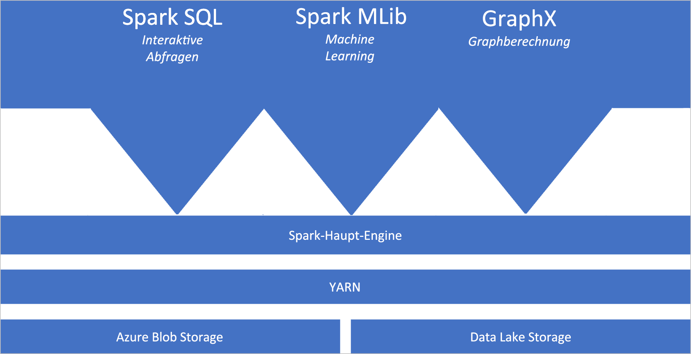
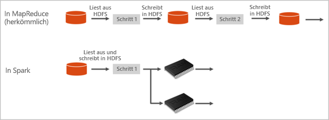

# Was ist Apache Spark in Azure Synapse Analytics?

Apache Spark ist ein Framework für die Parallelverarbeitung, das In-Memory-Verarbeitung unterstützt, um die Leistung von Big Data-Analyseanwendungen zu steigern. Apache Spark in Azure Synapse Analytics ist eine der cloudbasierten Apache Spark-Implementierungen von Microsoft. Azure Synapse vereinfacht das Erstellen und Konfigurieren eines Spark-Pools (Vorschauversion) in Azure. Spark-Pools in Azure Synapse sind mit Azure Storage sowie mit Azure Data Lake Storage der zweiten Generation kompatibel. Dadurch können Sie Azure Spark-Pools für die Verarbeitung Ihrer in Azure gespeicherten Daten verwenden.

[!INCLUDE [preview](../includes/note-preview.md)]

## Was ist Apache Spark?

Apache Spark stellt Primitive für In-Memory-Clustercomputing bereit. Bei einem Spark-Auftrag können Daten in den Arbeitsspeicher geladen, zwischengespeichert und dann wiederholt abgefragt werden. In-Memory-Computing ist im Vergleich zu datenträgerbasierten Anwendungen deutlich schneller. Spark kann auch in diverse Programmiersprache integriert werden, um die Arbeit mit verteilten Datasets (beispielsweise lokale Sammlungen) zu ermöglichen. Es ist nicht erforderlich, alles in Form von Mapper- und Reducer-Vorgängen zu strukturieren.

Spark-Pools in Azure Synapse bieten einen vollständig verwalteten Spark-Dienst. Im Anschluss werden die Vorteile der Erstellung eines Spark-Pools in Synapse Analytics aufgeführt:

| Funktion | BESCHREIBUNG |
| --- | --- |
| Geschwindigkeit und Effizienz |Spark-Instanzen werden in etwa zwei Minuten (weniger als 60 Knoten) bzw. in etwa fünf Minuten (mehr als 60 Knoten) gestartet. Die Instanz wird standardmäßig fünf Minuten nach dem letzten ausgeführten Auftrag heruntergefahren, sofern sie nicht durch eine Notebookverbindung aufrechterhalten wird. |
| Einfache Erstellung |Über das Azure-Portal, mithilfe von Azure PowerShell oder über das Synapse Analytics .NET SDK lässt sich innerhalb weniger Minuten ein neuer Spark-Pool in Azure Synapse erstellen. Weitere Informationen finden Sie unter [Schnellstart: Erstellen eines Apache Spark-Pools (Vorschauversion) in Synapse Analytics mithilfe von Webtools](../quickstart-create-apache-spark-pool-studio.md). |
| Einfache Bedienung |Synapse Analytics enthält ein benutzerdefiniertes, von [Nteract](https://nteract.io/) abgeleitetes Notebook. Diese Notebooks können Sie für die interaktive Datenverarbeitung und -visualisierung verwenden.|
| REST-APIs |Spark in Synapse Analytics beinhaltet [Apache Livy](https://github.com/cloudera/hue/tree/master/apps/spark/java#welcome-to-livy-the-rest-spark-server), einen auf der REST-API basierenden Spark-Auftragsserver für die Remoteübermittlung und -überwachung von Aufträgen. |
| Unterstützung von Azure Data Lake Storage der zweiten Generation| Spark-Pools in Azure Synapse können Azure Data Lake Storage der zweiten Generation sowie Blobspeicher nutzen. Weitere Informationen zu Data Lake Storage finden Sie unter [Übersicht über Azure Data Lake Storage](../../data-lake-store/data-lake-store-overview.md). |
| Integration in Drittanbieter-IDEs | Azure Synapse bietet ein IDE-Plug-In für [IntelliJ IDEA von JetBrains](https://www.jetbrains.com/idea/), das verwendet werden kann, um Anwendung zu erstellen und an einen Spark-Pool zu übermitteln. |
| Vorinstallierte Anaconda-Bibliotheken |Spark-Pools in Azure Synapse verfügen über vorinstallierte Anaconda-Bibliotheken. [Anaconda](https://docs.continuum.io/anaconda/) bietet ca. 200 Bibliotheken für Machine Learning, Datenanalyse, Visualisierung usw. |
| Skalierbarkeit | Für Apache Spark-Pools in Azure Synapse kann die automatische Skalierung aktiviert werden, sodass Pools je nach Bedarf durch Hinzufügen oder Entfernen von Knoten skaliert werden können. Darüber hinaus können Spark-Pools ohne Datenverlust heruntergefahren werden, da alle Daten in Azure Storage oder Data Lake Storage gespeichert werden. |

Spark-Pools in Azure Synapse enthalten die folgenden Komponenten, die standardmäßig in den Pools verfügbar sind:

- [Spark Core](https://spark.apache.org/docs/latest/). Umfasst Spark Core, Spark SQL, GraphX und MLlib.
- [Anaconda](https://docs.continuum.io/anaconda/)
- [Apache Livy](https://github.com/cloudera/hue/tree/master/apps/spark/java#welcome-to-livy-the-rest-spark-server)
- [Nteract-Notebook](https://nteract.io/)

## Architektur von Spark-Pools

Die Komponenten von Spark sind leicht nachvollziehbar, wenn Sie sich mit der Ausführung von Spark in Synapse Analytics vertraut machen.

Spark-Anwendungen werden als unabhängige Gruppen von Prozessen in einem Pool ausgeführt und vom SparkContext-Objekt in Ihrem Hauptprogramm (dem so genannten Treiberprogramm) koordiniert.

Das SparkContext-Objekt kann eine Verbindung mit dem Cluster-Manager herstellen, der anwendungsübergreifend Ressourcen zuordnet. Der Cluster-Manager ist [Apache Hadoop YARN](https://hadoop.apache.org/docs/current/hadoop-yarn/hadoop-yarn-site/YARN.html). Nach der Verbindungsherstellung ruft Spark Executors für Knoten im Pool ab. Dabei handelt es sich um Prozesse, die Berechnungen ausführen und Daten für Ihre Anwendung speichern. Als Nächstes wird Ihr Anwendungscode (definiert durch JAR- oder Python-Dateien, die an SparkContext übergeben werden) an die Executors gesendet. Abschließend sendet SparkContext Aufgaben zur Ausführung an die Executors.

Das SparkContext-Objekt führt die Hauptfunktion des Benutzers und dann die verschiedenen parallelen Vorgänge auf den Knoten aus. Anschließend sammelt es die Ergebnisse der Vorgänge. Von den Knoten werden Daten aus dem Dateisystem gelesen und in das Dateisystem geschrieben. Außerdem werden transformierte Daten von den Knoten als RDDs (Resilient Distributed Datasets) im Arbeitsspeicher zwischengespeichert.

Das SparkContext-Objekt stellt eine Verbindung mit dem Spark-Pool her und ist für die Konvertierung einer Anwendung in einen gerichteten (azyklischen) Graphen verantwortlich. Der Graph setzt sich aus einzelnen Aufgaben zusammen, die im Rahmen eines Executor-Prozesses auf den Knoten ausgeführt werden. Jede Anwendung erhält ihre eigenen Executor-Prozesse, die über die gesamte Anwendungsdauer aktiv bleiben und Aufgaben in mehreren Threads ausführen.

## Anwendungsfälle für Apache Spark in Synapse Analytics

Spark-Pools in Synapse Analytics können in folgenden Schlüsselszenarien genutzt werden:

### Datentechnik/-aufbereitung

Apache Spark enthält zahlreiche Sprachfeatures, die die Aufbereitung und Verarbeitung großer Datenmengen unterstützen, um ihren Nutzen zu steigern und sie für andere Synapse Analytics-Diensten nutzbar zu machen. Dies wird über mehrere Sprachen (C#, Scala, PySpark, Spark SQL) und bereitgestellte Bibliotheken für die Verarbeitung und Konnektivität ermöglicht.

### Machine Learning

Mit [MLlib](https://spark.apache.org/mllib/) verfügt Apache Spark über eine Spark-basierte Machine Learning-Bibliothek, die in einem Spark-Pool in Synapse Analytics verwendet werden kann. Spark-Pools in Synapse Analytics enthalten außerdem Anaconda – eine Python-Distribution mit verschiedenen Data Science-Paketen (einschließlich Machine Learning). In Kombination mit der integrierten Notebookunterstützung ergibt sich eine Umgebung zur Erstellung von Machine Learning-Anwendungen.

## Erste Schritte

Die folgenden Artikel enthalten weitere Informationen zu Apache Spark in Synapse Analytics:

- [Schnellstart: Erstellen eines Apache Spark-Pools (Vorschauversion) in Synapse Analytics mithilfe von Webtools](../quickstart-create-apache-spark-pool-portal.md)
- [Schnellstart: Erstellen eines Apache Spark-Notebooks](../quickstart-apache-spark-notebook.md)
- [Tutorial: Machine Learning mit Apache Spark](./apache-spark-machine-learning-mllib-notebook.md)
- [Offizielle Apache Spark-Dokumentation](https://spark.apache.org/docs/latest/)

> [!NOTE]
> In der offiziellen Apache Spark-Dokumentation wird teilweise die Spark-Konsole verwendet, diese ist in Azure Synapse Spark jedoch nicht verfügbar. Verwenden Sie stattdessen das Notebook oder IntelliJ.

## Nächste Schritte

In dieser Übersicht wurden einige grundlegende Informationen zu Apache Spark in Azure Synapse Analytics vermittelt. Im nächsten Artikel erfahren Sie, wie Sie einen Spark-Pool in Azure Synapse Analytics erstellen:

- [Schnellstart: Erstellen eines Apache Spark-Pools (Vorschauversion) in Synapse Analytics mithilfe von Webtools](../quickstart-create-apache-spark-pool-portal.md)
