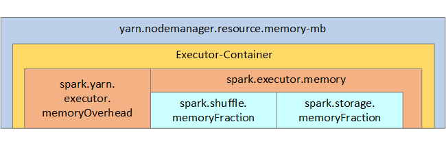

# <a name="optimize-apache-spark-jobs-preview-in-azure-synapse-analytics"></a>Optimieren von Apache Spark-Aufträgen (Vorschauversion) in Azure Synapse Analytics

Hier erfahren Sie, wie Sie die [Apache Spark](https://spark.apache.org/)-Clusterkonfiguration für Ihre spezielle Workload optimieren.  Die häufigste Herausforderung ist unzureichender Arbeitsspeicher aufgrund von nicht ordnungsgemäßen Konfigurationen (insbesondere bei falsch dimensionierten Executors), Vorgängen mit langer Ausführungsdauer und Tasks, die zu kartesischen Vorgängen führen. Sie können Aufträge beschleunigen, indem Sie ausreichend Cachespeicherplatz zuweisen und [Datenschiefe](#optimize-joins-and-shuffles) zulassen. Um die beste Leistung zu erzielen, überwachen und überprüfen Sie Spark-Auftragsausführungen mit langer Ausführungsdauer und hohem Ressourcenverbrauch.

Die folgenden Abschnitte beschreiben allgemeine Optimierungen und Empfehlungen für Spark-Aufträge.

## <a name="choose-the-data-abstraction"></a>Auswählen der Datenabstraktion

Frühere Versionen von Spark verwenden RDDs zum Abstrahieren von Daten. In Spark 1.3 und 1.6 wurden DataFrames und Datasets eingeführt. Diese Features bieten jeweils folgende Vorteile:

* **Dataframes**
  * In den meisten Situationen die beste Wahl.
  * Ermöglicht die Abfrageoptimierung durch Catalyst.
  * Codegenerierung für die gesamte Phase.
  * Direkter Zugriff auf den Arbeitsspeicher.
  * Geringer Overhead durch Garbage Collection (GC).
  * Nicht so entwicklerfreundlich wie Datasets, da keine Überprüfungen zur Kompilierzeit und Domänenobjektprogrammierung vorhanden sind.
* **Datasets**
  * Gut geeignet für komplexe ETL-Pipelines (Extrahieren, Transformieren, Laden), in denen die Leistungseinbußen akzeptabel sind.
  * Nicht gut geeignet in Aggregationen, in denen die Auswirkungen auf die Leistung beträchtlich sein können.
  * Ermöglicht die Abfrageoptimierung durch Catalyst.
  * Entwicklerfreundlich dank Domänenobjektprogrammierung und Überprüfungen zu Kompilierzeit.
  * Erzeugt Overhead für Serialisierung/Deserialisierung.
  * Hoher GC-Overhead.
  * Unterbricht die Codegenerierung für die gesamte Phase.
* **RDDs**
  * Sie müssen RDDs nicht verwenden, sofern Sie kein neues benutzerdefiniertes RDD erstellen.
  * Keine Abfrageoptimierung durch Catalyst.
  * Keine Codegenerierung für die gesamte Phase.
  * Hoher GC-Overhead.
  * Müssen ältere Spark 1.x-APIs verwenden.

## <a name="use-optimal-data-format"></a>Verwenden des optimalen Datenformats

Spark unterstützt eine Vielzahl von Formaten, z.B. CSV, JSON, XML, PARQUET, ORC und AVRO. Spark kann erweitert werden und viele weitere Formate mit externen Datenquellen unterstützen. Weitere Informationen dazu finden Sie unter [Apache Spark Packages](https://spark-packages.org) (Apache Spark-Pakete).

Hinsichtlich der Leistung ist Parquet mit *Snappy-Komprimierung* das beste Format. Dies ist die Standardeinstellung in Spark 2.x. Parquet speichert Daten im Spaltenformat und ist in Spark in hohem Maß optimiert. Die *Snappy-Komprimierung* führt unter Umständen zu größeren Dateien als die GZIP-Komprimierung. Diese Dateien sind teilbar und werden daher schneller dekomprimiert.

## <a name="use-the-cache"></a>Verwenden des Caches

Spark stellt einen eigenen nativen Cachemechanismus bereit, der über verschiedene Methoden wie `.persist()`, `.cache()` und `CACHE TABLE` verwendet werden kann. Dieses native Caching ist bei kleinen Datasets sowie in ETL-Pipelines effektiv, bei denen Zwischenergebnisse zwischengespeichert werden müssen. Das native Spark-Caching funktioniert jedoch derzeit nicht gut mit Partitionierung, da eine zwischengespeicherte Tabelle die Partitionierungsdaten nicht beibehält.

## <a name="use-memory-efficiently"></a>Effiziente Verwendung des Arbeitsspeichers

Spark platziert Daten in den Arbeitsspeicher, daher ist die Verwaltung von Arbeitsspeicherressourcen ein sehr wichtiger Aspekt beim Optimieren der Ausführung von Spark-Aufträgen.  Es gibt mehrere Verfahren, die Sie anwenden können, um den Arbeitsspeicher Ihres Clusters effizient zu nutzen.

* Legen Sie kleinere Datenpartitionen an, und berücksichtigen Sie in Ihrer Partitionierungsstrategie die Größe, den Typ und die Verteilung Ihrer Daten.
* Erwägen Sie die Verwendung der neueren, effizienteren [Kryo-Datenserialisierung](https://github.com/EsotericSoftware/kryo) anstelle der standardmäßigen Java-Serialisierung.
* Überwachen und optimieren Sie die Spark-Konfigurationseinstellungen.

Die folgende Abbildung zeigt die Spark-Arbeitsspeicherstruktur und einige wichtige Arbeitsspeicherparameter für den Executor.

### <a name="spark-memory-considerations"></a>Überlegungen zum Spark-Arbeitsspeicher

Apache Spark in Azure Synapse nutzt YARN ([Apache Hadoop YARN](https://hadoop.apache.org/docs/current/hadoop-yarn/hadoop-yarn-site/YARN.html)). YARN steuert den maximal von allen Containern auf jeden Spark-Knoten verwendeten Gesamtarbeitsspeicher.  Das folgende Diagramm zeigt die wichtigsten Objekte und ihre Beziehungen.



Um Meldungen zu unzureichendem Arbeitsspeicher zu beheben, versuchen Sie Folgendes:

* Überprüfen Sie die Shufflevorgänge in der DAG-Verwaltung. Verringern Sie die Datenmenge durch zuordnungsseitige Reduktion, partitionieren Sie Quelldaten vorab (oder legen Sie sie in Buckets ab), maximieren Sie einzelne Shufflevorgänge, und verringern Sie die Menge an gesendeten Daten.
* Verwenden Sie `ReduceByKey` mit festem Arbeitsspeicherlimit anstelle von `GroupByKey`, das Aggregationen, Fenstervorgänge und weitere Funktionen bietet, aber ein ungebundenes Arbeitsspeicherlimit aufweist.
* Verwenden Sie `TreeReduce`, welches einen größeren Teil der Verarbeitung in den Executors oder Partitionen ausführt, anstelle von `Reduce`, das die gesamte Arbeit im Treiber erledigt.
* Nutzen Sie eher Data Frames als die RDD-Objekte auf niedrigerer Ebene.
* Erstellen Sie ComplexTypes, die Aktionen kapseln, wie z.B. „Top N“, verschiedene Aggregationen oder Fenstervorgänge.

## <a name="optimize-data-serialization"></a>Optimieren Sie die Datenserialisierung

Spark-Aufträge sind verteilt, eine geeignete Datenserialisierung ist also wichtig, um die beste Leistung zu erzielen.  Es gibt zwei Serialisierungsoptionen für Spark:

* Die Java-Serialisierung ist die Standardeinstellung.
* Die Kryo-Serialisierung ist ein neueres Format und kann eine schnellere und kompaktere Serialisierung zeitigen als Java.  Kryo erfordert die Registrieren der Klassen in Ihrem Programm und unterstützt noch nicht alle serialisierbaren Typen.

## <a name="use-bucketing"></a>Verwenden der Zuordnung von Buckets

Das Zuordnen von Buckets funktioniert ähnlich wie die Datenpartitionierung, aber jeder Bucket kann eine Reihe von Spaltenwerten aufnehmen, nicht nur einen Wert. Das Zuordnen von Buckets funktioniert gut bei der Partitionierung für eine große Menge an Werten (im Millionenbereich und darüber), z.B. für Produktbezeichner. Ein Bucket wird durch eine Hashberechnung für den Bucketschlüssel der Zeile bestimmt. Buckettabellen bieten einzigartige Optimierungsmöglichkeiten, da sie Metadaten über die Art ihrer Bucketzuordnung und ihrer Sortierung speichern.

Das Zuordnen von Buckets bietet u.a. folgende erweiterte Features:

* Abfrageoptimierung basierend auf Metadaten zur Zuordnung von Buckets.
* Optimierte Aggregationen.
* Optimierte Joins.

Sie können die Partitionierung und die Zuordnung von Buckets gleichzeitig verwenden.

## <a name="optimize-joins-and-shuffles"></a>Optimieren von Join- und Shufflevorgängen

Wenn Aufträge in einem Join oder Shuffle langsam sind, ist die Ursache dafür wahrscheinlich *Datenschiefe*, also eine Asymmetrie in Ihren Auftragsdaten. Ein Beispiel: Ein Zuordnungsauftrag dauert 20 Sekunden, aber die Ausführung eines Auftrags mit Datenjoins und -shuffles dauert mehrere Stunden. Zum Beheben der Datenschiefe sollten Sie Saltvorgänge für den gesamten Schlüssel anwenden oder einen *isolierten Salt* nur für eine Teilmenge der Schlüssel verwenden. Wenn Sie einen isolierten Salt verwenden, sollten Sie eine weitere Filterung anwenden, um die Teilmenge der Schlüssel mit Salts in Zuordnungsjoins zu isolieren. Eine andere Option besteht darin, eine Bucketspalte einzuführen und zuerst vorab eine Aggregation in den Buckets durchzuführen.

Ein weiterer Faktor, der Joins verlangsamen kann, ist möglicherweise der Jointyp. Standardmäßig verwendet Spark den Jointyp `SortMerge`. Dieser Jointyp eignet sich am besten für große Datasets, ist aber teuer in der Berechnung, weil hierbei vor dem Zusammenführen zuerst die linke und rechte Seite der Daten sortiert werden muss.

Ein `Broadcast`-Join eignet sich am besten für kleinere Datasets oder für Fälle, in denen die eine Seite des Joins wesentlich kleiner ist als die andere Seite. Dieser Jointyp übermittelt eine Seite per Broadcast an alle Executors und erfordert daher im Allgemeinen mehr Arbeitsspeicher für Broadcasts.

Sie können den Jointyp in Ihrer Konfiguration durch Einrichten von `spark.sql.autoBroadcastJoinThreshold` ändern oder mithilfe der Data Frame-APIs (`dataframe.join(broadcast(df2))`) einen Joinhinweis festlegen.

```scala
// Option 1
spark.conf.set("spark.sql.autoBroadcastJoinThreshold", 1*1024*1024*1024)

// Option 2
val df1 = spark.table("FactTableA")
val df2 = spark.table("dimMP")
df1.join(broadcast(df2), Seq("PK")).
    createOrReplaceTempView("V_JOIN")

sql("SELECT col1, col2 FROM V_JOIN")
```

Wenn Sie Tabellen mit Buckets verwenden, steht Ihnen ein dritter Jointyp zur Verfügung: der `Merge`-Join. Ein ordnungsgemäß vorab partitioniertes und vorab sortiertes Dataset überspringt die teure Sortierungsphase eines `SortMerge`-Joins.

Die Reihenfolge der Joins spielt eine Rolle, insbesondere in komplexeren Abfragen. Beginnen Sie mit den selektivsten Joins. Verschieben Sie darüber hinaus nach Möglichkeit Joins, die die Zeilenanzahl erhöhen, hinter die Aggregation.

Zum Verwalten der Parallelität von kartesischen Joins können Sie geschachtelte Strukturen oder Fenstervorgänge hinzufügen und möglicherweise einen oder mehrere Schritte in Ihrem Spark-Auftrag überspringen.

### <a name="select-the-correct-executor-size"></a>Auswählen der richtigen Executorgröße

Wenn Sie über die Executorkonfiguration entscheiden, ziehen Sie den Overhead für die Java-Garbage Collection (GC) in Betracht.

* Folgende Faktoren reduzieren die Größe eines Executors:
  * Reduzieren Sie die Heapgröße auf unter 32 GB, um den GC-Overhead unter 10 % zu halten.
  * Reduzieren Sie die Anzahl von Kernen, um den GC-Overhead unter 10 % zu halten.

* Folgende Faktoren erhöhen die Größe eines Executors:
  * Reduzieren Sie die Kommunikation zwischen Executors.
  * Reduzieren Sie die Anzahl offener Verbindungen zwischen Executors (N2) in größeren Clustern (über 100 Executors).
  * Erhöhen Sie die Heapgröße, um genügend Platz für arbeitsspeicherintensive Tasks zu haben.
  * Optional: Reduzieren Sie den Arbeitsspeicheroverhead pro Executor.
  * Optional: Erhöhen Sie die Nutzung und Parallelität durch Überabonnierung der CPU.

Bei der Auswahl der Executorgröße gelten folgende allgemeine Faustregeln:

* Beginnen Sie mit 30 GB pro Executor, und verteilen Sie verfügbare Computerkerne.
* Erhöhen Sie die Anzahl von Executorkernen für größere Cluster (über 100 Executors).
* Ändern Sie die Größe anhand von Testausführungen und den oben genannten Faktoren wie z.B. GC-Overhead.

Berücksichtigen Sie beim Ausführen gleichzeitiger Abfragen folgende Aspekte:

* Beginnen Sie mit 30 GB pro Executor und allen Computerkernen.
* Erstellen Sie durch Überabonnierung der CPU mehrere parallele Spark-Anwendungen (etwa 30 % verbesserte Latenz).
* Verteilen Sie Abfragen auf parallele Anwendungen.
* Ändern Sie die Größe anhand von Testausführungen und den oben genannten Faktoren wie z.B. GC-Overhead.

Überwachen Sie die Abfrageleistung auf Ausreißer oder andere Leistungsprobleme, indem Sie die Zeitachsenansicht, das SQL-Diagramm, die Auftragsstatistiken usw. betrachten. Zuweilen sind einige Executors langsamer als die anderen, und die Ausführung der Tasks dauert wesentlich länger. Dies passiert häufig in größeren Clustern (über 30 Knoten). Teilen Sie in diesem Fall die Arbeit auf eine größere Anzahl von Tasks auf, sodass der Taskplaner langsame Tasks kompensieren kann. 

In der Anwendung sollten z.B. mindestens doppelt so viel Tasks wie Executorkerne vorhanden sein. Sie können auch mit `conf: spark.speculation = true` die spekulative Ausführung von Tasks aktivieren.

## <a name="optimize-job-execution"></a>Optimieren der Auftragsausführung

* Setzen Sie den Cache nach Bedarf ein. Wenn Sie Daten z.B. zweimal verwenden, speichern Sie sie zwischen.
* Übertragen Sie Variablen per Broadcast an alle Executors. Die Variablen werden nur einmal serialisiert, wodurch Lookupvorgänge beschleunigt werden.
* Verwenden Sie den Threadpool im Treiber, wodurch die Vorgänge für viele Tasks beschleunigt werden.

Entscheidend für die Abfrageleistung von Spark 2.x ist die Tungsten-Engine, die von der Codegenerierung für die gesamte Phase abhängig ist. In einigen Fällen ist die Codegenerierung für die gesamte Phase möglicherweise deaktiviert. 

Wenn Sie z.B. einen nicht veränderbaren Typ (`string`) im Aggregationsausdruck verwenden, wird `SortAggregate` anstelle von `HashAggregate` angezeigt. Um die Leistung zu verbessern, können Sie Folgendes versuchen und dann die Codegenerierung wieder aktivieren:

```sql
MAX(AMOUNT) -> MAX(cast(AMOUNT as DOUBLE))
```

## <a name="next-steps"></a>Nächste Schritte

- [Optimieren von Apache Spark](https://spark.apache.org/docs/latest/tuning.html)
- [How to Actually Tune Your Spark Jobs So They Work](https://www.slideshare.net/ilganeli/how-to-actually-tune-your-spark-jobs-so-they-work) (So optimieren Sie Ihre Spark-Aufträge, damit sie funktionieren)
- [Kryo Serialization](https://github.com/EsotericSoftware/kryo) (Kryo-Serialisierung)
