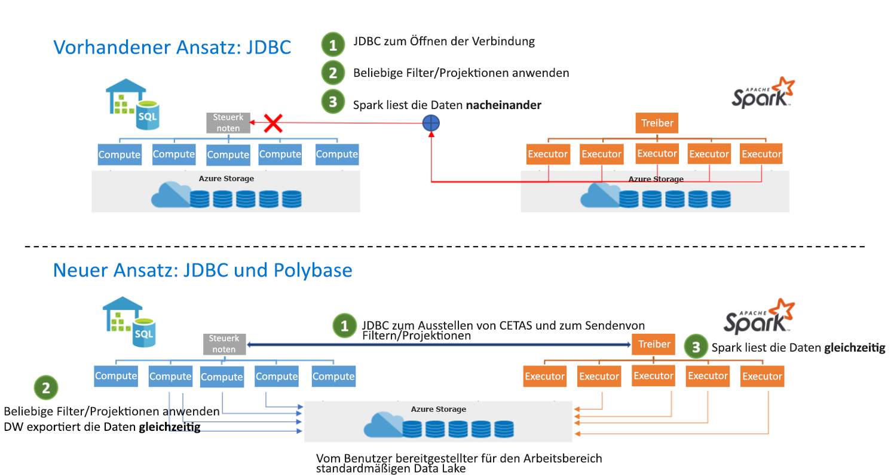

# <a name="introduction"></a>Einführung

Der Connector „Azure Synapse Apache Spark to Synapse SQL“ ist für die effiziente Übertragung von Daten zwischen serverlosen Apache Spark-Pools und dedizierten SQL-Pools in Azure Synapse konzipiert. Der Connector „Azure Synapse Apache Spark to Synapse SQL“ funktioniert nur bei dedizierten SQL-Pools und nicht bei einem serverlosen SQL-Pool.

> [!WARNING]
> Der Funktionsname **sqlanalytics()** wurde in **synapsesql()** geändert. Die Funktion „sqlanalytics“ funktioniert weiterhin, wird jedoch als veraltet markiert.  Ändern Sie Verweise von **sqlanalytics()** in **synapsesql()** , um künftige Unterbrechungen zu vermeiden.

## <a name="design"></a>Entwurf

Die Übertragung von Daten zwischen Spark-Pools und SQL-Pools kann mithilfe von JDBC erfolgen. Bei zwei verteilten Systemen wie Spark und SQL-Pools stellt JDBC jedoch tendenziell einen Engpass bei der seriellen Datenübertragung dar.

Der Connector „Azure Synapse Apache Spark pool to Synapse SQL“ ist eine Datenquellenimplementierung für Apache Spark. Er verwendet Azure Data Lake Storage Gen2 und PolyBase in dedizierten SQL-Pools für eine effiziente Datenübertragung zwischen dem Spark-Cluster und der dedizierten Synapse SQL-Instanz.



## <a name="authentication-in-azure-synapse-analytics"></a>Authentifizierung in Azure Synapse Analytics

Die Authentifizierung zwischen Systemen erfolgt in Azure Synapse Analytics nahtlos. Der Tokendienst stellt eine Verbindung mit Azure Active Directory her, um Sicherheitstoken für den Zugriff auf das Speicherkonto oder den Data Warehouse-Server zu erhalten.

Aus diesem Grund ist es nicht erforderlich, Anmeldeinformationen zu erstellen oder in der Connector-API anzugeben, solange Azure AD-Authentifizierung im Speicherkonto und auf dem Data Warehouse-Server konfiguriert ist. Andernfalls kann die SQL-Authentifizierung angegeben werden. Ausführlichere Informationen finden Sie im Abschnitt [Verbrauch](#usage).

## <a name="constraints"></a>Einschränkungen

- Dieser Connector kann nur in Scala verwendet werden.
- Details zu pySpark finden Sie im Abschnitt [Verwenden von Python](#use-pyspark-with-the-connector).
- Dieser Connector unterstützt nicht das Abfragen von SQL-Ansichten.

## <a name="prerequisites"></a>Voraussetzungen

- Sie müssen Mitglied der Rolle **db_exporter** in der Datenbank oder in dem SQL-Pool sein, die bzw. den Sie als Quelle oder Ziel für Datenübertragungen verwenden möchten.
- Sie müssen Mitglied der Rolle „Mitwirkender an Storage-Blobdaten“ im Standardspeicherkonto sein.

Stellen Sie zum Erstellen von Benutzern eine Verbindung mit der SQL-Pooldatenbank her, und halten Sie sich an die folgenden Beispiele:

```sql
--SQL User
CREATE USER Mary FROM LOGIN Mary;

--Azure Active Directory User
CREATE USER [mike@contoso.com] FROM EXTERNAL PROVIDER;
```

So weisen Sie eine Rolle zu:

```sql
--SQL User
EXEC sp_addrolemember 'db_exporter', 'Mary';

--Azure Active Directory User
EXEC sp_addrolemember 'db_exporter',[mike@contoso.com]
```

## <a name="usage"></a>Verwendung

Die import-Anweisungen sind nicht erforderlich. Sie werden für die Notebookumgebung vorab importiert.

### <a name="transfer-data-to-or-from-a-dedicated-sql-pool-attached-within-the-workspace"></a>Übertragen von Daten zu oder von einem im Arbeitsbereich angefügten dedizierten SQL-Pool

> [!NOTE]
> **Importe sind in der Notebookumgebung nicht erforderlich.**

```scala
 import com.microsoft.spark.sqlanalytics.utils.Constants
 import org.apache.spark.sql.SqlAnalyticsConnector._
```

#### <a name="read-api"></a>Lese-API

```scala
val df = spark.read.synapsesql("<DBName>.<Schema>.<TableName>")
```

Die obige API kann sowohl für interne (verwaltete) als auch für externe Tabellen im SQL-Pool verwendet werden.

#### <a name="write-api"></a>API zum Schreiben

```scala
df.write.synapsesql("<DBName>.<Schema>.<TableName>", <TableType>)
```

Die API zum Schreiben erstellt die Tabelle im dedizierten SQL-Pool und ruft dann PolyBase auf, um die Daten zu laden.  Die Tabelle darf im dedizierten SQL-Pool nicht vorhanden sein, da sonst ein Fehler mit einer Meldung zurückgegeben wird, dass ein Objekt dieses Namens bereits vorhanden ist.

TableType-Werte

- Constants.INTERNAL: Verwaltete Tabelle im dedizierten SQL-Pool
- Constants.INTERNAL: Externe Tabelle im dedizierten SQL-Pool

Verwaltete SQL-Pooltabelle

```scala
df.write.synapsesql("<DBName>.<Schema>.<TableName>", Constants.INTERNAL)
```

Externe SQL-Pool-Tabelle

Zum Schreiben einer externen Tabelle für dedizierte SQL-Pools müssen im dedizierten SQL-Pool eine externe Datenquelle (EXTERNAL DATA SOURCE) und ein externes Dateiformat (EXTERNAL FILE FORMAT) vorhanden sein.  Weitere Informationen finden Sie unter [Erstellen einer externen Datenquelle](/sql/t-sql/statements/create-external-data-source-transact-sql?view=azure-sqldw-latest&preserve-view=true) und [Externe Dateiformate](/sql/t-sql/statements/create-external-file-format-transact-sql?view=azure-sqldw-latest&preserve-view=true) im dedizierten SQL-Pool.  Unten sind Beispiele für die Erstellung einer externen Datenquelle und von externen Dateiformaten im dedizierten SQL-Pool angegeben.

```sql
--For an external table, you need to pre-create the data source and file format in dedicated SQL pool using SQL queries:
CREATE EXTERNAL DATA SOURCE <DataSourceName>
WITH
  ( LOCATION = 'abfss://...' ,
    TYPE = HADOOP
  ) ;

CREATE EXTERNAL FILE FORMAT <FileFormatName>
WITH (  
    FORMAT_TYPE = PARQUET,  
    DATA_COMPRESSION = 'org.apache.hadoop.io.compress.SnappyCodec'  
);
```

Ein Objekt vom Typ „Externe Anmeldeinformationen“ (EXTERNAL CREDENTIAL) ist nicht erforderlich, wenn die Azure Active Directory-Pass-Through-Authentifizierung für das Speicherkonto verwendet wird.  Stellen Sie sicher, dass Sie Mitglied der Rolle „Mitwirkender an Storage-Blobdaten“ im Speicherkonto sind.

```scala

df.write.
    option(Constants.DATA_SOURCE, <DataSourceName>).
    option(Constants.FILE_FORMAT, <FileFormatName>).
    synapsesql("<DBName>.<Schema>.<TableName>", Constants.EXTERNAL)

```

### <a name="transfer-data-to-or-from-a-dedicated-sql-pool-or-database-outside-the-workspace"></a>Übertragen von Daten in einen oder aus einem dedizierten SQL-Pool bzw. in eine oder aus einer Datenbank außerhalb des Arbeitsbereichs

> [!NOTE]
> Importe sind in der Notebookumgebung nicht erforderlich.

```scala
 import com.microsoft.spark.sqlanalytics.utils.Constants
 import org.apache.spark.sql.SqlAnalyticsConnector._
```

#### <a name="read-api"></a>Lese-API

```scala
val df = spark.read.
option(Constants.SERVER, "samplews.database.windows.net").
synapsesql("<DBName>.<Schema>.<TableName>")
```

#### <a name="write-api"></a>API zum Schreiben

```scala
df.write.
option(Constants.SERVER, "samplews.database.windows.net").
synapsesql("<DBName>.<Schema>.<TableName>", <TableType>)
```

### <a name="use-sql-auth-instead-of-azure-ad"></a>Verwenden der SQL-Authentifizierung anstelle von Azure AD

#### <a name="read-api"></a>Lese-API

Der Connector unterstützt zurzeit keine tokenbasierte Authentifizierung für einen dedizierten SQL-Pool, der sich außerhalb des Arbeitsbereichs befindet. Sie müssen die SQL-Authentifizierung verwenden.

```scala
val df = spark.read.
option(Constants.SERVER, "samplews.database.windows.net").
option(Constants.USER, <SQLServer Login UserName>).
option(Constants.PASSWORD, <SQLServer Login Password>).
synapsesql("<DBName>.<Schema>.<TableName>")
```

#### <a name="write-api"></a>API zum Schreiben

```scala
df.write.
option(Constants.SERVER, "samplews.database.windows.net").
option(Constants.USER, <SQLServer Login UserName>).
option(Constants.PASSWORD, <SQLServer Login Password>).
synapsesql("<DBName>.<Schema>.<TableName>", <TableType>)
```

### <a name="use-pyspark-with-the-connector"></a>Verwenden von PySpark mit dem Connector

> [!NOTE]
> In diesem Beispiel wird nur die Notebookumgebung berücksichtigt.

Angenommen, Sie verfügen über den Datenrahmen „pyspark_df“, den Sie in das DW schreiben möchten.

Erstellen Sie mithilfe des Datenrahmens in PySpark eine temporäre Tabelle:

```py
pyspark_df.createOrReplaceTempView("pysparkdftemptable")
```

Führen Sie mithilfe von Magics eine Scala-Zelle im PySpark-Notebook aus:

```scala
%%spark
val scala_df = spark.sqlContext.sql ("select * from pysparkdftemptable")

scala_df.write.synapsesql("sqlpool.dbo.PySparkTable", Constants.INTERNAL)
```

Lesen Sie analog dazu im Leseszenario die Daten mithilfe von Scala, schreiben Sie sie in eine temporäre Tabelle, und verwenden Sie Spark SQL in PySpark, um die temporäre Tabelle in einem Datenrahmen abzufragen.

## <a name="allow-other-users-to-use-the-azure-synapse-apache-spark-to-synapse-sql-connector-in-your-workspace"></a>Zulassen der Verwendung des Connectors „Azure Synapse Apache Spark to Synapse SQL“ in Ihrem Arbeitsbereich für andere Benutzer

Sie müssen ein Besitzer von Speicherblobdaten für das mit dem Arbeitsbereich verbundene ADLS Gen2-Speicherkonto sein, um fehlende Berechtigungen für andere Benutzer ändern zu können. Stellen Sie sicher, dass der Benutzer Zugriff auf den Arbeitsbereich und Berechtigungen zum Ausführen von Notebooks hat.

### <a name="option-1"></a>Option 1:

- Den Benutzer als Mitwirkender an/Besitzer von Speicherblobdaten festlegen

### <a name="option-2"></a>Option 2:

- Die folgenden ACLs (Zugriffssteuerungslisten) in der Ordnerstruktur angeben:

| Ordner | / | synapse | workspaces  | \<workspacename> | sparkpools | \<sparkpoolname>  | sparkpoolinstances  |
|--|--|--|--|--|--|--|--|
| Zugriffsberechtigungen | –X | –X | –X | –X | –X | –X | –WX |
| Standardberechtigungen | ---| ---| ---| ---| ---| ---| ---|

- Es sollte Ihnen möglich sein, im Azure-Portal alle Ordner aus „synapse“ und darunter zur ACL hinzuzufügen. Zum Hinzufügen des Stammordners „/“ zur ACL führen Sie die nachstehenden Anweisungen aus.

- Stellen Sie eine Verbindung mit dem Speicherkonto her, das aus Storage-Explorer über Azure AD mit dem Arbeitsbereich verbunden ist.
- Wählen Sie Ihr Konto aus, und geben Sie die ADLS Gen2-URL und das Standarddateisystem für den Arbeitsbereich an.
- Sobald das aufgelistete Speicherkonto angezeigt wird, klicken Sie mit der rechten Maustaste auf den Auflistungsarbeitsbereich, und wählen Sie „Zugriff verwalten“ aus.
- Fügen Sie den Benutzer mit der Zugriffsberechtigung „Execute“ (Ausführen) zum Ordner „/“ hinzu. Wählen Sie „OK“ aus.

> [!IMPORTANT]
> Wählen Sie auf keinen Fall „Standard“ aus, wenn Sie diesen Wert nicht verwenden möchten.


## <a name="next-steps"></a>Nächste Schritte

- [Erstellen eines dedizierten SQL-Pools mithilfe des Azure-Portals](../../synapse-analytics/quickstart-create-apache-spark-pool-portal.md)
- [Erstellen eines neuen Apache Spark-Pools über das Azure-Portal](../../synapse-analytics/quickstart-create-apache-spark-pool-portal.md) 
