# <a name="quickstart-create-and-query-a-synapse-sql-pool-using-the-azure-portal"></a>Schnellstart: Erstellen und Abfragen eines Synapse-SQL-Pools mit dem Azure-Portal

Hier wird beschrieben, wie Sie schnell über das Azure-Portal einen Synapse-SQL-Pool (Data Warehouse) in Azure Synapse Analytics (vormals SQL DW) erstellen und abfragen.

## <a name="prerequisites"></a>Voraussetzungen

1. Wenn Sie kein Azure-Abonnement besitzen, können Sie ein [kostenloses Konto](https://azure.microsoft.com/free/) erstellen, bevor Sie beginnen.

   > [!NOTE]
   > Die Erstellung eines SQL-Pools in Azure Synapse kann zu einem neuen kostenpflichtigen Dienst führen. Weitere Informationen finden Sie unter [Azure Synapse Analytics – Preise](https://azure.microsoft.com/pricing/details/synapse-analytics/).

2. Laden Sie die aktuelle Version von [SQL Server Management Studio](/sql/ssms/download-sql-server-management-studio-ssms?toc=/azure/synapse-analytics/sql-data-warehouse/toc.json&bc=/azure/synapse-analytics/sql-data-warehouse/breadcrumb/toc.json&view=azure-sqldw-latest) (SSMS) herunter, und installieren Sie sie.

## <a name="sign-in-to-the-azure-portal"></a>Melden Sie sich auf dem Azure-Portal an.

Melden Sie sich beim [Azure-Portal](https://portal.azure.com/) an.

## <a name="create-a-sql-pool"></a>Erstellen eines SQL-Pools

Data Warehouse-Instanzen werden erstellt, indem in Azure Synapse Analytics ein SQL-Pool verwendet wird. Ein SQL-Pool wird mit einem definierten Satz von [Computeressourcen](memory-concurrency-limits.md) erstellt. Die Datenbank wird innerhalb einer [Azure-Ressourcengruppe](../../azure-resource-manager/management/overview.md?toc=/azure/synapse-analytics/sql-data-warehouse/toc.json&bc=/azure/synapse-analytics/sql-data-warehouse/breadcrumb/toc.json) und auf einem [logischen Azure SQL-Server](../../sql-database/sql-database-servers.md?toc=/azure/synapse-analytics/sql-data-warehouse/toc.json&bc=/azure/synapse-analytics/sql-data-warehouse/breadcrumb/toc.json) erstellt.

Führen Sie diese Schritte aus, um einen SQL-Pool mit den **AdventureWorksDW**-Beispieldaten zu erstellen.

1. Wählen Sie im Azure-Portal oben links die Option **Ressource erstellen** aus.

   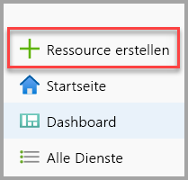

2. Wählen Sie auf der Seite **Neu** die Option **Datenbanken** und dann in der Liste **Empfohlen** die Option **Azure Synapse Analytics (vormals SQL DW)** aus.

   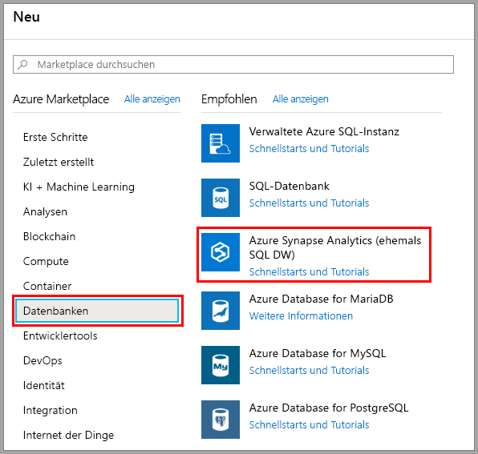

3. Geben Sie unter **Grundlagen** Ihr Abonnement, die Ressourcengruppe, den Namen des SQL-Pools und den Servernamen an:

   | Einstellung | Vorgeschlagener Wert | BESCHREIBUNG |
   | :------ | :-------------- | :---------- |
   | **Abonnement** | Ihr Abonnement | Ausführliche Informationen zu Ihren Abonnements finden Sie unter [Abonnements](https://account.windowsazure.com/Subscriptions). |
   | **Ressourcengruppe** | myResourceGroup | Gültige Ressourcengruppennamen finden Sie unter [Naming rules and restrictions](/azure/architecture/best-practices/resource-naming?toc=/azure/synapse-analytics/sql-data-warehouse/toc.json&bc=/azure/synapse-analytics/sql-data-warehouse/breadcrumb/toc.json) (Benennungsregeln und Einschränkungen). |
   | **Name des SQL-Pools** | Beliebiger global eindeutiger Name (Beispiel: *mySampleDataWarehouse*) | Gültige Datenbanknamen finden Sie unter [Database Identifiers](/sql/relational-databases/databases/database-identifiers?toc=/azure/synapse-analytics/sql-data-warehouse/toc.json&bc=/azure/synapse-analytics/sql-data-warehouse/breadcrumb/toc.json&view=azure-sqldw-latest) (Datenbankbezeichner). Beachten Sie, dass ein SQL-Pool ein Datenbanktyp ist. |
   | **Server** | Ein global eindeutiger Name | Wählen Sie einen vorhandenen Server aus, oder erstellen Sie einen neuen Servernamen, indem Sie **Neu erstellen** auswählen. Gültige Servernamen finden Sie unter [Naming rules and restrictions](/azure/architecture/best-practices/resource-naming?toc=/azure/synapse-analytics/sql-data-warehouse/toc.json&bc=/azure/synapse-analytics/sql-data-warehouse/breadcrumb/toc.json) (Benennungsregeln und Einschränkungen). |

   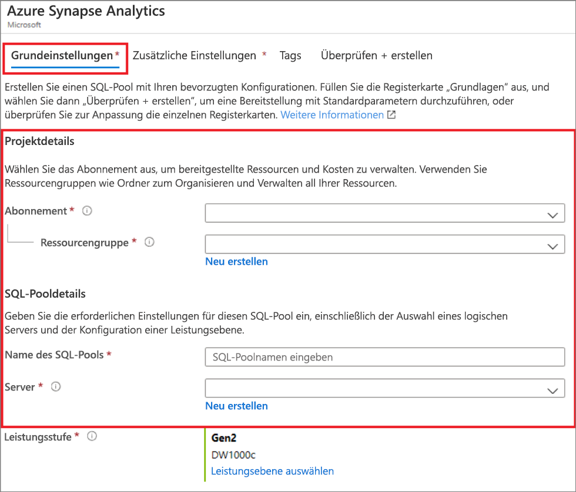

4. Wählen Sie unter **Leistungsebene** die Option **Leistungsebene auswählen** aus, um Ihre Konfiguration per Schieberegler zu ändern (optional).

   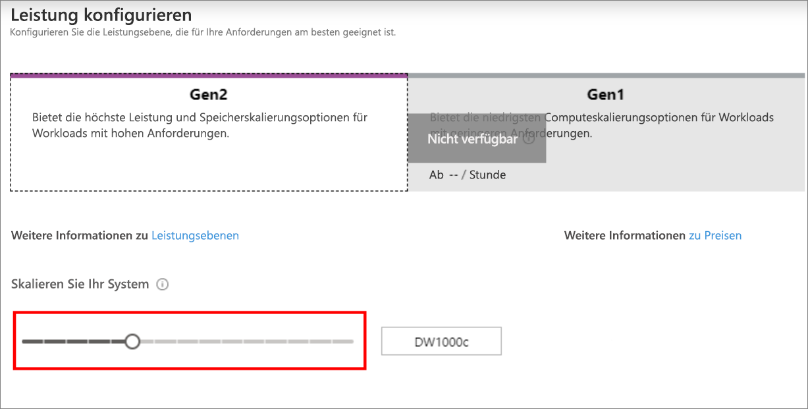  

   Weitere Informationen zu Leistungsebenen finden Sie unter [Verwalten von Computeressourcen in Azure SQL Data Warehouse](sql-data-warehouse-manage-compute-overview.md).

5. Wählen Sie nach dem Ausfüllen der Registerkarte „Grundlagen“ im Azure Synapse Analytics-Formular die Option **Bewerten + erstellen** und dann **Erstellen** aus, um den SQL-Pool zu erstellen. Die Bereitstellung dauert einige Minuten.

   

   

6. Wählen Sie in der Symbolleiste die Option **Benachrichtigungen** aus, um den Bereitstellungsprozess zu überwachen.

   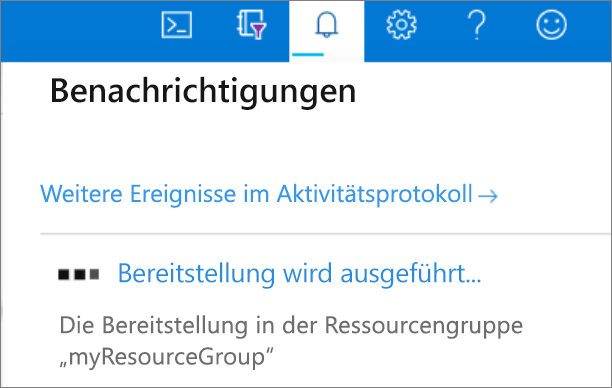

## <a name="create-a-server-level-firewall-rule"></a>Erstellen einer Firewallregel auf Serverebene

Der Azure Synapse-Dienst erstellt eine Firewall auf Serverebene. Diese Firewall verhindert, dass externe Anwendungen und Tools eine Verbindung mit dem Server oder mit Datenbanken auf dem Server herstellen. Zum Herstellen von Konnektivität können Sie Firewallregeln hinzufügen, mit denen Konnektivität für bestimmte IP-Adressen ermöglicht wird. Führen Sie die folgenden Schritte aus, um eine [Firewallregel auf Serverebene](../../sql-database/sql-database-firewall-configure.md?toc=/azure/synapse-analytics/sql-data-warehouse/toc.json&bc=/azure/synapse-analytics/sql-data-warehouse/breadcrumb/toc.json) für die IP-Adresse Ihres Clients zu erstellen.

> [!NOTE]
> Azure Synapse kommuniziert über Port 1433. Wenn Sie versuchen, eine Verbindung über ein Unternehmensnetzwerk herzustellen, wird ausgehender Datenverkehr über Port 1433 von der Firewall Ihres Netzwerks unter Umständen nicht zugelassen. In diesem Fall können Sie nur dann eine Verbindung mit Ihrem Azure SQL-Datenbank-Server herstellen, wenn Ihre IT-Abteilung Port 1433 öffnet.

1. Klicken Sie nach Abschluss der Bereitstellung im linken Menü auf **Alle Dienste**. Wählen Sie die Option **Datenbanken** und das Sternchen neben **Azure Synapse Analytics** aus, um Azure Synapse Analytics Ihren Favoriten hinzuzufügen.

2. Wählen Sie **Azure Synapse Analytics** im Menü auf der linken Seite und dann auf der Seite **Azure Synapse Analytics** die Option **mySampleDataWarehouse** aus. Die Übersichtsseite für Ihre Datenbank wird geöffnet. Diese enthält den vollqualifizierten Servernamen (z. B. **sqlpoolservername.database.windows.net**) und Optionen für die weitere Konfiguration.

3. Kopieren Sie diesen vollqualifizierten Servernamen, um ihn in diesem und nachfolgenden Schnellstarts zur Verbindungsherstellung mit Ihrem Server und den Datenbanken zu verwenden. Wählen Sie den Servernamen aus, um die Servereinstellungen zu öffnen.

   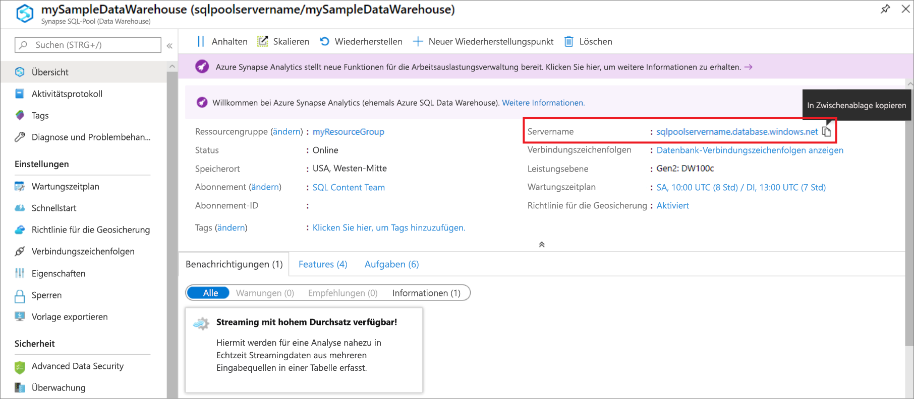

4. Wählen Sie die Option **Firewalleinstellungen anzeigen** aus.

   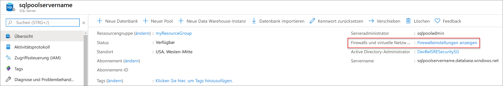

5. Die Seite **Firewalleinstellungen** für den SQL-Datenbank-Server wird geöffnet.

   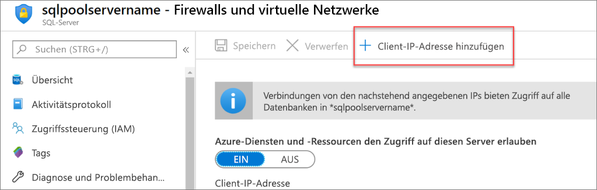

6. Wählen Sie in der Symbolleiste die Option **Client-IP-Adresse hinzufügen** aus, um Ihre aktuelle IP-Adresse einer neuen Firewallregel hinzuzufügen. Eine Firewallregel kann Port 1433 für eine einzelne IP-Adresse oder einen Bereich von IP-Adressen öffnen.

7. Wählen Sie **Speichern** aus. Für Ihre aktuelle IP-Adresse wird eine Firewallregel auf Serverebene erstellt, und auf dem logischen Server wird Port 1433 geöffnet.

8. Wählen Sie **OK** aus, und schließen Sie anschließend die Seite **Firewalleinstellungen**.

Jetzt können Sie mithilfe dieser IP-Adresse eine Verbindung mit dem SQL-Server und den zugehörigen SQL-Pools herstellen. Die Verbindung über SQL Server Management Studio oder ein anderes Tool Ihrer Wahl hergestellt werden. Verwenden Sie zum Herstellen der Verbindung das Serveradministratorkonto, das Sie zuvor erstellt haben.

> [!IMPORTANT]
> Standardmäßig ist der Zugriff über die SQL-Datenbank-Firewall für alle Azure-Dienste aktiviert. Wählen Sie auf dieser Seite die Option **AUS** und dann **Speichern** aus, um die Firewall für alle Azure-Dienste zu deaktivieren.

## <a name="get-the-fully-qualified-server-name"></a>Abrufen des vollqualifizierten Servernamens

Rufen Sie den vollqualifizierten Servernamen für Ihren SQL-Server im Azure-Portal ab. Später verwenden Sie den vollqualifizierten Namen zum Herstellen einer Verbindung mit dem Server.

1. Melden Sie sich beim [Azure-Portal](https://portal.azure.com/) an.

2. Wählen Sie im Menü auf der linken Seite die Option **Azure Synapse Analytics** und dann auf der Seite **Azure Synapse Analytics** Ihre Datenbank aus.

3. Suchen Sie im Azure-Portal auf der Seite für Ihre Datenbank unter **Zusammenfassung** nach Ihrer Datenbank, und kopieren Sie den **Servernamen**. In diesem Beispiel lautet der vollqualifizierte Name „sqlpoolservername.database.windows.net“.

    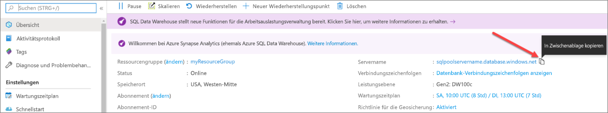

## <a name="connect-to-the-server-as-server-admin"></a>Herstellen einer Verbindung mit dem Server als Serveradministrator

In diesem Abschnitt wird [SQL Server Management Studio](/sql/ssms/download-sql-server-management-studio-ssms?toc=/azure/synapse-analytics/sql-data-warehouse/toc.json&bc=/azure/synapse-analytics/sql-data-warehouse/breadcrumb/toc.json&view=azure-sqldw-latest) zum Herstellen einer Verbindung mit Ihrem Azure SQL-Server verwendet.

1. Öffnen Sie SQL Server Management Studio.

2. Geben Sie im Dialogfeld **Mit Server verbinden** die folgenden Informationen ein:

   | Einstellung | Vorgeschlagener Wert | BESCHREIBUNG |
   | :------ | :-------------- | :---------- |
   | Servertyp | Datenbank-Engine | Dieser Wert ist erforderlich. |
   | Servername | Der vollqualifizierte Servername | Beispiel: **sqlpoolservername.database.windows.net**. |
   | Authentifizierung | SQL Server-Authentifizierung | In diesem Tutorial ist die SQL-Authentifizierung der einzige konfigurierte Authentifizierungstyp. |
   | Anmeldename | Das Serveradministratorkonto | Dies ist das Konto, das Sie bei der Servererstellung angegeben haben. |
   | Kennwort | Das Kennwort für das Serveradministratorkonto | Dies ist das Kennwort, das Sie beim Erstellen des Servers angegeben haben. |
   ||||

   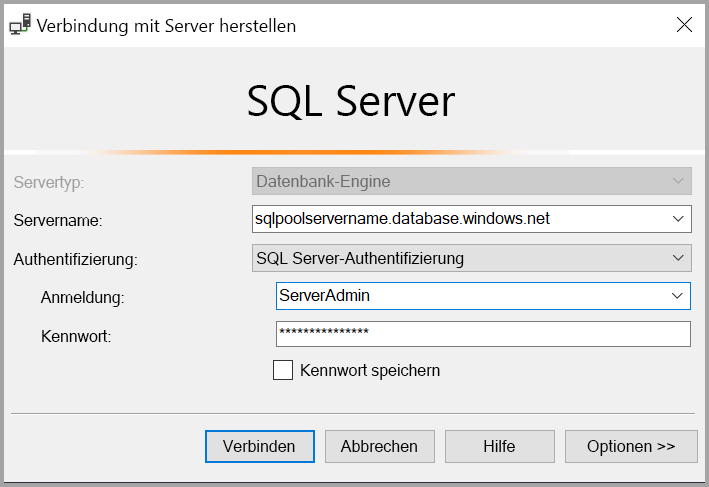

3. Wählen Sie **Verbinden** aus. Das Fenster „Objekt-Explorer“ wird in SSMS geöffnet.

4. Erweitern Sie im Objekt-Explorer den Eintrag **Datenbanken**. Erweitern Sie dann **mySampleDatabase**, um die Objekte in der neuen Datenbank anzuzeigen.

   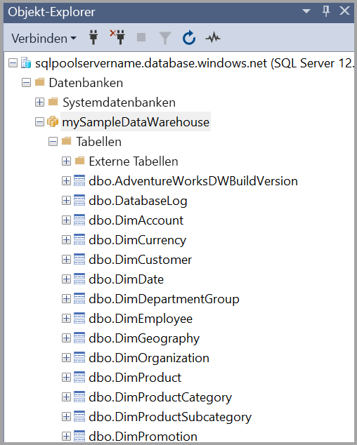

## <a name="run-some-queries"></a>Ausführen einiger Abfragen

SQL Data Warehouse verwendet T-SQL als Abfragesprache. Führen Sie die folgenden Schritte aus, um ein Abfragefenster zu öffnen und einige T-SQL-Abfragen auszuführen:

1. Wählen Sie mit der rechten Maustaste die Option **mySampleDataWarehouse** aus, und wählen Sie dann **Neue Abfrage** aus. Ein neues Abfragefenster wird geöffnet.

2. Geben Sie im Abfragefenster den folgenden Befehl ein, um eine Liste mit Datenbanken anzuzeigen.

    ```sql
    SELECT * FROM sys.databases
    ```

3. wählen Sie **Execute** (Ausführen) aus. Die Abfrageergebnisse zeigen zwei Datenbanken an: **master** und **mySampleDataWarehouse**.

   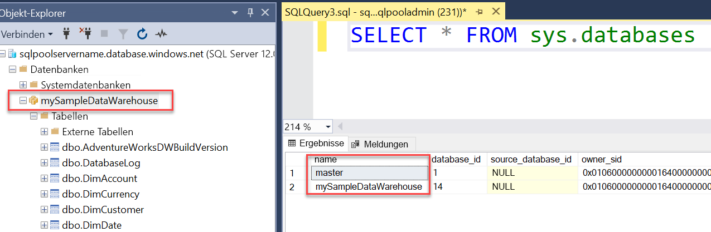

4. Zum Überprüfen einiger Daten verwenden Sie den folgenden Befehl, um die Anzahl der Kunden mit dem Nachnamen Baar anzuzeigen, die drei Kinder zu Hause haben. In den Ergebnissen sind sechs Kunden aufgelistet.

    ```sql
    SELECT LastName, FirstName FROM dbo.dimCustomer
    WHERE LastName = 'Adams' AND NumberChildrenAtHome = 3;
    ```

   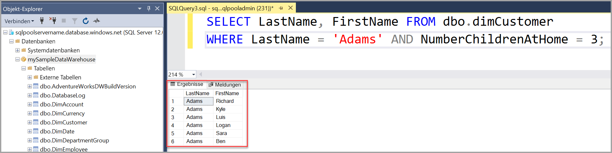

## <a name="clean-up-resources"></a>Bereinigen von Ressourcen

Ihnen werden Gebühren für Data Warehouse-Einheiten und für in Ihrem SQL-Pool gespeicherte Daten in Rechnung gestellt. Diese Compute- und Speicherressourcen werden separat in Rechnung gestellt.

- Falls Sie die Daten im Speicher belassen möchten, können Sie Computeressourcen anhalten, wenn Sie den SQL-Pool nicht verwenden. Wenn Sie Computeressourcen anhalten, werden Ihnen nur die Datenspeichergebühren in Rechnung gestellt. Sie können Computeressourcen fortsetzen, wenn Sie mit den Daten arbeiten möchten.

- Wenn künftig keine Gebühren mehr anfallen sollen, können Sie den SQL-Pool löschen.

Führen Sie die folgenden Schritte aus, um nicht länger benötigte Ressourcen zu bereinigen.

1. Melden Sie sich beim [Azure-Portal](https://portal.azure.com) an, und wählen Sie Ihren SQL-Pool aus.

   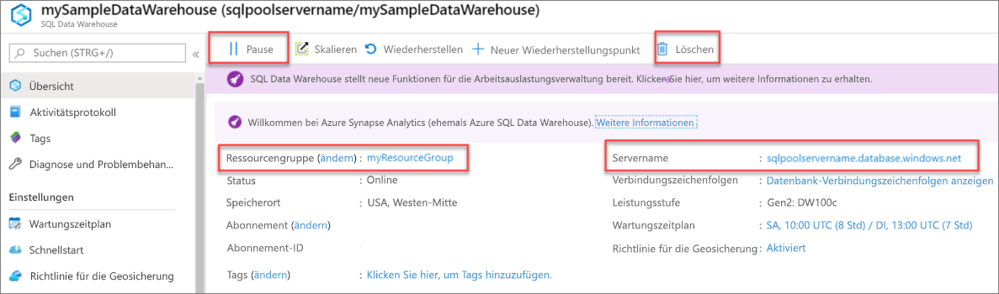

2. Wählen Sie zum Anhalten von Computeressourcen die Schaltfläche **Anhalten**. Wenn der SQL-Pool angehalten ist, wird die Schaltfläche **Fortsetzen** angezeigt. Wählen Sie zum Fortsetzen der Computeressourcen die Option **Fortsetzen** aus.

3. Wählen Sie **Löschen** aus, wenn Sie den SQL-Pool entfernen möchten, damit keine Gebühren für Compute- oder Speicherressourcen anfallen.

4. Wählen Sie zum Entfernen des von Ihnen erstellten SQL-Servers die Option **sqlpoolservername.database.windows.net** (siehe Abbildung oben) und dann **Löschen** aus. Seien Sie bei diesem Löschvorgang vorsichtig, da beim Löschen des Servers auch alle Datenbanken gelöscht werden, die dem Server zugewiesen sind.

5. Wählen Sie zum Entfernen der Ressourcengruppe die Option **myResourceGroup** und dann **Ressourcengruppe löschen**.

## <a name="next-steps"></a>Nächste Schritte

Weitere Informationen zum Laden von Daten in den SQL-Pool finden Sie im Artikel zum [Laden von Daten in den SQL-Pool](load-data-from-azure-blob-storage-using-polybase.md).
