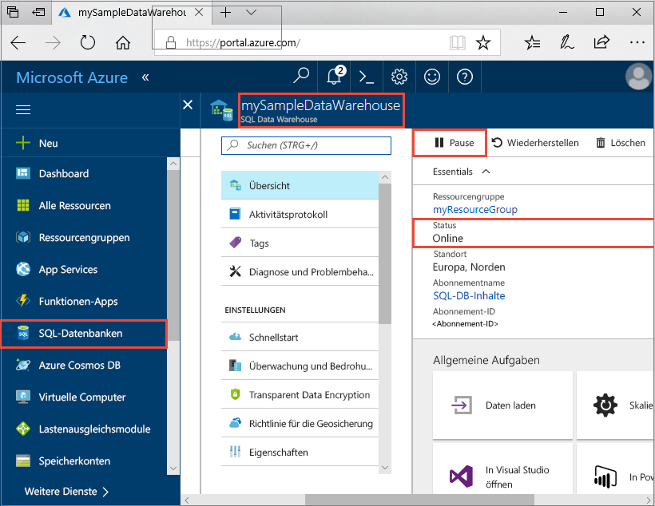
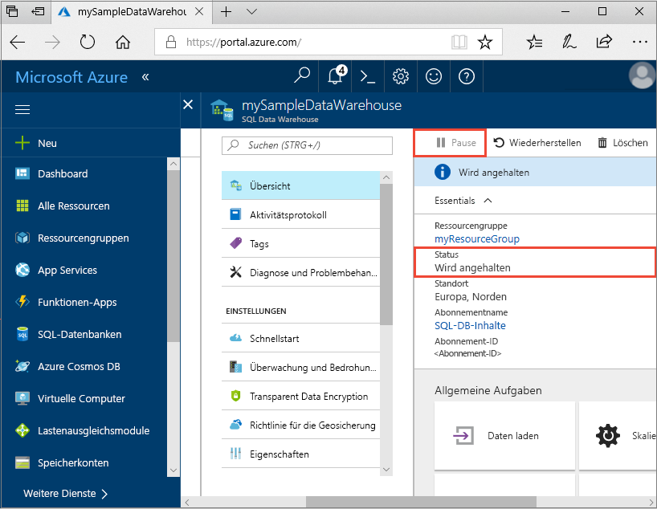
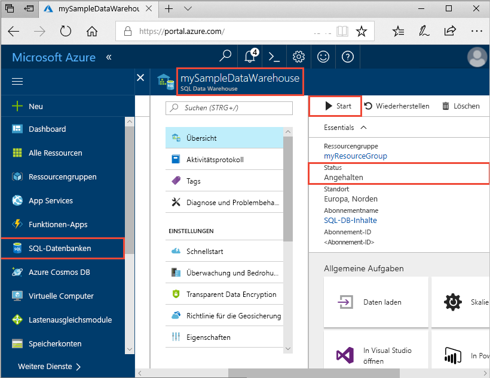
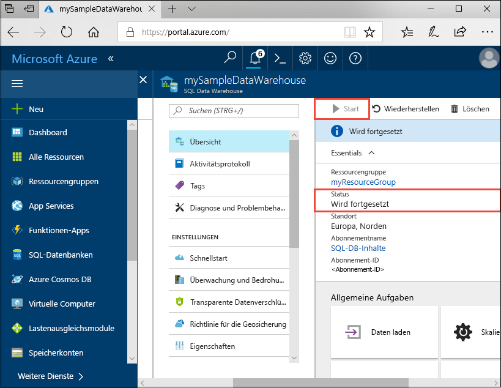
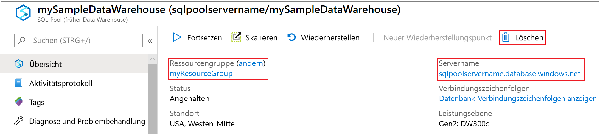

# Schnellstart: Anhalten und Fortsetzen von Computeressourcen im dedizierten Synapse-SQL-Pool über das Azure-Portal

Über das Azure-Portal können Sie Computeressourcen für den dedizierten SQL-Pool anhalten und fortsetzen. Wenn Sie kein Azure-Abonnement besitzen, können Sie ein [kostenloses Konto](https://azure.microsoft.com/free/) erstellen, bevor Sie beginnen.

## Melden Sie sich auf dem Azure-Portal an.

Melden Sie sich beim [Azure-Portal](https://portal.azure.com/) an.

## Voraussetzungen

Verwenden Sie [Erstellen und Verbinden – Portal](../quickstart-create-sql-pool-portal.md), um einen dedizierten SQL-Pool namens **mySampleDataWarehouse** zu erstellen. 

## Anhalten von Computeressourcen

Um Kosten zu senken, können Sie Computeressourcen bei Bedarf anhalten und fortsetzen. Wenn Sie die Datenbank z.B. nachts oder am Wochenende nicht verwenden, können Sie sie während dieser Zeiträume anhalten und während des Tages wieder fortsetzen.
 
>[!NOTE]
>Computeressourcen werden Ihnen nicht in Rechnung gestellt, während die Datenbank angehalten ist. Allerdings wird Ihnen der Speicherplatz weiter in Rechnung gestellt. 

Führen Sie die folgenden Schritte aus, um einen dedizierten SQL-Pool anzuhalten:

1. Melden Sie sich beim [Azure-Portal](https://portal.azure.com/) an.
2. Navigieren Sie zu Ihrer Seite **Dedizierter SQL-Pool**, um den SQL-Pool zu öffnen. 
3. Beachten Sie, dass für **Status** der Wert **Online** angezeigt wird.

    

4. Klicken Sie zum Anhalten des dedizierten SQL-Pools auf die Schaltfläche **Anhalten**. 
5. Sie werden in einer Meldung aufgefordert, das Fortsetzen des Vorgangs zu bestätigen. Klicken Sie auf **Ja**.
6. Warten Sie einen Moment, und beachten Sie, dass der **Status** als **Wird angehalten** angezeigt wird.

    

7. Nach Abschluss des Anhaltevorgangs lautet der Status **Angehalten**, und für die Optionsschaltfläche wird **Starten** angezeigt.
8. Die Computeressourcen für den dedizierten SQL-Pool sind nun offline. Ihnen werden erst wieder Computeressourcen in Rechnung gestellt, wenn Sie den Dienst fortsetzen.

    

## Fortsetzen von Computeressourcen

Führen Sie die folgenden Schritte aus, um einen dedizierten SQL-Pool fortzusetzen:

1. Navigieren Sie zu Ihrer Seite **Dedizierter SQL-Pool**, um den SQL-Pool zu öffnen.
3. Beachten Sie, dass auf der Seite **mySampleDataWarehouse** für **Status** der Wert **Angehalten** angezeigt wird.

    

1. Klicken Sie zum Fortsetzen des SQL-Pools auf **Fortsetzen**. 
1. Sie werden in einer Meldung aufgefordert, den Startvorgang zu bestätigen. Klicken Sie auf **Ja**.
1. Beachten Sie, dass der **Status** als **Wird fortgesetzt** angezeigt wird.

    

1. Wenn der SQL-Pool wieder online ist, lautet der Status **Online**, und für die Optionsschaltfläche wird **Anhalten** angezeigt.
1. Die Computeressourcen für den SQL-Pool sind nun online, und Sie können den Dienst verwenden. Es fallen wieder Kosten für die Computeressourcen an.

    

## Bereinigen von Ressourcen

Ihnen werden Gebühren für Data Warehouse-Einheiten und die in Ihrem dedizierten SQL-Pool gespeicherten Daten in Rechnung gestellt. Diese Compute- und Speicherressourcen werden separat in Rechnung gestellt. 

- Wenn Sie die Daten im Speicher beibehalten möchten, halten Sie die Computeressourcen an.
- Wenn künftig keine Gebühren mehr anfallen sollen, können Sie den dedizierten SQL-Pool löschen. 

Führen Sie die folgenden Schritte aus, um Ressourcen nach Wunsch zu bereinigen.

1. Melden Sie sich beim [Azure-Portal](https://portal.azure.com) an, und wählen Sie Ihren dedizierten SQL-Pool aus.

    

1. Zum Anhalten von Computeressourcen klicken Sie auf die Schaltfläche **Anhalten**. 

1. Wenn Sie den dedizierten SQL-Pool entfernen möchten, damit keine Gebühren für Compute- oder Speicherressourcen anfallen, klicken Sie auf **Löschen**.

## Nächste Schritte

Sie haben die Computeressourcen für Ihren dedizierten SQL-Pool angehalten und fortgesetzt. Im nächsten Artikel finden Sie weitere Informationen zum [Laden von Daten in einen dedizierten SQL-Pool](./load-data-from-azure-blob-storage-using-copy.md). Weitere Informationen zum Verwalten von Computefunktionen finden Sie im Artikel [Verwalten von Computeressourcen im Azure Synapse Analytics-Data Warehouse](sql-data-warehouse-manage-compute-overview.md).