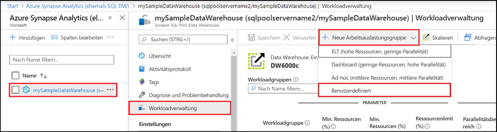
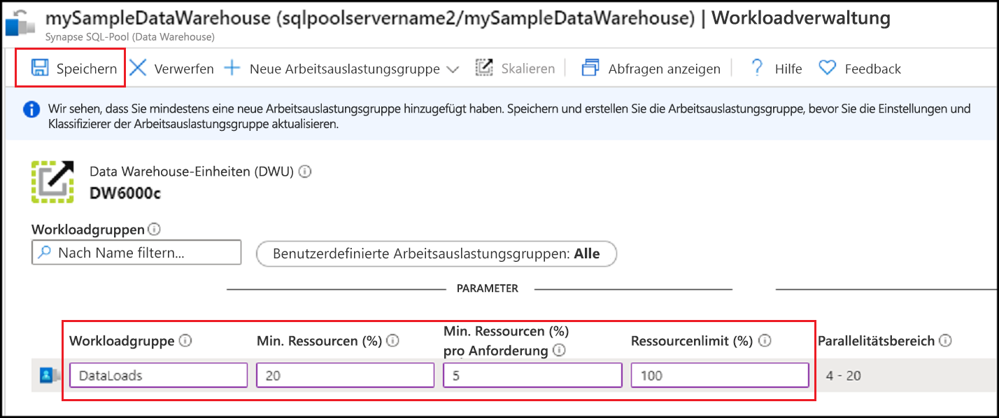
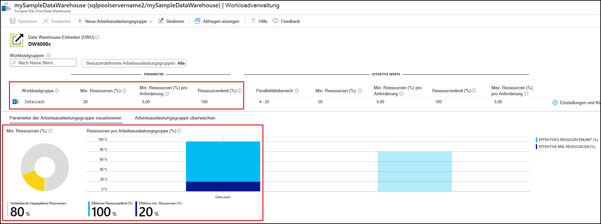
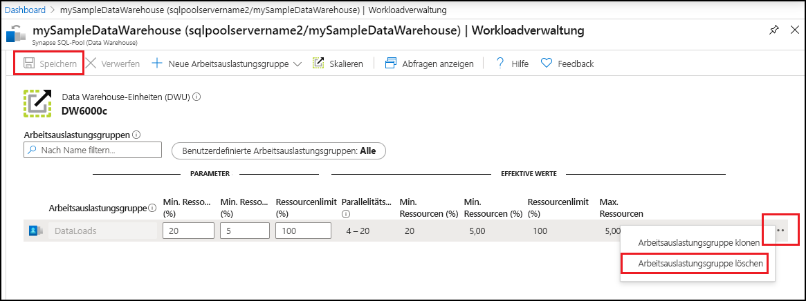

# Schnellstart: Konfigurieren der Workloadisolation eines Synapse SQL-Pools mithilfe einer Arbeitsauslastungsgruppe im Azure-Portal

In dieser Schnellstartanleitung konfigurieren Sie die [Workloadisolation](sql-data-warehouse-workload-isolation.md), indem Sie eine Arbeitsauslastungsgruppe für das Reservieren von Ressourcen erstellen.  Für dieses Tutorial erstellen Sie die Arbeitsauslastungsgruppe `DataLoads` zum Laden von Daten. Die Arbeitsauslastungsgruppe reserviert 20 Prozent der Systemressourcen.  Bei einer Isolation von 20 Prozent für Datenladevorgänge sind Ressourcen garantiert, die die Einhaltung von SLAs ermöglichen.  Nach der Erstellung der Arbeitsauslastungsgruppe [erstellen Sie einen Workloadklassifizierer](quickstart-create-a-workload-classifier-portal.md), um dieser Arbeitsauslastungsgruppe Abfragen hinzuzufügen.

Wenn Sie kein Azure-Abonnement besitzen, können Sie ein [kostenloses Konto](https://azure.microsoft.com/free/) erstellen, bevor Sie beginnen.

## Melden Sie sich auf dem Azure-Portal an.

Melden Sie sich beim [Azure-Portal](https://portal.azure.com/) an.

> [!NOTE]
> Das Erstellen einer SQL-Poolinstanz in Azure Synapse Analytics führt möglicherweise zu einem neuen abrechenbaren Dienst.  Weitere Informationen finden Sie unter [Azure Synapse Analytics – Preise](https://azure.microsoft.com/pricing/details/sql-data-warehouse/).

## Voraussetzungen

In dieser Schnellstartanleitung wird vorausgesetzt, dass Sie bereits über eine SQL-Poolinstanz in Azure Synapse SQL und über CONTROL DATABASE-Berechtigungen verfügen. Wenn Sie ein Data Warehouse erstellen müssen, verwenden Sie die Anweisungen unter [Erstellen und Verbinden – Portal](create-data-warehouse-portal.md), um ein Data Warehouse namens **mySampleDataWarehouse** zu erstellen.

>[!IMPORTANT] 
>Der SQL-Pool muss online sein, damit die Workloadverwaltung konfiguriert werden kann. 

## Konfigurieren der Workloadisolation
Durch die Erstellung von Arbeitsauslastungsgruppen können SQL-Poolressourcen isoliert und für bestimmte Workloads reserviert werden.  Ausführlichere Informationen dazu, wie Sie mithilfe von Arbeitsauslastungsgruppen Workloads verwalten können, finden Sie in der Dokumentation zur [Workloadisolation](sql-data-warehouse-workload-isolation.md)  Anhand der Informationen unter [Schnellstart: Erstellen und Abfragen eines Synapse-SQL-Pools mit dem Azure-Portal](create-data-warehouse-portal.md) wurde **mySampleDataWarehouse** erstellt und mit 400 DWUs initialisiert. Mit den folgenden Schritten erstellen Sie eine Arbeitsauslastungsgruppe in **mySampleDataWarehouse**.

So erstellen Sie eine Arbeitsauslastungsgruppe mit einer Isolation von 20 Prozent:
1.  Klicken Sie auf der linken Seite des Azure-Portals auf **Azure Synapse Analytics (vormals SQL DW)** .
2.  Wählen Sie auf der Seite **Azure Synapse Analytics (vormals SQL DW)** die Option **mySampleDataWarehouse** aus. Der SQL-Pool wird geöffnet.
3.  Klicken Sie auf **Workloadverwaltung**.
4.  Klicken Sie auf **Neue Arbeitsauslastungsgruppe**.
5.  Klicken Sie auf **Benutzerdefiniert**.

    

6.  Geben Sie `DataLoads` unter **Arbeitsauslastungsgruppe** ein.
7.  Geben Sie `20` unter **Prozentuale Mindestmenge für Ressourcen** ein.
8.  Geben Sie `5` unter **Prozentuale Mindestmenge für Ressourcen pro Anforderung** ein.
9.  Geben Sie `100` unter **Ressourcenbegrenzung (%)** ein.
10.   Klicken Sie auf **Speichern**.

   

Eine Portalbenachrichtigung wird angezeigt, wenn die Arbeitsauslastungsgruppe erstellt wird.  Die Ressourcen der Arbeitsauslastungsgruppe werden in den Diagrammen unterhalb der konfigurierten Werte angezeigt.

   

## Bereinigen von Ressourcen

So löschen Sie die in diesem Tutorial erstellte Arbeitsauslastungsgruppe `DataLoads`:
1. Klicken Sie rechts neben der Arbeitsauslastungsgruppe `DataLoads` auf die Schaltfläche **`...`** .
2. Klicken Sie auf **Arbeitsauslastungsgruppe löschen**.
3. Wenn Sie aufgefordert werden, das Löschen der Arbeitsauslastungsgruppe zu bestätigen, klicken Sie auf **Ja**.
4. Klicken Sie auf **Speichern**.

   

Ihnen werden Gebühren für Ihre Data Warehouse-Einheiten und die in Ihrem Data Warehouse gespeicherten Daten berechnet. Diese Compute- und Speicherressourcen werden separat in Rechnung gestellt.

- Falls Sie die Daten im Speicher belassen möchten, können Sie Computeressourcen anhalten, wenn Sie das Data Warehouse nicht verwenden. Wenn Sie Computeressourcen anhalten, werden Ihnen nur die Datenspeichergebühren in Rechnung gestellt. Sie können die Computeressourcen fortsetzen, wenn Sie mit den Daten arbeiten möchten.
- Wenn zukünftig keine Gebühren anfallen sollen, können Sie das Data Warehouse löschen.

Führen Sie die folgenden Schritte aus, um Ressourcen zu bereinigen.

1. Melden Sie sich am [Azure-Portal](https://portal.azure.com) an, und wählen Sie Ihre Data Warehouse-Instanz aus.

    

2. Wählen Sie zum Anhalten von Computeressourcen die Schaltfläche **Anhalten**. Wenn das Data Warehouse angehalten ist, wird die Schaltfläche **Starten** angezeigt.  Wählen Sie zum Fortsetzen der Computeressourcen die Option **Starten**.

3. Wählen Sie **Löschen**, wenn Sie die Data Warehouse-Instanz entfernen möchten, damit keine Gebühren für Compute- oder Speicherressourcen anfallen.

4. Wählen Sie zum Entfernen des von Ihnen erstellten SQL-Servers die Option **sqlpoolservername.database.windows.net** (siehe Abbildung oben) und dann **Löschen** aus.  Seien Sie bei diesem Löschvorgang vorsichtig, da beim Löschen des Servers auch alle Datenbanken gelöscht werden, die dem Server zugewiesen sind.

5. Wählen Sie zum Entfernen der Ressourcengruppe die Option **myResourceGroup** und dann **Ressourcengruppe löschen**.

## Nächste Schritte

Zur Verwendung der Arbeitsauslastungsgruppe `DataLoads` muss ein [Workloadklassifizierer](/sql/t-sql/statements/create-workload-classifier-transact-sql?toc=/azure/synapse-analytics/sql-data-warehouse/toc.json&bc=/azure/synapse-analytics/sql-data-warehouse/breadcrumb/toc.json&view=azure-sqldw-latest) erstellt werden, um Anforderungen an die Arbeitsauslastungsgruppe weiterzuleiten.  Fahren Sie mit dem Tutorial zum [Erstellen eines Workloadklassifizierers](quickstart-create-a-workload-classifier-portal.md) fort, um einen Workloadklassifizierer für `DataLoads` zu erstellen.

## Weitere Informationen
Ausführliche Informationen zum Überwachen von Workloads für die Workloadverwaltung finden Sie im Artikel [Verwalten und Überwachen der Workloadpriorität in Azure Synapse Analytics](sql-data-warehouse-how-to-manage-and-monitor-workload-importance.md).
