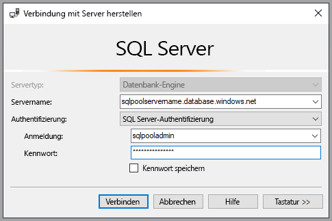
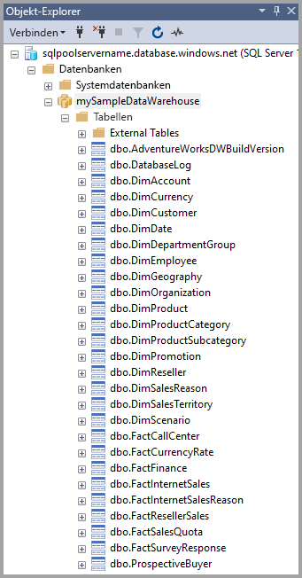
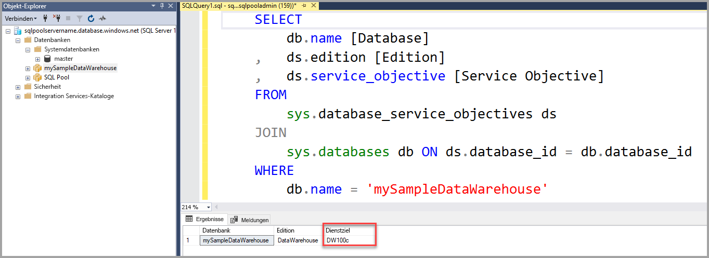
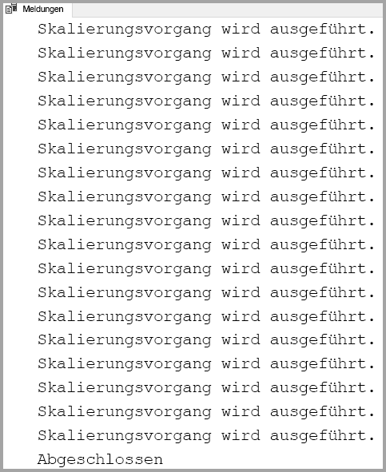

# <a name="quickstart-scale-compute-for-dedicated-sql-pool-formerly-sql-dw-in-azure-synapse-analytics-using-t-sql"></a>Schnellstart: Skalieren von Computeressourcen für einen dedizierten SQL-Pool (vormals SQL DW) in Azure Synapse Analytics mithilfe von T-SQL

Skalieren Sie Computeressourcen in einem dedizierten SQL-Pool (vormals SQL DW) mithilfe von T-SQL und SQL Server Management Studio (SSMS). [Skalieren Sie Computeressourcen auf](sql-data-warehouse-manage-compute-overview.md), um eine bessere Leistung zu erzielen, oder skalieren Sie sie ab, um Kosten einzusparen.

Wenn Sie kein Azure-Abonnement besitzen, können Sie ein [kostenloses Konto](https://azure.microsoft.com/free/) erstellen, bevor Sie beginnen.

## <a name="before-you-begin"></a>Voraussetzungen

Laden Sie die aktuelle Version von [SQL Server Management Studio](/sql/ssms/download-sql-server-management-studio-ssms?toc=/azure/synapse-analytics/sql-data-warehouse/toc.json&bc=/azure/synapse-analytics/sql-data-warehouse/breadcrumb/toc.json&view=azure-sqldw-latest) (SSMS) herunter, und installieren Sie sie.

## <a name="create-a-dedicated-sql-pool-formerly-sql-dw"></a>Erstellen eines dedizierten SQL-Pools (vormals SQL DW)

Verwenden Sie die Informationen unter [Schnellstart: Erstellen und Abfragen eines Synapse-SQL-Pools mit dem Azure-Portal](create-data-warehouse-portal.md), um einen dedizierten SQL-Pool (vormals SQL DW) namens **mySampleDataWarehouse** zu erstellen. Schließen Sie die Schnellstartanleitung ab, um sicherzustellen, dass Sie über eine Firewallregel verfügen und in SQL Server Management Studio eine Verbindung mit Ihrem dedizierten SQL-Pool (vormals SQL DW) herstellen können.

## <a name="connect-to-the-server-as-server-admin"></a>Herstellen einer Verbindung mit dem Server als Serveradministrator

In diesem Abschnitt wird [SQL Server Management Studio](/sql/ssms/download-sql-server-management-studio-ssms?toc=/azure/synapse-analytics/sql-data-warehouse/toc.json&bc=/azure/synapse-analytics/sql-data-warehouse/breadcrumb/toc.json&view=azure-sqldw-latest) zum Herstellen einer Verbindung mit Ihrem Azure SQL-Server verwendet.

1. Öffnen Sie SQL Server Management Studio.

2. Geben Sie im Dialogfeld **Mit Server verbinden** die folgenden Informationen ein:

   | Einstellung       | Vorgeschlagener Wert | BESCHREIBUNG |
   | ------------ | ------------------ | ------------------------------------------------- |
   | Servertyp | Datenbank-Engine | Dieser Wert ist erforderlich. |
   | Servername | Der vollqualifizierte Servername | Beispiel: **mySampleDataWarehouseservername.database.windows.net**. |
   | Authentifizierung | SQL Server-Authentifizierung | In diesem Tutorial ist die SQL-Authentifizierung der einzige konfigurierte Authentifizierungstyp. |
   | Anmeldename | Das Serveradministratorkonto | Hierbei handelt es sich um das Konto, das Sie bei der Servererstellung angegeben haben. |
   | Kennwort | Das Kennwort für das Serveradministratorkonto | Das Kennwort, das Sie beim Erstellen des Servers angegeben haben. |

    

3. Klicken Sie auf **Verbinden**. Das Fenster „Objekt-Explorer“ wird in SSMS geöffnet.

4. Erweitern Sie im Objekt-Explorer den Eintrag **Datenbanken**. Erweitern Sie dann **mySampleDataWarehouse**, um die Objekte in Ihrer neuen Datenbank anzuzeigen.

    

## <a name="view-service-objective"></a>Anzeigen des Dienstziels

Die Einstellung des Dienstziels enthält die Anzahl der Data Warehouse-Einheiten für den dedizierten SQL-Pool (vormals SQL DW).

So zeigen Sie die aktuellen Data Warehouse-Einheiten für den dedizierten SQL-Pool (vormals SQL DW) an:

1. Erweitern Sie unter der Verbindung mit **mySampleDataWarehouseservername.database.windows.net** den Knoten **Systemdatenbanken**.
2. Klicken Sie mit der rechten Maustaste auf **master** und dann auf **Neue Abfrage**. Ein neues Abfragefenster wird geöffnet.
3. Führen Sie die folgende Abfrage aus, um eine Auswahl aus der dynamischen Verwaltungssicht „sys.database_service_objectives“ zu treffen.

    ```sql
    SELECT
        db.name [Database]
    ,    ds.edition [Edition]
    ,    ds.service_objective [Service Objective]
    FROM
         sys.database_service_objectives ds
    JOIN
        sys.databases db ON ds.database_id = db.database_id
    WHERE
        db.name = 'mySampleDataWarehouse'
    ```

4. Die folgenden Ergebnisse zeigen, dass für **mySampleDataWarehouse** ein Dienstziel von DW400 besteht.

    

## <a name="scale-compute"></a>Skalieren von Computeressourcen

Im dedizierten SQL-Pool (vormals SQL DW) können Sie die Menge der Computeressourcen durch das Anpassen der Data Warehouse-Einheiten erhöhen oder verringern. Mit dem [Schnellstart: Erstellen und Abfragen einer Azure SQL Data Warehouse-Instanz im Azure-Portal](create-data-warehouse-portal.md) wurde **mySampleDataWarehouse** erstellt und mit 400 DWUs initialisiert. In den folgenden Schritten werden die DWUs für **mySampleDataWarehouse** angepasst.

So ändern Sie Data Warehouse-Einheiten

1. Klicken Sie mit der rechten Maustaste auf **master** und dann auf **Neue Abfrage**.
2. Mit der T-SQL-Anweisung [ALTER DATABASE](/sql/t-sql/statements/alter-database-azure-sql-database?toc=/azure/synapse-analytics/sql-data-warehouse/toc.json&bc=/azure/synapse-analytics/sql-data-warehouse/breadcrumb/toc.json&view=azure-sqldw-latest) ändern Sie das Dienstziel. Führen Sie die folgende Abfrage aus, um das Dienstziel in DW300 zu ändern.

    ```Sql
    ALTER DATABASE mySampleDataWarehouse
    MODIFY (SERVICE_OBJECTIVE = 'DW300c');
    ```

## <a name="monitor-scale-change-request"></a>Überwachen der Skalierungsänderungsanforderung

Wenn Sie den Fortschritt der vorherigen Änderungsanforderung anzeigen möchten, können Sie unter Verwendung der T-SQL-Syntax `WAITFORDELAY` die dynamische Verwaltungssicht (Dynamic Management View, DMV) „sys.dm_operation_status“ abfragen.

So fragen Sie den Status der Dienstobjektänderung ab:

1. Klicken Sie mit der rechten Maustaste auf **master** und dann auf **Neue Abfrage**.
2. Führen Sie die folgende Abfrage aus, um die DMV „sys.dm_operation_status“ abzufragen.

    ```sql
    WHILE
    (
        SELECT TOP 1 state_desc
        FROM sys.dm_operation_status
        WHERE
            1=1
            AND resource_type_desc = 'Database'
            AND major_resource_id = 'mySampleDataWarehouse'
            AND operation = 'ALTER DATABASE'
        ORDER BY
            start_time DESC
    ) = 'IN_PROGRESS'
    BEGIN
        RAISERROR('Scale operation in progress',0,0) WITH NOWAIT;
        WAITFOR DELAY '00:00:05';
    END
    PRINT 'Complete';
    ```

3. Die Ausgabe zeigt ein Protokoll für den Statusabruf.

    

## <a name="check-dedicated-sql-pool-formerly-sql-dw-state"></a>Überprüfen des Zustands eines dedizierten SQL-Pools (vormals SQL DW)

Wenn ein dedizierter SQL-Pool (vormals SQL DW) angehalten wurde, können Sie mit T-SQL keine Verbindung mit ihm herstellen. Um den aktuellen Zustand des dedizierten SQL-Pools (vormals SQL DW) anzuzeigen, können Sie ein PowerShell-Cmdlet verwenden. Ein Beispiel finden Sie unter [Überprüfen des Data Warehouse-Zustands](quickstart-scale-compute-powershell.md#check-data-warehouse-state).

## <a name="check-operation-status"></a>Überprüfen des Vorgangsstatus

Um Informationen zu verschiedenen Verwaltungsvorgängen für den dedizierten SQL-Pool zurückzugeben, führen Sie die folgende Abfrage für die DMV [sys.dm_operation_status](/sql/relational-databases/system-dynamic-management-views/sys-dm-operation-status-azure-sql-database?toc=/azure/synapse-analytics/sql-data-warehouse/toc.json&bc=/azure/synapse-analytics/sql-data-warehouse/breadcrumb/toc.json&view=azure-sqldw-latest) aus. Beispielsweise werden der Vorgang und der Status des Vorgangs („IN_PROGRESS“ oder „COMPLETED“) zurückgegeben.

```sql
SELECT *
FROM
    sys.dm_operation_status
WHERE
    resource_type_desc = 'Database'
AND
    major_resource_id = 'mySampleDataWarehouse'
```

## <a name="next-steps"></a>Nächste Schritte

Sie haben erfahren, wie Sie Computeressourcen für Ihren dedizierten SQL-Pool (vormals SQL DW) skalieren. Weitere Informationen zu Azure Synapse Analytics finden Sie im Tutorial zum Laden von Daten.

> [!div class="nextstepaction"]
>[Tutorial: Laden des Datasets „New York Taxis“](./load-data-from-azure-blob-storage-using-copy.md)