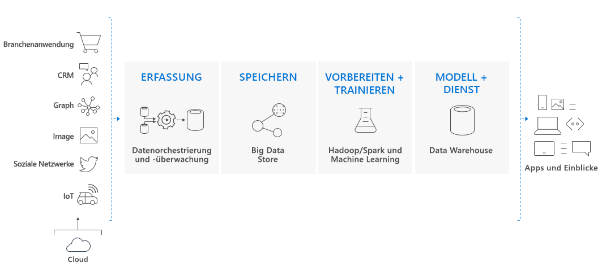

# Was ist Azure Synapse Analytics (früher SQL DW)?

> [!NOTE] 
>Sehen Sie sich die [Dokumentation zu Azure Synapse (Vorschau für Arbeitsbereiche)](../overview-what-is.md) an.
>

Azure Synapse ist ein Analysedienst, der Data Warehousing für Unternehmen mit Big Data-Analysen vereint. Er ermöglicht flexible Datenabfragen nach Ihren Vorstellungen, indem serverlose On-Demand-Ressourcen oder bereitgestellten Ressourcen im gewünschten Umfang verwendet werden. Azure Synapse kombiniert diese beiden Welten in einer vereinheitlichten Oberfläche zur Erfassung, Vorbereitung, Verwaltung und Verarbeitung von Daten für sofortige BI- und Machine Learning-Anforderungen.

Azure Synapse besteht aus vier Komponenten:

- Synapse SQL: Umfassende T-SQL-basierte Analyse – allgemein verfügbar
  - SQL-Pool (Bezahlung pro bereitgestellter DWU)
  - SQL On-Demand (Bezahlung pro verarbeitetem TB) – Vorschau
- Spark: Fest integriertes Apache Spark (Vorschau)
- Synapse-Pipelines: Hybrid-Datenintegration (Vorschau)
- Studio: Einheitliche Benutzeroberfläche. (Vorschauversion)

## Synapse SQL-Pool in Azure Synapse

Ein Synapse SQL-Pool bezieht sich auf die Data Warehousing-Features für Unternehmen, die in Azure Synapse allgemein zur Verfügung stehen.

Der SQL-Pool ist eine Sammlung von Analyseressourcen, die bei Verwendung von Synapse SQL bereitgestellt werden. Die Größe des SQL-Pools wird durch die Data Warehouse-Einheiten (DWUs) bestimmt.

Führen Sie den Import großer Datenmengen mit einfachen [PolyBase](/sql/relational-databases/polybase/polybase-guide?toc=/azure/synapse-analytics/sql-data-warehouse/toc.json&bc=/azure/synapse-analytics/sql-data-warehouse/breadcrumb/toc.json&view=azure-sqldw-latest)-T-SQL-Abfragen durch, und nutzen Sie anschließend die Vorteile von MPP für Hochleistungsanalysen. Bei der Integration und Analyse wird der Synapse SQL-Pool für Ihr Unternehmen somit zur alleinigen zuverlässigen Quelle für die Gewinnung schneller und besser fundierter Erkenntnisse.  

## Schlüsselkomponente einer Big Data-Lösung

Data Warehousing ist eine Schlüsselkomponente einer cloudbasierten Komplettlösung für Big Data.

In einer Clouddatenlösung werden Daten aus verschiedensten Quellen in Big Data-Speichern erfasst. Nach der Speicherung in einem Big Data-Speicher werden die Daten durch Hadoop, Spark und Machine Learning-Algorithmen vorbereitet und trainiert. Wenn die Daten für komplexe Analysen bereit sind, fragt der Synapse SQL-Pool die Big Data-Speicher mithilfe von PolyBase ab. PolyBase verwendet T-SQL-Standardabfragen, um die Daten an Tabellen des Synapse SQL-Pools zu übermitteln.

Der Synapse SQL-Pool speichert Daten in relationalen Tabellen mit spaltenbasiertem Speicher. Dieses Format zeichnet sich durch erheblich geringere Datenspeicherkosten und eine bessere Abfrageleistung aus. Nachdem die Daten gespeichert wurden, können Sie Analysen in großem Umfang durchführen. Im Vergleich zu herkömmlichen Datenbanksystemen dauern Analyseabfragen nur noch Sekunden statt Minuten (oder Stunden statt Tage).

Die Analyseergebnisse können an Berichtsdatenbanken oder Anwendungen auf der ganzen Welt übermittelt werden. Business Analysts können so Erkenntnisse gewinnen und fundierte Geschäftsentscheidungen treffen.

## Nächste Schritte

- Erkunden Sie die [Architektur von Azure Synapse](massively-parallel-processing-mpp-architecture.md).
- Führen Sie eine schnelle [Erstellung eines SQL-Pools](create-data-warehouse-portal.md) durch.
- [Laden von Beispieldaten](load-data-from-azure-blob-storage-using-polybase.md)
- Ansehen von [Videos](https://azure.microsoft.com/documentation/videos/index/?services=sql-data-warehouse)

Oder sehen Sie sich einige der folgenden weiteren Azure Synapse-Ressourcen an:

- Suche in [Blogs](https://azure.microsoft.com/blog/tag/azure-sql-data-warehouse/)
- Übermitteln von [Funktionsanfragen](https://feedback.azure.com/forums/307516-sql-data-warehouse)
- [Erstellen eines Supporttickets](sql-data-warehouse-get-started-create-support-ticket.md)
- Suche auf der [Frageseite von Microsoft Q&A (Fragen und Antworten)](https://docs.microsoft.com/answers/topics/azure-synapse-analytics.html)
- Suche im [Stack Overflow-Forum](https://stackoverflow.com/questions/tagged/azure-sqldw)
