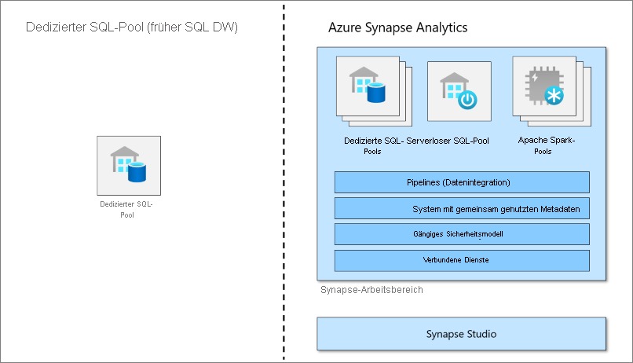

# Was ist ein dedizierter SQL-Pool (vormals SQL DW) in Azure Synapse Analytics?

Azure Synapse Analytics ist ein Analysedienst, der Data Warehousing für Unternehmen mit Big Data-Analysen vereint. Dedizierter SQL-Pool (vormals SQL DW) bezieht sich auf die Data Warehousing-Features für Unternehmen, die in Azure Synapse Analytics zur Verfügung stehen.

Ein dedizierter SQL-Pool (vormals SQL DW) ist eine Sammlung von Analyseressourcen, die bei Verwendung von Synapse SQL bereitgestellt werden. Die Größe eines dedizierten SQL-Pools (vormals SQL DW) wird durch Data Warehouse-Einheiten (Data Warehouse Units, DWUs) bestimmt.

Nach der Erstellung des dedizierten SQL-Pools können Sie Big Data mit einfachen [PolyBase](/sql/relational-databases/polybase/polybase-guide?toc=/azure/synapse-analytics/sql-data-warehouse/toc.json&bc=/azure/synapse-analytics/sql-data-warehouse/breadcrumb/toc.json&view=azure-sqldw-latest&preserve-view=true)-T-SQL-Abfragen importieren und anschließend die Vorteile der Engine für verteilte Abfragen für Hochleistungsanalysen nutzen. Bei der Integration und Analyse der Daten wird der dedizierte SQL-Pool (vormals SQL DW) für Ihr Unternehmen somit zur alleinigen zuverlässigen Quelle für die Gewinnung schneller und besser fundierter Erkenntnisse.

> [!NOTE]
>Informieren Sie sich ausführlicher in der [Dokumentation zu Azure Synapse Analytics](../overview-what-is.md).
> 

## Schlüsselkomponente einer Big Data-Lösung

Data Warehousing ist eine Schlüsselkomponente einer cloudbasierten Komplettlösung für Big Data.

In einer Clouddatenlösung werden Daten aus verschiedensten Quellen in Big Data-Speichern erfasst. Nach der Speicherung in einem Big Data-Speicher werden die Daten durch Hadoop, Spark und Machine Learning-Algorithmen vorbereitet und trainiert. Wenn die Daten für komplexe Analysen bereit sind, fragt der dedizierte SQL-Pool die Big Data-Speicher mithilfe von PolyBase ab. PolyBase verwendet T-SQL-Standardabfragen, um die Daten an Tabellen des dedizierten SQL-Pools (vormals SQL DW) zu übermitteln.

Der dedizierte SQL-Pool (vormals SQL DW) speichert Daten in relationalen Tabellen mit spaltenbasiertem Speicher. Dieses Format zeichnet sich durch erheblich geringere Datenspeicherkosten und eine wesentlich bessere Abfrageleistung aus. Nachdem die Daten gespeichert wurden, können Sie Analysen in großem Umfang durchführen. Im Vergleich zu herkömmlichen Datenbanksystemen dauern Analyseabfragen nur noch Sekunden statt Minuten (oder Stunden statt Tage).

Die Analyseergebnisse können an Berichtsdatenbanken oder Anwendungen auf der ganzen Welt übermittelt werden. Business Analysts können so Erkenntnisse gewinnen und fundierte Geschäftsentscheidungen treffen.

## Nächste Schritte

- Erkunden Sie die [Architektur von Azure Synapse](massively-parallel-processing-mpp-architecture.md).
- Informieren Sie sich darüber, wie Sie schnell [einen dedizierten SQL-Pool erstellen](create-data-warehouse-portal.md).
- [Laden von Beispieldaten](./load-data-from-azure-blob-storage-using-copy.md)
- Ansehen von [Videos](https://azure.microsoft.com/documentation/videos/index/?services=sql-data-warehouse)

Oder sehen Sie sich einige der folgenden weiteren Azure Synapse-Ressourcen an:

- Suche in [Blogs](https://azure.microsoft.com/blog/tag/azure-sql-data-warehouse/)
- Übermitteln von [Funktionsanfragen](https://feedback.azure.com/forums/307516-sql-data-warehouse)
- [Erstellen eines Supporttickets](sql-data-warehouse-get-started-create-support-ticket.md)
- Suche auf der [Frageseite von Microsoft Q&A (Fragen und Antworten)](/answers/topics/azure-synapse-analytics.html)
- Suche im [Stack Overflow-Forum](https://stackoverflow.com/questions/tagged/azure-sqldw)