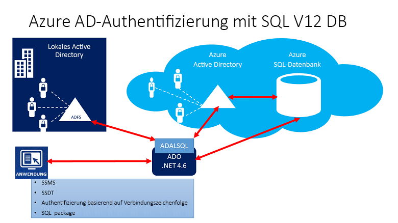
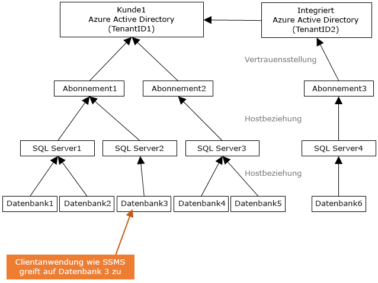
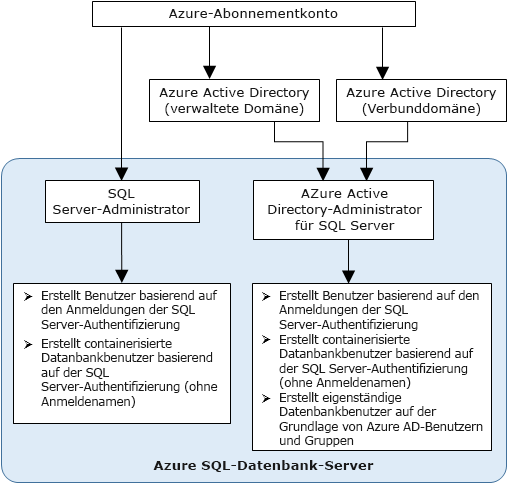

# Verwenden der Azure Active Directory-Authentifizierung für die Authentifizierung mit Synapse SQL

Azure Active Directory-Authentifizierung ist ein Mechanismus zum Herstellen einer Verbindung mit [Azure Synapse Analytics](../overview-faq.md), bei dem Identitäten in Azure Active Directory (Azure AD) verwendet werden.

Mit der Azure AD-Authentifizierung können Sie zur Vereinfachung der Berechtigungsverwaltung die Benutzeridentitäten zentral verwalten, die Zugriff auf Azure Synapse haben. Daraus ergeben sich u. a. die folgenden Vorteile:

- Sie bietet eine Alternative zur regulären Benutzernamen- und Kennwortauthentifizierung.
- Es wird einer unkontrollierten Ausbreitung von Benutzeridentitäten über Server hinweg Einhalt geboten.
- Über eine zentrale Stelle wird eine Kennwortrotation ermöglicht.
- Kunden können Berechtigungen mithilfe von externen Gruppen (Azure AD) verwalten.
- Durch das Aktivieren der integrierten Windows-Authentifizierung und andere von Azure Active Directory unterstützte Authentifizierungsformen wird das Speichern von Kennwörtern überflüssig.
- Azure AD unterstützt die tokenbasierte Authentifizierung für Anwendungen, die eine Verbindung mit Azure Synapse herstellen.
- Die Azure Active Directory-Authentifizierung unterstützt AD FS (Domänenverbund) sowie native Benutzer-/Kennwortauthentifizierung für ein lokales Azure Active Directory ohne Domänensynchronisierung.
- Azure AD unterstützt Verbindungen von SQL Server Management Studio, bei denen universelle Active Directory-Authentifizierungsverfahren verwendet werden, zu denen auch die Multi-Factor Authentication (MFA) gehört.  MFA bietet eine sichere Authentifizierung über eine Reihe einfacher Überprüfungsoptionen – Telefonanruf, SMS, Smartcards mit PIN oder Benachrichtigung in einer mobilen App. Weitere Informationen finden Sie unter [Verwenden der mehrstufigen AAD-Authentifizierung mit Synapse SQL (SSMS-Unterstützung für MFA)](mfa-authentication.md).
- Azure AD unterstützt ähnliche Verbindungen aus SQL Server Data Tools (SSDT), die die interaktive Active Directory-Authentifizierung verwenden. Weitere Informationen finden Sie unter [Azure Active Directory-Unterstützung in SQL Server Data Tools (SSDT)](/sql/ssdt/azure-active-directory?toc=/azure/synapse-analytics/toc.json&bc=/azure/synapse-analytics/breadcrumb/toc.json&view=azure-sqldw-latest).

Die Konfigurationsschritte schließen die folgenden Verfahren zum Konfigurieren und Verwenden der Azure Active Directory-Authentifizierung ein:

1. Erstellen und Auffüllen von Azure AD
2. Erstellen einer Azure Active Directory-Identität
3. Zuweisen einer Rolle zur erstellten Azure Active Directory-Identität im Synapse-Arbeitsbereich (Vorschauversion)
4. Herstellen einer Verbindung mit Synapse Studio unter Verwendung von Azure AD-Identitäten

## AAD-Pass-Through in Azure Synapse Analytics

Azure Synapse Analytics ermöglicht den Zugriff auf die Daten im Data Lake unter Verwendung Ihrer Azure Active Directory Identität.

Wenn Sie für die Dateien und Daten Zugriffsrechte festlegen, die in verschiedenen Daten-Engines berücksichtigt werden, können Sie Ihre Data Lake-Lösungen vereinfachen, da die Berechtigungen an einem zentralen Ort definiert werden.

## Architektur von Vertrauensstellungen

Das folgende Diagramm bietet eine Übersicht über die Lösungsarchitektur für die Azure AD-Authentifizierung mit Synapse SQL. Zur Unterstützung des nativen Benutzerkennworts von Azure AD werden nur der Cloudanteil und Azure AD/Synapse SQL berücksichtigt. Zur Unterstützung der Verbundauthentifizierung (oder von Benutzername und Kennwort für Windows-Anmeldeinformationen) ist die Kommunikation mit dem AD FS-Block erforderlich. Die Pfeile zeigen die Kommunikationswege.

Das folgende Diagramm zeigt die Verbund-, Vertrauensstellungs- und Hostbeziehungen, die einem Client durch Übermittlung eines Tokens die Verbindungsherstellung mit einer Datenbank ermöglichen. Das Token wird von einem Azure Active Directory authentifiziert, und die Datenbank vertraut dem Token. 

Bei „Customer1“ kann es sich um ein Azure Active Directory mit nativen Benutzern oder um ein Azure AD mit Verbundbenutzern handeln. „Customer2“ stellt eine mögliche Lösung einschließlich importierter Benutzer dar. In diesem Beispiel stammen diese aus einem dem Verbund angehörenden Azure Active Directory, und AD FS wird mit Azure Active Directory synchronisiert. 

Wichtig: Für den Zugriff auf eine Datenbank mithilfe der Azure AD-Authentifizierung muss das Abonnement, das als Host fungiert, dem Azure AD zugeordnet sein. Das gleiche Abonnement muss auch verwendet werden, um die SQL Server-Instanz zu erstellen, in der Azure SQL-Datenbank oder der SQL-Pool gehostet wird.

## Administratorstruktur

Bei Verwendung der Azure AD-Authentifizierung sind zwei Administratorkonten für Synapse SQL vorhanden: der ursprüngliche SQL Server-Administrator und der Azure AD-Administrator. Nur der auf einem Azure AD-Konto basierende Administrator kann den ersten eigenständigen Azure AD-Datenbankbenutzer in einer Benutzerdatenbank erstellen. 

Das Konto für die Azure AD-Administratoranmeldung kann ein Azure AD-Benutzer oder eine Azure AD-Gruppe sein. Wenn es sich bei dem Administrator um ein Gruppenkonto handelt, kann es von einem beliebigen Gruppenmitglied verwendet werden, sodass mehrere Azure AD-Administratoren die Synapse SQL-Instanz verwalten können. 

Die Verwendung eines Gruppenkontos für den Administrator verbessert die Verwaltbarkeit und ermöglicht es Ihnen, Gruppenmitglieder in Azure AD zentral hinzuzufügen und zu entfernen, ohne die Benutzer oder Berechtigungen im Synapse Analytics-Arbeitsbereich zu ändern. Es kann jeweils nur ein Azure AD-Administrator (ein Benutzer oder eine Gruppe) konfiguriert werden.

## Berechtigungen

Um neue Benutzer zu erstellen, müssen Sie über die Berechtigung `ALTER ANY USER` in der Datenbank verfügen. Die Berechtigung `ALTER ANY USER` kann jedem Datenbankbenutzer gewährt werden. Die Berechtigung `ALTER ANY USER` haben auch Serveradministratorkonten inne, ebenso wie Datenbankbenutzer mit der Berechtigung `CONTROL ON DATABASE` oder `ALTER ON DATABASE` für diese Datenbank sowie Mitglieder der Datenbankrolle `db_owner`.

Für die Erstellung eines Benutzer für die eigenständige Datenbank in Synapse SQL müssen Sie unter Verwendung einer Azure AD-Identität eine Verbindung mit der Datenbank oder Instanz herstellen. Um den ersten eigenständigen Datenbankbenutzer zu erstellen, müssen Sie unter Verwendung eines Azure AD-Administrators (dieser ist der Besitzer der Datenbank) eine Verbindung mit der Datenbank herstellen. 

Eine Azure AD-Authentifizierung ist nur möglich, wenn der Azure AD-Administrator für Synapse SQL erstellt wurde. Falls der Azure Active Directory-Administrator vom Server entfernt wurde, können vorhandene Azure Active Directory-Benutzer, die zuvor in Synapse SQL erstellt wurden, mithilfe ihrer Azure Active Directory-Anmeldeinformationen keine Verbindung mehr mit der Datenbank herstellen.
 
## Funktionen und Einschränkungen von Azure AD

- Die folgenden Elemente von Azure AD können in Synapse SQL Server bereitgestellt werden:

  - Native Elemente: In Azure AD erstellte Mitglieder in der verwalteten Domäne oder einer Kundendomäne. Weitere Informationen finden Sie unter [Verwenden von benutzerdefinierten Domänennamen zum Vereinfachen des Anmeldevorgangs für Benutzer](../../active-directory/fundamentals/add-custom-domain.md?toc=/azure/synapse-analytics/toc.json&bc=/azure/synapse-analytics/breadcrumb/toc.json).
  - Mitglieder der Verbunddomäne: In Azure AD mit einer Verbunddomäne erstellte Mitglieder. Weitere Informationen finden Sie unter [Microsoft Azure now supports federation with Windows Server Active Directory](https://azure.microsoft.com/blog/20../../windows-azure-now-supports-federation-with-windows-server-active-directory/)(Microsoft Azure unterstützt jetzt den Verbund mit Windows Server Active Directory).
  - Aus anderen Azure AD-Instanzen importierte Mitglieder, die native Mitglieder oder Mitglieder der Verbunddomäne sind.
  - Active Directory-Gruppen, die als Sicherheitsgruppen erstellt wurden.

- Azure AD-Benutzer, die einer Gruppe mit der Serverrolle `db_owner` angehören, können die Syntax **[CREATE DATABASE SCOPED CREDENTIAL](/sql/t-sql/statements/create-database-scoped-credential-transact-sql?toc=/azure/synapse-analytics/toc.json&bc=/azure/synapse-analytics/breadcrumb/toc.json&view=azure-sqldw-latest)** für Synapse SQL nicht verwenden. Der folgende Fehler wird angezeigt:

    `SQL Error [2760] [S0001]: The specified schema name 'user@mydomain.com' either does not exist or you do not have permission to use it.`

    Erteilen Sie die Rolle `db_owner` direkt dem einzelnen Azure AD-Benutzer, um das Problem **CREATE DATABASE SCOPED CREDENTIAL** zu verringern.

- Diese Systemfunktionen geben bei der Ausführung unter Azure AD-Prinzipalen NULL-Werte zurück:

  - `SUSER_ID()`
  - `SUSER_NAME(<admin ID>)`
  - `SUSER_SNAME(<admin SID>)`
  - `SUSER_ID(<admin name>)`
  - `SUSER_SID(<admin name>)`

## Herstellen einer Verbindung mit Azure AD-Identitäten

Die Azure Active Directory-Authentifizierung unterstützt die folgenden Methoden der Verbindungsherstellung mit einer Datenbank unter Verwendung von Azure AD-Identitäten:

- Azure Active Directory Password
- Azure Active Directory Integrated
- Azure Active Directory: universell mit MFA
- Anwendungstokenauthentifizierung

Die folgenden Authentifizierungsmethoden werden für Azure AD-Serverprinzipale (Anmeldungen) (**öffentliche Vorschau**) unterstützt:

- Azure Active Directory Password
- Azure Active Directory Integrated
- Azure Active Directory: universell mit MFA

### Weitere Überlegungen

- Um die Verwaltungsmöglichkeiten zu verbessern, wird empfohlen, eine dedizierte Azure AD-Gruppe als Administrator bereitzustellen.
- Es kann jeweils nur ein Azure AD-Administrator (ein Benutzer oder eine Gruppe) für einen Synapse SQL-Pool konfiguriert werden.
  - Das Hinzufügen von Azure AD-Serverprinzipalen (Anmeldungen) für SQL On-Demand (Vorschauversion) ermöglicht es, mehrere Azure AD-Serverprinzipale (Anmeldungen) zu erstellen, die der Rolle `sysadmin` hinzugefügt werden können.
- Nur ein Azure AD-Administrator für Synapse SQL kann zunächst über ein Azure Active Directory-Konto eine Verbindung mit Synapse SQL herstellen. Der Active Directory-Administrator kann weitere Azure AD-Datenbankbenutzer konfigurieren.
- Es wird empfohlen, das Verbindungstimeout auf 30 Sekunden festzulegen.
- SQL Server 2016 Management Studio und SQL Server Data Tools für Visual Studio 2015 (ab Version 14.0.60311.1April 2016) unterstützen die Azure Active Directory-Authentifizierung. (Die Azure AD-Authentifizierung wird vom **.NET Framework-Datenanbieter für SqlServer**ab .NET Framework 4.6 unterstützt.) Daher können die neuesten Versionen dieser Tools und Datenebenenanwendungen (DAC und BACPAC) die Azure AD-Authentifizierung verwenden.
- Ab Version 15.0.1 unterstützen [SQLCMD-Hilfsprogramm](/sql/tools/sqlcmd-utility?toc=/azure/synapse-analytics/toc.json&bc=/azure/synapse-analytics/breadcrumb/toc.json&view=azure-sqldw-latest) und [BCP-Hilfsprogramm](/sql/tools/bcp-utility?toc=/azure/synapse-analytics/toc.json&bc=/azure/synapse-analytics/breadcrumb/toc.json&view=azure-sqldw-latest) die interaktive Active Directory-Authentifizierung mit MFA.
- SQL Server Data Tools für Visual Studio 2015 erfordert mindestens die Data Tools-Version von April 2016 (Version 14.0.60311.1). Azure AD-Benutzer werden derzeit nicht im SSDT-Objekt-Explorer angezeigt. Sie können die Benutzer in [sys.database_principals](/sql/relational-databases/system-catalog-views/sys-database-principals-transact-sql?toc=/azure/synapse-analytics/toc.json&bc=/azure/synapse-analytics/breadcrumb/toc.json&view=azure-sqldw-latest) anzeigen, um dieses Problem zu umgehen.
- [Microsoft JDBC-Treiber 6.0 für SQL Server](https://www.microsoft.com/download/details.aspx?id=11774) unterstützt die Azure AD-Authentifizierung. Siehe auch [Einstellen der Verbindungseigenschaften](/sql/connect/jdbc/setting-the-connection-properties?toc=/azure/synapse-analytics/toc.json&bc=/azure/synapse-analytics/breadcrumb/toc.json&view=azure-sqldw-latest).

## Nächste Schritte

- Eine Übersicht über den Zugriff und die Steuerung in Synapse SQL finden Sie unter [Verwalten des Zugriffs auf Arbeitsbereiche, Daten und Pipelines](../sql/access-control.md).
- Weitere Informationen zu Datenbankprinzipalen finden Sie unter [Prinzipale](/sql/relational-databases/security/authentication-access/principals-database-engine?toc=/azure/synapse-analytics/toc.json&bc=/azure/synapse-analytics/breadcrumb/toc.json&view=azure-sqldw-latest).
- Weitere Informationen zu Datenbankrollen finden Sie unter [Datenbankrollen](/sql/relational-databases/security/authentication-access/database-level-roles?toc=/azure/synapse-analytics/toc.json&bc=/azure/synapse-analytics/breadcrumb/toc.json&view=azure-sqldw-latest).

 