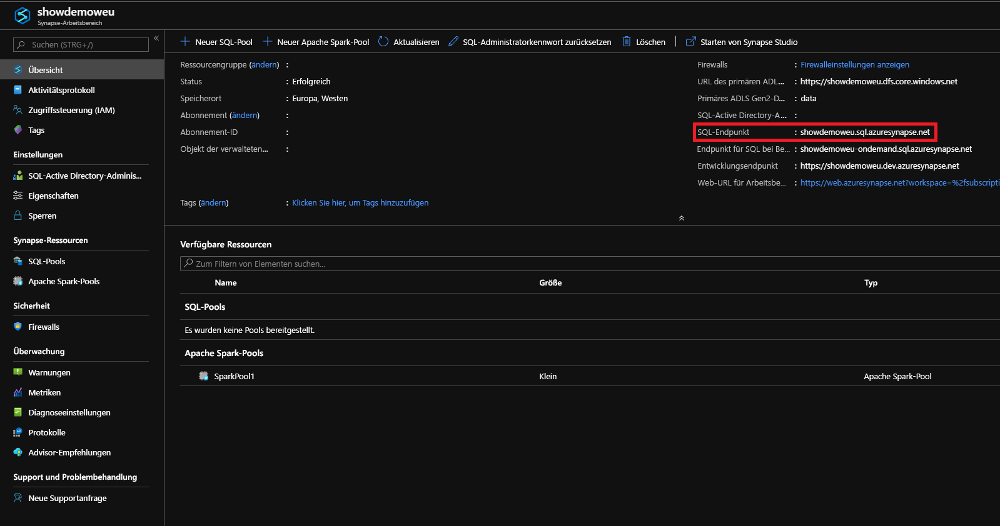
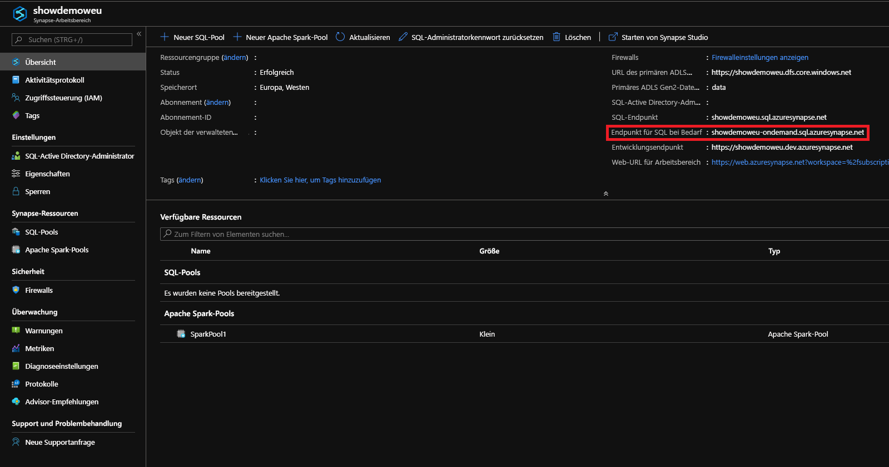

# <a name="connect-to-synapse-sql"></a>Herstellen einer Verbindung mit Synapse SQL
Stellen Sie eine Verbindung mit der Synapse SQL-Funktion in Azure Synapse Analytics her.

## <a name="supported-tools-for-serverless-sql-pool"></a>Unterstützte Tools für den serverlosen SQL-Pool

[Azure Data Studio](/sql/azure-data-studio/download-azure-data-studio) wird ab Version 1.18.0 vollständig unterstützt. SSMS wird ab Version 18.5 teilweise unterstützt, kann aber nur zum Herstellen einer Verbindung und für Abfragen verwendet werden.

> [!NOTE]
> Wenn die Verbindung bei einer AAD-Anmeldung zum Zeitpunkt der Abfrageausführung länger als eine Stunde geöffnet bleibt, schlägt jede auf AAD basierende Abfrage fehl. Dazu gehört das Abfragen von Speicher mit AAD-Pass-Through und Anweisungen, die mit AAD interagieren (z. B. CREATE EXTERNAL PROVIDER). Dies wirkt sich auf jedes Tool aus, das Verbindungen geöffnet hält, wie beim Abfrage-Editor in SSMS und ADS. Tools wie Synapse Studio, die neue Verbindungen zur Ausführung einer Abfrage öffnen, sind davon nicht betroffen.

> Zur Behebung dieses Problems können Sie SSMS neu starten oder in ADS eine Verbindung herstellen und trennen. 

## <a name="find-your-server-name"></a>Suchen des Servernamens

Der Servername für den dedizierten SQL-Pool im folgenden Beispiel lautet „showdemoweu.sql.azuresynapse.net“.
Der Servername für den serverlosen SQL-Pool im folgenden Beispiel lautet „showdemoweu-ondemand.sql.azuresynapse.net“.

So ermitteln Sie den vollqualifizierten Servernamen

1. Öffnen Sie das [Azure-Portal](https://portal.azure.com).
2. Wählen Sie **Synapse workspaces** (Synapse-Arbeitsbereiche) aus.
3. Wählen Sie den Arbeitsbereich aus, mit dem Sie eine Verbindung herstellen möchten.
4. Navigieren Sie zur Übersicht.
5. Suchen Sie den vollständigen Servernamen.

## <a name="sql-pool"></a>**SQL-Pool**



## <a name="serverless-sql-pool"></a>**Serverloser SQL-Pool**



## <a name="supported-drivers-and-connection-strings"></a>Unterstützte Treiber und Verbindungszeichenfolgen
Synapse SQL unterstützt [ADO.NET](https://msdn.microsoft.com/library/e80y5yhx(v=vs.110).aspx), [ODBC](https://msdn.microsoft.com/library/jj730314.aspx), [PHP](https://msdn.microsoft.com/library/cc296172.aspx?f=255&MSPPError=-2147217396) und [JDBC](https://msdn.microsoft.com/library/mt484311(v=sql.110).aspx). Um zur neuesten Version und Dokumentation zu gelangen, wählen Sie einen der genannten Treiber aus. Zur automatischen Erstellung der Verbindungszeichenfolge für den verwendeten Treiber wählen Sie im Azure-Portal die Option **Datenbank-Verbindungszeichenfolgen anzeigen** aus, wie im vorherigen Beispiel zu sehen. Im Anschluss finden Sie auch einige Beispielverbindungszeichenfolgen für die einzelnen Treiber.

> [!NOTE]
> Es empfiehlt sich, das Verbindungstimeout auf 300 Sekunden festzulegen, damit die Verbindung bei kurzen Ausfällen bestehen bleibt.

### <a name="adonet-connection-string-example"></a>Beispielverbindungszeichenfolge für ADO.NET

```csharp
Server=tcp:{your_server}.sql.azuresynapse.net,1433;Database={your_database};User ID={your_user_name};Password={your_password_here};Encrypt=True;TrustServerCertificate=False;Connection Timeout=30;
```

### <a name="odbc-connection-string-example"></a>Beispielverbindungszeichenfolge für ODBC

```csharp
Driver={SQL Server Native Client 11.0};Server=tcp:{your_server}.sql.azuresynapse.net,1433;Database={your_database};Uid={your_user_name};Pwd={your_password_here};Encrypt=yes;TrustServerCertificate=no;Connection Timeout=30;
```

### <a name="php-connection-string-example"></a>Beispielverbindungszeichenfolge für PHP

```PHP
Server: {your_server}.sql.azuresynapse.net,1433 \r\nSQL Database: {your_database}\r\nUser Name: {your_user_name}\r\n\r\nPHP Data Objects(PDO) Sample Code:\r\n\r\ntry {\r\n   $conn = new PDO ( \"sqlsrv:server = tcp:{your_server}.sql.azuresynapse.net,1433; Database = {your_database}\", \"{your_user_name}\", \"{your_password_here}\");\r\n    $conn->setAttribute( PDO::ATTR_ERRMODE, PDO::ERRMODE_EXCEPTION );\r\n}\r\ncatch ( PDOException $e ) {\r\n   print( \"Error connecting to SQL Server.\" );\r\n   die(print_r($e));\r\n}\r\n\rSQL Server Extension Sample Code:\r\n\r\n$connectionInfo = array(\"UID\" => \"{your_user_name}\", \"pwd\" => \"{your_password_here}\", \"Database\" => \"{your_database}\", \"LoginTimeout\" => 30, \"Encrypt\" => 1, \"TrustServerCertificate\" => 0);\r\n$serverName = \"tcp:{your_server}.sql.azuresynapse.net,1433\";\r\n$conn = sqlsrv_connect($serverName, $connectionInfo);
```

### <a name="jdbc-connection-string-example"></a>Beispielverbindungszeichenfolge für JDBC

```Java
jdbc:sqlserver://yourserver.sql.azuresynapse.net:1433;database=yourdatabase;user={your_user_name};password={your_password_here};encrypt=true;trustServerCertificate=false;hostNameInCertificate=*.sql.azuresynapse.net;loginTimeout=30;
```

## <a name="connection-settings"></a>Verbindungseinstellungen
Bei der Verbindungs- und Objekterstellung werden von Synapse SQL einige Einstellungen standardisiert. Diese Einstellungen können nicht überschrieben werden, und zu ihnen gehören:

| Datenbankeinstellung | Wert |
|:--- |:--- |
| [ANSI_NULLS](/sql/t-sql/statements/set-ansi-nulls-transact-sql?toc=/azure/synapse-analytics/toc.json&bc=/azure/synapse-analytics/breadcrumb/toc.json&view=azure-sqldw-latest&preserve-view=true) |EIN |
| [QUOTED_IDENTIFIERS](/sql/t-sql/statements/set-quoted-identifier-transact-sql?toc=/azure/synapse-analytics/toc.json&bc=/azure/synapse-analytics/breadcrumb/toc.json&view=azure-sqldw-latest&preserve-view=true) |EIN |
| [DATEFORMAT](/sql/t-sql/statements/set-dateformat-transact-sql?toc=/azure/synapse-analytics/toc.json&bc=/azure/synapse-analytics/breadcrumb/toc.json&view=azure-sqldw-latest&preserve-view=true) |dmy |
| [DATEFIRST](/sql/t-sql/statements/set-datefirst-transact-sql?toc=/azure/synapse-analytics/toc.json&bc=/azure/synapse-analytics/breadcrumb/toc.json&view=azure-sqldw-latest&preserve-view=true) |7 |

## <a name="recommendations"></a>Empfehlungen

Für die Ausführung von Abfragen eines **serverlosen SQL-Pools** werden [Azure Data Studio](get-started-azure-data-studio.md) und Azure Synapse Studio empfohlen.

## <a name="next-steps"></a>Nächste Schritte
Informationen zum Herstellen einer Verbindung und zum Durchführen von Abfragen mit Visual Studio finden Sie unter [Abfragen von Azure SQL Data Warehouse (Visual Studio)](../sql-data-warehouse/sql-data-warehouse-query-visual-studio.md?toc=/azure/synapse-analytics/toc.json&bc=/azure/synapse-analytics/breadcrumb/toc.json). Weitere Informationen zu Authentifizierungsoptionen finden Sie unter [Authentifizieren bei Azure Synapse Analytics](../sql-data-warehouse/sql-data-warehouse-authentication.md?toc=/azure/synapse-analytics/toc.json&bc=/azure/synapse-analytics/breadcrumb/toc.json).