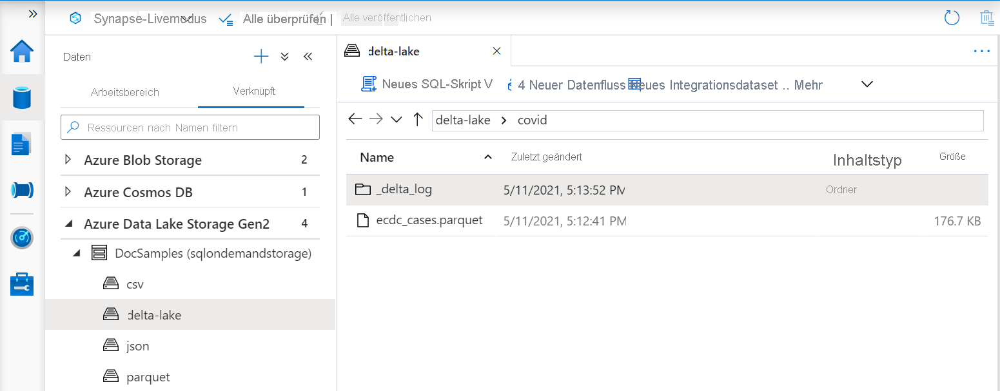

# <a name="create-and-use-native-external-tables-using-sql-pools-in-azure-synapse-analytics"></a>Erstellen und Verwenden nativer externer Tabellen mithilfe von SQL-Pools in Azure Synapse Analytics

In diesem Abschnitt erfahren Sie, wie Sie [native externe Tabellen](develop-tables-external-tables.md) in Synapse SQL-Pools erstellen und verwenden. Im Vergleich zu externen Tabellen mit `TYPE=HADOOP` in der Definition ihrer externen Datenquelle zeigen native externe Tabellen eine bessere Leistung. Dies liegt daran, dass native externe Tabellen nativen Code für den Zugriff auf externe Daten verwenden. 

Externe Tabellen sind nützlich, um den Zugriff auf externe Daten in einem Synapse SQL-Pool zu steuern. Außerdem sind externe Tabellen hilfreich, wenn Sie Tools wie Power BI zusammen mit einem Synapse SQL-Pool einsetzen möchten. Externe Tabellen können auf zwei Speichertypen zugreifen:
- Öffentlicher Speicher, in dem Benutzer auf öffentliche Speicherdateien zugreifen.
- Geschützter Speicher, in dem Benutzer mithilfe von SAS-Anmeldeinformationen, Azure AD-Identität oder verwalteter Identität des Synapse-Arbeitsbereichs auf Speicherdateien zugreifen.

> [!NOTE]
>  In dedizierten SQL-Pools können Sie nur native externe Parquet-Tabellen verwenden. Native externe Parquet-Tabellen befinden sich in den dedizierten SQL-Pools in der eingeschränkten öffentlichen Vorschauphase, weil dieses Feature noch immer nicht in allen Regionen verfügbar ist. Wenden Sie sich an Ihren Microsoft Technical Account Manager/Cloud Solution Architect, wenn Sie der öffentlichen Vorschau beitreten und überprüfen möchten, ob Sie die native externe Parquet-Tabelle in Ihren dedizierten Pools verwenden können. Wenn Sie allgemein verfügbare Funktionen in dedizierten SQL-Pools verwenden möchten oder auf CSV- oder ORC-Dateien zugreifen müssen, nutzen Sie externe Hadoop-Tabellen. Native externe Tabellen sind in serverlosen SQL-Pools allgemein verfügbar.
> Weitere Informationen zu den Unterschieden zwischen nativen externen Tabellen und externen Hadoop-Tabellen finden Sie unter [Verwenden externer Tabellen mit Synapse SQL](develop-tables-external-tables.md).

## <a name="prerequisites"></a>Voraussetzungen

Im ersten Schritt erstellen Sie eine Datenbank, in der die Tabellen erstellt werden sollen. Erstellen Sie anschließend die folgenden Objekte, die in diesem Beispiel verwendet werden:
- DATABASE SCOPED CREDENTIAL (Datenbankweit gültige Anmeldeinformationen) `sqlondemand`, die den Zugriff auf das SAS-geschützte `https://sqlondemandstorage.blob.core.windows.net` Azure-Speicherkonto ermöglichen.

    ```sql
    CREATE DATABASE SCOPED CREDENTIAL [sqlondemand]
    WITH IDENTITY='SHARED ACCESS SIGNATURE',  
    SECRET = 'sv=2018-03-28&ss=bf&srt=sco&sp=rl&st=2019-10-14T12%3A10%3A25Z&se=2061-12-31T12%3A10%3A00Z&sig=KlSU2ullCscyTS0An0nozEpo4tO5JAgGBvw%2FJX2lguw%3D'
    ```

- EXTERNAL DATA SOURCE (Externe Datenquelle) `sqlondemanddemo`, die auf das mit dem SAS-Schlüssel geschützte Demospeicherkonto verweist, und EXTERNAL DATA SOURCE `nyctlc`, die auf das öffentlich verfügbare Azure-Speicherkonto am Speicherort `https://azureopendatastorage.blob.core.windows.net/nyctlc/` verweist.

    ```sql
    CREATE EXTERNAL DATA SOURCE SqlOnDemandDemo WITH (
        LOCATION = 'https://sqlondemandstorage.blob.core.windows.net',
        CREDENTIAL = sqlondemand
    );
    GO
    CREATE EXTERNAL DATA SOURCE nyctlc
    WITH ( LOCATION = 'https://azureopendatastorage.blob.core.windows.net/nyctlc/')
    GO
    CREATE EXTERNAL DATA SOURCE DeltaLakeStorage
    WITH ( location = 'https://sqlondemandstorage.blob.core.windows.net/delta-lake/' );
    ```

- Dateiformate `QuotedCSVWithHeaderFormat` und `ParquetFormat` zur Beschreibung von CSV- und Parquet-Dateitypen.

    ```sql
    CREATE EXTERNAL FILE FORMAT QuotedCsvWithHeaderFormat
    WITH (  
        FORMAT_TYPE = DELIMITEDTEXT,
        FORMAT_OPTIONS ( FIELD_TERMINATOR = ',', STRING_DELIMITER = '"', FIRST_ROW = 2   )
    );
    GO
    CREATE EXTERNAL FILE FORMAT ParquetFormat WITH (  FORMAT_TYPE = PARQUET );
    GO
    CREATE EXTERNAL FILE FORMAT DeltaLakeFormat WITH (  FORMAT_TYPE = DELTA );
    GO
    ```

Die Abfragen in diesem Artikel werden in Ihrer-Beispieldatenbank ausgeführt und verwenden diese Objekte. 

## <a name="external-table-on-a-file"></a>Externe Tabelle für eine Datei

Sie können externe Tabellen für den Zugriff auf Daten in einem Azure-Speicherkonto erstellen, das den Zugriff auf Benutzer mit einer Azure AD-Identität oder einem SAS-Schlüssel erlaubt. Externe Tabellen können auf die gleiche Weise wie reguläre externe SQL Server-Tabellen erstellt werden. 

Mit der folgenden Abfrage wird eine externe Tabelle zum Lesen der Datei *population.csv* aus dem Azure-Speicherkonto der Demo „SynapseSQL“ erstellt, auf die mithilfe der Datenquelle `sqlondemanddemo` verwiesen und die mit den datenbankweit gültigen Anmeldeinformationen `sqlondemand` geschützt wird. 

Datenquelle und datenbankweit gültige Anmeldeinformationen werden im [Setupskript](https://github.com/Azure-Samples/Synapse/blob/master/SQL/Samples/LdwSample/SampleDB.sql) erstellt.

> [!NOTE]
> Ändern Sie die erste Zeile in der Abfrage (d. h. [mydbname]), sodass die von Ihnen erstellte Datenbank verwendet wird. 

```sql
USE [mydbname];
GO
CREATE EXTERNAL TABLE populationExternalTable
(
    [country_code] VARCHAR (5) COLLATE Latin1_General_BIN2,
    [country_name] VARCHAR (100) COLLATE Latin1_General_BIN2,
    [year] smallint,
    [population] bigint
)
WITH (
    LOCATION = 'csv/population/population.csv',
    DATA_SOURCE = sqlondemanddemo,
    FILE_FORMAT = QuotedCSVWithHeaderFormat
);
```

Native CSV-Tabellen sind derzeit nur in den serverlosen SQL-Pools verfügbar.

## <a name="external-table-on-a-set-of-files"></a>Externe Tabelle für eine Gruppe von Dateien

Sie können externe Tabellen erstellen, die Daten aus einer Gruppe von Dateien im Azure-Speicher lesen:

```sql
CREATE EXTERNAL TABLE Taxi (
     vendor_id VARCHAR(100) COLLATE Latin1_General_BIN2, 
     pickup_datetime DATETIME2, 
     dropoff_datetime DATETIME2,
     passenger_count INT,
     trip_distance FLOAT,
     fare_amount FLOAT,
     tip_amount FLOAT,
     tolls_amount FLOAT,
     total_amount FLOAT
) WITH (
         LOCATION = 'yellow/puYear=*/puMonth=*/*.parquet',
         DATA_SOURCE = nyctlc,
         FILE_FORMAT = ParquetFormat
);
```

Sie können das Muster angeben, dem die Dateien entsprechen müssen, damit die externe Tabelle auf sie verweisen kann. Das Muster ist nur für Parquet- und CSV-Tabellen erforderlich. Wenn Sie das Delta Lake-Format verwenden, müssen Sie nur einen Stammordner angeben, und die externe Tabelle findet das Muster automatisch.

> [!NOTE]
> Die Tabelle wird in der Struktur mit partitionierten Ordnern erstellt, die Partitionsentfernung kann jedoch teilweise nicht genutzt werden. Wenn Sie eine bessere Leistung erzielen möchten, indem Sie die Dateien überspringen, die einige Kriterien nicht erfüllen (in diesem Fall ein bestimmtes Jahr oder einen bestimmten Monat), verwenden Sie [Ansichten für externe Daten](create-use-views.md#partitioned-views).

## <a name="delta-lake-external-table"></a>Externe Delta Lake-Tabelle

Externe Tabellen können für einen Delta Lake-Ordners erstellt werden. Der einzige Unterschied zwischen den externen Tabellen, die für eine [einzelne Datei](#external-table-on-a-file) oder eine [Dateigruppe](#external-table-on-a-set-of-files) erstellt werden, und den im Delta Lake-Format erstellten externen Tabellen besteht darin, dass in der externen Delta Lake-Tabelle auf einen Ordner verwiesen werden muss, der die Delta Lake-Struktur enthält.

> [!div class="mx-imgBorder"]
>

Beispiel für eine Tabellendefinition, die für einen Delta Lake-Ordner erstellt wurde:

```sql
CREATE EXTERNAL TABLE Covid (
     date_rep date,
     cases int,
     geo_id varchar(6)
) WITH (
        LOCATION = 'covid', --> the root folder containing the Delta Lake files
        data_source = DeltaLakeStorage,
        FILE_FORMAT = DeltaLakeFormat
);
```

Delta Lake befindet sich in der öffentlichen Vorschau. Es sind einige Probleme und Einschränkungen bekannt. Überprüfen Sie die bekannten Probleme auf der [Selbsthilfeseite bei Problemen mit serverlosen Synapse-SQL-Pools](resources-self-help-sql-on-demand.md#delta-lake)

## <a name="use-an-external-table"></a>Verwenden einer externen Tabelle

Sie können [externe Tabellen](develop-tables-external-tables.md) in Ihren Abfragen genauso wie in SQL Server-Abfragen verwenden.

Die folgende Abfrage veranschaulicht dies anhand der externen Tabelle *population*, die Sie im vorhergehenden Abschnitt erstellt haben. Sie gibt Länder-/Regionsnamen mit der entsprechenden Bevölkerung im Jahr 2019 in absteigender Reihenfolge zurück.

> [!NOTE]
> Ändern Sie die erste Zeile in der Abfrage (d. h. [mydbname]), sodass die von Ihnen erstellte Datenbank verwendet wird.

```sql
USE [mydbname];
GO

SELECT
    country_name, population
FROM populationExternalTable
WHERE
    [year] = 2019
ORDER BY
    [population] DESC;
```

Die Leistung dieser Abfrage kann je nach Region variieren. Ihr Arbeitsbereich befindet sich möglicherweise nicht in derselben Region wie die in diesen Beispielen verwendeten Azure-Speicherkonten. Für Produktionsworkloads müssen Sie Ihren Synapse-Arbeitsbereich und Azure-Speicher in derselben Region platzieren.

## <a name="next-steps"></a>Nächste Schritte

Informationen dazu, wie die Ergebnisse einer Abfrage im Speicher abgelegt werden, finden Sie im Artikel [Speichern von Abfrageergebnissen im Speicher](../sql/create-external-table-as-select.md).
