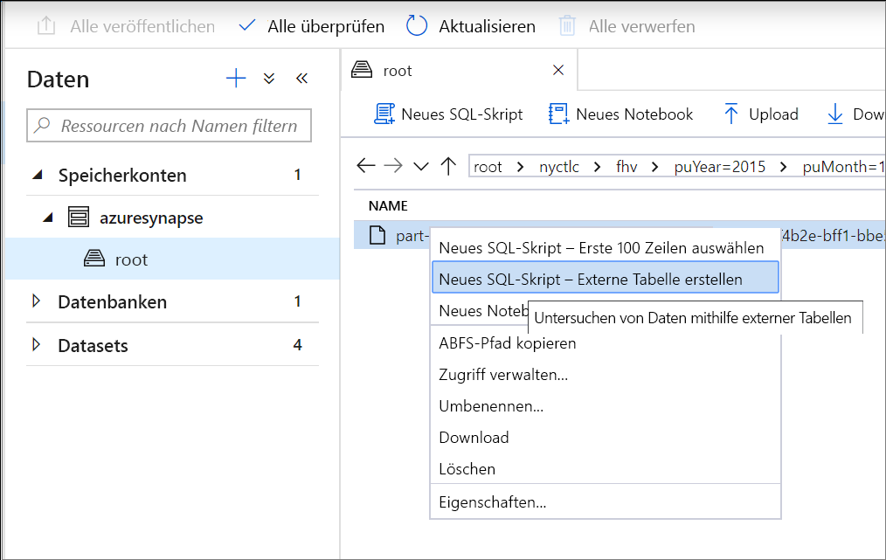
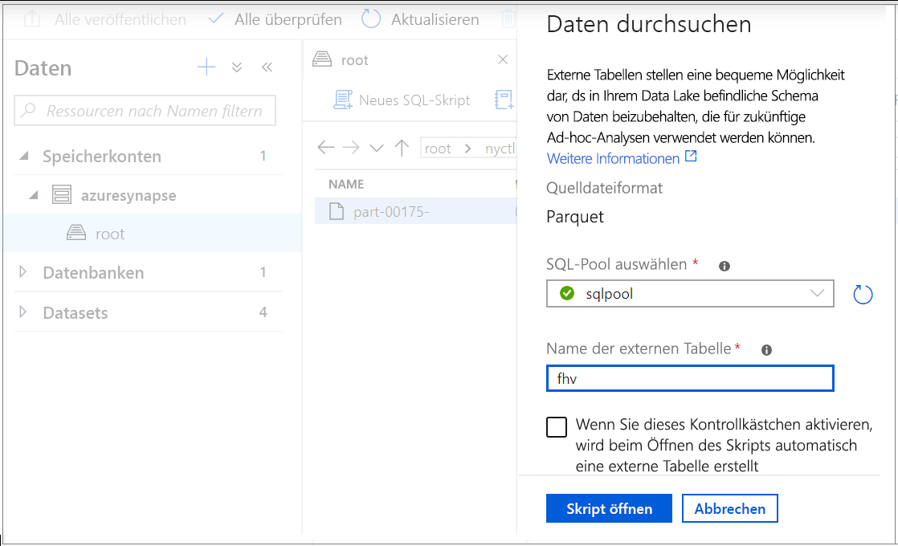
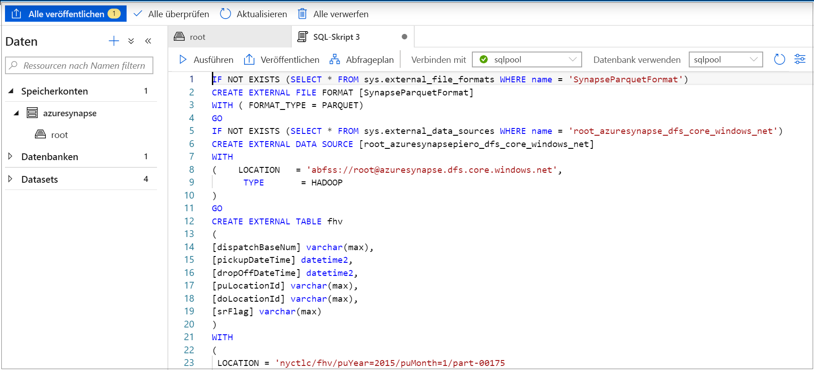
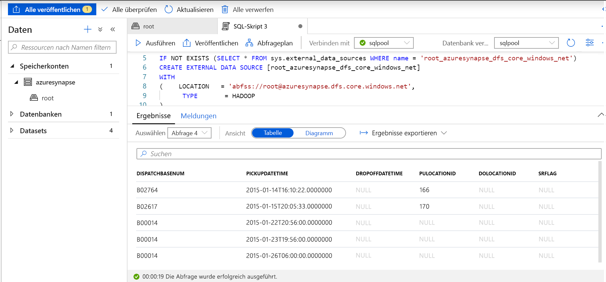
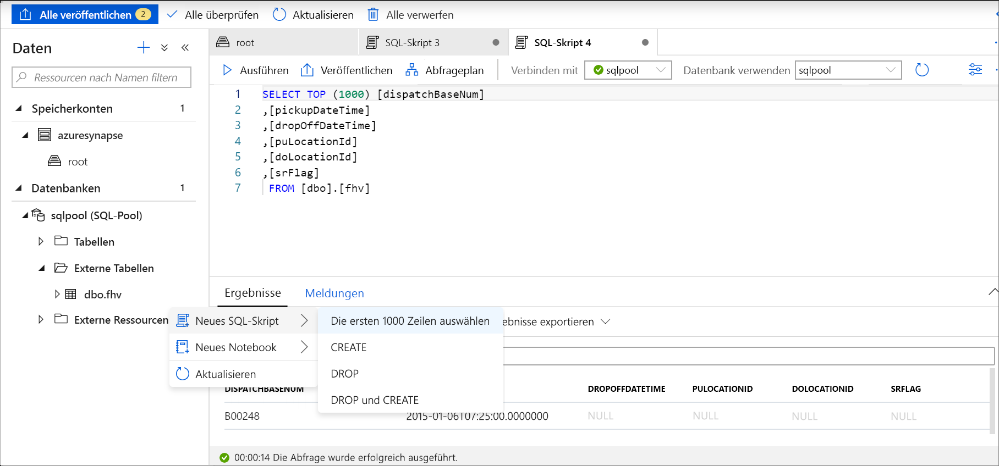

# <a name="use-external-tables-with-synapse-sql"></a>Verwenden externer Tabellen mit Synapse SQL

Eine externe Tabelle verweist auf Daten in Hadoop, Azure Storage Blob oder Azure Data Lake Store. Externe Tabellen werden verwendet, um Daten aus Dateien zu lesen oder Daten in Dateien in Azure Storage zu schreiben. Mit Synapse SQL können Sie externe Tabellen verwenden, um Daten aus einem SQL-Pool oder aus SQL On-Demand (Vorschauversion) zu lesen und dorthin zu schreiben.

## <a name="external-tables-in-sql-pool"></a>Externe Tabellen in einem SQL-Pool

In einem SQL-Pool können Sie eine externe Tabelle für Folgendes verwenden:

- Abfragen von Azure Blob Storage und Azure Data Lake Gen2 mit Transact-SQL-Anweisungen
- Importieren und Speichern von Daten aus Azure Blob Storage und Azure Data Lake Storage in den SQL-Pool

In Verbindung mit der Anweisung [CREATE TABLE AS SELECT](../sql-data-warehouse/sql-data-warehouse-develop-ctas.md?toc=/azure/synapse-analytics/toc.json&bc=/azure/synapse-analytics/breadcrumb/toc.json) werden in einer externen Tabelle ausgewählte Daten in eine Tabelle innerhalb des SQL-Pools importiert. Externe Tabellen sind zum Laden von Daten hilfreich (zusätzlich zur Anweisung [COPY](/sql/t-sql/statements/copy-into-transact-sql?toc=/azure/synapse-analytics/toc.json&bc=/azure/synapse-analytics/breadcrumb/toc.json&view=azure-sqldw-latest)). Ein Tutorial zum Laden finden Sie unter [Verwenden von PolyBase zum Laden von Daten aus Azure Blob Storage](../sql-data-warehouse/load-data-from-azure-blob-storage-using-polybase.md?toc=/azure/synapse-analytics/toc.json&bc=/azure/synapse-analytics/breadcrumb/toc.json).

## <a name="external-tables-in-sql-on-demand-preview"></a>Externer Tabellen in SQL On-Demand (Vorschauversion)

In Verbindung mit SQL On-Demand wird eine externe Tabelle für Folgendes verwendet:

- Abfragen von Azure Blob Storage oder Azure Data Lake Storage mit Transact-SQL-Anweisungen
- Speichern von SQL On-Demand-Abfrageergebnissen in Azure Blob Storage oder Azure Data Lake Storage mithilfe von [CETAS](develop-tables-cetas.md)

Externe Tabellen können mit SQL On-Demand mithilfe der folgenden Schritte erstellt werden:

1. CREATE EXTERNAL DATA SOURCE
2. CREATE EXTERNAL FILE FORMAT
3. CREATE EXTERNAL TABLE

## <a name="create-external-data-source"></a>CREATE EXTERNAL DATA SOURCE

Externe Datenquellen dienen zum Herstellen einer Verbindung mit Speicherkonten. Die vollständige Dokumentation finden Sie [hier](/sql/t-sql/statements/create-external-data-source-transact-sql?toc=/azure/synapse-analytics/toc.json&bc=/azure/synapse-analytics/breadcrumb/toc.json&view=azure-sqldw-latest).

## <a name="syntax-for-create-external-data-source"></a>Syntax für „CREATE EXTERNAL DATA SOURCE“

```syntaxsql
CREATE EXTERNAL DATA SOURCE <data_source_name>
WITH
(    LOCATION         = '<prefix>://<path>' )
[;]
```

## <a name="arguments-for-create-external-data-source"></a>Argumente für „CREATE EXTERNAL DATA SOURCE“

„data_source_name“: Dient zum Angeben des benutzerdefinierten Namens für die Datenquelle. Dieser Name muss innerhalb der Datenbank eindeutig sein.

„LOCATION = `'<prefix>://<path>'`“: Dient zum Angeben des Konnektivitätsprotokolls und des Pfads der externen Datenquelle. Der Pfad kann einen Container im Format `'<prefix>://<path>/container'` und einen Ordner im Format `'<prefix>://<path>/container/folder'` enthalten.

| Externe Datenquelle        | Speicherort-Präfix | Location path (Pfad zum Speicherort)                                         |
| --------------------------- | --------------- | ----------------------------------------------------- |
| Azure Blob Storage          | `wasb[s]`       | `<container>@<storage_account>.blob.core.windows.net` |
| Azure Data Lake Storage Gen 1 | `adl`           | `<storage_account>.azuredatalake.net`                 |
| Azure Data Lake Storage Gen 2 | `abfs[s]`       | `<container>@<storage_account>.dfs.core.windows.net`  |

## <a name="example-for-create-external-data-source"></a>Beispiel für „CREATE EXTERNAL DATA SOURCE“

Im folgenden Beispiel wird eine externe Datenquelle für Azure Data Lake Gen2 erstellt, die auf das Dataset für New York verweist:

```sql
CREATE EXTERNAL DATA SOURCE AzureDataLakeStore
WITH
  -- Please note the abfss endpoint when your account has secure transfer enabled
  ( LOCATION = 'abfss://newyorktaxidataset.azuredatalakestore.net' ,
    CREDENTIAL = ADLS_credential ,
    TYPE = HADOOP
  ) ;
```

## <a name="create-external-file-format"></a>CREATE EXTERNAL FILE FORMAT

Erstellt ein Objekt für ein externes Dateiformat, das externe, in Azure Blob Storage oder Azure Data Lake Storage gespeicherte Daten definiert. Das Erstellen eines externen Dateiformats ist eine Voraussetzung für die Erstellung einer externen Tabelle. Die vollständige Dokumentation finden Sie [hier](/sql/t-sql/statements/create-external-file-format-transact-sql?toc=/azure/synapse-analytics/toc.json&bc=/azure/synapse-analytics/breadcrumb/toc.json&view=azure-sqldw-latest).

Durch Erstellen eines externen Dateiformats wird das tatsächliche Layout der Daten angegeben, auf die von einer externen Tabelle verwiesen wird.

## <a name="syntax-for-create-external-file-format"></a>Syntax für „CREATE EXTERNAL FILE FORMAT“

```syntaxsql
-- Create an external file format for PARQUET files.  
CREATE EXTERNAL FILE FORMAT file_format_name  
WITH (  
    FORMAT_TYPE = PARQUET  
    [ , DATA_COMPRESSION = {  
        'org.apache.hadoop.io.compress.SnappyCodec'  
      | 'org.apache.hadoop.io.compress.GzipCodec'      }  
    ]);  

--Create an external file format for DELIMITED TEXT files
CREATE EXTERNAL FILE FORMAT file_format_name  
WITH (  
    FORMAT_TYPE = DELIMITEDTEXT  
    [ , FORMAT_OPTIONS ( <format_options> [ ,...n  ] ) ]  
    );  

<format_options> ::=  
{  
    FIELD_TERMINATOR = field_terminator  
    | STRING_DELIMITER = string_delimiter
    | First_Row = integer
    | USE_TYPE_DEFAULT = { TRUE | FALSE }
    | Encoding = {'UTF8' | 'UTF16'}
}
```

## <a name="arguments-for-create-external-file-format"></a>Argumente für „CREATE EXTERNAL FILE FORMAT“

„file_format_name“: Dient zum Angeben eines Namens für das externe Dateiformat.

„FORMAT_TYPE = [ PARQUET | DELIMITEDTEXT]“: Dient zum Angeben des Formats der externen Daten.

- PARQUET: Dient zum Angeben eines Parquet-Formats.
- „DELIMITEDTEXT“: Dient zum Angeben eines Textformats mit Spaltentrennzeichen (auch Feldabschlusszeichen genannt).

„FIELD_TERMINATOR = *field_terminator*“: Nur für durch Trennzeichen getrennte Textdateien relevant. Das Feldabschlusszeichen gibt mindestens ein Zeichen an, welches das Ende der einzelnen Felder (Spalten) in der durch Trennzeichen getrennten Textdatei markiert. Als Standardzeichen wird der senkrechte Strich (ꞌ|ꞌ) verwendet.

Beispiele:

- FIELD_TERMINATOR = '|'
- FIELD_TERMINATOR = ' '
- FIELD_TERMINATOR = ꞌ\tꞌ

STRING_DELIMITER = *string_delimiter*: Dient zum Angeben des Feldabschlusszeichens für Zeichenfolgendaten in der durch Trennzeichen getrennten Textdatei. Das Zeichenfolgen-Trennzeichen umfasst mindestens ein Zeichen und ist in einfache Anführungszeichen gesetzt. Der Standardwert ist eine leere Zeichenfolge ("").

Beispiele:

- STRING_DELIMITER = '"'
- STRING_DELIMITER = '*'
- STRING_DELIMITER = ꞌ,ꞌ

FIRST_ROW = *First_row_int*: Dient zum Angeben der Zeilennummer, die zuerst gelesen wird, und gilt für alle Dateien. Wenn Sie diesen Wert auf „2“ festlegen, wird beim Laden der Daten in allen Dateien jeweils die erste Zeile (Kopfzeile) übersprungen. Zeilen werden basierend auf dem Vorhandensein von Zeilenabschlusszeichen (/ r/n, r, /n) übersprungen.

USE_TYPE_DEFAULT = { TRUE | **FALSE** }: Gibt an, wie fehlende Werte in durch Trennzeichen getrennten Textdateien behandelt werden sollen, wenn Daten aus der Textdatei abgerufen werden.

TRUE: Beim Abrufen von Daten aus der Textdatei werden fehlende Werte jeweils unter Verwendung des Standardwerts für den Datentyp der entsprechenden Spalte in der externen Tabellendefinition gespeichert. Ersetzen Sie einen fehlenden Wert beispielsweise durch:

- 0, wenn die Spalte als numerische Spalte definiert ist. Dezimalspalten werden nicht unterstützt und führen zu einem Fehler.
- Leere Zeichenfolge (""), wenn die Spalte eine Zeichenfolgenspalte ist.
- 1900-01-01, wenn die Spalte eine Datumsspalte ist.

FALSE: Fehlende Werte werden als NULL-Werte gespeichert. Alle NULL-Werte, die durch Verwendung des Worts NULL in der durch Trennzeichen getrennten Textdatei gespeichert werden, werden als Zeichenfolge „NULL“ importiert.

Encoding = {'UTF8' | 'UTF16'}: Von SQL On-Demand können UTF8- und UTF16-codierte, durch Trennzeichen getrennte Textdateien gelesen werden.

DATA_COMPRESSION = *data_compression_method*: Dieses Argument dient zum Angeben der Datenkomprimierungsmethode für die externen Daten. Beim Lesen aus externen Tabellen wird es ignoriert. Es wird nur verwendet, wenn mithilfe von [CETAS](develop-tables-cetas.md) in externe Tabellen geschrieben wird.

Der PARQUET-Dateiformattyp unterstützt folgende Komprimierungsmethoden:

- DATA_COMPRESSION = 'org.apache.hadoop.io.compress.GzipCodec'
- DATA_COMPRESSION = 'org.apache.hadoop.io.compress.SnappyCodec'

## <a name="example-for-create-external-file-format"></a>Beispiel für „CREATE EXTERNAL FILE FORMAT“

Im folgenden Beispiel wird ein externes Dateiformat für Zensusdateien erstellt:

```sql
CREATE EXTERNAL FILE FORMAT census_file_format
WITH
(  
    FORMAT_TYPE = PARQUET,
    DATA_COMPRESSION = 'org.apache.hadoop.io.compress.SnappyCodec'
)
```

## <a name="create-external-table"></a>CREATE EXTERNAL TABLE

Der Befehl „CREATE EXTERNAL TABLE“ erstellt eine externe Tabelle für Synapse SQL, um den Zugriff auf Daten zu ermöglichen, die in Azure Blob Storage oder Azure Data Lake Storage gespeichert sind. 

## <a name="syntax-for-create-external-table"></a>Syntax für „CREATE EXTERNAL TABLE“

```syntaxsql
CREATE EXTERNAL TABLE { database_name.schema_name.table_name | schema_name.table_name | table_name }
    ( <column_definition> [ ,...n ] )  
    WITH (
        LOCATION = 'folder_or_filepath',  
        DATA_SOURCE = external_data_source_name,  
        FILE_FORMAT = external_file_format_name
    )  
[;]  

<column_definition> ::=
column_name <data_type>
    [ COLLATE collation_name ]
```

## <a name="arguments-create-external-table"></a>Argumente für „CREATE EXTERNAL TABLE“

*{ database_name.schema_name.table_name | schema_name.table_name | table_name }*

Ein- bis dreiteiliger Name der Tabelle, die erstellt werden soll. Für eine externe Tabelle werden von SQL On-Demand nur die Tabellenmetadaten gespeichert. Es werden keine tatsächlichen Daten in SQL On-Demand verschoben oder gespeichert.

<column_definition>, ...*n* ]

„CREATE EXTERNAL TABLE“ unterstützt das Konfigurieren von Spaltenname, Datentyp, NULL-Zulässigkeit und Sortierung. Sie können DEFAULT CONSTRAINT nicht für externe Tabellen verwenden.

>[!IMPORTANT]
>Die Spaltendefinitionen, einschließlich der Datentypen und der Anzahl der Spalten, müssen mit den Daten in den externen Dateien übereinstimmen. Wenn ein Konflikt besteht, werden die Zeilen der Datei beim Abfragen der tatsächlichen Daten zurückgewiesen.

Beim Lesen aus Parquet-Dateien können Sie die zu lesenden Spalten angeben und die übrigen Spalten überspringen.

LOCATION = '*folder_or_filepath*'

Dient zum Angeben des Ordners oder des Dateipfads und Dateinamens für die tatsächlichen Daten in Azure Blob Storage. Der Speicherort beginnt im Stammordner. Der Stammordner ist der in der externen Datenquelle angegebene Datenspeicherort.

Wenn Sie mithilfe von „LOCATION“ einen Ordnerspeicherort angeben, wird bei einer SQL On-Demand-Abfrage eine Auswahl aus der Tabelle getroffen, und es werden Dateien aus dem Ordner abgerufen.

> [!NOTE]
> Im Gegensatz zu Hadoop und PolyBase werden von SQL On-Demand keine Unterordner zurückgegeben. Es werden Dateien zurückgegeben, deren Dateiname mit einem Unterstrich (_) oder Punkt (.) beginnt.

In diesem Beispiel werden von einer SQL On-Demand-Abfrage Zeilen aus „mydata.txt“ und „_hidden.txt“ zurückgegeben, wenn „LOCATION='/webdata/'“ angegeben wird. „mydata2.txt“ und „mydata3.txt“ werden nicht zurückgegeben, da sie sich in einem Unterordner befinden.


DATA_SOURCE = *external_data_source_name*: Dient zum Angeben des Namens der externen Datenquelle, die den Speicherort der externen Daten enthält. Verwenden Sie zum Erstellen einer externen Datenquelle [CREATE EXTERNAL DATA SOURCE](#create-external-data-source).

FILE_FORMAT = *external_file_format_name*: Dient zum Angeben des Namens des Objekts für das externe Dateiformat, das den Dateityp und die Komprimierungsmethode für die externen Daten enthält. Verwenden Sie zum Erstellen eines externen Dateiformats [CREATE EXTERNAL FILE FORMAT](#create-external-file-format).

## <a name="permissions-create-external-table"></a>Berechtigungen für „CREATE EXTERNAL TABLE“

Sie benötigen geeignete Anmeldeinformationen mit Berechtigungen zum Auflisten und Lesen, um etwas in einer externen Tabelle auswählen zu können.

## <a name="example-create-external-table"></a>Beispiel für „CREATE EXTERNAL TABLE“

Im folgenden Beispiel wird eine externe Tabelle erstellt und die erste Zeile zurückgegeben:

```sql
CREATE EXTERNAL TABLE census_external_table
(
    decennialTime varchar(20),
    stateName varchar(100),
    countyName varchar(100),
    population int,
    race varchar(50),
    sex    varchar(10),
    minAge int,
    maxAge int
)  
WITH (
    LOCATION = '/parquet/',
    DATA_SOURCE = population_ds,  
    FILE_FORMAT = census_file_format
)
GO

SELECT TOP 1 * FROM census_external_table
```

## <a name="create-and-query-external-tables-from-a-file-in-azure-data-lake"></a>Erstellen und Abfragen externer Tabellen auf der Grundlage einer Datei in Azure Data Lake

Mithilfe von Data Lake-Erkundungsfunktionen können Sie nun mit einem einfachen Rechtsklick auf die Datei eine externe Tabelle unter Verwendung einer SQL-Pool- oder SQL On-Demand-Instanz erstellen und abfragen.

## <a name="prerequisites"></a>Voraussetzungen

- Für den Zugriff auf den Arbeitsbereich müssen Sie mindestens über die ARM-Zugriffsrolle „Mitwirkender an Storage-Blobdaten“ für das ADLS Gen2-Konto verfügen.

- Sie müssen mindestens über [Berechtigungen zum Erstellen](/sql/t-sql/statements/create-external-table-transact-sql?toc=/azure/synapse-analytics/toc.json&bc=/azure/synapse-analytics/breadcrumb/toc.json&view=azure-sqldw-latest#permissions-2) und Abfragen externer Tabellen im SQL-Pool oder in SQL On-Demand verfügen.

- Der verknüpfte Dienst, der dem ADLS Gen2-Konto zugeordnet ist, muss über **Zugriff auf die Datei** verfügen. Wird für den verknüpften Dienst also beispielsweise „Verwaltete Identität“ als Authentifizierungsmechanismus verwendet, muss die verwaltete Identität des Arbeitsbereichs mindestens über Speicherblob-Leseberechtigungen für das Speicherkonto verfügen.

Wählen Sie im Datenbereich die Datei aus, auf deren Grundlage Sie die externe Tabelle erstellen möchten:
> [!div class="mx-imgBorder"]
>

Daraufhin wird ein Dialogfenster geöffnet. Wählen Sie die SQL-Pool- oder die SQL On-Demand-Option aus, geben Sie einen Namen für die Tabelle ein, und wählen Sie „Skript öffnen“ aus:

> [!div class="mx-imgBorder"]
>

Das SQL-Skript wird automatisch generiert, und das Schema wird aus der Datei abgeleitet:
> [!div class="mx-imgBorder"]
>

Führen Sie das Skript aus. Durch das Skript wird automatisch eine Abfrage vom Typ „Top 100 auswählen“ ausgeführt:
> [!div class="mx-imgBorder"]
>

Die externe Tabelle ist nun erstellt. Zur späteren Erkundung ihres Inhalts kann der Benutzer sie direkt über den Datenbereich abfragen:
> [!div class="mx-imgBorder"]
>

## <a name="next-steps"></a>Nächste Schritte

Im [Artikel zu CETAS](develop-tables-cetas.md) erfahren Sie, wie Sie die Abfrageergebnisse in einer externen Tabelle in Azure Storage speichern. Alternativ können Sie mit dem Abfragen von [Spark-Tabellen](develop-storage-files-spark-tables.md) beginnen.
