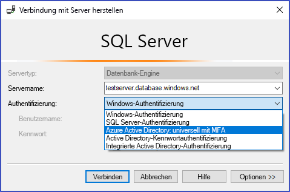
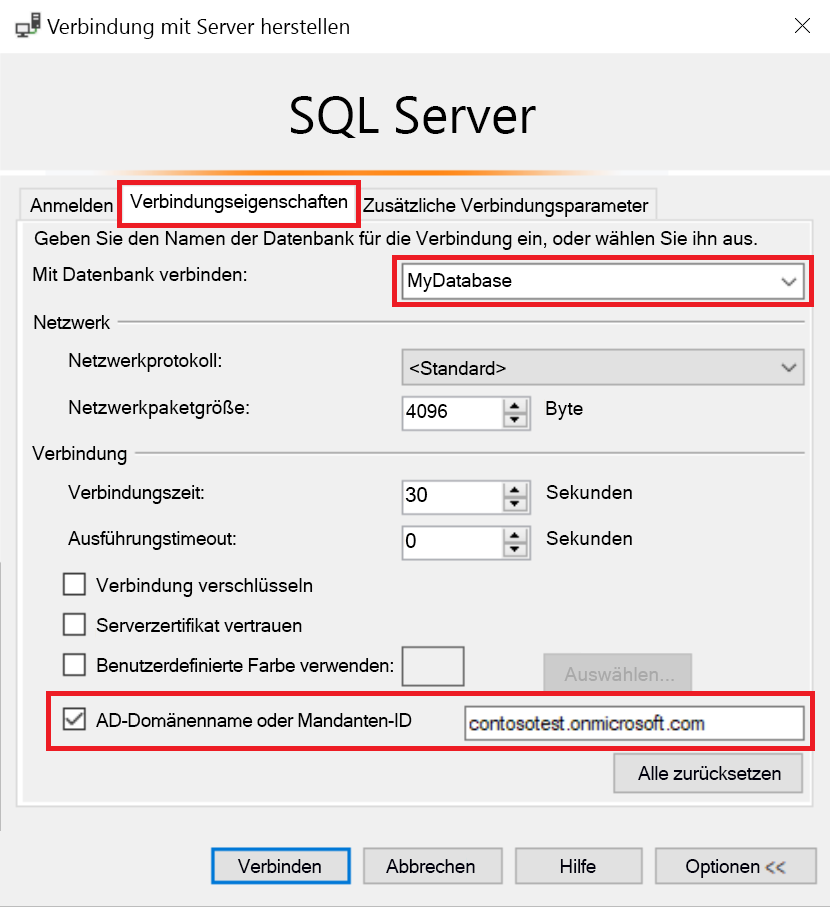
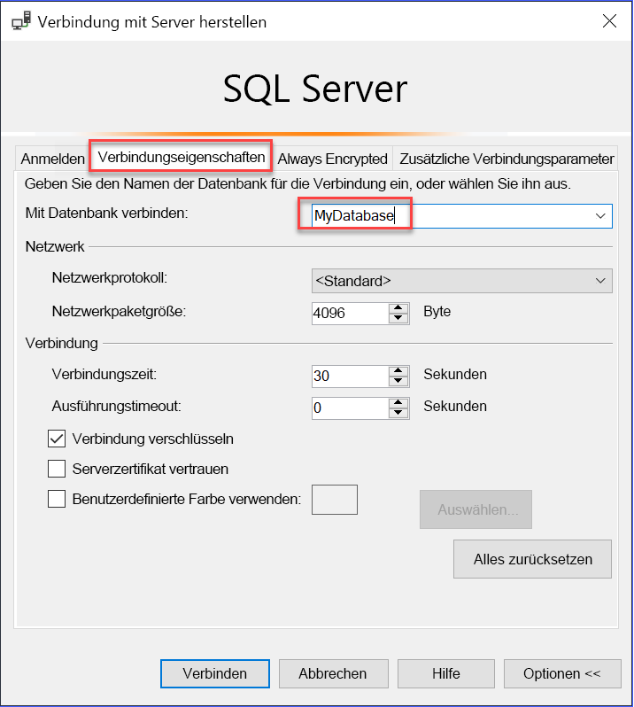

# Verwenden der mehrstufigen AAD-Authentifizierung mit Synapse SQL (SSMS-Unterstützung für MFA)

Synapse SQL unterstützt Verbindungen mit SQL Server Management Studio (SSMS) mithilfe der *universellen Active Directory-Authentifizierung*. 

In diesem Artikel werden die Unterschiede zwischen den verschiedenen Authentifizierungsoptionen sowie die Einschränkungen bei Verwendung der universellen Authentifizierung erörtert. 

**Herunterladen der aktuellen Version von SSMS:** Laden Sie die neueste Version von SSMS unter [Herunterladen von SQL Server Management Studio (SSMS)](/sql/ssms/download-sql-server-management-studio-ssms?toc=/azure/synapse-analytics/toc.json&bc=/azure/synapse-analytics/breadcrumb/toc.json&view=azure-sqldw-latest&preserve-view=true) auf den Clientcomputer herunter.

Verwenden Sie für alle Features in diesem Artikel mindestens die Version 17.2 vom Juli 2017.  Das letzte Verbindungsdialogfeld sollte ungefähr wie folgt aussehen:

  

## Die fünf Authentifizierungsoptionen  

Die universelle Active Directory-Authentifizierung unterstützt die folgenden beiden nicht interaktiven Authentifizierungsmethoden
    - Authentifizierung per `Active Directory - Password`
    - Authentifizierung per `Active Directory - Integrated`

Es gibt darüber hinaus zwei nicht interaktive Authentifizierungsmodelle, die in zahlreichen verschiedenen Anwendungen (ADO.NET, JDCB, ODC usw.) verwendet werden können. Bei diesen beiden Methoden werden niemals Popupdialogfelder angezeigt:

- `Active Directory - Password`
- `Active Directory - Integrated`

Die folgende interaktive Methode unterstützt auch Azure Multi-Factor Authentication (MFA):

- `Active Directory - Universal with MFA`

Azure MFA bietet Schutz für den Zugriff auf Daten sowie Anwendungen und erfüllt gleichzeitig Benutzeranforderungen nach einem einfachen Anmeldevorgang. Diese Lösung ermöglicht eine sichere Authentifizierung über eine Reihe einfacher Überprüfungsoptionen: Telefonanruf, SMS, Smartcards mit PIN oder Benachrichtigung in einer mobilen App. Benutzer können ihre bevorzugte Methode wählen. Bei der interaktiven MFA mit Azure AD kann ein Popupdialogfeld zur Überprüfung geöffnet werden.

Eine Beschreibung von Multi-Factor Authentication finden Sie unter [Multi-Factor Authentication](../../active-directory/authentication//concept-mfa-howitworks.md?toc=/azure/synapse-analytics/toc.json&bc=/azure/synapse-analytics/breadcrumb/toc.json).

### Name der Azure AD-Domäne oder Mandanten-ID-Parameter

Ab [SSMS Version 17](/sql/ssms/download-sql-server-management-studio-ssms?toc=/azure/synapse-analytics/toc.json&bc=/azure/synapse-analytics/breadcrumb/toc.json&view=azure-sqldw-latest&preserve-view=true) können Benutzer, die aus anderen Azure Active Directorys als Gastbenutzer in Active Directory importiert wurden, beim Herstellen einer Verbindung den Namen der Azure AD-Domäne oder die Mandanten-ID angeben. 

Zu den Gastbenutzern zählen Benutzer, die von anderen Azure ADs eingeladen wurden, Microsoft-Konten wie outlook.com, hotmail.com, live.com oder andere Konten wie gmail.com. Durch diese Informationen kann bei der **universellen Active Directory-Authentifizierung mit mehrstufiger Authentifizierung** die richtige Authentifizierungsstelle identifiziert werden. Diese Option ist für die Unterstützung von Microsoft-Konten (MSA) wie outlook.com, hotmail.com oder live.com oder Nicht-MSA-Konten erforderlich. 

Alle diese Benutzer, die mithilfe der universellen Authentifizierung authentifiziert werden sollen, müssen den Namen ihrer Azure AD-Domäne oder ihre Mandanten-ID eingeben. Dieser Parameter stellt den aktuellen Namen der Azure AD-Domäne/die aktuelle Mandanten-ID dar, mit denen der Azure-Server verknüpft ist. 

Wenn Azure Server beispielsweise mit der Azure AD-Domäne `contosotest.onmicrosoft.com` verbunden ist, in der Benutzer `joe@contosodev.onmicrosoft.com` als importierter Benutzer aus Azure AD-Domäne `contosodev.onmicrosoft.com` gehostet wird, lautet der erforderliche Domänenname für die Authentifizierung dieses Benutzers `contosotest.onmicrosoft.com`. 

Wenn der Benutzer ein nativer Benutzer des mit Azure Server verknüpften Azure AD ist und kein MSA-Konto darstellt, sind weder Domänenname noch Mandanten-ID erforderlich. 

Um den Parameter einzugeben (ab SSMS Version 17.2) füllen Sie das Dialogfeld **Verbindung mit Datenbank herstellen** aus. Wählen Sie dazu die Authentifizierung **Active Directory: universell mit MFA-Unterstützung** aus, wählen Sie **Optionen** aus, füllen Sie das Feld **Benutzername** aus, und wählen Sie dann die Registerkarte **Verbindungseigenschaften** aus. 

Aktivieren Sie das Kontrollkästchen **AD-Domänenname oder Mandanten-ID**, und geben Sie die Authentifizierungsstelle an, z.B. den Domänennamen (**contosotest.onmicrosoft.com**) oder die GUID der Mandanten-ID.  

   

Wenn Sie SSMS 18. x oder höher ausführen, wird der Active Directory-Domänenname oder die Mandanten-ID nicht mehr für Gastbenutzer benötigt, da diese Angaben von Version 18. x oder höher automatisch erkannt werden.

   

### Azure AD-Business-to-Business-Unterstützung   
Azure AD-Benutzer, die für Azure AD B2B-Szenarien als Gastbenutzer unterstützt werden (siehe [Was ist Azure B2B-Zusammenarbeit?](../../active-directory/b2b/what-is-b2b.md?toc=/azure/synapse-analytics/toc.json&bc=/azure/synapse-analytics/breadcrumb/toc.json)), können nur als Mitglieder einer Gruppe eine Verbindung mit Azure Synapse herstellen, die in der aktuellen Azure AD-Instanz erstellt und manuell mit der Transact-SQL-Anweisung `CREATE USER` in einer bestimmten Datenbank zugeordnet wurde. 

Wenn beispielsweise `steve@gmail.com` zu Azure AD `contosotest` (mit der Azure AD-Domäne `contosotest.onmicrosoft.com`) eingeladen wird, muss eine Azure AD-Gruppe, z.B. `usergroup` in dem Azure AD erstellt werden, das `steve@gmail.com` als Mitglied enthält. Diese Gruppe muss dann durch einen Azure AD-SQL-Administrator oder Azure AD-DBO durch Ausführen der Transact-SQL-Anweisung `CREATE USER [usergroup] FROM EXTERNAL PROVIDER` für eine bestimmte Datenbank (d. h. MyDatabase) erstellt werden. 

Nach dem Erstellen des Datenbankbenutzers kann der Benutzer `steve@gmail.com` sich mithilfe der SSMS-Authentifizierungsoption `Active Directory – Universal with MFA support` bei `MyDatabase` anmelden. 

Die Benutzergruppe verfügt standardmäßig nur über die Verbindungsberechtigung, und alle weiteren Datenzugriffe müssen auf normale Weise gewährt werden. 

Der Benutzer `steve@gmail.com` muss als Gastbenutzer das Kontrollkästchen aktivieren und den AD-Domänennamen `contosotest.onmicrosoft.com` im SSMS-Dialogfeld **Verbindungseigenschaften** hinzufügen. Die Option **AD-Domänenname oder Mandanten-ID** wird nur für Optionen der Reihe „universell mit MFA-Unterstützung“ unterstützt, andernfalls wird sie abgeblendet dargestellt.

## Einschränkungen der universellen Authentifizierung bei Synapse SQL

- SSMS und SqlPackage.exe sind die einzigen Tools, die derzeit für MFA über die universelle Active Directory-Authentifizierung aktiviert sind.
- SSMS Version 17.2 unterstützt den gleichzeitigen Zugriff durch mehrere Benutzer mithilfe der universellen Authentifizierung mit mehrstufiger Authentifizierung. In Version 17.0 und 17.1 konnte sich nur ein einziges Azure Active Directory-Konto über die universelle Authentifizierung bei einer SSMS-Instanz anmelden. Für die Anmeldung mit einem anderen Azure AD-Konto müssen Sie eine andere SSMS-Instanz verwenden. (Diese Einschränkung gilt nur für die universelle Active Directory-Authentifizierung. Mit der Active Directory-Kennwortauthentifizierung, der integrierten Active Directory-Authentifizierung oder der SQL Server-Authentifizierung können Sie sich bei verschiedenen Servern anmelden.)
- SSMS unterstützt die universelle Active Directory-Authentifizierung für den Objekt-Explorer, den Abfrage-Editor und die Abfragespeichervisualisierung.
- SSMS Version 17.2 bietet Unterstützung von DacFx Wizard zum Exportieren/Extrahieren/Bereitstellen von Daten aus Datenbanken. Sobald ein bestimmter Benutzer über das erste Authentifizierungsdialogfeld mithilfe der universellen Authentifizierung authentifiziert wurde, funktioniert DacFx Wizard genau wie bei allen anderen Authentifizierungsmethoden.
- Der SSMS-Tabellen-Designer unterstützt die universelle Authentifizierung nicht.
- Es bestehen keine weiteren Softwareanforderungen für die universelle Active Directory-Authentifizierung – mit einer Ausnahme: Sie müssen eine unterstützte SSMS-Version verwenden.  
- Die ADAL-Version (Active Directory Authentication Library) für die universelle Authentifizierung wurde auf die aktuelle veröffentlichte Version 3.13.9 von „ADAL.DLL“ aktualisiert. Weitere Informationen finden Sie unter [Active Directory Authentication Library 3.14.1](https://www.nuget.org/packages/Microsoft.IdentityModel.Clients.ActiveDirectory/).  

## Nächste Schritte
Weitere Informationen finden Sie im Artikel [Herstellen einer Verbindung mit Synapse SQL mithilfe von SQL Server Management Studio](get-started-ssms.md). 

