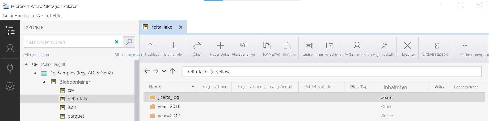

# <a name="query-delta-lake-files-preview-using-serverless-sql-pool-in-azure-synapse-analytics"></a>Abfragen von Delta Lake-Dateien (Preview) mithilfe eines serverlosen SQL-Pools in Azure Synapse Analytics

In diesem Artikel erfahren Sie, wie Sie eine Abfrage mithilfe eines serverlosen Synapse SQL-Pools schreiben, um Apache Delta Lake-Dateien zu lesen.
Delta Lake ist eine Open-Source-Speicherebene, die ACID-Transaktionen (Atomizität, Konsistenz, Isolation und Dauerhaftigkeit) in Apache Spark und Big Data-Workloads einführt.

Mit dem serverlosen SQL-Pool im Synapse-Arbeitsbereich können Sie die im Delta Lake-Format gespeicherten Daten lesen und für Berichterstellungstools bereitstellen. Ein serverloser SQL-Pool kann Delta Lake-Dateien lesen, die mit Apache Spark, Azure Databricks oder einem anderen Producer des Delta Lake-Formats erstellt werden.

Mit Apache Spark-Pools in Azure Synapse können technische Fachkräfte für Daten Delta Lake-Dateien mit Scala, PySpark und .NET ändern. Serverlose SQL-Pools unterstützen Datenanalysten beim Erstellen von Berichten zu Delta Lake-Dateien, die von technischen Fachkräften für Daten erstellt wurden.

[!INCLUDE [synapse-analytics-preview-features](../../../includes/synapse-analytics-preview-features.md)]

## <a name="quickstart-example"></a>Schnellstartbeispiel

Mit der Funktion [OPENROWSET](develop-openrowset.md) können Sie die Inhalte von Delta Lake-Dateien lesen, indem Sie die URL zu Ihrem Stammordner angeben.

### <a name="read-delta-lake-folder"></a>Lesen des Delta Lake-Ordners

Die einfachste Möglichkeit zum Anzeigen des Inhalts Ihrer `DELTA`-Datei besteht darin, die Datei-URL zu der [OPENROWSET](develop-openrowset.md)-Funktion bereitzustellen und das `DELTA`-Format anzugeben. Wenn die Datei öffentlich verfügbar ist oder Ihre Azure AD-Identität auf diese Datei zugreifen kann, sollten Sie den Inhalt der Datei mithilfe einer Abfrage wie im folgenden Beispiel anzeigen können:

```sql
select top 10 *
from openrowset(
    bulk 'https://sqlondemandstorage.blob.core.windows.net/delta-lake/covid/',
    format = 'delta') as rows
```

Spaltennamen und Datentypen werden automatisch aus Data Lake-Dateien gelesen. Die `OPENROWSET`-Funktion verwendet Typen nach bester Schätzung wie VARCHAR(1000) für die Zeichenfolgenspalten.

Der URI in der `OPENROWSET`-Funktion muss auf den Delta Lake-Stammordner verweisen, der einen Unterordner namens `_delta_log` enthält.

> [!div class="mx-imgBorder"]
>

Wenn Sie nicht über diesen Unterordner verfügen, verwenden Sie nicht das Delta Lake-Format. Sie können Ihre einfachen Parquet-Dateien im Ordner mithilfe des folgenden Apache Spark Python-Skripts in das Delta Lake-Format konvertieren:

```python
%%pyspark
from delta.tables import *
deltaTable = DeltaTable.convertToDelta(spark, "parquet.`abfss://delta-lake@sqlondemandstorage.dfs.core.windows.net/covid`")
```

Um die Leistung Ihrer Abfragen zu verbessern, sollten Sie explizite Typen in [der `WITH`-Klausel](#explicitly-specify-schema) angeben.

> [!NOTE]
> Der serverlose Synapse SQL-Pool verwendet Schemarückschlüsse, um Spalten und deren Typen automatisch zu bestimmen. Die Regeln für den Schemarückschluss sind dieselben, die für Parquet-Dateien verwendet werden.
> Informationen zur Delta Lake-Typzuordnung zum nativen SQL-Typ finden Sie unter [Typzuordnung für Parquet](develop-openrowset.md#type-mapping-for-parquet). 

Stellen Sie sicher, dass Sie auf Ihre Datei zugreifen können. Wenn Ihre Datei mit einem SAS-Schlüssel oder einer benutzerdefinierten Azure-Identität geschützt ist, müssen Sie [Anmeldeinformationen auf Serverebene für die SQL-Anmeldung](develop-storage-files-storage-access-control.md?tabs=shared-access-signature#server-scoped-credential) einrichten.

> [!IMPORTANT]
> Stellen Sie sicher, dass Sie eine UTF-8-Datenbanksortierung (z. B. `Latin1_General_100_BIN2_UTF8`) verwenden, da Zeichenfolgenwerte in Delta Lake-Dateien mit UTF-8 codiert sind.
> Ein Konflikt zwischen der Textcodierung in der Delta Lake-Datei und der Sortierung kann zu unerwarteten Konvertierungsfehlern führen.
> Die Standardsortierung der aktuellen Datenbank kann mit der folgenden T-SQL-Anweisung problemlos geändert werden: `alter database current collate Latin1_General_100_BIN2_UTF8`.

### <a name="data-source-usage"></a>Datenquellennutzung

In den vorherigen Beispielen wurde der vollständige Pfad zur Datei verwendet. Alternativ können Sie eine externe Datenquelle mit dem Speicherort erstellen, der auf den Stammordner des Speichers verweist. Nachdem Sie die externe Datenquelle erstellt haben, verwenden Sie die Datenquelle und den relativen Pfad zu der Datei in der `OPENROWSET`-Funktion. Auf diese Weise müssen Sie nicht den vollständigen absoluten URI zu Ihren Dateien verwenden. Sie können dann auch benutzerdefinierte Anmeldeinformationen für den Zugriff auf den Speicherort definieren.

> [!IMPORTANT]
> Datenquellen können nur in benutzerdefinierten Datenbanken erstellt werden (nicht in der Masterdatenbank oder in den Datenbanken, die aus Apache Spark-Pools repliziert werden). 

Um die folgenden Beispiele verwenden zu können, müssen Sie den folgenden Schritt ausführen:
1. **Erstellen Sie eine Datenbank** mit einer Datenquelle, die auf das Speicherkonto [NYC Yellow Taxi](https://azure.microsoft.com/services/open-datasets/catalog/nyc-taxi-limousine-commission-yellow-taxi-trip-records/) verweist. 
1. Initialisieren Sie die Objekte, indem Sie das [Setupskript](https://github.com/Azure-Samples/Synapse/blob/master/SQL/Samples/LdwSample/SampleDB.sql) für die Datenbank ausführen, die Sie in Schritt 1 erstellt haben. Mit diesem Setupskript werden die Datenquellen, die für die gesamte Datenbank gültigen Anmeldeinformationen und externe Dateiformate erstellt, die in diesen Beispielen verwendet werden.

Wenn Sie Ihre Datenbank erstellt und den Kontext auf Ihre Datenbank umgestellt haben (mithilfe einer `USE database_name`-Anweisung oder der Dropdownliste zum Auswählen der Datenbank in einem Abfrage-Editor), können Sie ihre externe Datenquelle, die den Stamm-URI zu Ihrem Dataset enthält, erstellen und zum Abfragen von Delta Lake-Dateien verwenden:

```sql
create external data source DeltaLakeStorage
with ( location = 'https://sqlondemandstorage.blob.core.windows.net/delta-lake/' );
go

select top 10 *
from openrowset(
        bulk 'covid',
        data_source = 'DeltaLakeStorage',
        format = 'delta'
    ) as rows
```

Wenn eine Datenquelle mit einem SAS-Schlüssel oder einer benutzerdefinierten Identität geschützt ist, können Sie die [Datenquelle mit datenbankweit gültigen Anmeldeinformationen](develop-storage-files-storage-access-control.md?tabs=shared-access-signature#database-scoped-credential) konfigurieren.

### <a name="explicitly-specify-schema"></a>Explizites Angeben des Schemas

Bei `OPENROWSET` können Sie mit der `WITH`-Klausel explizit angeben, welche Spalten aus der Datei gelesen werden sollen:

```sql
select top 10 *
from openrowset(
        bulk 'covid',
        data_source = 'DeltaLakeStorage',
        format = 'delta'
    )
    with ( date_rep date,
           cases int,
           geo_id varchar(6)
           ) as rows
```

Mit der expliziten Angabe des Resultsetschemas können Sie die Typgrößen minimieren und die präziseren Typen VARCHAR(6) für Zeichenfolgenspalten anstelle von pessimistischem VARCHAR(1000) verwenden. Die Minimierung von Typen kann die Leistung Ihrer Abfragen erheblich verbessern.

> [!IMPORTANT]
> Stellen Sie sicher, dass Sie explizit eine UTF-8-Sortierung (z. B. `Latin1_General_100_BIN2_UTF8`) für alle Zeichenfolgenspalten in der `WITH`-Klausel angeben, oder legen Sie eine UTF-8-Sortierung auf Datenbankebene fest.
> Ein Konflikt zwischen der Textcodierung in der Datei und der Sortierung der Zeichenfolgenspalte kann zu unerwarteten Konvertierungsfehlern führen.
> Die Standardsortierung der aktuellen Datenbank kann mithilfe der folgenden T-SQL-Anweisung problemlos geändert werden: `alter database current collate Latin1_General_100_BIN2_UTF8`.
> Sie können die Sortierung der Spaltentypen problemlos mit der folgenden Definition festlegen: `geo_id varchar(6) collate Latin1_General_100_BIN2_UTF8`.

## <a name="dataset"></a>Dataset

In diesem Beispiel wird das Dataset [NYC Yellow Taxi](https://azure.microsoft.com/services/open-datasets/catalog/nyc-taxi-limousine-commission-yellow-taxi-trip-records/) verwendet. Sie können Parquet-Dateien auf dieselbe Weise abfragen wie Sie [CSV-Dateien lesen](query-parquet-files.md). Der einzige Unterschied besteht darin, dass der Parameter `FILEFORMAT` auf `PARQUET` festgelegt werden muss. In den Beispielen in diesem Artikel werden die Besonderheiten beim Lesen von Parquet-Dateien erläutert.


### <a name="query-partitioned-data"></a>Abfragen von partitionierten Daten
Das in diesem Beispiel bereitgestellte Dataset ist in separate Unterordner aufgeteilt (partitioniert).
Im Gegensatz zu [Parquet](query-parquet-files.md) müssen Sie keine bestimmten Partitionen mithilfe der `FILEPATH`-Funktion als Ziel verwenden. `OPENROWSET` identifiziert Partitionierungsspalten in Ihrer Delta Lake-Ordnerstruktur und ermöglicht ihnen das direkte Abfragen von Daten mithilfe dieser Spalten. Dieses Beispiel zeigt die Fahrpreisbeträge nach Jahr, Monat und Zahlungsart für die ersten drei Monate des Jahres 2017.

```sql
SELECT
        YEAR(pickup_datetime) AS year,
        passenger_count,
        COUNT(*) AS cnt
FROM  
    OPENROWSET(
        BULK 'yellow',
        DATA_SOURCE = 'DeltaLakeStorage',
        FORMAT='DELTA'
    ) nyc
WHERE
    nyc.year = 2017
    AND nyc.month IN (1, 2, 3)
    AND pickup_datetime BETWEEN CAST('1/1/2017' AS datetime) AND CAST('3/31/2017' AS datetime)
GROUP BY
    passenger_count,
    YEAR(pickup_datetime)
ORDER BY
    YEAR(pickup_datetime),
    passenger_count;
```

Die `OPENROWSET`-Funktion entfernt Partitionen, die nicht mit `year` und in der `month` where-Klausel übereinstimmen. Diese Datei-/Partitionsbereinigungsmethode verringert Ihr Dataset erheblich, verbessert die Leistung und reduziert die Kosten der Abfrage.

Der Ordnername in der `OPENROWSET`-Funktion (`yellow` in diesem Beispiel), wird mithilfe von `LOCATION` in der `DeltaLakeStorage`-Datenquelle verkettet und muss auf den Delta Lake-Stammordner verweisen, der einen Unterordner namens `_delta_log` enthält.

> [!div class="mx-imgBorder"]
>

Wenn Sie nicht über diesen Unterordner verfügen, verwenden Sie nicht das Delta Lake-Format. Sie können Ihre einfachen Parquet-Dateien im Ordner mithilfe des folgenden Apache Spark Python-Skripts in das Delta Lake-Format konvertieren:

```python
%%pyspark
from delta.tables import *
deltaTable = DeltaTable.convertToDelta(spark, "parquet.`abfss://delta-lake@sqlondemandstorage.dfs.core.windows.net/yellow`&quot;, &quot;year INT, month INT")
```

Das zweite Argument der `DeltaTable.convertToDeltaLake` Funktion stellt die Partitionierungsspalten (Jahr und Monat) dar, die Teil des Ordnermusters sind (`year=*/month=*` in diesem Beispiel), und deren Typen.

## <a name="limitations"></a>Einschränkungen

- Schemarückschluss funktioniert nicht, wenn Sie über komplexe Datentypen verfügen. Verwenden Sie für komplexe Datentypen ein explizites `WITH`-Schema, und geben Sie den Typ `VARCHAR(MAX)` an. 
- Die `OPENROWSET`-Funktion unterstützt keine Aktualisierung einer Delta Lake-Datei oder einer Zeitreise. Verwenden Sie die Apache Spark-Engine, um diese Aktionen durchzuführen.

## <a name="next-steps"></a>Nächste Schritte

Wechseln Sie zum nächsten Artikel, um Informationen zum [Abfragen geschachtelter Parquet-Typen](query-parquet-nested-types.md) zu erhalten.
Wenn Sie die Erstellung der Delta Lake-Lösung fortsetzen möchten, lesen Sie nach, wie Sie [Sichten](create-use-views.md#delta-lake-views) oder [externe Tabellen](create-use-external-tables.md#delta-lake-external-table) im Delta Lake-Ordner erstellen.

## <a name="see-also"></a>Weitere Informationen

- [Was ist Delta Lake?](../spark/apache-spark-what-is-delta-lake.md)
- [Informationen, wie Sie Delta Lake in Apache Spark-Pools für Azure Synapse Analytics verwenden](../spark/apache-spark-delta-lake-overview.md)
- [Bewährte Methoden von Azure Databricks für Delta Lake](/azure/databricks/delta/best-practices.md)
- [Delta Lake-Dokumentationsseite](https://docs.delta.io/latest/delta-intro.html)
