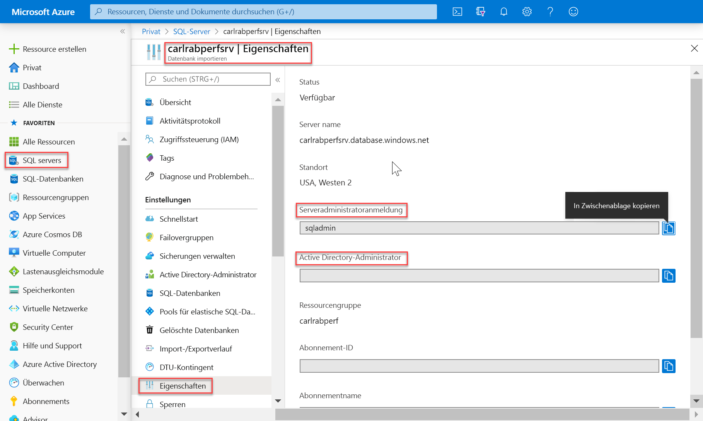
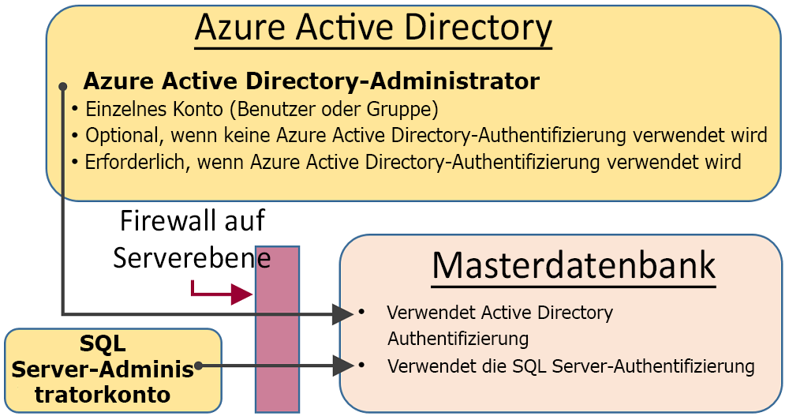
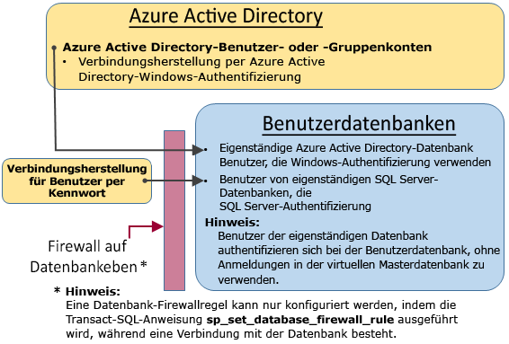

# <a name="sql-authentication"></a>SQL-Authentifizierung

Azure Synapse Analytics beinhaltet zwei SQL-Formfaktoren, mit denen Sie den Ressourcenverbrauch steuern können. In diesem Artikel wird erläutert, wie die Benutzerauthentifizierung mit den beiden Formfaktoren gesteuert wird.

Für die Autorisierung bei Synapse SQL können Sie zwei Autorisierungstypen verwenden:

- Azure Active Directory-Autorisierung
- SQL-Autorisierung

Die Azure Active Directory-Autorisierung bietet Ihnen einen zentralen Ort für die Benutzerverwaltung. Die SQL-Autorisierung ermöglicht Legacy-Anwendungen die Verwendung von Synapse SQL auf vertraute Weise.

## <a name="administrative-accounts"></a>Verwaltungskonten

Es gibt zwei Administratorkonten (**Serveradministrator** und **Active Directory-Administrator**), die als Administratoren fungieren. Öffnen Sie das Azure-Portal, und navigieren Sie zur Registerkarte „Eigenschaften“ Ihrer Synapse SQL-Instanz, um diese Administratorkonten für Ihren SQL-Server zu identifizieren.



- **Serveradministrator**

  Wenn Sie eine Azure Synapse Analytics-Instanz erstellen, müssen Sie eine **Serveradministratoranmeldung** benennen. Vom SQL-Server wird dieses Konto als Anmeldung für die Masterdatenbank erstellt. Dieses Konto stellt die Verbindung per SQL Server-Authentifizierung (Benutzername und Kennwort) her. Nur eines dieser Konten kann vorhanden sein.

- **Azure Active Directory-Administrator**

  Ein Azure Active Directory-Konto – entweder für eine Einzelperson oder eine Sicherheitsgruppe – kann auch als Administrator konfiguriert werden. Die Konfiguration eines Azure AD-Administrators ist optional. Ein Azure AD-Administrator **muss** aber konfiguriert werden, wenn Sie Azure AD-Konten zum Herstellen einer Verbindung mit Synapse SQL verwenden möchten.

Die Konten **Serveradministrator** und **Azure AD-Administrator** weisen die folgenden Merkmale auf:

- Sie sind die einzigen Konten, mit denen automatisch eine Verbindung mit einer beliebigen SQL-Datenbank auf dem Server hergestellt werden kann. (Zum Herstellen einer Verbindung mit einer Benutzerdatenbank müssen andere Konten entweder der Besitzer der Datenbank sein oder in der Benutzerdatenbank über ein Benutzerkonto verfügen.)
- Für diese Konten wird auf Benutzerdatenbanken mit dem Benutzer `dbo` zugegriffen, und alle Berechtigungen sind in den Benutzerdatenbanken enthalten. (Der Besitzer einer Benutzerdatenbank greift auf die Datenbank ebenfalls als Benutzer `dbo` zu.)
- Die Konten greifen auf die `master`-Datenbank nicht als Benutzer `dbo` zu und haben eingeschränkte Berechtigungen in „master“.
- Diese Konten sind **keine** Mitglieder der festen Standardserverrolle `sysadmin` von SQL Server, die in SQL-Datenbank nicht verfügbar ist.  
- Mit diesen Konten können Datenbanken, Anmeldungen, Benutzer in „master“ und IP-Firewallregeln auf Serverebene erstellt, geändert und verworfen werden.
- Sie können Mitglieder für die Rollen `dbmanager` und `loginmanager` hinzufügen und entfernen.
- Sie können die `sys.sql_logins`-Systemtabelle anzeigen.

## <a name="serverless-sql-pool"></a>[Serverloser SQL-Pool](#tab/serverless)

Zum Verwalten der Benutzer, die Zugriff auf den serverlosen SQL-Pool haben, können Sie die nachfolgenden Anweisungen ausführen.

Verwenden Sie die folgende Syntax, um eine Anmeldung für den serverlosen SQL-Pool zu erstellen:

```sql
CREATE LOGIN Mary WITH PASSWORD = '<strong_password>';
-- or
CREATE LOGIN Mary@domainname.net FROM EXTERNAL PROVIDER;
```
Sobald die Anmeldung erstellt wurde, können Sie Benutzer in den einzelnen Datenbanken im Endpunkt für den serverlosen SQL-Pool erstellen und diesen Benutzern die erforderlichen Berechtigungen erteilen. Zum Erstellen eines Benutzers können Sie die folgende Syntax verwenden:
```sql
CREATE USER Mary FROM LOGIN Mary;
-- or
CREATE USER Mary FROM LOGIN Mary@domainname.net;
-- or
CREATE USER [mike@contoso.com] FROM EXTERNAL PROVIDER;
```

Nachdem Sie die Anmeldung und den Benutzer erstellt haben, können Sie mit der regulären SQL Server-Syntax Rechte erteilen.

## <a name="sql-pool"></a>[SQL-Pool](#tab/provisioned)

### <a name="administrator-access-path"></a>Administrator-Zugriffspfad

Wenn die Firewall auf Serverebene richtig konfiguriert ist, können mit **SQL Server-Administrator** und **Azure Active Directory-Administrator** Verbindungen mit Tools wie SQL Server Management Studio oder SQL Server Data Tools hergestellt werden. Nur die neuesten Tools verfügen über alle Features und Funktionen. 

Das folgende Diagramm zeigt eine typische Konfiguration für die beiden Administratorkonten:
 


Bei der Verwendung eines offenen Ports in der Firewall auf Serverebene können Administratoren eine Verbindung mit jeder beliebigen SQL-Datenbank herstellen.

### <a name="database-creators"></a>Datenbankersteller

Eine dieser Administratorrollen ist die Rolle **dbmanager**. Mitglieder dieser Rolle können neue Datenbanken erstellen. Zum Verwenden dieser Rolle erstellen Sie einen Benutzer in der Datenbank `master` und fügen den Benutzer dann der Datenbankrolle **dbmanager** hinzu. 

Für die Erstellung einer Datenbank muss es sich um einen Benutzer handeln, der auf einer SQL Server-Anmeldung in der Datenbank `master` basiert, oder um einen Benutzer einer eigenständigen Datenbank, der auf einem Azure Active Directory-Benutzer basiert.

1. Stellen Sie mit einem Administratorkonto eine Verbindung mit der Datenbank `master` her.
2. Erstellen Sie eine SQL Server-Authentifizierungsanmeldung mit der [CREATE LOGIN](/sql/t-sql/statements/create-login-transact-sql?view=azure-sqldw-latest&preserve-view=true)-Anweisung. Beispielanweisung:

   ```sql
   CREATE LOGIN Mary WITH PASSWORD = '<strong_password>';
   ```

   > [!NOTE]
   > Verwenden Sie ein sicheres Kennwort, wenn Sie eine Anmeldung oder einen Benutzer für eine eigenständige Datenbank erstellen. Weitere Informationen finden Sie unter [Strong Passwords](/sql/relational-databases/security/strong-passwords?view=azure-sqldw-latest&preserve-view=true).

   Um die Leistung zu verbessern, werden Anmeldungen (Prinzipale auf Serverebene) vorübergehend auf Datenbankebene zwischengespeichert. Informationen zum Aktualisieren des Caches für die Authentifizierung finden Sie unter [DBCC FLUSHAUTHCACHE](/sql/t-sql/database-console-commands/dbcc-flushauthcache-transact-sql?view=azure-sqldw-latest&preserve-view=true).

3. Erstellen Sie mithilfe der Anweisung [CREATE USER](/sql/t-sql/statements/create-user-transact-sql?view=azure-sqldw-latest&preserve-view=true) einen Datenbankbenutzer. Der Benutzer kann ein eigenständiger Datenbankbenutzer mit Azure Active Directory-Authentifizierung (bei Konfiguration Ihrer Umgebung für die Azure AD-Authentifizierung), ein eigenständiger Datenbankbenutzer mit SQL Server-Authentifizierung oder ein Benutzer mit SQL Server-Authentifizierung basierend auf einer SQL Server-Authentifizierungsanmeldung (im vorherigen Schritt erstellt) sein. Beispielanweisungen:

   ```sql
   CREATE USER [mike@contoso.com] FROM EXTERNAL PROVIDER; -- To create a user with Azure Active Directory
   CREATE USER Ann WITH PASSWORD = '<strong_password>'; -- To create a SQL Database contained database user
   CREATE USER Mary FROM LOGIN Mary;  -- To create a SQL Server user based on a SQL Server authentication login
   ```

4. Fügen Sie den neuen Benutzer der Datenbankrolle **dbmanager** in `master` hinzu. Verwenden Sie dazu die Prozedur [sp_addrolemember](/sql/relational-databases/system-stored-procedures/sp-addrolemember-transact-sql?view=azure-sqldw-latest&preserve-view=true). (Beachten Sie, dass die Anweisung [ALTER ROLE](/sql/t-sql/statements/alter-role-transact-sql?view=azure-sqldw-latest&preserve-view=true) in SQL (bereitgestellt) nicht unterstützt wird). Beispielanweisungen:

   ```sql
   EXEC sp_addrolemember 'dbmanager', 'Mary'; 
   EXEC sp_addrolemember 'dbmanager', 'mike@contoso.com]'; 
   ```

   > [!NOTE]
   > „dbmanager“ ist eine Datenbankrolle in der Masterdatenbank. Dies bedeutet, dass Sie einen Datenbankbenutzer nur der Rolle „dbmanager“ hinzufügen können. Es ist nicht möglich, eine Anmeldung auf Serverebene einer Rolle für die Datenbankebene hinzufügen.

5. Konfigurieren Sie bei Bedarf eine Firewallregel, um für den neuen Benutzer das Herstellen der Verbindung zuzulassen. (Der neue Benutzer ist ggf. durch eine vorhandene Firewallregel abgedeckt.)

Nun kann der Benutzer eine Verbindung mit der Datenbank `master` herstellen und neue Datenbanken erstellen. Das Konto, mit dem die Datenbank erstellt wird, wird zum Besitzer der Datenbank.

### <a name="login-managers"></a>Anmeldungs-Manager

Die andere Administratorrolle ist die Rolle „loginmanager“ (Anmeldungs-Manager). Mitglieder dieser Rolle können in der Masterdatenbank neue Anmeldungen erstellen. Bei Bedarf können Sie die gleichen Schritte ausführen (Erstellen einer Anmeldung und eines Benutzers und Hinzufügen eines Benutzers zur Rolle **loginmanager**), um es einem Benutzer zu ermöglichen, im Master neue Anmeldungen zu erstellen. In der Regel sind keine Anmeldungen erforderlich, da Microsoft anstelle von auf Anmeldungen basierenden Benutzern die Verwendung von eigenständigen Datenbankbenutzern empfiehlt, die auf Datenbankebene authentifiziert werden. Weitere Informationen finden Sie unter [Eigenständige Datenbankbenutzer - machen Sie Ihre Datenbank portabel](/sql/relational-databases/security/contained-database-users-making-your-database-portable?view=azure-sqldw-latest&preserve-view=true).

---

## <a name="non-administrator-users"></a>Benutzer ohne Administratorrechte

Üblicherweise benötigen Konten ohne Administratorrechte keinen Zugriff auf die Masterdatenbank. Erstellen Sie eigenständige Datenbankbenutzer auf Datenbankebene, indem Sie die [CREATE USER](/sql/t-sql/statements/create-user-transact-sql) -Anweisung (Transact-SQL) verwenden. 

Der Benutzer kann ein eigenständiger Datenbankbenutzer mit Azure Active Directory-Authentifizierung (bei Konfiguration Ihrer Umgebung für die Azure AD-Authentifizierung), ein eigenständiger Datenbankbenutzer mit SQL Server-Authentifizierung oder ein Benutzer mit SQL Server-Authentifizierung basierend auf einer SQL Server-Authentifizierungsanmeldung (im vorherigen Schritt erstellt) sein.  

Stellen Sie zum Erstellen von Benutzern eine Verbindung mit der Datenbank her, und führen Sie ähnliche Anweisungen wie die folgenden aus:

```sql
CREATE USER Mary FROM LOGIN Mary;
CREATE USER [mike@contoso.com] FROM EXTERNAL PROVIDER;
```

Zu Beginn kann nur einer der Administratoren oder der Besitzer der Datenbank Benutzer erstellen. Um für weitere Benutzer die Erstellung neuer Benutzer zu genehmigen, gewähren Sie einem ausgewählten Benutzer die Berechtigung `ALTER ANY USER` , indem Sie eine Anweisung wie diese verwenden:

```sql
GRANT ALTER ANY USER TO Mary;
```

Um weiteren Benutzern die vollständige Steuerung der Datenbank zu ermöglichen, machen Sie sie zu einem Mitglied der festen Datenbankrolle **db_owner**.

Verwenden Sie in Azure SQL-Datenbank oder Synapse (serverlos) die Anweisung `ALTER ROLE`.

```sql
ALTER ROLE db_owner ADD MEMBER Mary;
```

Verwenden Sie für einen dedizierten SQL-Pool [EXEC sp_addrolemember](/sql/relational-databases/system-stored-procedures/sp-addrolemember-transact-sql?view=azure-sqldw-latest&preserve-view=true).

```sql
EXEC sp_addrolemember 'db_owner', 'Mary';
```

> [!NOTE]
> Die Erstellung von Datenbankbenutzern auf der Grundlage einer Anmeldung bei einem Server wird unter anderem für Benutzer verwendet, die Zugriff auf mehrere Datenbanken benötigen. Da eigenständige Datenbankbenutzer individuelle Entitäten sind, werden für jede Datenbank ein eigener Benutzer und ein eigenes Kennwort vorgehalten. Diese Vorgehensweise kann erheblichen Mehraufwand verursachen, da sich Benutzer die Kennwörter für alle Datenbanken merken müssen, und nicht mehr praktikabel sein, wenn mehrere Kennwörter für zahlreiche Datenbanken geändert werden müssen. Bei der Verwendung von SQL Server-Anmeldenamen und Hochverfügbarkeit (aktive Georeplikation und Failovergruppen) müssen die SQL Server-Anmeldenamen jedoch manuell auf jedem Server festgelegt werden. Andernfalls wird der Datenbankbenutzer nach einem Failover nicht mehr der Serveranmeldung zugeordnet, und er kann nach dem Failover nicht auf die Datenbank zugreifen. 

Weitere Informationen zum Konfigurieren von Anmeldungen für die Georeplikation finden Sie unter [Konfigurieren und Verwalten der Sicherheit von Azure SQL-Datenbank für die Geowiederherstellung oder den Failover](../../azure-sql/database/active-geo-replication-security-configure.md).

### <a name="configuring-the-database-level-firewall"></a>Konfigurieren der Firewall auf Datenbankebene

Es ist eine bewährte Methode, dass Benutzer ohne Administratorrechte nur über die Firewall Zugriff auf die von ihnen verwendeten Datenbanken haben sollten. Verwenden Sie die Anweisung [sp_set_database_firewall_rule](/sql/relational-databases/system-stored-procedures/sp-set-database-firewall-rule-azure-sql-database?view=azure-sqldw-latest&preserve-view=true), um die Firewall auf Datenbankebene zu konfigurieren, anstatt ihre IP-Adressen über die Firewall auf Serverebene zu autorisieren und ihnen Zugriff auf alle Datenbanken zu gewähren. Die Firewall auf Datenbankebene kann nicht über das Portal konfiguriert werden.

### <a name="non-administrator-access-path"></a>Zugriffspfad für Benutzer ohne Administratorrechte

Wenn die Firewall auf Datenbankebene richtig konfiguriert ist, können Datenbankbenutzer eine Verbindung mit Clienttools wie SQL Server Management Studio oder SQL Server Data Tools herstellen. Nur die neuesten Tools verfügen über alle Features und Funktionen. Das folgende Diagramm zeigt einen typischen Zugriffspfad für Benutzer ohne Administratorrechte.



## <a name="groups-and-roles"></a>Gruppen und Rollen

Bei der effizienten Zugriffsverwaltung werden Berechtigungen verwendet, die Gruppen und Rollen zugewiesen sind, anstatt einzelnen Benutzern.

- Ordnen Sie Azure Active Directory-Benutzer bei Verwendung der Azure Active Directory-Authentifizierung in einer Azure Active Directory-Gruppe an. Erstellen Sie einen eigenständigen Datenbankbenutzer für die Gruppe. Ordnen Sie einen oder mehrere Datenbankbenutzer in einer [Datenbankrolle](/sql/relational-databases/security/authentication-access/database-level-roles?view=azure-sqldw-latest&preserve-view=true) an, und weisen Sie der Datenbankrolle dann [Berechtigungen](/sql/relational-databases/security/permissions-database-engine?view=azure-sqldw-latest&preserve-view=true) zu.

- Erstellen Sie bei Verwendung der SQL Server-Authentifizierung in der Datenbank eigenständige Datenbankbenutzer. Ordnen Sie einen oder mehrere Datenbankbenutzer in einer [Datenbankrolle](/sql/relational-databases/security/authentication-access/database-level-roles?view=azure-sqldw-latest&preserve-view=true) an, und weisen Sie der Datenbankrolle dann [Berechtigungen](/sql/relational-databases/security/permissions-database-engine?view=azure-sqldw-latest&preserve-view=true) zu.

Bei den Datenbankrollen kann es sich um integrierte Rollen handeln, z.B. **db_owner**, **db_ddladmin**, **db_datawriter**, **db_datareader**, **db_denydatawriter** und **db_denydatareader**. **db_owner** wird häufig verwendet, um nur einigen Benutzern uneingeschränkte Berechtigungen zu erteilen. Die anderen festen Datenbankrollen sind hilfreich, um bei der Entwicklung schnell eine einfache Datenbank zu erhalten, aber sie sind auch für die meisten Produktionsdatenbanken zu empfehlen. 

Die feste Datenbankrolle **db_datareader** gewährt beispielsweise Lesezugriff auf jede Tabelle der Datenbank. Dies ist im Normalfall nicht unbedingt erforderlich. 

Es ist viel besser, die Anweisung [CREATE ROLE](/sql/t-sql/statements/create-role-transact-sql) zum Erstellen Ihrer eigenen benutzerdefinierten Datenbankrollen zu verwenden und jeder Rolle sorgfältig nur die Berechtigungen zu gewähren, die für die jeweilige Aufgabe benötigt werden. Wenn ein Benutzer Mitglied mehrerer Rollen ist, verfügt er über die zusammengefassten Berechtigungen all dieser Rollen.

## <a name="permissions"></a>Berechtigungen

Es gibt mehr als 100 Berechtigungen, die in SQL-Datenbank individuell gewährt oder verweigert werden können. Viele dieser Berechtigungen sind geschachtelt. Die `UPDATE`-Berechtigung für ein Schema enthält beispielsweise für jede Tabelle des Schemas die `UPDATE`-Berechtigung. Wie bei den meisten Berechtigungssystemen wird eine Gewährung durch die Verweigerung einer Berechtigung außer Kraft gesetzt. 

Aufgrund der Schachtelung und der Anzahl von Berechtigungen muss ein geeignetes Berechtigungssystem sorgfältig entworfen werden, um für Ihre Datenbank den richtigen Schutz sicherzustellen. 

Beginnen Sie mit der Liste der Berechtigungen unter [Berechtigungen (Datenbank-Engine)](/sql/relational-databases/security/permissions-database-engine), und sehen Sie sich die [Grafik in Postergröße](/sql/relational-databases/security/media/database-engine-permissions.png) mit den Berechtigungen an.

### <a name="considerations-and-restrictions"></a>Überlegungen und Einschränkungen

Beachten Sie beim Verwalten von Anmeldungen und Benutzern in SQL-Datenbank die folgenden Punkte:

- Sie müssen über eine Verbindung mit der Datenbank **master** verfügen, wenn Sie die `CREATE/ALTER/DROP DATABASE`-Anweisungen ausführen.
- Der Datenbankbenutzer, der der Anmeldung **Serveradministrator** entspricht, kann weder geändert noch verworfen werden.
- „Englisch (USA)“ ist die Standardsprache des Anmeldungstyps **Serveradministrator**.
- Nur die Administratoren (Anmeldung **Serveradministrator** oder Azure AD-Administrator) und die Mitglieder der Datenbankrolle **dbmanager** in der Datenbank **master** verfügen über die Berechtigung zum Ausführen der Anweisungen `CREATE DATABASE` und `DROP DATABASE`.
- Sie müssen über eine Verbindung mit der Datenbank „master“ verfügen, wenn Sie die `CREATE/ALTER/DROP LOGIN` -Anweisungen ausführen. Von der Verwendung von Anmeldungen wird jedoch abgeraten. Verwenden Sie stattdessen Benutzer von eigenständigen Datenbanken.
- Sie müssen den Namen der Datenbank in der Verbindungszeichenfolge angeben, um eine Verbindung mit einer Benutzerdatenbank herzustellen.
- Nur die Serverebenenprinzipal-Anmeldung und die Mitglieder der Datenbankrolle **loginmanager** in der Datenbank **master** verfügen über die Berechtigung zum Ausführen der Anweisungen `CREATE LOGIN`, `ALTER LOGIN` und `DROP LOGIN`.
- Beim Ausführen der Anweisungen `CREATE/ALTER/DROP LOGIN` und `CREATE/ALTER/DROP DATABASE` in einer ADO.NET-Anwendung ist die Verwendung von parametrisierten Befehlen nicht zulässig. Weitere Informationen finden Sie unter [Befehle und Parameter](/dotnet/framework/data/adonet/commands-and-parameters).
- Beim Ausführen der Anweisungen `CREATE/ALTER/DROP DATABASE` und `CREATE/ALTER/DROP LOGIN` muss es sich jeweils um die einzige Anweisung in einem Transact-SQL-Batch handeln. Andernfalls tritt ein Fehler auf. Beispielsweise wird mit dem folgenden Transact-SQL-Code überprüft, ob die Datenbank vorhanden ist. Wenn ja, wird die Anweisung `DROP DATABASE` aufgerufen, um die Datenbank zu entfernen. Da die Anweisung `DROP DATABASE` nicht die einzige Anweisung im Batch ist, führt das Ausführen der folgenden Transact-SQL-Anweisung zu einem Fehler.

  ```sql
  IF EXISTS (SELECT [name]
           FROM   [sys].[databases]
           WHERE  [name] = N'database_name')
  DROP DATABASE [database_name];
  GO
  ```
  
  Verwenden Sie stattdessen die folgende Transact-SQL-Anweisung:
  
  ```sql
  DROP DATABASE IF EXISTS [database_name]
  ```

- Beim Ausführen der Anweisung `CREATE USER` mit der Option `FOR/FROM LOGIN` muss sie die einzige Anweisung in einem Transact-SQL-Batch sein.
- Beim Ausführen der Anweisung `ALTER USER` mit der Option `WITH LOGIN` muss sie die einzige Anweisung in einem Transact-SQL-Batch sein.
- Für `CREATE/ALTER/DROP` benötigt ein Benutzer die Berechtigung `ALTER ANY USER` für die Datenbank.
- Wenn der Besitzer einer Datenbankrolle versucht, dieser Datenbankrolle einen anderen Datenbankbenutzer hinzuzufügen oder ihn aus ihr zu entfernen, tritt eventuell der folgende Fehler auf: **Benutzer oder Rolle „Name“ ist in dieser Datenbank nicht vorhanden.** Dieser Fehler tritt auf, weil der Benutzer für den Besitzer nicht sichtbar ist. Gewähren Sie dem Rollenbesitzer die Berechtigung `VIEW DEFINITION` für den Benutzer, um dieses Problem zu beheben. 

## <a name="next-steps"></a>Nächste Schritte

Weitere Informationen finden Sie unter [Eigenständige Datenbankbenutzer - machen Sie Ihre Datenbank portabel](/sql/relational-databases/security/contained-database-users-making-your-database-portable).
