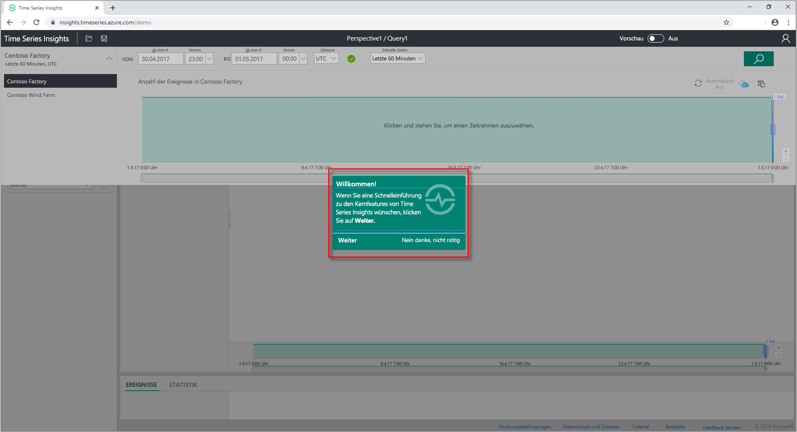
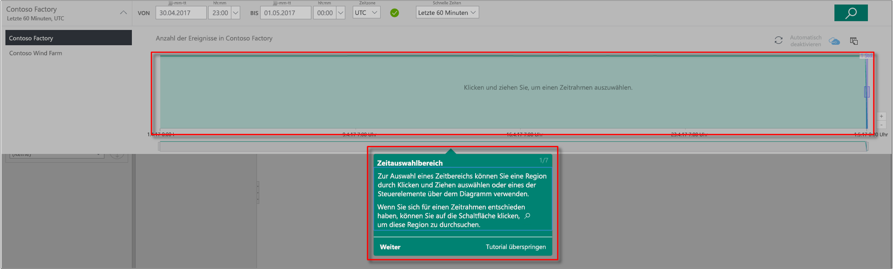
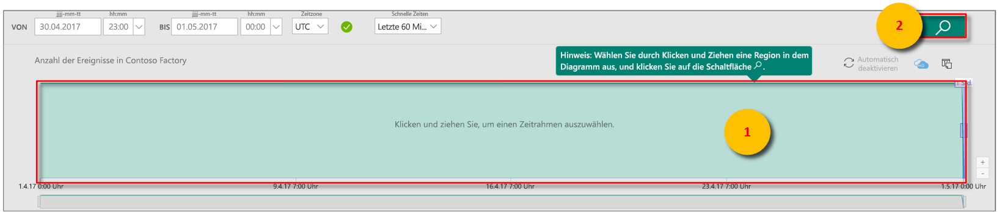
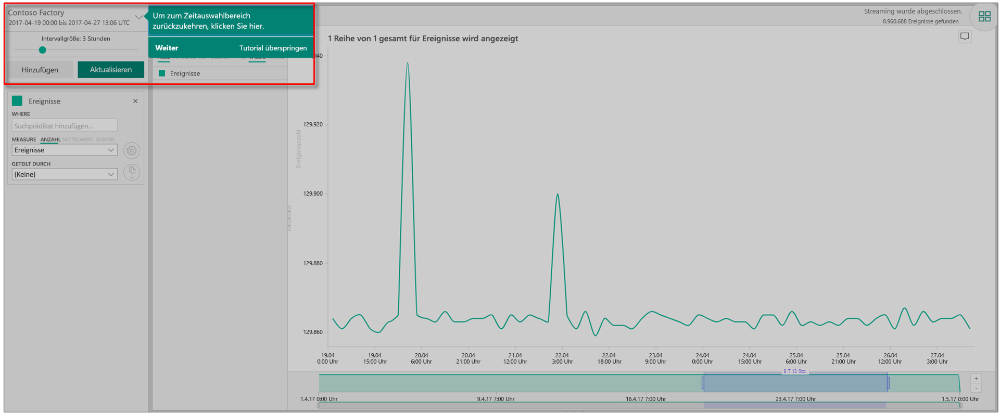
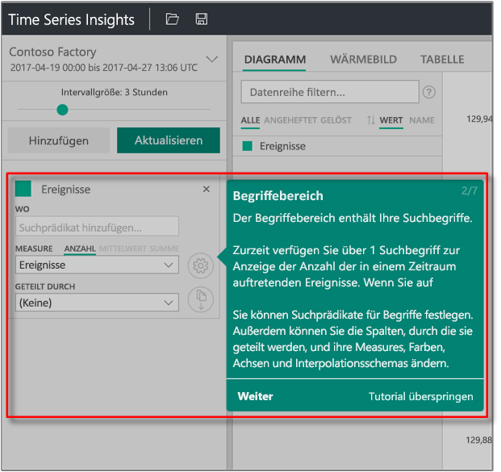
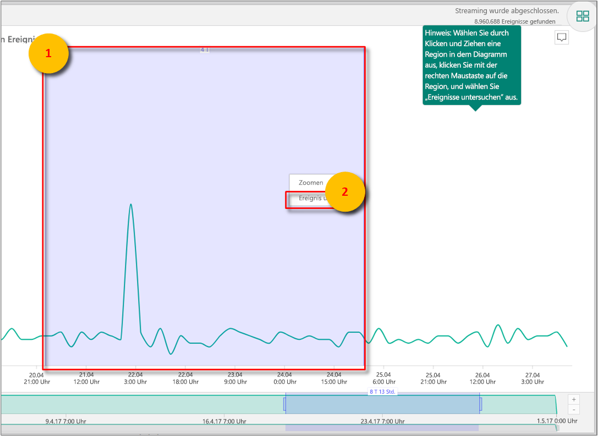
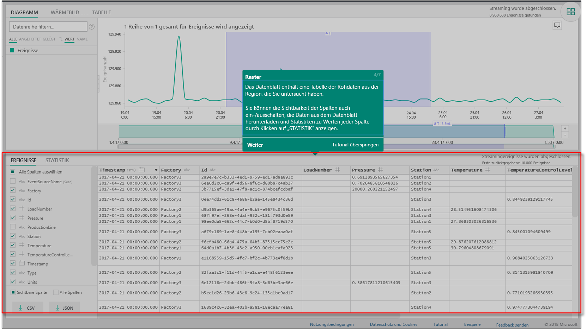
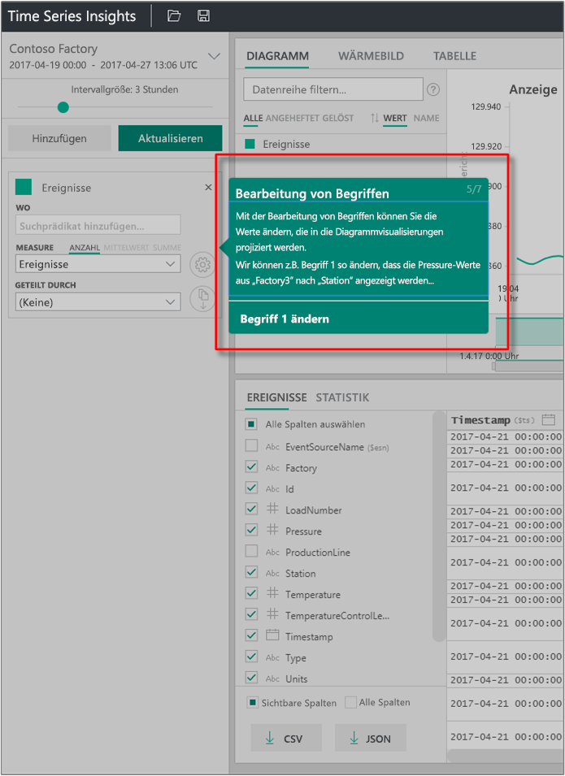
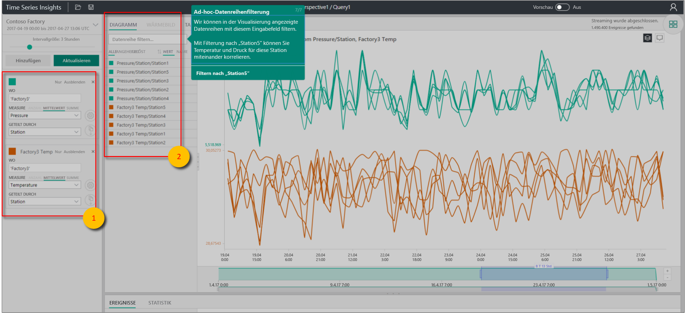

# Schnellstart: Erkunden von Azure Time Series Insights

Dieser Schnellstart für den Azure Time Series Insights-Explorer unterstützt Sie bei den ersten Schritten mit Azure Time Series in einer kostenlosen Demoumgebung. In dieser Schnellstartanleitung erfahren Sie, wie Sie große IoT-Datenmengen im Webbrowser visualisieren, und lernen die wichtigsten Features kennen, die nun allgemein verfügbar sind.

Azure Time Series Insights ist ein vollständig verwalteter Analyse-, Speicher- und Visualisierungsdienst, der die simultane Untersuchung und Analyse von Milliarden von IoT-Ereignissen vereinfacht. Sie erhalten eine globale Ansicht Ihrer Daten und können basierend darauf Ihre IoT-Lösung schneller überprüfen und kostenintensive Ausfallzeiten unternehmenskritischer Geräte vermeiden. Mit Azure Time Series Insights können Sie versteckte Trends aufdecken, Anomalien erkennen und Ursachenanalysen nahezu in Echtzeit durchführen.

Zur Erhöhung der Flexibilität kann Azure Time Series Insights über seine leistungsfähigen [REST-APIs](./time-series-insights-update-tsq.md) und das [Client-SDK](https://github.com/microsoft/tsiclient) einer bereits vorhandenen Anwendung hinzugefügt werden. Die APIs ermöglichen es Ihnen, Zeitreihendaten in einer Clientanwendung Ihrer Wahl zu speichern, abzufragen und zu nutzen. Sie können auch das Client-SDK verwenden, um Ihrer vorhandenen Anwendung Benutzeroberflächenkomponenten hinzuzufügen.

In dieser Schnellstartanleitung zum Time Series Insights-Explorer werden die Features beschrieben, die nun allgemein verfügbar sind.

> [!IMPORTANT]
> Erstellen Sie ein [kostenloses Azure-Konto](https://azure.microsoft.com/free/?ref=microsoft.com&utm_source=microsoft.com&utm_medium=docs&utm_campaign=visualstudio), sofern noch nicht geschehen.

## Vorbereiten der Demoumgebung

1. Navigieren Sie in Ihrem Browser zur [Demo der allgemeinen Verfügbarkeit](https://insights.timeseries.azure.com/demo).

1. Wenn Sie dazu aufgefordert werden, melden Sie sich mit Ihren Azure-Kontoanmeldeinformationen beim Time Series Insights-Explorer an.

1. Die Seite zur Schnelleinführung in Time Series Insights wird angezeigt. Wählen Sie **Weiter** aus, um die Schnelleinführung zu starten.

   

## Erkunden der Demoumgebung

1. Der **Zeitauswahlbereich** wird angezeigt. Wählen Sie in diesem Bereich den Zeitrahmen aus, der dargestellt werden soll.

   

1. Wählen Sie einen Zeitrahmen aus, und ziehen Sie ihn in den Bereich. Wählen Sie anschließend **Suchen** aus.

   

   In Time Series Insights wird eine Diagrammvisualisierung für den angegebenen Zeitrahmen angezeigt. Sie können verschiedene Aktionen im Liniendiagramm ausführen. Nutzen Sie beispielsweise Optionen zum Filtern, Anheften, Sortieren und Stapeln.

   Um zum **Zeitauswahlbereich** zurückzukehren, wählen Sie wie dargestellt den Pfeil nach unten aus:

   

1. Wählen Sie im **Begriffsbereich** die Option **Hinzufügen** aus, um einen neuen Suchbegriff hinzuzufügen.

   

1. Im Diagramm können Sie eine Region auswählen, mit der rechten Maustaste auf die Region klicken und **Explore Events** (Ereignisse durchsuchen) auswählen.

   

   Ein Raster der Rohdaten aus der durchsuchten Region wird angezeigt.

   

## Auswählen und Filtern von Daten

1. Bearbeiten Sie Ihre Begriffe, um die Werte im Diagramm zu ändern. Fügen Sie einen weiteren Begriff zum übergreifenden Korrelieren verschiedener Werttypen hinzu.

   

1. Lassen Sie das Feld **Datenreihe filtern** leer, um alle ausgewählten Suchbegriffe anzuzeigen, oder geben Sie im Feld **Datenreihe filtern** einen Filterbegriff ein, um eine improvisierte Filterung von Datenreihen durchzuführen.

   

   Geben Sie für den Schnellstart **Station5** ein, um die Temperatur und den Druck für die Station übergreifend zu korrelieren.

Nach Abschluss des Schnellstarts können Sie das Beispiel-DataSet verwenden, um verschiedene Visualisierungen zu erstellen.

## Bereinigen von Ressourcen

Bereinigen Sie nach dem Tutorial die von Ihnen erstellten Ressourcen:

1. Wählen Sie im [Azure-Portal](https://portal.azure.com) im Menü auf der linken Seite **Alle Ressourcen** aus, und suchen Sie Ihre Azure Time Series Insights-Ressourcengruppe.
1. Löschen Sie entweder die gesamte Ressourcengruppe (und alle darin enthaltenen Ressourcen), indem Sie auf **Löschen** klicken, oder entfernen Sie die Ressourcen einzeln.

## Nächste Schritte

Nun können Sie Ihre eigene Time Series Insights-Umgebung erstellen:
> [!div class="nextstepaction"]
> [Planen Ihrer Time Series Insights-Umgebung](time-series-insights-environment-planning.md)
