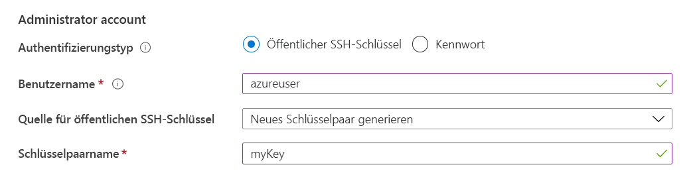

# Bereitstellen von VMs auf dedizierten Hosts über das Portal

Dieser Artikel führt Sie durch die Erstellung eines [dedizierten Azure-Hosts](dedicated-hosts.md) zum Hosten Ihrer virtuellen Computer (VMs). 

[!INCLUDE [virtual-machines-common-dedicated-hosts-portal](../../../includes/virtual-machines-common-dedicated-hosts-portal.md)]

## Erstellen einer VM

1. Klicken Sie links oben im Azure-Portal auf **Ressource erstellen**.
1. Suchen Sie im Suchfeld oberhalb der Liste der Azure Marketplace-Ressourcen nach **Ubuntu Server 16.04 LTS** von Canonical, und klicken Sie auf **Erstellen**.
1. Stellen Sie auf der Registerkarte **Grundlagen** unter **Projektdetails** sicher, dass das richtige Abonnement ausgewählt ist, und wählen Sie dann *myDedicatedHostsRG* als **Ressourcengruppe** aus. 
1. Geben Sie unter **Instanzdetails***myVM* als **Namen des virtuellen Computers** ein, und wählen Sie *USA, Osten* als Ihre **Ort** aus.
1. Wählen Sie unter **Verfügbarkeitsoptionen** die Option **Verfügbarkeitszone** aus, und wählen Sie in der Dropdownliste *1* aus.
1. Wählen Sie für die Größe **Größe ändern** aus. Wählen Sie in der Liste der verfügbaren Größen eine der Esv3-Serie aus, z. B. **Standard E2s v3**. Möglicherweise müssen Sie den Filter löschen, um alle verfügbaren Größen anzuzeigen.
1. Wählen Sie unter **Administratorkonto** die Option **Öffentlicher SSH-Schlüssel** aus, geben Sie Ihren Benutzernamen ein, und fügen Sie Ihren öffentlichen Schlüssel in das Textfeld ein. Entfernen Sie in Ihrem öffentlichen Schlüssel alle führenden bzw. nachgestellten Leerzeichen.

    

1. Wählen Sie unter **Regeln für eingehende Ports** > **Öffentliche Eingangsports** die Option **Ausgewählte Ports zulassen** und dann in der Dropdownliste **SSH (22)** aus. 
1. Wählen Sie oben auf der Seite die Registerkarte **Erweitert** und im Abschnitt **Host** den Eintrag *myHostGroup* für **Hostgruppe**  und *myHost* für den **Host** aus. 
    
1. Belassen Sie die übrigen Standardeinstellungen, und wählen Sie dann die Schaltfläche **Überprüfen + erstellen** am unteren Rand der Seite aus.
1. Wenn eine Meldung über die erfolgreiche Validierung angezeigt wird, wählen Sie **Erstellen** aus.

Die Bereitstellung des virtuellen Computers dauert ein paar Minuten.

## Hinzufügen einer vorhandenen VM 

Sie können einem dedizierten Host einen vorhandene virtuellen Computer hinzufügen. Der virtuelle Computer muss allerdings zuerst beendet bzw. seine Zuordnung aufgehoben werden. Vergewissern Sie sich vor dem Verschieben eines virtuellen Computers auf einen dedizierten Host, dass die VM-Konfiguration unterstützt wird:

- Die VM-Größe muss sich in der gleichen Größenfamilie befinden wie der dedizierte Host. Wenn der dedizierte Host z. B. DSv3 ist, kann die VM-Größe Standard_D4s_v3, aber nicht Standard_A4_v2 sein. 
- Der virtuelle Computer muss sich in der gleichen Region befinden wie der dedizierte Host.
- Der virtuelle Computer darf nicht Teil einer Näherungsplatzierungsgruppe sein. Entfernen Sie den virtuellen Computer aus der Näherungsplatzierungsgruppe, bevor Sie ihn auf einen dedizierten Host verschieben. Weitere Informationen finden Sie unter [Verschieben einer vorhandenen VM aus einer Näherungsplatzierungsgruppe](https://docs.microsoft.com/azure/virtual-machines/windows/proximity-placement-groups#move-an-existing-vm-out-of-a-proximity-placement-group).
- Der virtuelle Computer darf sich nicht in einer Verfügbarkeitsgruppe befinden.
- Wenn sich der virtuelle Computer in einer Verfügbarkeitszone befindet, muss es sich dabei um die gleiche Verfügbarkeitszone handeln wie bei der Hostgruppe. Die Verfügbarkeitszoneneinstellungen für den virtuellen Computer und die Hostgruppe müssen identisch sein.

Verschieben Sie den virtuellen Computer mithilfe des [Portals](https://portal.azure.com) auf einen dedizierten Host.

1. Öffnen Sie die Seite für den virtuellen Computer.
1. Wählen Sie **Beenden** aus, um den virtuellen Computer zu beenden bzw. seine Zuordnung aufzuheben.
1. Wählen Sie im Menü auf der linken Seite die Option **Konfiguration** aus.
1. Wählen Sie in den entsprechenden Dropdownmenüs eine Hostgruppe und einen Host aus.
1. Wählen Sie abschließend im oberen Bereich der Seite **Speichern** aus.
1. Klicken Sie im linken Menü auf **Übersicht**, nachdem der virtuelle Computer dem Host hinzugefügt wurde.
1. Wählen Sie oben auf der Seite **Starten** aus, um den virtuellen Computer neu zu starten.

## Nächste Schritte

- Weitere Informationen finden Sie in der Übersicht zu [dedizierten Hosts](dedicated-hosts.md).

- [Hier](https://github.com/Azure/azure-quickstart-templates/blob/master/201-vm-dedicated-hosts/README.md) finden Sie eine Beispielvorlage, die sowohl Zonen als auch Fehlerdomänen für maximale Resilienz in einer Region verwendet.

- Sie können einen dedizierten Host auch über die [Azure-Befehlszeilenschnittstelle](dedicated-hosts-cli.md) bereitstellen.

