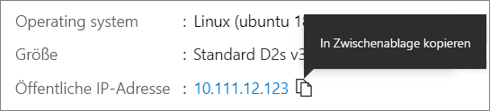

# <a name="quickstart-create-a-linux-virtual-machine-in-the-azure-portal"></a>Schnellstart: Erstellen eines virtuellen Linux-Computers im Azure-Portal

Virtuelle Azure-Computer (VMs) können über das Azure-Portal erstellt werden. Das Azure-Portal ist eine browserbasierte Benutzeroberfläche, über die Sie Azure-Ressourcen erstellen können. In dieser Schnellstartanleitung wird gezeigt, wie Sie über das Azure-Portal einen virtuellen Linux-Computer unter Ubuntu 18.04 LTS bereitstellen. Wenn Sie den virtuellen Computer in Aktion sehen möchten, stellen Sie eine SSH-Verbindung mit dem virtuellen Computer her und installieren den NGINX-Webserver.

Wenn Sie kein Azure-Abonnement besitzen, können Sie ein [kostenloses Konto](https://azure.microsoft.com/free/?WT.mc_id=A261C142F) erstellen, bevor Sie beginnen.

## <a name="sign-in-to-azure"></a>Anmelden bei Azure

Melden Sie sich beim [Azure-Portal](https://portal.azure.com) an, falls Sie dies noch nicht getan haben.

## <a name="create-virtual-machine"></a>Erstellen eines virtuellen Computers

1. Geben Sie in das Suchfeld **virtuelle Computer** ein.
1. Wählen Sie unter **Dienste** die Option **Virtuelle Computer** aus.
1. Wählen Sie auf der Seite **Virtuelle Computer** die Option **Hinzufügen** aus. Die Seite **Virtuellen Computer erstellen** wird geöffnet.
1. Stellen Sie auf der Registerkarte **Grundlagen** unter **Projektdetails** sicher, dass das richtige Abonnement ausgewählt ist, und wählen Sie dann **Neu erstellen** für „Ressourcengruppe“ aus. Geben Sie als Namen *myResourceGroup* ein. 

    

1. Geben Sie unter **Instanzdetails** die Zeichenfolge *myVM* als **Namen des virtuellen Computers** ein, wählen Sie *USA, Osten* als Ihre **Region** aus, und wählen Sie *Ubuntu 18.04 LTS* als **Image** aus. Behalten Sie die restlichen Standardwerte bei.

    

1. Wählen Sie unter **Administratorkonto** die Option **Öffentlicher SSH-Schlüssel** aus.

1. Geben Sie in **Benutzername** die Zeichenfolge *azureuser* ein.

1. Für **Öffentliche SSH-Schlüsselquelle** belassen Sie die Voreinstellung **Neues Schlüsselpaar generieren**, und geben Sie dann *myKey* für den **Schlüsselpaarnamen** ein.

    

1. Wählen Sie unter **Regeln für eingehende Ports** > **Öffentliche Eingangsports** die Option **Ausgewählte Ports zulassen** aus, und wählen Sie dann **SSH (22)** und **HTTP-(80)** aus der Dropdownliste aus. 

    

1. Belassen Sie die übrigen Standardeinstellungen, und wählen Sie dann die Schaltfläche **Überprüfen + erstellen** am unteren Rand der Seite aus.

1. Auf der Seite zum **Erstellen eines virtuellen Computers** werden die Details des virtuellen Computers angezeigt, den Sie erstellen möchten. Klicken Sie auf **Erstellen**, wenn Sie so weit sind.

1. Wenn das Fenster **Neues Schlüsselpaar generieren** geöffnet wird, wählen Sie **Privaten Schlüssel herunterladen und Ressource erstellen** aus. Ihre Schlüsseldatei wird als **myKey.pem** heruntergeladen. Vergewissern Sie sich, dass Sie wissen, wo die `.pem`-Datei heruntergeladen wurde. Sie benötigen im nächsten Schritt den Pfad zu dieser Datei.

1. Wählen Sie nach Abschluss der Bereitstellung die Option **Zu Ressourcengruppe wechseln**.

1. Wählen Sie auf der Seite für Ihren neuen virtuellen Computer (VM) die öffentliche IP-Adresse aus, und kopieren Sie sie in die Zwischenablage.


    

## <a name="connect-to-virtual-machine"></a>Herstellen der Verbindung mit dem virtuellen Computer

Stellen Sie eine SSH-Verbindung mit dem virtuellen Computer her.

1. Wenn Sie auf einem Macintosh- oder Linux-Computer arbeiten, öffnen Sie eine Bash-Eingabeaufforderung. Wenn Sie sich auf einem Windows-Computer befinden, öffnen Sie eine PowerShell-Eingabeaufforderung. 

1. Öffnen Sie an Ihrer Eingabeaufforderung eine SSH-Verbindung mit Ihrem virtuellen Computer. Ersetzen Sie die IP-Adresse durch die Ihres virtuellen Computers, und ersetzen Sie den Pfad zur `.pem` durch den Pfad, in den die Schlüsseldatei heruntergeladen wurde.

```console
ssh -i .\Downloads\myKey1.pem azureuser@10.111.12.123
```

> [!TIP]
> Der von Ihnen erstellte SSH-Schlüssel kann bei der nächsten Erstellung einer VM in Azure verwendet werden. Wählen Sie einfach die Option **In Azure gespeicherten Schlüssel verwenden** für **Öffentliche SSH-Schlüsselquelle** aus, wenn Sie das nächste Mal einen virtuellen Computer erstellen. Der private Schlüssel befindet sich bereits auf Ihrem Computer, sodass Sie nichts herunterladen müssen.

## <a name="install-web-server"></a>Installieren des Webservers

Wenn Sie den virtuellen Computer in Aktion sehen möchten, installieren Sie den NGINX-Webserver. Aktualisieren Sie über die SSH-Sitzung Ihre Paketquellen, und installieren Sie dann das aktuelle NGINX-Paket.

```bash
sudo apt-get -y update
sudo apt-get -y install nginx
```

Geben Sie abschließend `exit` ein, um die SSH-Sitzung zu verlassen.


## <a name="view-the-web-server-in-action"></a>Anzeigen des Webservers in Aktion

Verwenden Sie einen beliebigen Webbrowser, um die Standardwillkommensseite von NGINX anzuzeigen. Geben Sie die öffentliche IP-Adresse Ihres virtuellen Computers als Webadresse ein. Die öffentliche IP-Adresse finden Sie auf der Übersichtsseite für den virtuellen Computer sowie in der weiter oben verwendeten SSH-Verbindungszeichenfolge.


## <a name="clean-up-resources"></a>Bereinigen von Ressourcen

Wenn Ressourcengruppe, virtueller Computer und alle zugehörigen Ressourcen nicht mehr benötigt werden, können Sie sie löschen. Wählen Sie dazu die Ressourcengruppe für den virtuellen Computer aus, klicken Sie auf **Löschen**, und bestätigen Sie den Namen der zu löschenden Ressourcengruppe.

## <a name="next-steps"></a>Nächste Schritte

In dieser Schnellstartanleitung haben Sie einen einfachen virtuellen Computer bereitgestellt, eine Netzwerksicherheitsgruppe und eine Regel erstellt sowie einen einfachen Webserver installiert. Fahren Sie mit dem Tutorial für virtuelle Linux-Computer fort, um weitere Informationen zu virtuellen Azure-Computern zu erhalten.

> [!div class="nextstepaction"]
> [Tutorials für virtuelle Azure Linux-Computer](./tutorial-manage-vm.md)
