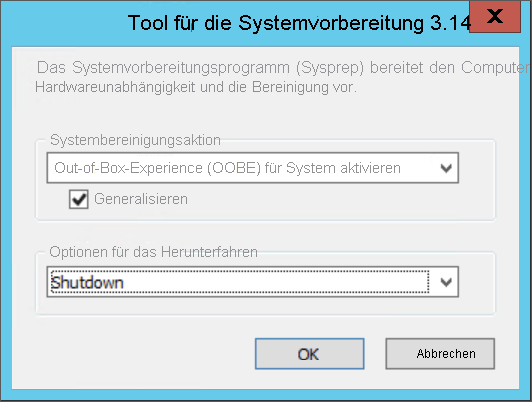

# <a name="prepare-a-windows-vhd-or-vhdx-to-upload-to-azure"></a>Vorbereiten einer Windows-VHD oder -VHDX zum Hochladen in Azure

Bevor Sie einen virtuellen Windows-Computer aus einem lokalen Speicherort in Azure hochladen können, müssen Sie die virtuelle Festplatte (Virtual Hard Disk, VHD oder VHDX) vorbereiten. Azure unterstützt VMs der Generationen 1 und 2, die das VHD-Dateiformat und einen Datenträger mit fester Größe aufweisen. Die maximal zulässige Größe für die Betriebssystem-VHD eines virtuellen Computers der Generation 1 beträgt 2 TB.

Sie können eine VHDX-Datei in das VHD-Format und einen dynamisch erweiterbaren Datenträger in einen Datenträger mit fester Größe konvertieren, die Generation eines virtuellen Computers kann jedoch nicht geändert werden. Weitere Informationen finden Sie unter [Sollte ich eine VM der Generation 1 oder 2 in Hyper-V erstellen?](/windows-server/virtualization/hyper-v/plan/Should-I-create-a-generation-1-or-2-virtual-machine-in-Hyper-V) und [Support für VMs der Generation 2 in Azure](generation-2.md).

Weitere Informationen zur Supportrichtlinie für Azure-VMs finden Sie unter [Microsoft-Server-Software-Support für virtuelle Maschinen von Microsoft Azure](https://support.microsoft.com/help/2721672/).

> [!NOTE]
> Die Anweisungen in diesem Artikel gelten für Folgendes:
>
> - Die 64-Bit-Version von Windows Server 2008 R2 und höhere Versionen des Windows Server-Betriebssystems. Informationen zum Ausführen einer 32-Bit-Version des Betriebssystems in Azure finden Sie unter [Unterstützung für 32-Bit-Betriebssysteme in Azure-VMs](https://support.microsoft.com/help/4021388/).
> - Wird die Workload mithilfe eines Notfallwiederherstellungstools wie Azure Site Recovery oder Azure Migrate migriert, muss dieser Prozess trotzdem für das Gastbetriebssystem vor der Migration ausgeführt werden.

## <a name="system-file-checker"></a>System File Checker

### <a name="run-windows-system-file-checker-utility-before-generalization-of-os-image"></a>Ausführen des Hilfsprogramms Windows System File Checker vor der Generalisierung des Betriebssystemimages

SFC (System File Checker) wird verwendet, um Windows-Systemdateien zu überprüfen und zu ersetzen.

> [!IMPORTANT]
> Die Beispiele in diesem Artikel müssen in einer PowerShell-Sitzung mit erhöhten Rechten ausgeführt werden.

Führen Sie den SFC-Befehl aus:

```powershell
sfc.exe /scannow
```

```Output
Beginning system scan.  This process will take some time.

Beginning verification phase of system scan.
Verification 100% complete.

Windows Resource Protection did not find any integrity violations.
```

Nachdem die SFC-Prüfung abgeschlossen wurde, versuchen Sie, Windows-Updates zu installieren und den Computer neu zu starten.

## <a name="set-windows-configurations-for-azure"></a>Festlegen der Windows-Konfigurationen für Azure

> [!NOTE]
> Die Azure-Plattform stellt eine ISO-Datei auf der DVD-ROM bereit, wenn eine Windows-VM aus einem generalisierten Image erstellt wird. Aus diesem Grund muss die DVD-ROM im Betriebssystem im generalisierten Image aktiviert werden. Wenn sie deaktiviert ist, bleibt die Windows-VM auf der Windows-Willkommenseite (OOBE) hängen.

1. Entfernen Sie alle statischen persistenten Routen aus der Routingtabelle:

   - Um die Routingtabelle anzuzeigen, führen Sie `route.exe print`aus.
   - Überprüfen Sie den Abschnitt **Persistenzrouten**. Wenn eine persistente Route vorhanden ist, verwenden Sie den Befehl `route.exe delete`, um sie zu entfernen.

1. Entfernen Sie den WinHTTP-Proxy:

   ```powershell
   netsh.exe winhttp reset proxy
   ```

    Wenn die VM mit einem bestimmten Proxy zusammenarbeiten muss, fügen Sie der Azure-IP-Adresse eine Proxyausnahme hinzu ([168.63.129.16](/azure/virtual-network/what-is-ip-address-168-63-129-16)), damit die VM eine Verbindung mit Azure herstellen kann:

    ```
    $proxyAddress='<your proxy server>'
    $proxyBypassList='<your list of bypasses>;168.63.129.16'
    netsh.exe winhttp set proxy $proxyAddress $proxyBypassList
    ```

1. Öffnen Sie DiskPart:

   ```powershell
   diskpart.exe
   ```

   Legen Sie für die Datenträger-SAN-Richtlinie [`Onlineall`](/previous-versions/windows/it-pro/windows-server-2012-R2-and-2012/gg252636(v=ws.11)) fest:

   ```DiskPart
   DISKPART> san policy=onlineall
   DISKPART> exit
   ```

1. Legen Sie für Windows die koordinierten Weltzeit (UTC) fest. Legen Sie außerdem den Starttyp des Windows-Zeitdiensts (**w32time**) auf **Automatisch** fest:

   ```powershell
   Set-ItemProperty -Path HKLM:\SYSTEM\CurrentControlSet\Control\TimeZoneInformation -Name RealTimeIsUniversal -Value 1 -Type DWord -Force
   Set-Service -Name w32time -StartupType Automatic
   ```

1. Legen Sie das Energieprofil auf „Hohe Leistung“ fest:

   ```powershell
   powercfg.exe /setactive SCHEME_MIN
   ```

1. Stellen Sie sicher, dass die Umgebungsvariablen **TEMP** und **TMP** auf ihre Standardwerte festgelegt sind:

   ```powershell
   Set-ItemProperty -Path 'HKLM:\SYSTEM\CurrentControlSet\Control\Session Manager\Environment' -Name TEMP -Value "%SystemRoot%\TEMP" -Type ExpandString -Force
   Set-ItemProperty -Path 'HKLM:\SYSTEM\CurrentControlSet\Control\Session Manager\Environment' -Name TMP -Value "%SystemRoot%\TEMP" -Type ExpandString -Force
   ```

## <a name="check-the-windows-services"></a>Überprüfen der Windows-Dienste

Stellen Sie sicher, dass jeder der folgenden Windows-Dienste auf den Windows-Standardwert festgelegt ist. Die Konfiguration dieser Dienste stellt die Mindestanforderung für VM-Konnektivität dar. Um die Starteinstellungen festzulegen, führen Sie das folgende Beispiel aus:

```powershell
Get-Service -Name BFE, Dhcp, Dnscache, IKEEXT, iphlpsvc, nsi, mpssvc, RemoteRegistry |
  Where-Object StartType -ne Automatic |
    Set-Service -StartupType Automatic

Get-Service -Name Netlogon, Netman, TermService |
  Where-Object StartType -ne Manual |
    Set-Service -StartupType Manual
```

## <a name="update-remote-desktop-registry-settings"></a>Aktualisieren der Remotedesktop-Registrierungseinstellungen

Stellen Sie sicher, dass die folgenden Einstellungen ordnungsgemäß für Remotezugriff konfiguriert sind:

> [!NOTE]
> Wenn Sie beim Ausführen von `Set-ItemProperty -Path 'HKLM:\SOFTWARE\Policies\Microsoft\Windows NT\Terminal Services -Name <string> -Value <object>` eine Fehlermeldung erhalten, können Sie diese problemlos ignorieren. Sie gibt lediglich an, dass diese Konfiguration von der Domäne nicht über ein Gruppenrichtlinienobjekt festgelegt wird.

1. Das Remotedesktopprotokoll (RDP) ist aktiviert:

   ```powershell
   Set-ItemProperty -Path 'HKLM:\SYSTEM\CurrentControlSet\Control\Terminal Server' -Name fDenyTSConnections -Value 0 -Type DWord -Force
   Set-ItemProperty -Path 'HKLM:\SOFTWARE\Policies\Microsoft\Windows NT\Terminal Services' -Name fDenyTSConnections -Value 0 -Type DWord -Force
   ```

1. Der RDP-Port wird mithilfe des Standardports 3389 ordnungsgemäß festgelegt:

   ```powershell
   Set-ItemProperty -Path 'HKLM:\SYSTEM\CurrentControlSet\Control\Terminal Server\Winstations\RDP-Tcp' -Name PortNumber -Value 3389 -Type DWord -Force
   ```

   Wenn Sie eine VM bereitstellen, werden die Standardregeln für Port 3389 erstellt. Wenn Sie die Portnummer ändern möchten, führen Sie dies nach der Bereitstellung der VM in Azure durch.

1. Der Listener lauscht an allen Netzwerkschnittstellen:

   ```powershell
   Set-ItemProperty -Path 'HKLM:\SYSTEM\CurrentControlSet\Control\Terminal Server\Winstations\RDP-Tcp' -Name LanAdapter -Value 0 -Type DWord -Force
   ```

1. Konfigurieren Sie den Modus zur Authentifizierung auf Netzwerkebene (Network Level Authentication, NLA) für die RDP-Verbindungen:

   ```powershell
   Set-ItemProperty -Path 'HKLM:\SYSTEM\CurrentControlSet\Control\Terminal Server\WinStations\RDP-Tcp' -Name UserAuthentication -Value 1 -Type DWord -Force
   Set-ItemProperty -Path 'HKLM:\SYSTEM\CurrentControlSet\Control\Terminal Server\WinStations\RDP-Tcp' -Name SecurityLayer -Value 1 -Type DWord -Force
   Set-ItemProperty -Path 'HKLM:\SYSTEM\CurrentControlSet\Control\Terminal Server\WinStations\RDP-Tcp' -Name fAllowSecProtocolNegotiation -Value 1 -Type DWord -Force
   ```

1. Legen Sie den Keep-Alive-Wert fest:

   ```PowerShell
   Set-ItemProperty -Path 'HKLM:\SOFTWARE\Policies\Microsoft\Windows NT\Terminal Services' -Name KeepAliveEnable -Value 1  -Type DWord -Force
   Set-ItemProperty -Path 'HKLM:\SOFTWARE\Policies\Microsoft\Windows NT\Terminal Services' -Name KeepAliveInterval -Value 1  -Type DWord -Force
   Set-ItemProperty -Path 'HKLM:\SYSTEM\CurrentControlSet\Control\Terminal Server\Winstations\RDP-Tcp' -Name KeepAliveTimeout -Value 1 -Type DWord -Force
   ```

1. Legen Sie die Optionen für erneute Verbindungsherstellung fest:

   ```PowerShell
   Set-ItemProperty -Path 'HKLM:\SOFTWARE\Policies\Microsoft\Windows NT\Terminal Services' -Name fDisableAutoReconnect -Value 0 -Type DWord -Force
   Set-ItemProperty -Path 'HKLM:\SYSTEM\CurrentControlSet\Control\Terminal Server\Winstations\RDP-Tcp' -Name fInheritReconnectSame -Value 1 -Type DWord -Force
   Set-ItemProperty -Path 'HKLM:\SYSTEM\CurrentControlSet\Control\Terminal Server\Winstations\RDP-Tcp' -Name fReconnectSame -Value 0 -Type DWord -Force
   ```

1. Beschränken Sie die Anzahl gleichzeitiger Verbindungen:

   ```powershell
   Set-ItemProperty -Path 'HKLM:\SYSTEM\CurrentControlSet\Control\Terminal Server\Winstations\RDP-Tcp' -Name MaxInstanceCount -Value 4294967295 -Type DWord -Force
   ```

1. Entfernen Sie alle selbstsignierten Zertifikate, die an den RDP-Listener gebunden sind:

   ```powershell
   if ((Get-Item -Path 'HKLM:\SYSTEM\CurrentControlSet\Control\Terminal Server\WinStations\RDP-Tcp').Property -contains 'SSLCertificateSHA1Hash')
   {
       Remove-ItemProperty -Path 'HKLM:\SYSTEM\CurrentControlSet\Control\Terminal Server\WinStations\RDP-Tcp' -Name SSLCertificateSHA1Hash -Force
   }
   ```

   Durch diesen Code wird sichergestellt, dass Sie bei der Bereitstellung der VM eine Verbindung herstellen können. Sie können diese Einstellungen auch nach der Bereitstellung der VM in Azure überprüfen.

1. Wenn die VM Teil einer Domäne ist, überprüfen Sie die folgenden Richtlinien, um sicherzustellen, dass die vorherigen Einstellungen nicht zurückgesetzt werden.

    |                 Zielsetzung                  |                                                                            Richtlinie                                                                            |                           Wert                            |
    | ------------------------------------- | ------------------------------------------------------------------------------------------------------------------------------------------------------------ | ---------------------------------------------------------- |
    | RDP ist aktiviert                        | Computerkonfiguration\Richtlinien\Windows-Einstellungen\Administrative Vorlagen\Komponenten\Remotedesktopdienste\Remotedesktop-Sitzungshost\Verbindungen         | Remoteverbindungen für Benutzer mithilfe der Remotedesktopdienste zulassen    |
    | NLA-Gruppenrichtlinie                      | Einstellungen\Administrative Vorlagen\Komponenten\Remotedesktopdienste\Remotedesktop-Sitzungshost\Sicherheit                                                    | Erfordern der Benutzerauthentifizierung für den Remotezugriff mithilfe der NLA |
    | Keep-Alive-Einstellungen                   | Computerkonfiguration\Richtlinien\Windows-Einstellungen\Administrative Vorlagen\Windows-Komponenten\Remotedesktopdienste\Remotedesktop-Sitzungshost\Verbindungen | Keep-Alive-Verbindungsintervall konfigurieren                   |
    | Einstellungen zur erneuten Verbindungsherstellung                    | Computerkonfiguration\Richtlinien\Windows-Einstellungen\Administrative Vorlagen\Windows-Komponenten\Remotedesktopdienste\Remotedesktop-Sitzungshost\Verbindungen | Verbindung automatisch erneut herstellen                                    |
    | Begrenzte Anzahl von Verbindungseinstellungen | Computerkonfiguration\Richtlinien\Windows-Einstellungen\Administrative Vorlagen\Windows-Komponenten\Remotedesktopdienste\Remotedesktop-Sitzungshost\Verbindungen | Anzahl der Verbindungen einschränken                                |

## <a name="configure-windows-firewall-rules"></a>Konfigurieren von Windows-Firewallregeln

1. Aktivieren Sie die Windows-Firewall für die drei Profile („Domäne“, „Standard“ und „Öffentlich“):

   ```powershell
   Set-NetFirewallProfile -Profile Domain, Public, Private -Enabled True
   ```

1. Führen Sie das folgende Beispiel aus, um WinRM in den drei Firewallprofilen („Domäne“, „Privat“ und „Öffentlich“) zuzulassen, und aktivieren Sie den PowerShell-Remotedienst:

   ```powershell
   Enable-PSRemoting -Force
   Set-NetFirewallRule -DisplayName 'Windows Remote Management (HTTP-In)' -Enabled True
   ```

1. Aktivieren Sie die folgenden Firewallregeln, um RDP-Datenverkehr zuzulassen:

   ```powershell
   Set-NetFirewallRule -DisplayGroup 'Remote Desktop' -Enabled True
   ```

1. Aktivieren Sie die Regel für die Datei- und Druckerfreigabe, damit die VM auf Ping-Anforderungen innerhalb des virtuellen Netzwerks antworten kann:

   ```powershell
   Set-NetFirewallRule -DisplayName 'File and Printer Sharing (Echo Request - ICMPv4-In)' -Enabled True
   ```

1. Erstellen Sie eine Regel für das Azure-Plattformnetzwerk:

   ```powershell
   New-NetFirewallRule -DisplayName AzurePlatform -Direction Inbound -RemoteAddress 168.63.129.16 -Profile Any -Action Allow -EdgeTraversalPolicy Allow
   New-NetFirewallRule -DisplayName AzurePlatform -Direction Outbound -RemoteAddress 168.63.129.16 -Profile Any -Action Allow
   ```

1. Wenn die VM Teil einer Domäne ist, überprüfen Sie die folgenden Azure AD-Richtlinien, um sicherzustellen, dass die vorherigen Einstellungen nicht zurückgesetzt werden.

    |                 Zielsetzung                 |                                                                         Richtlinie                                                                          |                  Wert                  |
    | ------------------------------------ | ------------------------------------------------------------------------------------------------------------------------------------------------------- | --------------------------------------- |
    | Aktivieren der Windows-Firewallprofile | Computerkonfiguration\Richtlinien\Windows-Einstellungen\Administrative Vorlagen\Netzwerk\Netzwerkverbindung\Windows-Firewall\Domänenprofil\Windows-Firewall   | Schützen aller Netzwerkverbindungen         |
    | Aktivieren von RDP                           | Computerkonfiguration\Richtlinien\Windows-Einstellungen\Administrative Vorlagen\Netzwerk\Netzwerkverbindung\Windows-Firewall\Domänenprofil\Windows-Firewall   | Zulassen eingehender Remotedesktopausnahmen |
    |                                      | Computerkonfiguration\Richtlinien\Windows-Einstellungen\Administrative Vorlagen\Netzwerk\Netzwerkverbindung\Windows-Firewall\Standardprofil\Windows-Firewall | Zulassen eingehender Remotedesktopausnahmen |
    | Aktivieren von ICMP-V4                       | Computerkonfiguration\Richtlinien\Windows-Einstellungen\Administrative Vorlagen\Netzwerk\Netzwerkverbindung\Windows-Firewall\Domänenprofil\Windows-Firewall   | Zulassen von ICMP-Ausnahmen                   |
    |                                      | Computerkonfiguration\Richtlinien\Windows-Einstellungen\Administrative Vorlagen\Netzwerk\Netzwerkverbindung\Windows-Firewall\Standardprofil\Windows-Firewall | Zulassen von ICMP-Ausnahmen                   |

## <a name="verify-the-vm"></a>Überprüfen des virtuellen Computers

Stellen Sie sicher, dass die VM fehlerfrei und sicher ist und dass per RDP darauf zugegriffen werden kann:

1. Um sicherzustellen, dass der Datenträger fehlerfrei und konsistent ist, führen Sie beim nächsten VM-Neustart eine Datenträgerüberprüfung durch:

   ```powershell
   chkdsk.exe /f
   ```

   Stellen Sie sicher, dass der Bericht einen sauberen und fehlerfreien Datenträger anzeigt.

1. Legen Sie die Einstellungen für die Startkonfigurationsdaten (Boot Configuration Data, BCD) fest.

   ```powershell
   bcdedit.exe /set "{bootmgr}" integrityservices enable
   bcdedit.exe /set "{default}" device partition=C:
   bcdedit.exe /set "{default}" integrityservices enable
   bcdedit.exe /set "{default}" recoveryenabled Off
   bcdedit.exe /set "{default}" osdevice partition=C:
   bcdedit.exe /set "{default}" bootstatuspolicy IgnoreAllFailures

   #Enable Serial Console Feature
   bcdedit.exe /set "{bootmgr}" displaybootmenu yes
   bcdedit.exe /set "{bootmgr}" timeout 5
   bcdedit.exe /set "{bootmgr}" bootems yes
   bcdedit.exe /ems "{current}" ON
   bcdedit.exe /emssettings EMSPORT:1 EMSBAUDRATE:115200
   ```

1. Das Abbildprotokoll kann bei der Problembehandlung nach Windows-Abstürzen hilfreich sein. Aktivieren Sie die Sammlung von Abbildprotokollen:

   ```powershell
   # Set up the guest OS to collect a kernel dump on an OS crash event
   Set-ItemProperty -Path 'HKLM:\SYSTEM\CurrentControlSet\Control\CrashControl' -Name CrashDumpEnabled -Type DWord -Force -Value 2
   Set-ItemProperty -Path 'HKLM:\SYSTEM\CurrentControlSet\Control\CrashControl' -Name DumpFile -Type ExpandString -Force -Value "%SystemRoot%\MEMORY.DMP"
   Set-ItemProperty -Path 'HKLM:\SYSTEM\CurrentControlSet\Control\CrashControl' -Name NMICrashDump -Type DWord -Force -Value 1

   # Set up the guest OS to collect user mode dumps on a service crash event
   $key = 'HKLM:\SOFTWARE\Microsoft\Windows\Windows Error Reporting\LocalDumps'
   if ((Test-Path -Path $key) -eq $false) {(New-Item -Path 'HKLM:\SOFTWARE\Microsoft\Windows\Windows Error Reporting' -Name LocalDumps)}
   New-ItemProperty -Path $key -Name DumpFolder -Type ExpandString -Force -Value 'C:\CrashDumps'
   New-ItemProperty -Path $key -Name CrashCount -Type DWord -Force -Value 10
   New-ItemProperty -Path $key -Name DumpType -Type DWord -Force -Value 2
   Set-Service -Name WerSvc -StartupType Manual
   ```

1. Überprüfen Sie, ob das Repository für die Windows-Verwaltungsinstrumentation (Windows Management Instrumentation, WMI) konsistent ist:

   ```powershell
   winmgmt.exe /verifyrepository
   ```

   Wenn das Repository beschädigt ist, informieren Sie sich in [WMI: Repository beschädigt oder nicht](https://techcommunity.microsoft.com/t5/ask-the-performance-team/wmi-repository-corruption-or-not/ba-p/375484).

1. Stellen Sie sicher, dass keine andere Anwendung Port 3389 verwendet. Dieser Port wird für den RDP-Dienst in Azure verwendet. Um festzustellen, welche Ports auf dem virtuellen Computer verwendet werden, führen Sie `netstat.exe -anob` aus:

   ```powershell
   netstat.exe -anob
   ```

1. So laden Sie eine Windows-VHD hoch, die ein Domänencontroller ist

   - Führen Sie [diese zusätzlichen Schritte aus](https://support.microsoft.com/kb/2904015), um den Datenträger vorzubereiten.

   - Stellen Sie sicher, dass Sie das DSRM-Kennwort (Directory Services Restore Mode) kennen, falls Sie die VM in DSRM starten müssen. Weitere Informationen finden Sie unter [set DSRM password](/previous-versions/windows/it-pro/windows-server-2012-R2-and-2012/cc754363(v=ws.11)) (Festlegen eines DSRM-Kennworts).

1. Stellen Sie sicher, dass Sie die Anmeldeinformationen für das integrierte Administratorkonto und das Kennwort kennen. Setzen Sie ggf. das aktuelle Kennwort des lokalen Administrators zurück, und stellen Sie sicher, dass Sie sich mit diesem Konto über die RDP-Verbindung bei Windows anmelden können. Diese Zugriffsberechtigung wird über das Gruppenrichtlinienobjekt „Anmelden über Remotedesktopdienste zulassen“ gesteuert. Zeigen Sie dieses Objekt im folgenden Pfad im Editor für lokale Gruppenrichtlinien an:

   - `Computer Configuration\Windows Settings\Security Settings\Local Policies\User Rights Assignment`

1. Überprüfen Sie die folgenden Azure AD-Richtlinien, um sicherzustellen, dass Sie den RDP-Zugriff nicht blockieren:

   - `Computer Configuration\Windows Settings\Security Settings\Local Policies\User Rights
      Assignment\Deny access to this computer from the network`

   - `Computer Configuration\Windows Settings\Security Settings\Local Policies\User Rights
      Assignment\Deny log on through Remote Desktop Services`

1. Überprüfen Sie die folgende Azure AD-Richtlinie, um sicherzustellen, dass keines der erforderlichen Zugriffskonten entfernt wird:

   - `Computer Configuration\Windows Settings\Security Settings\Local Policies\User Rights Assignment\Access this computer from the network`

   Die Richtlinie sollten die folgenden Gruppen enthalten:

   - Administratoren

   - Sicherungsoperatoren

   - Jeder

   - Benutzer

1. Starten Sie den virtuellen Computer neu, um sicherzustellen, dass Windows weiterhin fehlerfrei ausgeführt wird und über die RDP-Verbindung erreichbar ist. An diesem Punkt können Sie einen virtuellen Computer auf dem lokalen Hyper-V-Server erstellen, um zu überprüfen, ob der virtuelle Computer vollständig gestartet wird. Testen Sie danach, ob Sie den virtuellen Computer über RDP erreichen können.

1. Entfernen Sie alle zusätzlichen TDI-Filter (Transport Driver Interface). Entfernen Sie beispielsweise Software, die TCP-Pakete analysiert, oder zusätzliche Firewalls.

1. Deinstallieren Sie jegliche Drittanbietersoftware und -treiber im Zusammenhang mit physischen Komponenten oder einer anderen Virtualisierungstechnologie.

### <a name="install-windows-updates"></a>Installieren von Windows-Updates

Im Idealfall sollten Sie den Computer auf die *Patchebene* aktualisieren. Wenn dies nicht möglich ist, stellen Sie sicher, dass die folgenden Updates installiert sind. Informieren Sie sich auf den Verlaufsseiten von Windows Update, um die neuesten Updates herunterzuladen: [Windows 10 und Windows Server 2019](https://support.microsoft.com/help/4000825), [Windows 8.1 und Windows Server 2012 R2](https://support.microsoft.com/help/4009470) sowie [Windows 7 SP1 und Windows Server 2008 R2 SP1](https://support.microsoft.com/help/4009469).

<br />

|        Komponente        |     Binary     | Windows 7 SP1, Windows Server 2008 R2 SP1 |       Windows 8, Windows Server 2012        | Windows 8.1, Windows Server 2012 R2 | Windows 10 v1607, Windows Server 2016 v1607 |      Windows 10 v1703      | Windows 10 v1709, Windows Server 2016 v1709 | Windows 10 v1803, Windows Server 2016 v1803 |
| ----------------------- | -------------- | ----------------------------------------- | ------------------------------------------- | ----------------------------------- | ------------------------------------------- | -------------------------- | ------------------------------------------- | ------------------------------------------- |
| Storage                 | disk.sys       | 6.1.7601.23403 – KB3125574                | 6.2.9200.17638 / 6.2.9200.21757 – KB3137061 | 6.3.9600.18203 – KB3137061          | -                                           | -                          | -                                           | -                                           |
|                         | storport.sys   | 6.1.7601.23403 – KB3125574                | 6.2.9200.17188 / 6.2.9200.21306 – KB3018489 | 6.3.9600.18573 – KB4022726          | 10.0.14393.1358 – KB4022715                 | 10.0.15063.332             | -                                           | -                                           |
|                         | ntfs.sys       | 6.1.7601.23403 – KB3125574                | 6.2.9200.17623 / 6.2.9200.21743 – KB3121255 | 6.3.9600.18654 – KB4022726          | 10.0.14393.1198 – KB4022715                 | 10.0.15063.447             | -                                           | -                                           |
|                         | Iologmsg.dll   | 6.1.7601.23403 – KB3125574                | 6.2.9200.16384 – KB2995387                  | -                                   | -                                           | -                          | -                                           | -                                           |
|                         | Classpnp.sys   | 6.1.7601.23403 – KB3125574                | 6.2.9200.17061 / 6.2.9200.21180 – KB2995387 | 6.3.9600.18334 – KB3172614          | 10.0.14393.953 – KB4022715                  | -                          | -                                           | -                                           |
|                         | Volsnap.sys    | 6.1.7601.23403 – KB3125574                | 6.2.9200.17047 / 6.2.9200.21165 – KB2975331 | 6.3.9600.18265 – KB3145384          | -                                           | 10.0.15063.0               | -                                           | -                                           |
|                         | partmgr.sys    | 6.1.7601.23403 – KB3125574                | 6.2.9200.16681 – KB2877114                  | 6.3.9600.17401 – KB3000850          | 10.0.14393.953 – KB4022715                  | 10.0.15063.0               | -                                           | -                                           |
|                         | volmgr.sys     |                                           |                                             |                                     |                                             | 10.0.15063.0               | -                                           | -                                           |
|                         | Volmgrx.sys    | 6.1.7601.23403 – KB3125574                | -                                           | -                                   | -                                           | 10.0.15063.0               | -                                           | -                                           |
|                         | Msiscsi.sys    | 6.1.7601.23403 – KB3125574                | 6.2.9200.21006 – KB2955163                  | 6.3.9600.18624 – KB4022726          | 10.0.14393.1066 – KB4022715                 | 10.0.15063.447             | -                                           | -                                           |
|                         | Msdsm.sys      | 6.1.7601.23403 – KB3125574                | 6.2.9200.21474 – KB3046101                  | 6.3.9600.18592 – KB4022726          | -                                           | -                          | -                                           | -                                           |
|                         | Mpio.sys       | 6.1.7601.23403 – KB3125574                | 6.2.9200.21190 – KB3046101                  | 6.3.9600.18616 – KB4022726          | 10.0.14393.1198 – KB4022715                 | -                          | -                                           | -                                           |
|                         | vmstorfl.sys   | 6.3.9600.18907 – KB4072650                | 6.3.9600.18080 – KB3063109                  | 6.3.9600.18907 – KB4072650          | 10.0.14393.2007 – KB4345418                 | 10.0.15063.850 – KB4345419 | 10.0.16299.371 – KB4345420                  | -                                           |
|                         | Fveapi.dll     | 6.1.7601.23311 – KB3125574                | 6.2.9200.20930 – KB2930244                  | 6.3.9600.18294 – KB3172614          | 10.0.14393.576 – KB4022715                  | -                          | -                                           | -                                           |
|                         | Fveapibase.dll | 6.1.7601.23403 – KB3125574                | 6.2.9200.20930 – KB2930244                  | 6.3.9600.17415 – KB3172614          | 10.0.14393.206 – KB4022715                  | -                          | -                                           | -                                           |
| Netzwerk                 | netvsc.sys     | -                                         | -                                           | -                                   | 10.0.14393.1198 – KB4022715                 | 10.0.15063.250 – KB4020001 | -                                           | -                                           |
|                         | mrxsmb10.sys   | 6.1.7601.23816 – KB4022722                | 6.2.9200.22108 – KB4022724                  | 6.3.9600.18603 – KB4022726          | 10.0.14393.479 – KB4022715                  | 10.0.15063.483             | -                                           | -                                           |
|                         | mrxsmb20.sys   | 6.1.7601.23816 – KB4022722                | 6.2.9200.21548 – KB4022724                  | 6.3.9600.18586 – KB4022726          | 10.0.14393.953 – KB4022715                  | 10.0.15063.483             | -                                           | -                                           |
|                         | mrxsmb.sys     | 6.1.7601.23816 – KB4022722                | 6.2.9200.22074 – KB4022724                  | 6.3.9600.18586 – KB4022726          | 10.0.14393.953 – KB4022715                  | 10.0.15063.0               | -                                           | -                                           |
|                         | tcpip.sys      | 6.1.7601.23761 – KB4022722                | 6.2.9200.22070 – KB4022724                  | 6.3.9600.18478 – KB4022726          | 10.0.14393.1358 – KB4022715                 | 10.0.15063.447             | -                                           | -                                           |
|                         | http.sys       | 6.1.7601.23403 – KB3125574                | 6.2.9200.17285 – KB3042553                  | 6.3.9600.18574 – KB4022726          | 10.0.14393.251 – KB4022715                  | 10.0.15063.483             | -                                           | -                                           |
|                         | vmswitch.sys   | 6.1.7601.23727 – KB4022719                | 6.2.9200.22117 – KB4022724                  | 6.3.9600.18654 – KB4022726          | 10.0.14393.1358 – KB4022715                 | 10.0.15063.138             | -                                           | -                                           |
| Core                    | ntoskrnl.exe   | 6.1.7601.23807 – KB4022719                | 6.2.9200.22170 – KB4022718                  | 6.3.9600.18696 – KB4022726          | 10.0.14393.1358 – KB4022715                 | 10.0.15063.483             | -                                           | -                                           |
| Remotedesktopdienste | rdpcorets.dll  | 6.2.9200.21506 – KB4022719                | 6.2.9200.22104 – KB4022724                  | 6.3.9600.18619 – KB4022726          | 10.0.14393.1198 – KB4022715                 | 10.0.15063.0               | -                                           | -                                           |
|                         | termsrv.dll    | 6.1.7601.23403 – KB3125574                | 6.2.9200.17048 – KB2973501                  | 6.3.9600.17415 – KB3000850          | 10.0.14393.0 – KB4022715                    | 10.0.15063.0               | -                                           | -                                           |
|                         | termdd.sys     | 6.1.7601.23403 – KB3125574                | -                                           | -                                   | -                                           | -                          | -                                           | -                                           |
|                         | win32k.sys     | 6.1.7601.23807 – KB4022719                | 6.2.9200.22168 – KB4022718                  | 6.3.9600.18698 – KB4022726          | 10.0.14393.594 – KB4022715                  | -                          | -                                           | -                                           |
|                         | rdpdd.dll      | 6.1.7601.23403 – KB3125574                | -                                           | -                                   | -                                           | -                          | -                                           | -                                           |
|                         | rdpwd.sys      | 6.1.7601.23403 – KB3125574                | -                                           | -                                   | -                                           | -                          | -                                           | -                                           |
| Sicherheit                | MS17-010       | KB4012212                                 | KB4012213                                   | KB4012213                           | KB4012606                                   | KB4012606                  | -                                           | -                                           |
|                         |                |                                           | KB4012216                                   |                                     | KB4013198                                   | KB4013198                  | -                                           | -                                           |
|                         |                | KB4012215                                 | KB4012214                                   | KB4012216                           | KB4013429                                   | KB4013429                  | -                                           | -                                           |
|                         |                |                                           | KB4012217                                   |                                     | KB4013429                                   | KB4013429                  | -                                           | -                                           |
|                         | CVE-2018-0886  | KB4103718                                 | KB4103730                                   | KB4103725                           | KB4103723                                   | KB4103731                  | KB4103727                                   | KB4103721                                   |
|                         |                | KB4103712                                 | KB4103726                                   | KB4103715                           |                                             |                            |                                             |                                             |

> [!NOTE]
> Um einen versehentlichen Neustart bei der VM-Bereitstellung zu vermeiden, empfiehlt es sich, darauf zu achten, dass alle Windows Update-Installationen abgeschlossen sind und keine Updates ausstehen. Dies kann beispielsweise so erfolgen, dass alle möglichen Windows-Updates installiert werden und einmalig ein Neustart durchgeführt wird, bevor Sie den `sysprep.exe`-Befehl ausführen.

## <a name="determine-when-to-use-sysprep"></a>Ermitteln von Einsatzszenarien für Sysprep

Das Tool für die Systemvorbereitung (`sysprep.exe`) ist ein Prozess, den Sie ausführen können, um eine Windows-Installation zurückzusetzen.
Sysprep ermöglicht praktisch das Zurücksetzen auf Werkseinstellungen, bei dem alle personenbezogenen Daten entfernt und verschiedene Komponenten zurückgesetzt werden.

Sie verwenden `sysprep.exe` in der Regel, wenn Sie eine Vorlage erstellen, aus der Sie verschiedene weitere VMs mit einer spezifischen Konfiguration bereitstellen können. Diese Vorlage wird als *generalisiertes Image* bezeichnet.

Wenn Sie nur eine VM aus einem Datenträger erstellen möchten, ist die Verwendung von Sysprep nicht erforderlich. Sie können den virtuellen Computer stattdessen aus einem *spezialisierten Image* erstellen. Weitere Informationen zum Erstellen einer VM aus einem spezialisierten Datenträger finden Sie hier:

- [Erstellen eines virtuellen Computers von einem speziellen Datenträger](create-vm-specialized.md)
- [Create a VM from a specialized VHD disk](/azure/virtual-machines/windows/create-vm-specialized-portal) (Erstellen einer VM aus einem spezialisierten VHD-Datenträger)

Wenn Sie ein generalisiertes Image erstellen möchten, müssen Sie Sysprep ausführen. Weitere Informationen finden Sie unter [How to Use Sysprep: An introduction.](/previous-versions/windows/it-pro/windows-xp/bb457073(v=technet.10)) (Verwenden von Sysprep: Einführung.)

Nicht jede Rolle oder Anwendung, die auf einem Windows-basierten Computer installiert ist, unterstützt generalisierte Images. Stellen Sie vor dem Durchführen dieses Verfahrens sicher, dass Sysprep die Rolle des Computers unterstützt. Weitere Informationen finden Sie unter [Sysprep Support for Server Roles](/windows-hardware/manufacture/desktop/sysprep-support-for-server-roles) (Sysprep-Unterstützung für Serverrollen).

Sysprep erfordert insbesondere, dass die Laufwerke vor der Ausführung vollständig entschlüsselt werden. Wenn Sie auf Ihrem virtuellen Computer die Verschlüsselung aktiviert haben, deaktivieren Sie sie, bevor Sie Sysprep ausführen.


### <a name="generalize-a-vhd"></a>Generalisieren einer VHD

>[!NOTE]
> Schalten Sie die VM nach der Ausführung von `sysprep.exe` in den folgenden Schritten aus. Schalten Sie sie erst wieder ein, nachdem Sie ein Image davon in Azure erstellt haben.

1. Melden Sie sich bei der Windows-VM an.
1. Führen Sie eine PowerShell-Sitzung als Administrator aus.
1. Wechseln Sie zum Verzeichnis `%windir%\system32\sysprep`. Führen Sie dann `sysprep.exe` aus.
1. Wählen Sie unter **Systemvorbereitungsprogramm** die Option **Out-of-Box-Experience (OOBE) für System aktivieren**, und vergewissern Sie sich, dass das Kontrollkästchen **Verallgemeinern** aktiviert ist.

    
1. Wählen Sie unter **Optionen für Herunterfahren** die Option **Herunterfahren** aus.
1. Klicken Sie auf **OK**.
1. Fahren Sie die VM herunter, nachdem Sysprep abgeschlossen wurde. Verwenden Sie nicht **Neu starten**, um die VM herunterzufahren.

Jetzt kann die VHD hochgeladen werden. Weitere Informationen zum Erstellen einer VM aus einem generalisierten Datenträger finden Sie unter [Hochladen einer generalisierten VHD in Azure und Erstellen einer neuen VM](sa-upload-generalized.md).

>[!NOTE]
> Eine benutzerdefinierte Datei *unattend.xml* wird nicht unterstützt. Wir unterstützen aber die **AdditionalUnattendContent**-Eigenschaft, die nur eingeschränkte Unterstützung für das Hinzufügen von [microsoft-windows-shell-setup](/windows-hardware/customize/desktop/unattend/microsoft-windows-shell-setup)-Optionen in die Datei *unattend.xml* bietet, die der Azure-Bereitstellungs-Agent verwendet. Sie können z. B. [additionalUnattendContent](/dotnet/api/microsoft.azure.management.compute.models.additionalunattendcontent?view=azure-dotnet) verwenden, um FirstLogonCommands und LogonCommands hinzuzufügen. Weitere Informationen finden Sie unter [Beispiel für additionalUnattendContent FirstLogonCommands](https://github.com/Azure/azure-quickstart-templates/issues/1407).

## <a name="convert-the-virtual-disk-to-a-fixed-size-vhd"></a>Konvertieren des virtuellen Datenträgers in eine VHD mit fester Größe

Verwenden Sie eine der Methoden in diesem Abschnitt, um Ihren virtuellen Datenträger in das für Azure erforderliche Format zu konvertieren und die Größe entsprechend anzupassen:

1. Sichern Sie den virtuellen Computer, bevor Sie die Konvertierung oder Größenänderung durchführen.

1. Vergewissern Sie sich, dass die Windows-VHD auf dem lokalen Server ordnungsgemäß funktioniert. Beheben Sie alle Probleme auf dem virtuellen Computer selbst, bevor Sie versuchen, ihn zu konvertieren oder in Azure hochzuladen.

1. Konvertieren Sie den virtuellen Datenträger in einen Datenträger mit fester Größe.

1. Ändern Sie die Größe des virtuellen Datenträgers gemäß den Azure-Anforderungen:

   1. Datenträger in Azure benötigen eine virtuelle Größe, die auf 1 MiB ausgerichtet ist. Wenn die Größe Ihrer VHD ein Bruchteil von 1 MiB ist, muss die Größe des Datenträgers in ein Vielfaches von 1 MiB geändert werden. Bei Datenträgern mit einem MiB-Bruchteil treten Fehler auf, wenn Images auf der Grundlage der hochgeladenen VHD erstellt werden. Verwenden Sie zur Überprüfung der Größe das PowerShell-Cmdlet [Get-VHD](/powershell/module/hyper-v/get-vhd), und sehen Sie sich den Wert für „Size“ an. Der Wert muss in Azure ein Vielfaches von 1 MiB sein. Sehen Sie sich außerdem den Wert für „FileSize“ an. Dieser Wert muss der Summe aus dem Wert für „Size“ und 512 Bytes für die VHD-Fußzeile entsprechen.
   
   1. Die maximal zulässige Größe für die Betriebssystem-VHD eines virtuellen Computers der Generation 1 beträgt 2.048 GiB (2 TiB). 
   1. Die maximale Größe eines Datenträgers beträgt 32.767 GiB (32 TiB).

> [!NOTE]
> - Wenn Sie nach der Konvertierung in einen Datenträger mit fester Größe und der ggf. durchgeführten Größenänderung einen Windows-Betriebssystemdatenträger vorbereiten, erstellen Sie einen virtuellen Computer, von dem der Datenträger verwendet wird. Starten Sie den virtuellen Computer, melden Sie sich an, und fahren Sie mit den Abschnitten in diesem Artikel fort, um die Vorbereitung für den Upload abzuschließen.  
> - Wenn Sie einen regulären Datenträger vorbereiten, können Sie direkt mit dem Hochladen Ihres Datenträgers fortfahren.

### <a name="use-hyper-v-manager-to-convert-the-disk"></a>Verwenden von Hyper-V-Manager zum Konvertieren des Datenträgers

1. Öffnen Sie den Hyper-V-Manager, und wählen Sie auf der linken Seite Ihren lokalen Computer aus. Wählen Sie im Menü über der Computerliste **Aktion** > **Datenträger bearbeiten** aus.
1. Wählen Sie auf der Seite **Virtuelle Festplatte suchen** Ihren virtuellen Datenträger aus.
1. Wählen Sie auf der Seite **Aktion auswählen** die Optionen **Konvertieren** > **Weiter** aus.
1. Zum Konvertieren aus VHDX wählen Sie **VHD** > **Weiter** aus.
1. Zum Konvertieren aus einem dynamisch erweiterbaren Datenträger wählen Sie **Feste Größe** > **Weiter** aus.
1. Navigieren Sie zu einem Pfad zum Speichern der neuen VHD-Datei, und wählen Sie ihn aus.
1. Wählen Sie **Fertig stellen** aus.

### <a name="use-powershell-to-convert-the-disk"></a>Verwenden von PowerShell zum Konvertieren des Datenträgers

Sie können einen virtuellen Datenträger mithilfe des PowerShell-Cmdlets [Convert-VHD](/powershell/module/hyper-v/convert-vhd) konvertieren. Informationen zum Installieren dieses Cmdlets finden Sie bei Bedarf unter [Installieren der Hyper-V-Rolle auf Windows Server](https://docs.microsoft.com/windows-server/virtualization/hyper-v/get-started/install-the-hyper-v-role-on-windows-server).

Im folgenden Beispiel wird der Datenträger aus VHDX in VHD konvertiert. Der Datenträger wird außerdem aus einem dynamisch erweiterbaren Datenträger in einen Datenträger mit fester Größe konvertiert.

```powershell
Convert-VHD -Path C:\test\MyVM.vhdx -DestinationPath C:\test\MyNewVM.vhd -VHDType Fixed
```

Ersetzen Sie in diesem Beispiel den Wert für **Path** durch den Pfad zu der virtuellen Festplatte, die Sie konvertieren möchten. Ersetzen Sie den Wert für **DestinationPath** durch den neuen Pfad und Namen für den konvertierten Datenträger.

### <a name="use-hyper-v-manager-to-resize-the-disk"></a>Verwenden des Hyper-V-Managers zum Ändern der Datenträgergröße

1. Öffnen Sie den Hyper-V-Manager, und wählen Sie auf der linken Seite Ihren lokalen Computer aus. Wählen Sie im Menü über der Computerliste **Aktion** > **Datenträger bearbeiten** aus.
1. Wählen Sie auf der Seite **Virtuelle Festplatte suchen** Ihren virtuellen Datenträger aus.
1. Wählen Sie auf der Seite **Aktion auswählen** die Optionen **Erweitern** > **Weiter** aus.
1. Geben Sie auf der Seite **Virtuelle Festplatte suchen** die neue Größe in GiB ein, und wählen Sie anschließend **Weiter** aus.
1. Wählen Sie **Fertig stellen** aus.

### <a name="use-powershell-to-resize-the-disk"></a>Verwenden von PowerShell zum Ändern der Datenträgergröße

Die Größe eines virtuellen Datenträgers kann mithilfe des PowerShell-Cmdlets [Resize-VHD](/powershell/module/hyper-v/resize-vhd) geändert werden. Informationen zum Installieren dieses Cmdlets finden Sie bei Bedarf unter [Installieren der Hyper-V-Rolle auf Windows Server](https://docs.microsoft.com/windows-server/virtualization/hyper-v/get-started/install-the-hyper-v-role-on-windows-server).

Im folgenden Beispiel wird die Größe des Datenträgers von 100,5 MiB in 101 MiB geändert, um die Azure-Ausrichtungsanforderung zu erfüllen.

```powershell
Resize-VHD -Path C:\test\MyNewVM.vhd -SizeBytes 105906176
```

Ersetzen Sie in diesem Beispiel den Wert für **Path** durch den Pfad der virtuellen Festplatte, deren Größe Sie ändern möchten. Ersetzen Sie den Wert für **SizeBytes** durch die neue Größe für den Datenträger (in Bytes).

### <a name="convert-from-vmware-vmdk-disk-format"></a>Konvertieren des VMware-VMDK-Datenträgerformats

Wenn Sie ein Windows-VM-Image im [VMDK-Dateiformat](https://en.wikipedia.org/wiki/VMDK) haben, können Sie das VMDK mithilfe von [Azure Migrate](https://docs.microsoft.com/azure/migrate/server-migrate-overview) konvertieren und in Azure hochladen.

## <a name="complete-the-recommended-configurations"></a>Abschließen empfohlener Konfigurationen

Die folgenden Einstellungen wirken sich nicht auf das Hochladen von VHDs aus. Es wird jedoch dringend empfohlen, diese Einstellungen zu konfigurieren.

- Installieren Sie den [Azure-VM-Agent](https://go.microsoft.com/fwlink/?LinkID=394789). Anschließend können Sie VM-Erweiterungen aktivieren. Die VM-Erweiterungen implementieren die meisten der wichtigen Funktionen, die Sie für Ihre virtuellen Computer möglicherweise verwenden möchten. Sie benötigten die Erweiterungen z. B. zum Zurücksetzen von Kennwörtern und zum Konfigurieren von RDP. Weitere Informationen finden Sie unter [Übersicht über den Agent für virtuelle Azure-Computer](../extensions/agent-windows.md).
- Nachdem die VM in Azure erstellt wurde, sollten Sie die Auslagerungsdatei zur Verbesserung der Leistung auf dem *Volume für das temporäre Laufwerk* platzieren. Sie können die Ablage von Dateien wie folgt einrichten:

  ```powershell
  Set-ItemProperty -Path 'HKLM:\SYSTEM\CurrentControlSet\Control\Session Manager\Memory Management' -Name PagingFiles -Value 'D:\pagefile.sys' -Type MultiString -Force
  ```

  Wenn an die VM ein Datenträger angefügt ist, lautet der Laufwerkbuchstabe des Volumes für das temporäre Laufwerk typischerweise *D*. Die Bezeichnung kann abhängig von Ihren Einstellungen und der Anzahl verfügbarer Laufwerke jedoch abweichen.

  - Es wird empfohlen, Skriptblocker zu deaktivieren, die möglicherweise von Antivirussoftware bereitgestellt werden. Diese können die beim Bereitstellen einer neuen VM aus Ihrem Image ausgeführten Skripts des Windows-Bereitstellungs-Agents beeinträchtigen oder blockieren.

## <a name="next-steps"></a>Nächste Schritte

- [Hochladen eines Windows-VM-Images an Azure für Resource Manager-Bereitstellungen](upload-generalized-managed.md)
- [Beheben von Problemen bei der Aktivierung virtueller Windows-Computer](troubleshoot-activation-problems.md)