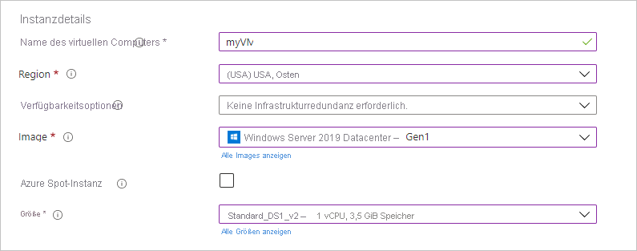

# <a name="quickstart-create-a-windows-virtual-machine-in-the-azure-portal"></a>Schnellstart: Erstellen einer virtuellen Windows-Maschine im Azure-Portal

Virtuelle Azure-Computer (VMs) können über das Azure-Portal erstellt werden. Bei dieser Methode können Sie die browserbasierte Benutzeroberfläche nutzen, um virtuelle Computer und ihre dazugehörigen Ressourcen zu erstellen. In dieser Schnellstartanleitung wird gezeigt, wie Sie über das Azure-Portal einen virtuellen Computer unter Windows Server 2019 in Azure bereitstellen. Wenn Sie den virtuellen Computer in Aktion sehen möchten, stellen Sie anschließend eine RDP-Verbindung mit dem virtuellen Computer her und installieren den IIS-Webserver.

Wenn Sie kein Azure-Abonnement besitzen, können Sie ein [kostenloses Konto](https://azure.microsoft.com/free/?WT.mc_id=A261C142F) erstellen, bevor Sie beginnen.

## <a name="sign-in-to-azure"></a>Anmelden bei Azure

Melden Sie sich unter https://portal.azure.com beim Azure-Portal an.

## <a name="create-virtual-machine"></a>Erstellen eines virtuellen Computers

1. Geben Sie in das Suchfeld **virtuelle Computer** ein.
1. Wählen Sie unter **Dienste** die Option **Virtuelle Computer** aus.
1. Wählen Sie auf der Seite **Virtuelle Computer** die Option **Hinzufügen** und dann **Virtueller Computer** aus. 
1. Stellen Sie auf der Registerkarte **Grundlagen** unter **Projektdetails** sicher, dass das richtige Abonnement ausgewählt ist, und wählen Sie dann **Neu erstellen** für „Ressourcengruppe“ aus. Geben Sie als Namen *myResourceGroup* ein. 

    

1. Geben Sie unter **Instanzdetails***myVM* als **Namen des virtuellen Computers** ein, und wählen Sie *USA, Osten* als Ihre **Region** aus. Wählen Sie unter **Image** die Option *Windows Server 2019 Datacenter* und unter **Größe** die Option *Standard_DS1_v2* aus. Behalten Sie die restlichen Standardwerte bei.

    

1. Geben Sie unter **Administratorkonto** einen Benutzernamen wie *azureuser* an sowie ein Kennwort. Das Kennwort muss mindestens zwölf Zeichen lang sein und die [definierten Anforderungen an die Komplexität](faq.md#what-are-the-password-requirements-when-creating-a-vm) erfüllen.

    

1. Wählen Sie unter **Regeln für eingehende Ports** die Option **Ausgewählte Ports zulassen** aus, und wählen Sie dann **RDP (3389)** und **HTTP (80)** aus der Dropdownliste aus.

    

1. Belassen Sie die übrigen Standardeinstellungen, und wählen Sie dann die Schaltfläche **Überprüfen + erstellen** am unteren Rand der Seite aus.

    

1. Wählen Sie nach der Überprüfung unten auf der Seite die Schaltfläche **Erstellen** aus.

1. Wenn Ihre Bereitstellung abgeschlossen ist, wählen Sie **Go to resource** (Zu Ressource wechseln) aus.

    

## <a name="connect-to-virtual-machine"></a>Herstellen der Verbindung mit dem virtuellen Computer

Erstellen Sie eine Remotedesktopverbindung mit dem virtuellen Computer. In dieser Anleitung wird erläutert, wie Sie über einen Windows-Computer eine Verbindung mit Ihrem virtuellen Computer herstellen. Auf einem Macintosh benötigen Sie einen RDP-Client, z. B. diesen [Remotedesktopclien](https://apps.apple.com/app/microsoft-remote-desktop/id1295203466?mt=12)t aus dem Mac App Store.

1. Wählen Sie auf der Seite „Übersicht“ des virtuellen Computers die Schaltfläche **Verbinden** und dann **RDP** aus. 

    
    
2. Übernehmen Sie auf der Seite **Verbindung mit RDP herstellen** die Standardoptionen, um basierend auf der IP-Adresse eine Verbindung über Port 3389 herzustellen. Klicken Sie anschließend auf **RDP-Datei herunterladen**.

2. Öffnen Sie die heruntergeladene RDP-Datei, und klicken Sie auf **Verbinden**, wenn Sie dazu aufgefordert werden. 

3. Wählen Sie im Fenster **Windows-Sicherheit** die Option **Weitere Optionen** und dann **Anderes Konto verwenden** aus. Geben Sie den Benutzernamen im Format **localhost**\\*Benutzername* sowie das Kennwort ein, das Sie für den virtuellen Computer erstellt haben, und klicken Sie dann auf **OK**.

4. Während des Anmeldevorgangs wird unter Umständen eine Zertifikatwarnung angezeigt. Klicken Sie auf **Ja** oder **Weiter**, um die Verbindung zu erstellen.

## <a name="install-web-server"></a>Installieren des Webservers

Installieren Sie den IIS-Webserver, um den virtuellen Computer in Aktion zu sehen. Öffnen Sie eine PowerShell-Eingabeaufforderung auf dem virtuellen Computer, und führen Sie den folgenden Befehl aus:

```powershell
Install-WindowsFeature -name Web-Server -IncludeManagementTools
```

Beenden Sie anschließend die RDP-Verbindung mit dem virtuellen Computer.


## <a name="view-the-iis-welcome-page"></a>Anzeigen der IIS-Willkommensseite

Wählen Sie im Portal den virtuellen Computer aus, und zeigen Sie in der Übersicht des virtuellen Computers auf die IP-Adresse, um die Option **In Zwischenablage kopieren** anzuzeigen. Kopieren Sie die IP-Adresse, und fügen Sie sie in eine Browserregisterkarte ein. Die Standardbegrüßungsseite für IIS wird geöffnet und sollte wie folgt aussehen:


## <a name="clean-up-resources"></a>Bereinigen von Ressourcen

Wenn Ressourcengruppe, virtueller Computer und alle zugehörigen Ressourcen nicht mehr benötigt werden, können Sie sie löschen. 

Navigieren Sie zu der Ressourcengruppe für den virtuellen Computer, und wählen Sie dann **Ressourcengruppe löschen** aus. Bestätigen Sie dann den Namen der Ressourcengruppe, um das Löschen der Ressourcen abzuschließen.

## <a name="next-steps"></a>Nächste Schritte

In dieser Schnellstartanleitung haben Sie einen einfachen virtuellen Computer bereitgestellt, einen Netzwerkport für den Webdatenverkehr geöffnet und einen einfachen Webserver installiert. Fahren Sie mit dem Tutorial für virtuelle Windows-Computer fort, um weitere Informationen zu virtuellen Azure-Computern zu erhalten.

> [!div class="nextstepaction"]
> [Azure-Tutorials zu virtuellen Windows-Computern](./tutorial-manage-vm.md)
