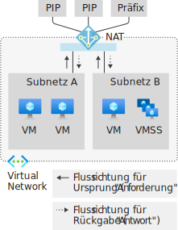
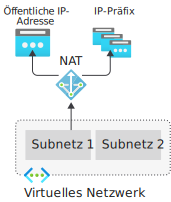
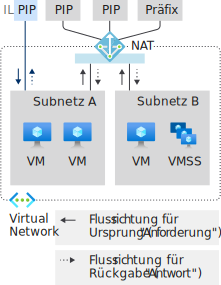
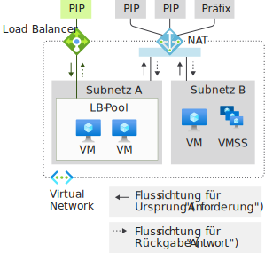
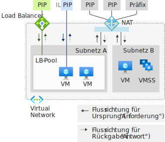
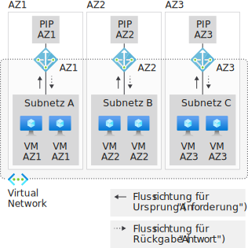
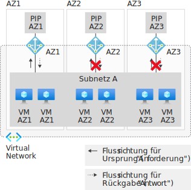
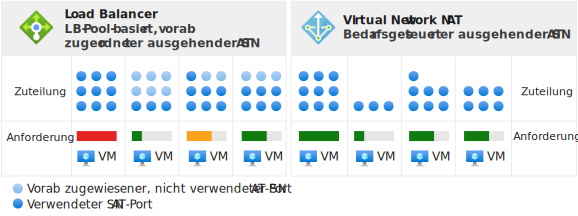
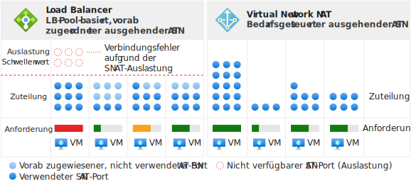

# Entwerfen von virtuellen Netzwerken mit NAT-Gatewayressourcen

NAT-Gatewayressourcen sind Teil von [Virtual Network NAT](nat-overview.md) und stellen die Internetverbindung in ausgehender Richtung für ein oder mehrere Subnetze eines virtuellen Netzwerks bereit. Im Subnetz des virtuellen Netzwerks wird angegeben, welches NAT-Gateway verwendet wird. NAT ermöglicht die „Übersetzung der Quellnetzwerkadresse“ (Source Network Address Translation, SNAT) für ein Subnetz.  Mit NAT-Gatewayressourcen wird angegeben, welche statischen IP-Adressen von virtuellen Computern beim Erstellen ausgehender Datenflüsse verwendet werden. Statische IP-Adressen stammen aus Ressourcen für öffentliche IP-Adressen (PIP), Ressourcen für öffentliche IP-Adresspräfixe oder aus beiden Quellen. Wird eine Präfixressource für öffentliche IP-Adressen verwendet, werden alle IP-Adressen der gesamten Präfixressource für öffentliche IP-Adressen von einer NAT-Gatewayressource genutzt. Für eine NAT-Gatewayressource können für die beiden Quellen jeweils insgesamt bis zu 16 statische IP-Adressen verwendet werden.

  

*Abbildung: Virtual Network NAT für Internetverbindung in ausgehender Richtung*

## Bereitstellen von NAT

Die Konfiguration und Nutzung von NAT-Gateways wurde bewusst einfach gehalten:  

NAT-Gatewayressource:
- Erstellen einer regionalen oder zonenbasierten (nur in einer Zone vorhandenen) NAT-Gatewayressource
- Zuweisen von IP-Adressen
- Ändern des TCP-Leerlauftimeouts bei Bedarf (optional)  Lesen Sie den Abschnitt [Timer](#timers), <ins>bevor</ins> Sie die Standardeinstellung ändern.

Virtuelles Netzwerk:
- Konfigurieren Sie das Subnetz des virtuellen Netzwerks so, dass ein NAT-Gateway verwendet wird.

Benutzerdefinierte Routen sind nicht erforderlich.

## Resource

Bei der Ressource wurde auf einen einfachen Aufbau geachtet. Dies ist im folgenden Azure Resource Manager-Beispiel im Vorlagenformat dargestellt.  Dieses Vorlagenformat ist hier angegeben, um die Konzepte und die Struktur zu verdeutlichen.  Ändern Sie das Beispiel gemäß Ihren Anforderungen.  Dieses Dokument ist nicht als Tutorial gedacht.

Im folgenden Diagramm sind die schreibbaren Verweise zwischen den verschiedenen Azure Resource Manager-Ressourcen dargestellt.  Der Pfeil gibt die Richtung des Verweises an und geht vom schreibbaren Ort aus. Überprüfung 

  

*Abbildung: Virtual Network NAT-Objektmodell*

NAT wird für die meisten Workloads empfohlen, sofern bei Ihnen nicht eine spezifische Abhängigkeit von [poolbasierter Load Balancer-Konnektivität in ausgehender Richtung](../load-balancer/load-balancer-outbound-connections.md) besteht.  

Sie können die Migration von Standardszenarien für den Lastenausgleich, einschließlich [Ausgangsregeln](../load-balancer/load-balancer-outbound-connections.md#outboundrules), zu einem NAT-Gateway durchführen. Verschieben Sie zur Durchführung der Migration die Ressourcen bzw. Präfixressourcen für öffentliche IP-Adressen von den Front-Ends des Lastenausgleichs auf das NAT-Gateway. Neue IP-Adressen für das NAT-Gateway sind nicht erforderlich. Öffentliche Standard-IP-Adressressourcen und die Präfixressource für öffentliche IP-Adressen können wiederverwendet werden, sofern die Gesamtzahl von 16 IP-Adressen nicht überschritten wird. Planen Sie die Migration so, dass die Dienstunterbrechung während der Umstellung berücksichtigt wird.  Sie können die Unterbrechungsdauer verringern, indem Sie den Prozess automatisieren. Testen Sie die Migration zuerst in einer Stagingumgebung.  Während der Umstellung werden Datenflüsse, die ursprünglich in eingehender Richtung erfolgt sind, nicht beeinträchtigt.

Bei dem folgenden Beispiel handelt es sich um einen Ausschnitt aus einer Azure Resource Manager-Vorlage.  Diese Vorlage stellt mehrere Ressourcen bereit, einschließlich eines NAT-Gateways.  In dem Beispiel besitzt die Vorlage folgende Parameter:

- **natgatewayname**: Der Name des NAT-Gateways.
- **location**: Die Azure-Region, in der sich die Ressource befindet.
- **publicipname**: Der Name der öffentlichen IP-Ausgangsadresse, die dem NAT-Gateway zugeordnet ist.
- **vnetname**: Der Name des virtuellen Netzwerks.
- **subnetname** Der Name des Subnetzes, das dem NAT-Gateway zugeordnet ist.

Die Gesamtzahl von IP-Adressen, die von allen IP-Adress- und Präfixressourcen bereitgestellt werden, darf den Höchstwert von 16 IP-Adressen nicht übersteigen. Eine beliebige Anzahl von IP-Adressen zwischen 1 und 16 ist zulässig.

:::code language="json" source="~/quickstart-templates/101-nat-gateway-vnet/azuredeploy.json" range="81-96":::

Nachdem die NAT-Gatewayressource erstellt wurde, kann sie in einem oder mehreren Subnetzen eines virtuellen Netzwerks verwendet werden. Geben Sie an, von welchen Subnetzen diese NAT-Gatewayressource verwendet wird. Ein NAT-Gateway kann nicht für mehr als ein virtuelles Netzwerk gelten. Es ist nicht erforderlich, allen Subnetzen eines virtuellen Netzwerks dasselbe NAT-Gateway zuzuweisen. Die einzelnen Subnetze können mit unterschiedlichen NAT-Gatewayressourcen konfiguriert werden.

Szenarien, für die keine Verfügbarkeitszonen genutzt werden, sind regional (keine Angabe einer Zone). Bei Verwendung von Verfügbarkeitszonen können Sie eine Zone angeben, um NAT in einer bestimmten Zone zu isolieren. Die Zonenredundanz wird nicht unterstützt. Lesen Sie den Artikel über NAT-[Verfügbarkeitszonen](#availability-zones).

:::code language="json" source="~/quickstart-templates/101-nat-gateway-vnet/azuredeploy.json" range="1-146" highlight="81-96":::

NAT-Gateways werden mit einer Eigenschaft in einem Subnetz eines virtuellen Netzwerks definiert. Für Datenflüsse, die von virtuellen Computern im Subnetz **subnetname** des virtuellen Netzwerks **vnetname** erstellt werden, wird das NAT-Gateway verwendet. Für alle ausgehenden Verbindungen werden die IP-Adressen, die **natgatewayname** zugeordnet sind, als Quell-IP-Adresse verwendet.

Weitere Informationen zur in diesem Beispiel verwendeten Azure Resource Manager-Vorlage finden Sie hier:

- [Schnellstart: Erstellen eines NAT-Gateways: Resource Manager-Vorlage](quickstart-create-nat-gateway-template.md)
- [Virtual Network NAT](https://azure.microsoft.com/resources/templates/101-nat-gateway-1-vm/)

## Leitfaden zum Entwurf

Lesen Sie diesen Abschnitt, um sich mit den Aspekten in Bezug auf das Entwerfen virtueller Netzwerke mit NAT vertraut zu machen.  

1. [Kostenoptimierung](#cost-optimization)
1. [Koexistenz von eingehenden und ausgehenden Verbindungen](#coexistence-of-inbound-and-outbound)
2. [Verwalten von „Basic“-Ressourcen](#managing-basic-resources)
3. [Verfügbarkeitszonen](#availability-zones)

### Kostenoptimierung

[Dienstendpunkte](virtual-network-service-endpoints-overview.md) und [Private Link](../private-link/private-link-overview.md) sind zwei Optionen, die beim Optimieren der Kosten berücksichtigt werden sollten. Für diese Dienste ist keine NAT erforderlich. Für Dienstendpunkte oder Private Link bestimmter Datenverkehr wird nicht durch den NAT-Dienst des virtuellen Netzwerks verarbeitet.  

Mit Dienstendpunkten werden Azure-Dienstressourcen an Ihr virtuelles Netzwerk gebunden, und sie dienen zum Steuern des Zugriffs auf Ihre Azure-Dienstressourcen. Verwenden Sie beim Zugreifen auf Azure-Speicher beispielsweise einen Dienstendpunkt für die Speicherung, um NAT-Gebühren für die Datenverarbeitung zu vermeiden. Dienstendpunkte sind kostenlos.

Per Private Link wird der Azure PaaS-Dienst (oder andere mit Private Link gehostete Dienste) als privater Endpunkt in einem virtuellen Netzwerk verfügbar gemacht.  Private Link wird basierend auf der Dauer und den verarbeiteten Daten berechnet.

Evaluieren Sie, ob ein oder beide Ansätze für Ihr Szenario geeignet sind, und nutzen Sie sie je nach Bedarf.

### Koexistenz von eingehenden und ausgehenden Verbindungen

Das NAT-Gateway ist kompatibel mit:

 - Load Balancer Standard
 - Öffentliche IP-Standardadresse
 - Öffentliches IP-Standardpräfix

Beginnen Sie bei der Entwicklung einer neuen Bereitstellung mit Standard-SKUs.

  

*Abbildung: Virtual Network NAT für Internetverbindung in ausgehender Richtung*

Das Szenario mit ausschließlich ausgehender Internetverbindung per NAT-Gateway kann um die Funktionalität für eine eingehende Internetverbindung erweitert werden. Jede Ressource kennt die Richtung, in der ein Datenfluss ausgelöst wird. In einem Subnetz mit einem NAT-Gateway werden alle Szenarien mit ausgehenden Internetverbindungen durch das NAT-Gateway ersetzt. Szenarien mit eingehender Internetverbindung werden von der entsprechenden Ressource bereitgestellt.

#### NAT und VM mit öffentlicher IP-Adresse auf Instanzebene

  

*Abbildung: Virtual Network NAT und VM mit öffentlicher IP-Adresse auf Instanzebene*

| Direction | Resource |
|:---:|:---:|
| Eingehend | VM mit öffentlicher IP-Adresse auf Instanzebene |
| Ausgehend | NAT Gateway |

Von der VM wird das NAT-Gateway für ausgehenden Datenverkehr genutzt.  Ursprünglich eingehender Datenverkehr ist nicht betroffen.

#### NAT und VM mit öffentlichem Load Balancer

  

*Abbildung: Virtual Network NAT und VM mit öffentlichem Load Balancer*

| Direction | Resource |
|:---:|:---:|
| Eingehend | Öffentlicher Load Balancer |
| Ausgehend | NAT Gateway |

Alle Ausgangskonfigurationen einer Lastenausgleichsregel oder von Ausgangsregeln werden durch das NAT-Gateway ersetzt.  Ursprünglich eingehender Datenverkehr ist nicht betroffen.

#### NAT und VM mit öffentlicher IP-Adresse auf Instanzebene und öffentlichem Load Balancer

  

*Abbildung: Virtual Network NAT und VM mit öffentlicher IP-Adresse auf Instanzebene und öffentlichem Load Balancer*

| Direction | Resource |
|:---:|:---:|
| Eingehend | VM mit öffentlicher IP-Adresse auf Instanzebene und öffentlichem Load Balancer |
| Ausgehend | NAT Gateway |

Alle Ausgangskonfigurationen einer Lastenausgleichsregel oder von Ausgangsregeln werden durch das NAT-Gateway ersetzt.  Die VM nutzt auch das NAT-Gateway für ausgehenden Datenverkehr.  Ursprünglich eingehender Datenverkehr ist nicht betroffen.

### Verwalten von „Basic“-Ressourcen

Load Balancer Standard, die öffentliche IP-Adresse und das Präfix für die öffentliche IP-Adresse sind mit dem NAT-Gateway kompatibel. NAT-Gateways werden im Subnetzbereich eingesetzt. Die Basic-SKU dieser Dienste muss in einem Subnetz ohne NAT-Gateway bereitgestellt werden. Diese Trennung ermöglicht es, dass beide SKU-Varianten in demselben virtuellen Netzwerk vorhanden sein können.

NAT-Gateways haben Vorrang vor Ausgangsszenarien des Subnetzes. Load Balancer im Tarif „Basic“ oder die öffentliche IP-Adresse (und viele integrierte verwaltete Dienste) können mit den richtigen Übersetzungen nicht angepasst werden. Das NAT-Gateway übernimmt für ein Subnetz die Kontrolle über den ausgehenden Datenverkehr ins Internet. Der eingehende Datenverkehr zum Load Balancer im Tarif „Basic“ und an die öffentliche IP-Adresse ist nicht verfügbar. Der eingehende Datenverkehr an einen Load Balancer im Tarif „Basic“ oder eine auf einer VM konfigurierten öffentlichen IP-Adresse ist nicht verfügbar.

### Verfügbarkeitszonen

#### Zonenisolation mit Zonenstapeln

  

*Abbildung: Virtual Network NAT mit Zonenisolation: Erstellen mehrerer „Zonenstapel“*

Auch ohne Verfügbarkeitszonen ist NAT resilient und kann mehrere Ausfälle von Infrastrukturkomponenten überstehen.  Verfügbarkeitszonen bauen mit Szenarien zur Zonenisolation für NAT auf dieser Resilienz auf.

Bei virtuellen Netzwerken und den zugehörigen Subnetzen handelt es sich um regionale Konstrukte.  Subnetze sind nicht auf eine Zone beschränkt.

Eine Zonenzusage für die Zonenisolation besteht, wenn sich eine Instanz eines virtuellen Computers mit einer NAT-Gatewayressource in derselben Zone wie die NAT-Gatewayressource und die zugehörigen öffentlichen IP-Adressen befindet. Das für die Zonenisolation empfohlene Muster ist die Erstellung von jeweils einem „Zonenstapel“ pro Verfügbarkeitszone.  Dieser Zonenstapel besteht aus VM-Instanzen, NAT-Gatewayressourcen und öffentlichen IP-Adressen bzw. Präfixressourcen in einem Subnetz, das ausschließlich für dieselbe Zone vorgesehen ist.   Die Vorgänge auf der Steuerungs- und Datenebene sind dann auf die angegebene Zone ausgerichtet und darauf beschränkt. 

Ein Ausfall in einer anderen Zone als Ihrer eigenen Zone sollte keine Auswirkungen auf NAT haben. Für ausgehenden Datenverkehr von virtuellen Computern in derselben Zone tritt aufgrund der Zonenisolation ein Fehler auf.  

#### Integrieren von Endpunkten für eingehenden Datenverkehr

Wenn Sie Endpunkte für eingehenden Datenverkehr benötigen, haben Sie zwei Optionen:

| Option | Muster | Beispiel | Vorteil | Nachteil |
|---|---|---|---|---|
| (1) | Führen Sie die **Ausrichtung** der Endpunkte für eingehenden Datenverkehr mit den jeweiligen **Zonenstapeln** durch, die Sie für ausgehenden Datenverkehr erstellen. | Erstellen Sie eine Load Balancer Standard-Instanz mit Zonen-Front-End. | Gleiches Integritätsmodell und gleicher Fehlermodus für ein- und ausgehenden Datenverkehr. Einfacherer Betrieb. | Einzelne IP-Adressen pro Zone müssen ggf. durch einen gemeinsamen DNS-Namen maskiert werden. |
| (2) | Führen Sie die **Überlagerung** der Zonenstapel mit einem **zonenübergreifenden** Endpunkt für eingehenden Datenverkehr durch. | Erstellen Sie eine Load Balancer Standard-Instanz mit zonenredundantem Front-End. | Nur eine IP-Adresse für den Endpunkt für eingehenden Datenverkehr. | Unterschiede bei Integritätsmodell und Fehlermodus für ein- und ausgehenden Datenverkehr.  Komplexerer Betrieb. |

>[!NOTE]
> Für ein NAT-Gateway mit Zonenisolation müssen die IP-Adressen mit der Zone des NAT-Gateways übereinstimmen. NAT-Gatewayressourcen mit IP-Adressen aus einer anderen Zone oder ohne Zone sind nicht zulässig.

#### Keine Unterstützung von zonenübergreifenden Szenarien für ausgehenden Datenverkehr

  

*Abbildung: Virtual Network NAT ist mit zonenübergreifendem Subnetz nicht kompatibel*

Sie können für NAT-Gatewayressourcen keine Zonenzusage erzielen, wenn VM-Instanzen in mehreren Zonen desselben Subnetzes bereitgestellt werden.   Auch wenn mehrere NAT-Zonengateways an ein Subnetz angefügt sind, weiß die VM-Instanz nicht, welche NAT-Gatewayressource ausgewählt werden soll.

Eine Zonenzusage besteht nicht, wenn a) die Zone einer VM-Instanz und die Zone eines NAT-Zonengateways nicht aufeinander ausgerichtet sind oder b) eine regionale NAT-Gatewayressource mit VM-Zoneninstanzen genutzt wird.

Auch wenn das Szenario scheinbar funktioniert, sind das Integritätsmodell und der Fehlermodus aus Sicht der Verfügbarkeitszone nicht definiert. Erwägen Sie stattdessen, Zonenstapel zu verwenden oder ganz auf Regionen zu setzen.

>[!NOTE]
>Die Zoneneigenschaft einer NAT-Gatewayressource ist nicht veränderlich.  Stellen Sie die NAT-Gatewayressource mit der gewünschten Regions- oder Zonenpräferenz erneut bereit.

>[!NOTE] 
>IP-Adressen allein sind nicht zonenredundant, wenn keine Zone angegeben wird.  Das Front-End einer [Load Balancer Standard-Instanz ist zonenredundant](../load-balancer/load-balancer-standard-availability-zones.md), wenn in einer bestimmten Zone keine IP-Adresse erstellt wird.  Dies gilt nicht für NAT.  Nur die Regions- oder Zonenisolation wird unterstützt.

## Leistung

Jede NAT-Gatewayressource kann einen Durchsatz von bis zu 50 GBit/s bereitstellen. Zum Aufskalieren können Sie Ihre Bereitstellungen in mehrere Subnetze unterteilen und jedem Subnetz oder jeder Gruppe von Subnetzen ein NAT-Gateway zuweisen.

Jedes NAT-Gateway kann 64.000 TCP- bzw. UDP-Datenflüsse pro zugewiesener ausgehender IP-Adresse unterstützen.  Ausführlichere Informationen finden Sie im folgenden Abschnitt zur Übersetzung der Quellnetzwerkadresse (Source Network Address Translation, SNAT). Spezifische Informationen zur Problembehandlung finden Sie im Artikel [Problembehandlung für Azure Virtual Network NAT-Konnektivität](./troubleshoot-nat.md).

## Übersetzung der Quellnetzwerkadresse (Source Network Address Translation, SNAT)

Bei der Übersetzung der Quellnetzwerkadresse (Source Network Address Translation, SNAT) wird die Quelle eines Datenflusses so umgeschrieben, dass dieser von einer anderen IP-Adresse ausgeht.  Für NAT-Gatewayressourcen wird eine Variante von SNAT genutzt, die allgemein als Portadressübersetzung (Port Address Translation, PAT) bezeichnet wird. Bei PAT werden die Quelladresse und der Quellport neu geschrieben. Bei SNAT gibt es keine feste Beziehung zwischen der Anzahl von privaten Adressen und den zugehörigen übersetzten öffentlichen Adressen.  

### Grundlagen

Wir sehen uns ein Beispiel mit vier Datenflüssen an, um das grundlegende Konzept zu beschreiben.  Das NAT-Gateway verwendet die Ressource für öffentliche IP-Adressen 65.52.1.1, und die VM stellt Verbindungen mit 65.52.0.1 her.

| Flow | Quelltupel | Zieltupel |
|:---:|:---:|:---:|
| 1 | 192.168.0.16:4283 | 65.52.0.1:80 |
| 2 | 192.168.0.16:4284 | 65.52.0.1:80 |
| 3 | 192.168.0.17.5768 | 65.52.0.1:80 |

Diese Datenflüsse sehen nach dem PAT-Vorgang ggf. wie folgt aus:

| Flow | Quelltupel | Quelltupel nach SNAT | Zieltupel | 
|:---:|:---:|:---:|:---:|
| 1 | 192.168.0.16:4283 | **65.52.1.1:1234** | 65.52.0.1:80 |
| 2 | 192.168.0.16:4284 | **65.52.1.1:1235** | 65.52.0.1:80 |
| 3 | 192.168.0.17.5768 | **65.52.1.1:1236** | 65.52.0.1:80 |

Dem Ziel wird die Quelle des Datenflusses als 65.52.0.1 (SNAT-Quelltupel) mit dem zugewiesenen Port angezeigt.  Der PAT-Vorgang wie in der obigen Tabelle wird auch als „SNAT mit Portmaskierung“ bezeichnet.  Mehrere private Quellen werden hinter der IP-Adresse und dem Port maskiert.  

#### Wiederverwendung von (SNAT-)Quellports

NAT-Gateways verwenden (SNAT-)Quellports opportunistisch wieder.  Im Folgenden wird dieses Konzept als zusätzlicher Datenfluss neben den obigen Datenflüssen veranschaulicht.  Die VM im Beispiel verfügt über einen Datenfluss zu 65.52.0.2.

| Flow | Quelltupel | Zieltupel |
|:---:|:---:|:---:|
| 4 | 192.168.0.16:4285 | 65.52.0.2:80 |

Ein NAT-Gateway übersetzt Datenfluss 4 wahrscheinlich in einen Port, der auch für andere Ziele verwendet werden kann.  Weitere Informationen zur richtigen Dimensionierung bei der IP-Adressbereitstellung finden Sie unter [Skalierung](#scaling).

| Flow | Quelltupel | Quelltupel nach SNAT | Zieltupel | 
|:---:|:---:|:---:|:---:|
| 4 | 192.168.0.16:4285 | 65.52.1.1:**1234** | 65.52.0.2:80 |

Die Umsetzung der Zuweisung von Quellports im obigen Beispiel ist nicht verbindlich.  Die obige Abbildung enthält nur eine Darstellung des grundlegenden Konzepts.

Die Bereitstellung von SNAT über NAT unterscheidet sich in mehreren Punkten von [Load Balancer](../load-balancer/load-balancer-outbound-connections.md).

### Bei Bedarf

Von NAT werden bedarfsgesteuerte SNAT-Ports für neue ausgehende Datenverkehrsflüsse bereitgestellt. Alle verfügbaren SNAT-Ports des Bestands werden von allen virtuellen Computern in Subnetzen genutzt, für die NAT konfiguriert ist. 

  

*Abbildung: Virtual Network NAT: Bedarfsgesteuerte SNAT in ausgehender Richtung*

Über die IP-Konfiguration eines virtuellen Computers können je nach Bedarf Datenflüsse in ausgehender Richtung erstellt werden.  Eine Vorabzuteilung (Planung pro Instanz mit Überbereitstellung für Notfälle) ist nicht erforderlich.  

  

*Abbildung: Unterschiede bei Auslastungsszenarien*

Nach der Freigabe eines SNAT-Ports kann dieser von allen virtuellen Computern in Subnetzen genutzt werden, für die NAT konfiguriert ist.  Bei der bedarfsgesteuerten Zuteilung können SNAT-Ports von dynamischen und divergenten Workloads in Subnetzen je nach Bedarf genutzt werden.  Solange ein Bestand an SNAT-Ports verfügbar ist, sind SNAT-Datenflüsse erfolgreich. SNAT-Port-Hotspots profitieren dagegen von einem größeren Bestand. SNAT-Ports bleiben für virtuelle Computer, die diese nicht aktiv benötigen, nicht ungenutzt.

### Skalierung

Die Skalierung von NAT ist hauptsächlich eine Funktion, bei der es um die Verwaltung des freigegebenen verfügbaren SNAT-Portbestands geht. Für NAT ist ein ausreichender Bestand an SNAT-Ports erforderlich, um für alle Subnetze einer NAT-Gatewayressource die erwartete Spitzenlast für ausgehende Datenflüsse abdecken zu können.  Sie können öffentliche IP-Adressressourcen, öffentliche IP-Präfixressourcen oder beides verwenden, um einen Bestand an SNAT-Ports zu erstellen.  

>[!NOTE]
>Wenn Sie eine Präfixressource für öffentliche IP-Adressen zuweisen, wird das gesamte Präfix für öffentliche IP-Adressen verwendet.  Sie können keine Präfixressource für öffentliche IP-Adressen zuweisen und dann einzelne IP-Adressen anderen Ressourcen zuweisen.  Wenn Sie einzelne IP-Adressen aus einem Präfix für öffentliche IP-Adressen mehreren Ressourcen zuweisen möchten, müssen Sie einzelne öffentliche IP-Adressen aus der Präfixressource für öffentliche IP-Adressen erstellen und sie bei Bedarf anstelle dieser Präfixressource zuweisen.

Bei SNAT werden private Adressen mindestens einer öffentlichen IP-Adresse zugeordnet. Hierbei werden die Quelladresse und der Quellport neu erstellt. Für eine NAT-Gatewayressource werden für diesen Übersetzungsvorgang 64.000 Ports (SNAT-Ports) pro konfigurierter öffentlicher IP-Adresse verwendet. NAT-Gatewayressourcen können auf bis zu 16 IP-Adressen und 1 Million SNAT-Ports hochskaliert werden. Wenn eine öffentliche IP-Präfixressource bereitgestellt wird, wird für jede IP-Adresse des Präfixbereichs ein Bestand an SNAT-Ports angelegt. Wenn Sie weitere öffentliche IP-Adressen hinzufügen, wird die Anzahl von verfügbaren SNAT-Ports des Bestands erhöht. Für TCP und UDP werden separate SNAT-Portbestände verwendet, die nicht miteinander in Beziehung stehen.

NAT-Gatewayressourcen verwenden (SNAT-)Quellports opportunistisch wieder. Als Orientierung beim Entwurf sollten Sie für Skalierungszwecke davon ausgehen, dass für jeden Datenfluss ein neuer SNAT-Port benötigt wird, und die Gesamtanzahl von verfügbaren IP-Adressen für ausgehenden Datenverkehr entsprechend skalieren.  Sie sollten die geplante Größe sorgfältig berücksichtigen und eine entsprechende Anzahl von IP-Adressen bereitstellen.

SNAT-Ports für verschiedene Ziele werden höchstwahrscheinlich nach Möglichkeit wiederverwendet, und wenn die SNAT-Ports fast ausgelastet sind, tritt für die Datenflüsse möglicherweise ein Fehler auf.  

Weitere Informationen finden Sie z. B. im Abschnitt über [SNAT-Grundlagen](#source-network-address-translation).

### Protokolle

NAT-Gatewayressourcen interagieren mit IP- und IP-Transportheadern von UDP- und TCP-Datenflüssen und sind gegenüber Nutzlasten auf Anwendungsebene agnostisch.  Andere IP-Protokolle werden nicht unterstützt.

### Timer

>[!IMPORTANT]
>Ein hoher Wert für den Leerlauftimer kann dazu führen, dass die Wahrscheinlichkeit einer SNAT-Überlastung unnötigerweise zunimmt. Je höher der von Ihnen angegebene Timerwert ist, desto länger werden die SNAT-Ports vom NAT-Vorgang belegt, bis der Zeitpunkt für das Leerlauftimeout erreicht ist. Wenn für Ihre Datenflüsse das Leerlauftimeout erreicht wurde, tritt hierfür sowieso ein Fehler auf, und es kommt zu einem unnötigen Verbrauch von SNAT-Ports aus dem Bestand.  Für Datenflüsse, für die nach zwei Stunden ein Fehler auftritt, wäre dies auch nach dem Standardzeitraum von vier Minuten der Fall gewesen. Die Verlängerung des Zeitraums für das Leerlauftimeout ist nur das letzte Mittel, das Sie sehr sparsam einsetzen sollten. Wenn sich ein Datenfluss niemals im Leerlaufzustand befindet, wird er durch das Leerlauftimeout nicht beeinträchtigt.

Das TCP-Leerlauftimeout kann für alle Datenflüsse auf einen Wert zwischen vier Minuten (Standardwert) und 120 Minuten (2 Stunden) festgelegt werden.  Darüber hinaus können Sie den Leerlaufzeitgeber mit Datenverkehr im Datenfluss zurücksetzen.  Ein empfohlenes Muster zur Aktualisierung von Verbindungen mit langer Leerlaufzeit und zur Erkennung des Livezustands von Endpunkten sind TCP-Keep-Alives.  TCP-Keep-Alives werden als doppelte ACK-Vorgänge für die Endpunkte angezeigt und sind mit geringem Aufwand verbunden und für die Anwendungsschicht unsichtbar.

Die folgenden Zeitgeber werden für die Freigabe von SNAT-Ports verwendet:

| Zeitgeber | Wert |
|---|---|
| TCP FIN (TCP-Beendigung) | 60 Sekunden |
| TCP RST (TCP-Zurücksetzung) | 10 Sekunden |
| TCP half open (TCP halb geöffnet) | 30 Sekunden |

Ein SNAT-Port ist für eine IP-Zieladresse und den entsprechenden Zielport nach fünf Sekunden bereit für die Wiederverwendung.

>[!NOTE] 
>Diese Zeitgebereinstellungen können sich ändern. Die Werte sind hier nur als Hilfe bei der Problembehandlung angegeben, und Sie sollten noch keine Abhängigkeit von bestimmten Zeitgebern einrichten.

## Einschränkungen

- NAT ist mit öffentlichen IP-Adressen, Präfixen für öffentliche IP-Adressen und Lastenausgleichsressourcen der Standard-SKU kompatibel.   Basic-Ressourcen (z. B. Load Balancer im Tarif „Basic“) und alle davon abgeleiteten Produkte sind nicht mit NAT kompatibel.  Basic-Ressourcen müssen in einem Subnetz angeordnet sein, für das NAT nicht konfiguriert ist.
- Die Familie der IPv4-Adressen wird unterstützt.  NAT interagiert nicht mit der Familie der IPv6-Adressen.  Die NAT kann nicht in einem Subnetz mit IPv6-Präfix bereitgestellt werden.
- NAT kann übergreifend für mehrere virtuelle Netzwerke genutzt werden.
- Die IP-Fragmentierung wird nicht unterstützt.

## Vorschläge

Wir möchten wissen, wie wir den Dienst verbessern können. Fehlt eine Funktion? Unter [UserVoice für NAT](https://aka.ms/natuservoice) können Sie uns Ihre Wünsche zukommen lassen.

## Nächste Schritte

* Informieren Sie sich über [Virtual Network NAT](nat-overview.md).
* Informieren Sie sich über [Metriken und Warnungen für NAT-Gatewayressourcen](nat-metrics.md).
* Informieren Sie sich über die [Problembehandlung im Zusammenhang mit der Azure Virtual Network NAT-Konnektivität](troubleshoot-nat.md).
