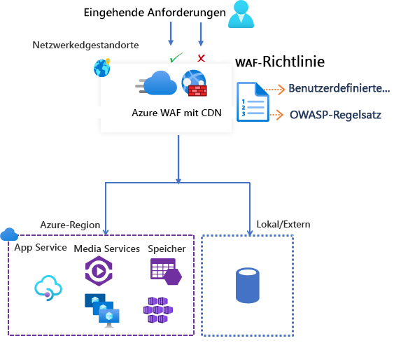

# Azure Web Application Firewall in Azure Content Delivery Network

Azure Web Application Firewall (WAF) in Azure Content Delivery Network (CDN) von Microsoft ermöglicht einen zentralen Schutz für Ihre Webinhalte. WAF schützt Ihre Webdienste von gängigen Exploits und Sicherheitsrisiken. Die Lösung gewährleistet eine hohe Verfügbarkeit Ihres Diensts für Benutzer und unterstützt Sie bei der Erfüllung von Complianceanforderungen.

> [!IMPORTANT]
> WAF in Azure CDN von Microsoft befindet sich derzeit in der öffentlichen Vorschauphase und wird mit einer Vorschau-SLA (Vereinbarung zum Servicelevel) bereitgestellt. Manche Features werden möglicherweise nicht unterstützt oder sind nur eingeschränkt verwendbar.  Weitere Informationen finden Sie unter [Ergänzende Nutzungsbedingungen für Microsoft Azure-Vorschauversionen](https://azure.microsoft.com/support/legal/preview-supplemental-terms/).

WAF in Azure CDN ist eine globale und zentrale Lösung. Sie wird an Edgestandorten des Azure-Netzwerks auf der ganzen Welt bereitgestellt. Per WAF werden schädliche Angriffe in der Nähe der Angriffsquellen gestoppt, bevor sie Ihren Ursprungsort erreichen. Sie erhalten globalen bedarfsgerechten Schutz ohne Leistungseinbußen. 

Mit einer WAF-Richtlinie kann leicht eine Verknüpfung mit jedem CDN-Endpunkt Ihres Abonnements hergestellt werden. Neue Regeln lassen sich innerhalb weniger Minuten bereitstellen, um schnell auf veränderte Bedrohungsmuster zu reagieren.

## WAF-Richtlinien und -Regeln

Sie können eine WAF-Richtlinie konfigurieren und diese Richtlinie zu Schutzzwecken einem oder mehreren CDN-Endpunkten zuordnen. Eine WAF-Richtlinie besteht aus zwei verschiedenen Arten von Sicherheitsregeln:

- Benutzerdefinierte Regeln, die Sie erstellen können

- Verwaltete Regelsätze, bei denen es sich um eine Sammlung mit vorkonfigurierten Regelsätzen handelt, die von Azure verwaltet werden

Wenn beides vorhanden ist, werden die benutzerdefinierten Regeln vor den Regeln eines verwalteten Regelsatzes verarbeitet. Eine Regel besteht aus einer Übereinstimmungsbedingung, einer Priorität und einer Aktion. Folgende Aktionstypen werden unterstützt: *ALLOW*, *BLOCK*, *LOG* und *REDIRECT* (ZULASSEN, BLOCKIEREN, PROTOKOLLIEREN und UMLEITEN). Sie können eine vollständig angepasste Richtlinie erstellen, die Ihre speziellen Anforderungen an die Anwendungssicherheit erfüllt, indem Sie verwaltete und benutzerdefinierte Regeln kombinieren.

Die Regeln innerhalb einer Richtlinie werden nach Priorität verarbeitet. Bei der Priorität handelt es sich um eine eindeutige Zahl, die die Reihenfolge der Regelverarbeitung angibt. Niedrigere Zahlen weisen auf eine höhere Priorität hin, und die entsprechenden Regeln werden vor Regeln mit höheren Zahlen ausgewertet. Sobald eine Übereinstimmung mit einer Regel erkannt wird, wird die entsprechende Aktion, die in der Regel definiert wurde, auf die Anforderung angewendet. Nach der Verarbeitung einer derartigen Übereinstimmung werden Regeln mit niedrigerer Priorität nicht weiter verarbeitet.

Einer in Azure CDN gehosteten Webanwendung kann jeweils nur eine WAF-Richtlinie zugeordnet werden. Sie können aber auch einen CDN-Endpunkt verwenden, dem keine WAF-Richtlinien zugeordnet sind. Ist eine WAF-Richtlinie vorhanden, wird sie in allen unseren Edgestandorten repliziert, um bei den Sicherheitsrichtlinien auf der ganzen Welt Konsistenz zu gewährleisten.

## WAF-Modi

Für die Ausführung der WAF-Richtlinie können die beiden folgenden Modi konfiguriert werden:

- *Erkennungsmodus*: Im Erkennungsmodus überwacht WAF nur die Anforderung und die entsprechende WAF-Regel und protokolliert die Ergebnisse im WAF-Protokoll. Es werden keine weiteren Aktionen ausgeführt. Sie können die Protokollierung von Diagnosedaten für CDN aktivieren. Navigieren Sie bei Verwendung des Portals zum Abschnitt **Diagnose**.

- *Schutzmodus*: Im Schutzmodus führt WAF die angegebene Aktion aus, wenn eine Anforderung einer Regel entspricht. Nachdem eine Entsprechung gefunden wurde, werden keine weiteren Regeln mit niedrigerer Priorität mehr ausgewertet. Jede Anforderung mit einer Regelübereinstimmung wird außerdem in den WAF-Protokollen protokolliert.

## WAF-Aktionen

Sie können eine der folgenden Aktionen auswählen, wenn für eine Anforderung die Bedingungen einer Regel erfüllt sind:

- *Zulassen*: Die Anforderung passiert die WAF und wird an das Back-End weitergeleitet. Diese Anforderung kann mit Regeln niedrigerer Priorität nicht mehr gesperrt werden.
- *Blockieren*: Die Anforderung wird gesperrt. WAF sendet eine Antwort an den Client, ohne die Anforderung an das Back-End weiterzuleiten.
- *Log*:  Die Anforderung wird in den WAF-Protokollen protokolliert, und WAF setzt den Vorgang mit dem Auswerten von Regeln mit niedrigerer Priorität fort.
- *Redirect*: WAF leitet die Anforderung an den angegebenen URI weiter. Der URI wird als Einstellung auf Richtlinienebene angegeben. Nach der Konfiguration werden alle Anforderungen, die der Aktion *REDIRECT* entsprechen, an diesen URI gesendet.

## WAF-Regeln

Eine WAF-Richtlinie kann aus zwei verschiedenen Arten von Sicherheitsregeln bestehen:

- *Benutzerdefinierte Regeln*: Dies sind Regeln, die Sie selbst erstellen. 
- *Verwaltete Regelsätze*: Von Azure verwaltete vorkonfigurierte Regelsätze.

### Benutzerdefinierte Regeln

Benutzerdefinierte Regeln können über Übereinstimmungsregeln und Regeln für die Ratensteuerung verfügen.

Sie können die folgenden benutzerdefinierten Übereinstimmungsregeln konfigurieren:

- *Liste mit zugelassenen und gesperrten IP-Adressen*: Sie können den Zugriff auf Ihre Webanwendungen auf der Grundlage einer Liste von Client-IP-Adressen (oder IP-Adressbereichen) steuern. Unterstützt werden sowohl IPv4- als auch IPv6-Adresstypen. Diese Liste können Sie so konfigurieren, dass Anforderungen, deren Quell-IP-Adresse mit einer IP-Adresse in der Liste übereinstimmt, entweder gesperrt oder zugelassen werden.

- *Geografiebasierte Zugriffssteuerung*: Sie können den Zugriff auf Ihre Webanwendungen anhand des Ländercodes einer IP-Clientadresse steuern.

- *Zugriffssteuerung auf Basis von HTTP-Parametern*: Sie können Zeichenfolgenübereinstimmungen in HTTP/HTTPS-Anforderungsparametern als Grundlage für Regeln verwenden.  Hierzu zählen beispielsweise Abfragezeichenfolgen, POST-Argumente, Anforderungs-URI, Anforderungsheader und Anforderungstext.

- *Zugriffssteuerung auf Basis der Anforderungsmethode*: Sie können Regeln verwenden, die auf der HTTP-Anforderungsmethode der Anforderung basieren. Beispiel wären etwa GET, PUT und HEAD.

- *Größenbeschränkung*: Sie können Regeln verwenden, die auf der Länge bestimmter Teile einer Anforderung (Abfragezeichenfolge, URI, Anforderungstext oder Ähnliches) basieren.

Mit einer Regel für die Ratensteuerung kann außergewöhnlich hoher Datenverkehr von einer beliebigen IP-Clientadresse eingeschränkt werden.

- *Ratenbegrenzungsregeln*: Sie können einen Schwellenwert für die Anzahl von Webanforderungen konfigurieren, die von einer IP-Clientadresse während einer Dauer von einer Minute zulässig sind. Diese Regel unterscheidet sich von der benutzerdefinierten Regel mit einer Liste zugelassener oder gesperrter IP-Adressen, bei der alle Anforderungen von einer IP-Clientadresse entweder zugelassen oder blockiert werden. Für eine präzise Ratensteuerung kann die Ratenbegrenzung mit weiteren Übereinstimmungsbedingungen (etwa mit HTTP(S)-Parametern) kombiniert werden.

### Von Azure verwaltete Regelsätze

Von Azure verwaltete Regelsätze bieten eine einfache Möglichkeit zum Bereitstellen von Schutz vor allgemeinen Sicherheitsbedrohungen. Da Azure diese Regelsätze verwaltet, werden die Regeln zum Schutz vor neuen Angriffssignaturen aktualisiert, wenn dies erforderlich ist. Der von Azure verwaltete Standardregelsatz enthält Regeln für die folgenden Bedrohungskategorien:

- Cross-Site-Scripting
- Java-Angriffe
- Local File Inclusion
- PHP Code-Injection
- Remotebefehlsausführung
- Remote File Inclusion
- Session Fixation
- Schutz vor Einschleusung von SQL-Befehlen
- Protokollangreifer

Die Versionsnummer des Standardregelsatzes wird erhöht, wenn dem Regelsatz neue Angriffssignaturen hinzugefügt werden.
Der Standardregelsatz wird in den WAF-Richtlinien standardmäßig im Modus *Erkennung* aktiviert. Sie können einzelne Regeln im Standardregelsatz deaktivieren bzw. aktivieren, um die Anforderungen Ihrer Anwendungen zu erfüllen. Sie können pro Regel auch bestimmte Aktionen (ALLOW/BLOCK/REDIRECT/LOG) festlegen. Die Standardaktion für den verwalteten Standardregelsatz ist *Block* (Blockieren).

Benutzerdefinierte Regeln werden immer vor den Regeln im Standardregelsatz ausgewertet. Wenn eine Anforderung einer benutzerdefinierten Regel entspricht, wird die entsprechende Regelaktion angewendet. Die Anforderung wird entweder gesperrt oder an das Back-End weitergeleitet. Es werden keine weiteren benutzerdefinierten Regeln oder Regeln im Standardregelsatz verarbeitet. Der Standardregelsatz kann auch aus WAF-Richtlinien entfernt werden.

## Konfiguration

Alle Arten von WAF-Regeln können über das Azure-Portal, mithilfe von REST-APIs, unter Verwendung von Azure Resource Manager-Vorlagen und per Azure PowerShell konfiguriert und bereitgestellt werden.

## Überwachung

Die Überwachung für WAF mit CDN ist in Azure Monitor integriert und dient zum Nachverfolgen von Warnungen und zum einfachen Überwachen von Datenverkehrstrends.

## Nächste Schritte

- [Tutorial: Erstellen einer WAF-Richtlinie mit Azure CDN über das Azure-Portal](waf-cdn-create-portal.md)
