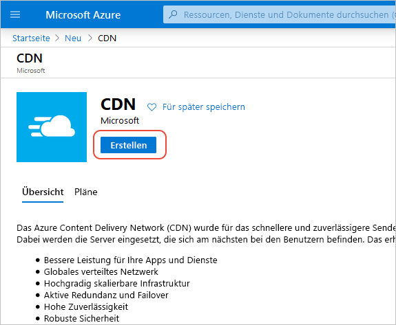
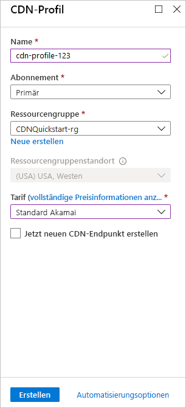

## Erstellen eines neuen CDN-Profils

Ein CDN-Profil ist ein Container für CDN-Endpunkte und gibt einen Tarif an.

1. Wählen Sie im Azure-Portal die Option **Ressource erstellen** aus (links oben). Der Bereich **Neu** wird angezeigt.
   
1. Suchen Sie nach **CDN**, und wählen Sie diese Option und dann **Erstellen** aus:
   
    

    Der Bereich **CDN-Profil** wird angezeigt.

1. Geben Sie die folgenden Werte ein:
   
    | Einstellung  | Wert |
    | -------- | ----- |
    | **Name** | Geben Sie *cdn-profile-123* als Profilnamen ein. |
    | **Abonnement** | Wählen Sie in der Dropdownliste ein Azure-Abonnement aus. |
    | **Ressourcengruppe** | Wählen Sie **Neu erstellen** aus, und geben Sie *CDNQuickstart-rg* als Namen für Ihre Ressourcengruppe ein. Wählen Sie alternativ **Vorhandene verwenden** und dann *CDNQuickstart-rg* aus, falls die Gruppe bereits vorhanden ist. | 
    | **Ressourcengruppenstandort** | Wählen Sie in der Dropdownliste einen Standort in Ihrer Nähe aus. |
    | **Preisstufe** | Wählen Sie in der Dropdownliste eine **Akamai Standard**-Option aus. (Die Bereitstellungsdauer für den Akamai-Tarif beträgt ungefähr eine Minute. Für den Microsoft-Tarif werden ca. zehn Minuten benötigt, und für die Verizon-Tarife ca. 30 Minuten.) |
    | **Jetzt neuen CDN-Endpunkt erstellen** | Lassen Sie das Kontrollkästchen deaktiviert. |  
   
    

1. Wählen Sie **Erstellen**, um das Profil zu erstellen.

