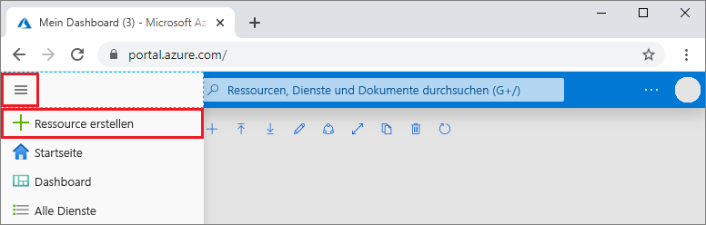
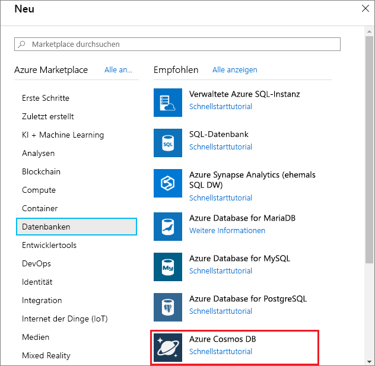
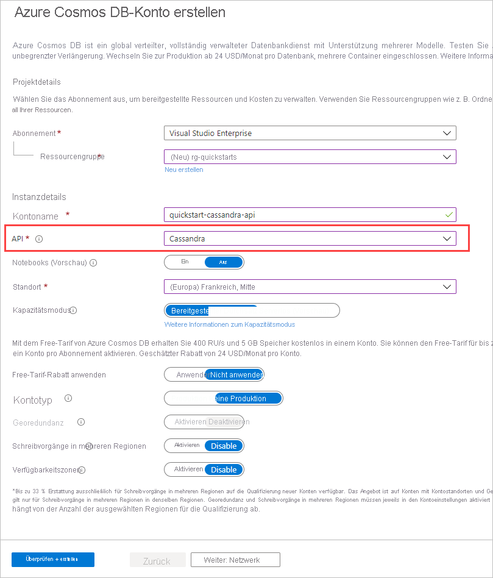

1. Melden Sie sich in einem neuen Browserfenster beim [Azure-Portal](https://portal.azure.com/) an.

2. Wählen Sie im Menü auf der linken Seite **Ressource erstellen** aus.
   
   
   
3. Wählen Sie auf der Seite **Neu** die Optionen **Datenbanken** > **Azure Cosmos DB** aus.
   
   
   
3. Geben Sie auf der Seite **Azure Cosmos DB-Konto erstellen** die Einstellungen für das neue Azure Cosmos DB-Konto ein: 
 
    Einstellung|Wert|BESCHREIBUNG
    ---|---|---
    Subscription|Ihr Abonnement|Wählen Sie das Azure-Abonnement aus, das Sie für dieses Azure Cosmos DB-Konto verwenden möchten. 
    Ressourcengruppe|Neu erstellen  Geben Sie dann den gleichen Namen als Kontonamen ein.|Wählen Sie **Neu erstellen**. Geben Sie dann einen neuen Ressourcengruppenname für Ihr Konto ein. Verwenden Sie der Einfachheit halber den gleichen Namen als Azure Cosmos-Kontonamen. 
    Kontoname|Geben Sie einen eindeutigen Namen ein.|Geben Sie einen eindeutigen Namen ein, der Ihr Azure Cosmos DB-Konto identifiziert. Der Konto-URI lautet *cassandra.cosmos.azure.com* und wird an Ihren eindeutigen Kontonamen angehängt.  Der Kontoname darf nur Kleinbuchstaben, Ziffern und Bindestriche (-) enthalten und muss zwischen 3 und 31 Zeichen lang sein.
    API|Cassandra|Die API bestimmt den Typ des zu erstellenden Kontos. Azure Cosmos DB stellt fünf APIs bereit: Kern-API (SQL) für Dokumentdatenbanken, Gremlin-API für Graphdatenbanken, MongoDB-API für Dokumentdatenbanken, Azure-Tabellen-API und Cassandra-API. Sie müssen ein separates Konto für jede API erstellen.   Wählen Sie **Cassandra** aus, da Sie in diesem Schnellstart eine Tabelle erstellen, die mit der Cassandra-API verwendet werden kann.   [Weitere Informationen zur Cassandra-API](../articles/cosmos-db/cassandra-introduction.md)|
    Position|Wählen Sie die Region aus, die Ihren Benutzern am nächsten liegt.|Wählen Sie einen geografischen Standort aus, an dem Ihr Azure Cosmos DB-Konto gehostet werden soll. Verwenden Sie einen Standort, der Ihren Benutzern am nächsten liegt, um ihnen einen schnellen Zugriff auf die Daten zu gewähren.
    Kapazitätsmodus|„Bereitgestellter Durchsatz“ oder „Serverlos“|Wählen Sie **Bereitgestellter Durchsatz** aus, um ein Konto im Modus [Bereitgestellter Durchsatz](../articles/cosmos-db/set-throughput.md) zu erstellen. Wählen Sie **Serverlos** aus, um ein Konto im Modus [Serverlos](../articles/cosmos-db/serverless.md) zu erstellen.

    Wählen Sie **Bewerten + erstellen** aus. Sie können die Abschnitte **Netzwerk** , **Sicherung** , **Verschlüsselung** und **Tags** überspringen. 

    

4. Die Kontoerstellung dauert einige Minuten. Warten Sie, bis im Portal die Seite **Herzlichen Glückwunsch! Ihr Azure Cosmos DB-Konto wurde erstellt** angezeigt wird.

