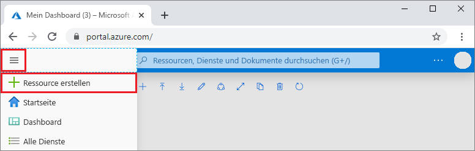
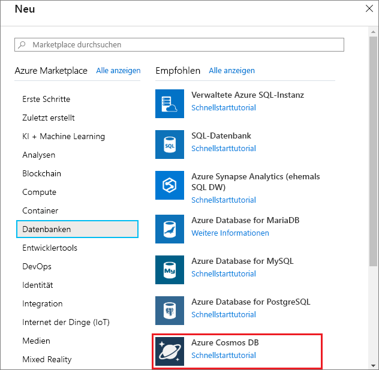
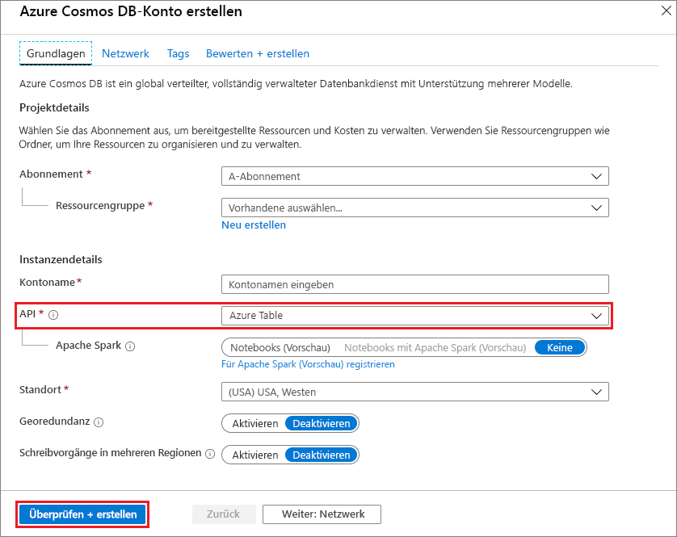
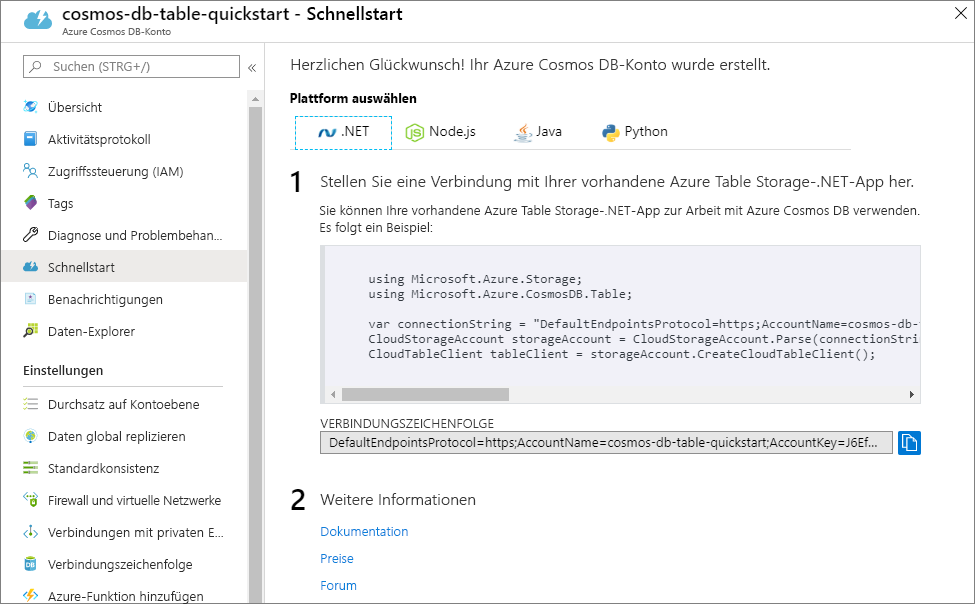

1. Melden Sie sich in einem neuen Browserfenster beim [Azure-Portal](https://portal.azure.com/) an.

2. Wählen Sie im Menü auf der linken Seite **Ressource erstellen** aus.
   
   
   
3. Wählen Sie auf der Seite **Neu** die Optionen **Datenbanken** > **Azure Cosmos DB** aus.
   
   
   
3. Geben Sie auf der Seite **Azure Cosmos DB-Konto erstellen** die Einstellungen für das neue Azure Cosmos DB-Konto ein: 
 
    Einstellung|value|Beschreibung
    ---|---|---
    Subscription|Ihr Abonnement|Wählen Sie das Azure-Abonnement aus, das Sie für dieses Azure Cosmos DB-Konto verwenden möchten. 
    Ressourcengruppe|**Neu erstellen**, dann Kontoname|Wählen Sie **Neu erstellen**. Geben Sie dann einen neuen Ressourcengruppenname für Ihr Konto ein. Verwenden Sie der Einfachheit halber den gleichen Namen als Azure Cosmos DB-Kontonamen. 
    Kontoname|Ein eindeutiger Name|Geben Sie einen eindeutigen Namen ein, der Ihr Azure Cosmos DB-Konto identifiziert.  Der Kontoname darf nur Kleinbuchstaben, Ziffern und Bindestriche (-) enthalten und muss zwischen 3 und 31 Zeichen lang sein.
    API|Tabelle|Die API bestimmt den Typ des zu erstellenden Kontos. Azure Cosmos DB stellt fünf APIs bereit: Kern-API (SQL) für Dokumentdatenbanken, Gremlin-API für Graphdatenbanken, MongoDB-API für Dokumentdatenbanken, Azure-Tabellen-API und Cassandra-API. Sie müssen ein separates Konto für jede API erstellen.   Wählen Sie **Azure Table** aus, da Sie mit dieser Schnellstartanleitung eine Tabelle erstellen, die mit der Tabellen-API verwendet werden kann.   [Weitere Informationen zur Tabellen-API](../articles/cosmos-db/table-introduction.md)|
    Location|Die Region, die Ihren Benutzern am nächsten liegt|Wählen Sie einen geografischen Standort aus, an dem Ihr Azure Cosmos DB-Konto gehostet werden soll. Verwenden Sie einen Standort, der Ihren Benutzern am nächsten liegt, um ihnen einen schnellen Zugriff auf die Daten zu gewähren.

    Sie können für die Optionen **Georedundanz** und **Schreibvorgänge in mehreren Regionen** die Standardwerte beibehalten (**Deaktivieren**), um zusätzliche Gebühren zu vermeiden, und die Abschnitte **Netzwerk** und **Tags** überspringen.

5. Wählen Sie **Bewerten + erstellen** aus. Wählen Sie nach Abschluss der Validierung **Erstellen** aus, um das Konto zu erstellen. 
 
   

6. Die Erstellung des Kontos dauert einige Minuten. Es wird folgende Meldung angezeigt: **Ihre Bereitstellung wird ausgeführt**. Warten Sie, bis die Bereitstellung abgeschlossen ist, und wählen Sie dann **Zu Ressource wechseln** aus.

    

