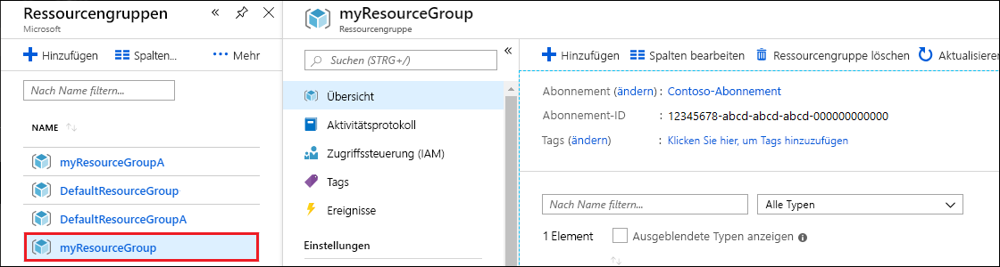

Wenn Sie Ihre App und das Azure Cosmos DB-Konto fertiggestellt haben, können Sie die erstellten Azure-Ressourcen löschen, damit keine weiteren Gebühren anfallen. So löschen Sie die Ressourcen:

1. Suchen Sie über die Suchleiste des Azure-Portals nach **Ressourcengruppen**, und wählen Sie die entsprechende Option aus.

2. Wählen Sie in der Liste die Ressourcengruppe aus, die Sie für diesen Schnellstart erstellt haben.  

   

2. Wählen Sie auf der Seite **Übersicht** der Ressourcengruppe die Option **Ressourcengruppe löschen** aus.

      

3. Geben Sie in dem nächsten Fenster den Namen der zu löschenden Ressourcengruppe ein, und wählen Sie dann **Löschen** aus.

