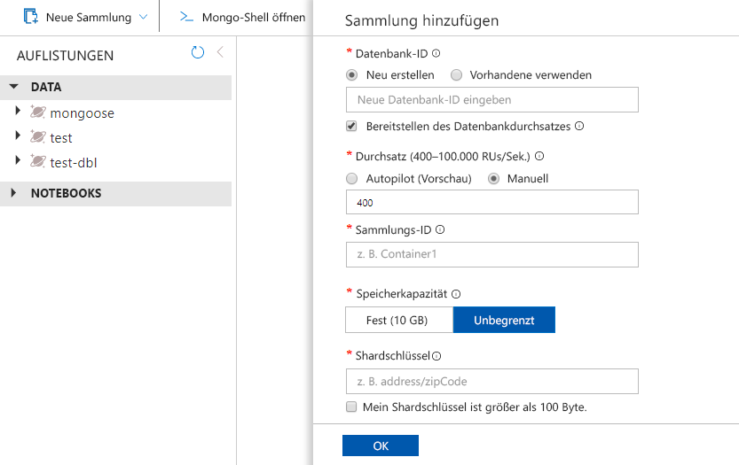

Sie können jetzt das Data Explorer-Tool im Azure-Portal verwenden, um die API einer Azure Cosmos DB für die MongoDB-Datenbank und den Container zu erstellen. 

1. Wählen Sie **Daten-Explorer** > **Neuer Container** aus. 
    
    Der Bereich **Container hinzufügen** wird ganz rechts angezeigt. Möglicherweise müssen Sie nach rechts scrollen, damit Sie ihn sehen.

    

2. Geben Sie auf der Seite **Container hinzufügen** die Einstellungen für den neuen Container ein.

    |Einstellung|Vorgeschlagener Wert|BESCHREIBUNG
    |---|---|---|
    |**Datenbank-ID**|db|Geben Sie *db* als Namen für die neue Datenbank ein. Datenbanknamen müssen zwischen 1 und 255 Zeichen lang sein und dürfen weder `/, \\, #, ?` noch nachgestellte Leerzeichen enthalten. Aktivieren Sie die Option **Provision database throughput** (Datenbankdurchsatz bereitstellen). Diese Option ermöglicht es Ihnen, den für die Datenbank bereitgestellten Durchsatz auf alle Container in der Datenbank zu verteilen. Darüber hinaus hilft sie Ihnen dabei, Kosten zu sparen. |
    |**Durchsatz**|400|Belassen Sie den Durchsatz bei 400 Anforderungseinheiten pro Sekunde (RU/s). Sie können den Durchsatz später hochskalieren, wenn Sie Wartezeiten reduzieren möchten. Sie können auch den [Autoskalierungsmodus](https://docs.microsoft.com/azure/cosmos-db/provision-throughput-autoscale) auswählen, der Ihnen einen RU/s-Bereich bietet, der sich je nach Bedarf dynamisch vergrößert und verkleinert.| 
    |**Sammlungs-ID**|coll|Geben Sie `coll` als Namen für den neuen Container ein. Für Container-IDs gelten dieselben Zeichenanforderungen wie für Datenbanknamen.|
    |**Speicherkapazität**|Fest (10 GB)|Geben Sie *Fest (10 GB)* für diese Anwendung ein. Wenn Sie *Unbegrenzt* auswählen, müssen Sie einen `Shard Key` erstellen, den alle eingefügten Elemente benötigen.|
    |**Shardschlüssel**| /_id| Das in diesem Artikel beschriebene Beispiel verwendet keinen Shardschlüssel. Wenn Sie es also auf */_id* festlegen, wird das automatisch generierte ID-Feld als Shardschlüssel verwendet. Weitere Informationen zum Sharding, auch als Partitionierung bekannt, finden Sie in [Partitionierung in Azure Cosmos DB](https://docs.microsoft.com/azure/cosmos-db/partitioning-overview)|
        
    Klicken Sie auf **OK**. Im Daten-Explorer werden die neue Datenbank und der neue Container angezeigt.
