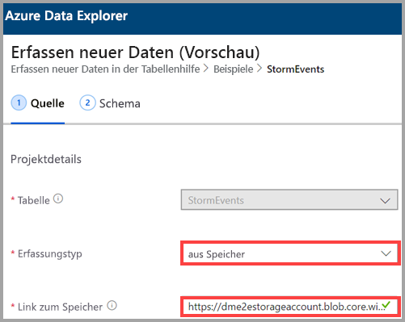
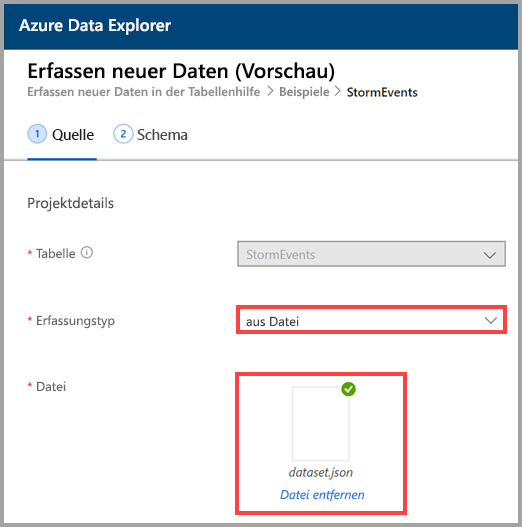
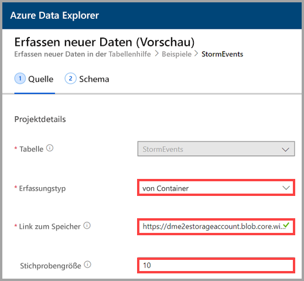
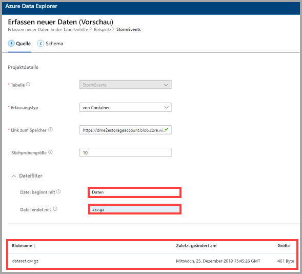

## Auswahl eines Erfassungstyps

Wählen Sie für **Erfassungstyp** eine der folgenden Optionen aus:
   * **Aus Speicher**: Fügen Sie im Feld **Mit Speicher verknüpfen** die URL des Speicherkontos hinzu. Verwenden Sie die [Blob-SAS-URL](/azurevs-azure-tools-storage-explorer-blobs#get-the-sas-for-a-blob-container) für private Speicherkonten.
   
      

    * **Aus Datei**: Wählen Sie **Durchsuchen** aus, um nach der Datei zu suchen, oder ziehen Sie die Datei in das Feld.
  
      

    * **Aus Container**: Fügen Sie im Feld **Mit Speicher verknüpfen** die [SAS-URL](/azure/vs-azure-tools-storage-explorer-blobs#get-the-sas-for-a-blob-container) des Containers hinzu, und geben Sie optional die Stichprobengröße ein.

      

  Es wird eine Stichprobe der Daten angezeigt. Sie können diese Anzeige filtern, um nur Dateien anzuzeigen, die mit bestimmten Zeichen beginnen und/oder auf bestimmte Zeichen enden. Die Vorschau wird automatisch aktualisiert, sobald Sie die Filter anpassen.
  
  Sie können die Anzeige beispielsweise so filtern, dass alle Dateien aufgelistet werden, die mit dem Begriff *Daten* beginnen und auf die Erweiterung *.csv.gz* enden.

  
