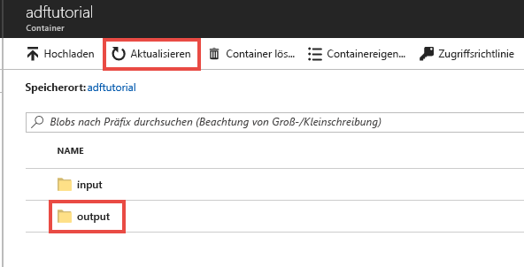

## <a name="review-deployed-resources"></a>Überprüfen der bereitgestellten Ressourcen

Die Pipeline erstellt den Ausgabeordner automatisch im Blobcontainer „adftutorial“. Anschließend wird die Datei „emp.txt“ aus dem Eingabe- in den Ausgabeordner kopiert. 

1. Wählen Sie im Azure-Portal auf der Seite des Containers **adftutorial** die Option **Aktualisieren** aus, um den Ausgabeordner anzuzeigen. 
    
    

2. Wählen Sie in der Ordnerliste **output** aus. 

3. Überprüfen Sie, ob die Datei **emp.txt** in den Ausgabeordner kopiert wurde. 

    

## <a name="clean-up-resources"></a>Bereinigen von Ressourcen

Die im Rahmen dieser Schnellstartanleitung erstellten Ressourcen können auf zwei Arten bereinigt werden. Sie können die [Azure-Ressourcengruppe](../articles/azure-resource-manager/management/overview.md) einschließlich aller darin enthaltenen Ressourcen löschen. Falls die anderen Ressourcen erhalten bleiben sollen, löschen Sie nur die Data Factory, die Sie in diesem Tutorial erstellt haben.

Wenn Sie eine Ressourcengruppe löschen, werden alle Ressourcen einschließlich enthaltener Data Factorys gelöscht. Führen Sie den folgenden Befehl aus, um die gesamte Ressourcengruppe zu löschen: 

```powershell
Remove-AzResourceGroup -ResourceGroupName $resourcegroupname
```

> [!Note]
> Das Löschen einer Ressourcengruppe kann einige Zeit in Anspruch nehmen. Bitte haben Sie etwas Geduld.

Wenn Sie nur die Data Factory und nicht die gesamte Ressourcengruppe löschen möchten, führen Sie den folgenden Befehl aus: 

```powershell
Remove-AzDataFactoryV2 -Name $dataFactoryName -ResourceGroupName $resourceGroupName
```