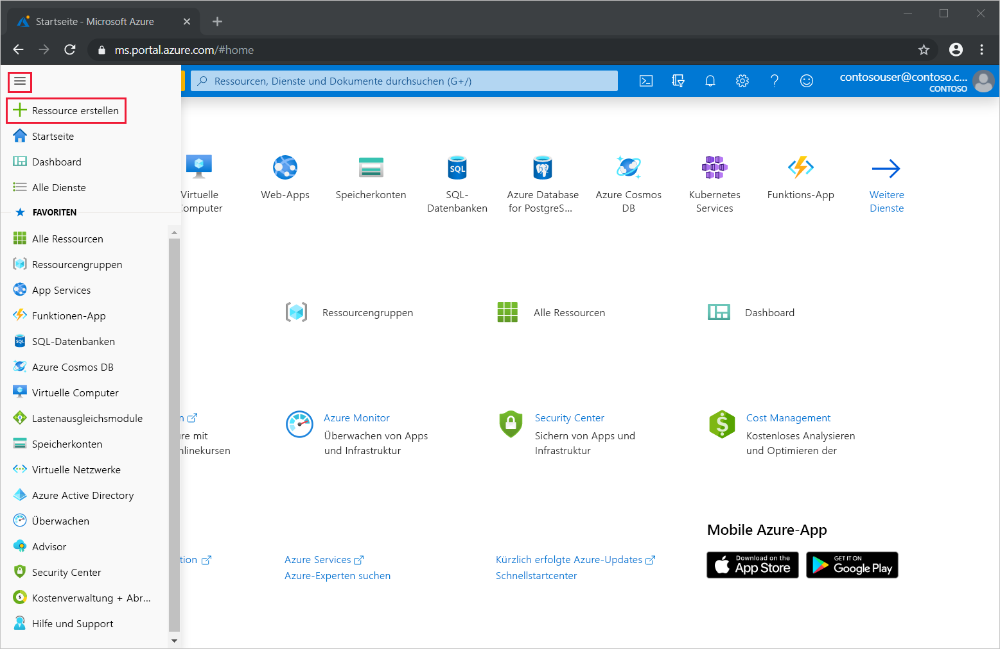
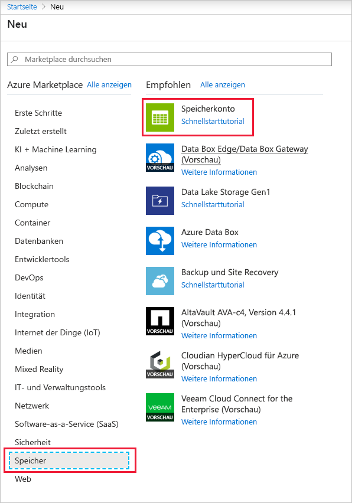
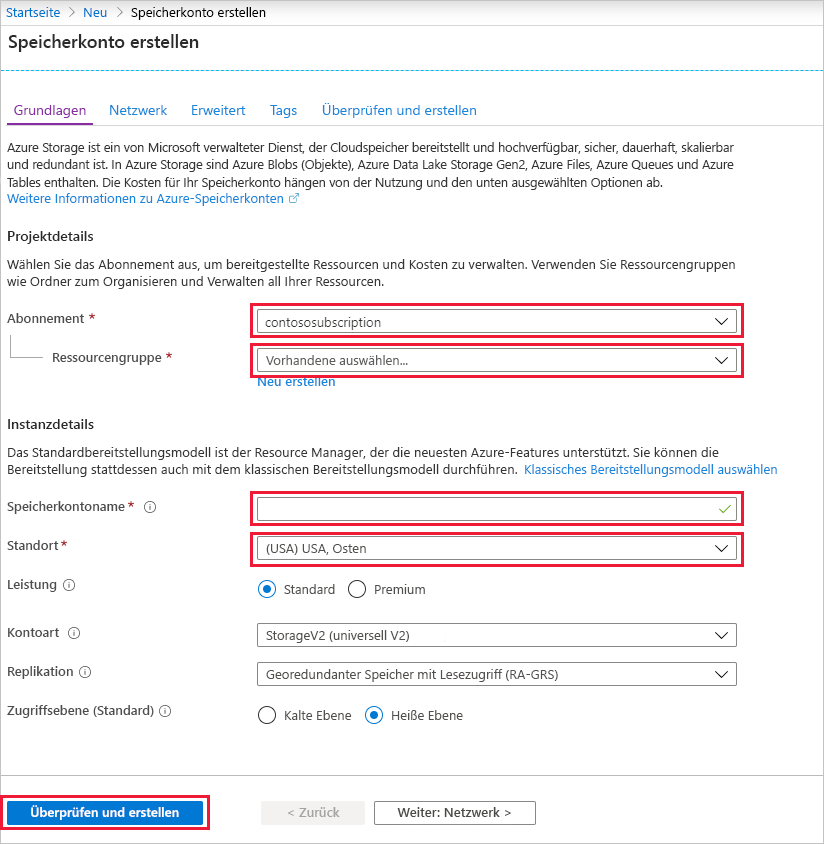
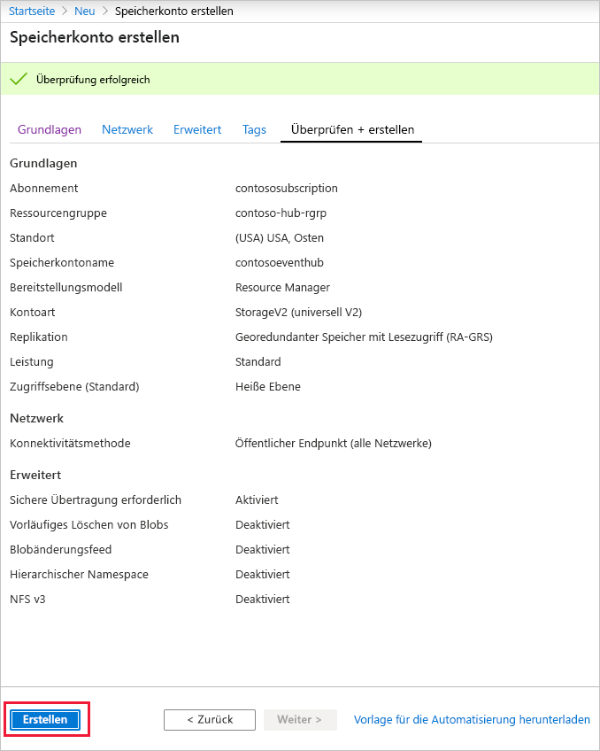
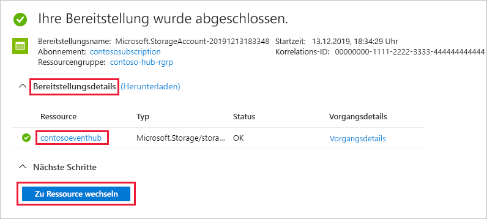
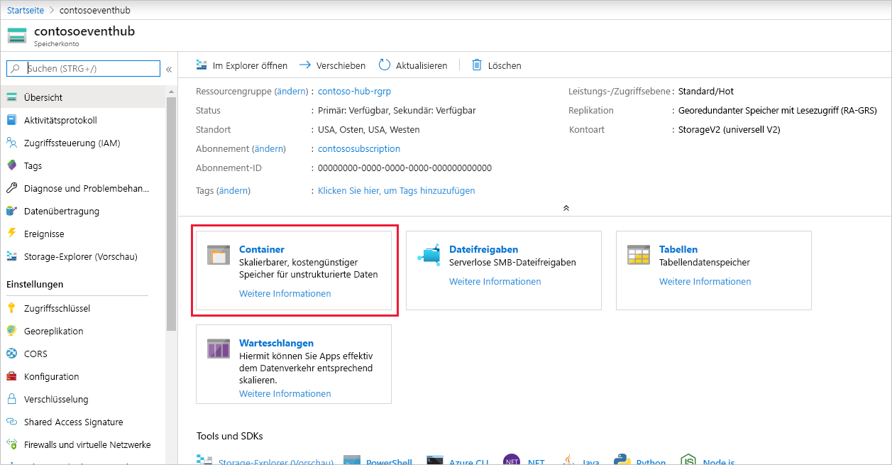
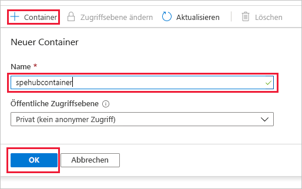

### Erstellen eines Speicherkontos für den Ereignisprozessorhost
Der Ereignisprozessorhost ist ein intelligenter Agent, mit dem das Empfangen von Ereignissen von Event Hubs vereinfacht wird, indem permanente Prüfpunkte und parallele Empfangsvorgänge verwaltet werden. Für das Setzen von Prüfpunkten benötigt der Ereignisprozessorhost ein Speicherkonto. Im folgenden Beispiel wird veranschaulicht, wie Sie ein Speicherkonto erstellen und die zugehörigen Zugriffsschlüssel beziehen:

1. Wählen Sie im Menü des Azure-Portals die Option **Ressource erstellen** aus.

    

2. Wählen Sie **Storage** > **Speicherkonto** aus.
   
    

3. Führen Sie auf der Seite **Speicherkonto erstellen** die folgenden Schritte aus: 

   1. Geben Sie den **Namen des Speicherkontos** ein.
   2. Wählen Sie ein Azure-**Abonnement** aus, das den Event Hub enthält.
   3. Wählen Sie die **Ressourcengruppe** aus, die den Event Hub enthält, oder erstellen Sie sie.
   4. Wählen Sie einen **Speicherort** für die Erstellung der Ressource aus. 
   5. Klicken Sie auf **Überprüfen + erstellen**.
   
        

4. Überprüfen Sie auf der Seite **Überprüfen + erstellen** die Werte, und wählen Sie **Erstellen** aus. 

    
5. Wenn die Meldung **Bereitstellungen erfolgreich**  in Ihren Benachrichtigungen angezeigt wird, wählen Sie **Zu Ressource wechseln** aus, um die Seite „Speicherkonto“ zu öffnen. Alternativ können Sie **Bereitstellungsdetails** erweitern und dann die neue Ressource in der Ressourcenliste auswählen.  

     
6. Wählen Sie **Container**aus.

    
7. Wählen Sie oben **+ Container** aus, geben Sie einen **Namen** für den Container ein, und wählen Sie **OK** aus. 

    
8. Wählen Sie im Menü der Seite **Speicherkonto** die Option **Zugriffsschlüssel** aus, und kopieren Sie den Wert von **key1**.

    Speichern Sie die folgenden Werte im Editor oder an einem anderen temporären Speicherort.
    - Name des Speicherkontos
    - Zugriffsschlüssel für das Speicherkonto
    - Name des Containers
