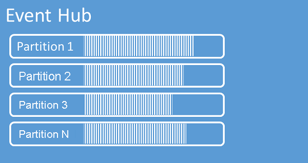

In Event Hub werden Sequenzen mit Ereignissen in einer oder mehreren Partitionen organisiert. Neu eingehende Ereignisse werden am Ende dieser Sequenz hinzugefügt. Eine Partition kann als "Commitprotokoll" betrachtet werden

Partitionen enthalten Ereignisdaten mit dem Text des Ereignisses und einer benutzerdefinierten Eigenschaftensammlung mit einer Beschreibung des Ereignisses. Darüber hinaus enthalten sie Metadaten, z. B. den Offset in der Partition, die Nummer in der Datenstromsequenz und den dienstseitigen Zeitstempel des Akzeptierungsvorgangs.

Event Hubs wurde zur Unterstützung der Verarbeitung von großen Ereignismengen konzipiert, und die Partitionierung ist hierbei aus zwei Gründen hilfreich:

Erstens: Bei Event Hubs handelt es sich zwar um einen PaaS-Dienst, aber es gibt auch eine physische Komponente. Zum Führen eines Protokolls, in dem die Reihenfolge der Ereignisse festgehalten wird, müssen diese Ereignisse zusammen im zugrunde liegenden Speicher und in den zugehörigen Replikaten gespeichert werden. Dies führt dazu, dass für ein Protokoll dieser Art ein Grenzwert für den Durchsatz gilt. Die Partitionierung ermöglicht es, dass mehrere parallele Protokolle für dieselbe Event Hub-Instanz verwendet werden. Auf diese Weise wird die verfügbare Rohkapazität für den E/A-Durchsatz multipliziert.

Zweitens: Ihre eigenen Anwendungen müssen die Verarbeitung der Ereignismenge, die an einen Event Hub gesendet wird, bewältigen können. Dies kann ziemlich komplex sein und erfordert eine hohe Kapazität für die Parallelverarbeitung mit Skalierungsoptionen. Für die Partitionen gilt die gleiche Begründung wie oben: Da die Kapazität eines einzelnen Prozesses für die Verarbeitung von Ereignissen begrenzt ist, benötigen Sie mehrere Prozesse. Partitionen werden von Ihrer Lösung verwendet, um diese Prozesse mit Daten zu versorgen, während gleichzeitig sichergestellt wird, dass jedes Ereignis über einen eindeutigen Verarbeitungsbesitzer verfügt. 

Von Event Hubs werden Ereignisse über einen konfigurierten Aufbewahrungszeitraum aufbewahrt, der für alle Partitionen gilt. Ereignisse werden automatisch entfernt, nachdem das Ende des Aufbewahrungszeitraums erreicht wurde. Wenn Sie einen Aufbewahrungszeitraum mit einer Dauer von einem Tag angeben, endet die Verfügbarkeit des Ereignisses genau 24 Stunden nach dem Akzeptierungsvorgang. Sie haben nicht die Möglichkeit, Ereignisse explizit zu löschen. 

Die zulässige Aufbewahrungsdauer beträgt bis zu 7 Tage für Event Hubs Standard und bis zu 90 Tage für Event Hubs Dedicated. Falls Sie Ereignisse über den zulässigen Aufbewahrungszeitraum hinaus archivieren müssen, können Sie die [automatische Speicherung in Azure Storage oder Azure Data Lake nutzen, indem Sie das Feature „Event Hubs Capture“ aktivieren](../articles/event-hubs/event-hubs-capture-overview.md). Wenn Sie Deep Archives dieser Art durchsuchen oder analysieren müssen, können Sie sie leicht in [Azure Synapse](../articles/event-hubs/store-captured-data-data-warehouse.md) oder ähnliche Speicher und Analyseplattformen importieren. 

Durch die zeitliche Beschränkung der Datenaufbewahrung für Event Hubs soll verhindert werden, dass große Mengen von Verlaufsdaten der Kunden in einem tiefen Speicher, der nur mit einem Zeitstempel indiziert ist und für den nur der sequenzielle Zugriff zulässig ist, quasi gefangen sind. Der Grundgedanke dieser Architektur ist, dass für Verlaufsdaten eine umfassendere Indizierung und eine direktere Zugriffsoption benötigt werden, als dies über die Echtzeitoberfläche für Ereignisse von Event Hubs oder Kafka möglich ist. Ereignisdatenstrom-Engines sind nicht gut geeignet, um die Rolle von Data Lakes oder Langzeitarchiven für die Ereignisherkunftsermittlung zu übernehmen. 

Da Partitionen unabhängig sind und ihre eigene Datensequenz enthalten, wachsen sie häufig mit unterschiedlicher Geschwindigkeit. In Event Hubs ist dies kein Problem, das durch den Eingriff eines Administrators gelöst werden muss, wie dies beispielsweise bei Apache Kafka der Fall ist. Eine ungleichmäßige Verteilung führt aber zu einer ungleichmäßigen Auslastung Ihrer nachgeschalteten Ereignisprozessoren.

Die Anzahl von Partitionen wird bei der Erstellung angegeben und muss für Event Hubs Standard zwischen 1 und 32 liegen. Die Partitionsanzahl kann für Event Hubs Dedicated bei bis zu 2.000 Partitionen pro Kapazitätseinheit liegen. 

Wir empfehlen Ihnen, mindestens so viele Partitionen auszuwählen, wie Sie voraussichtlich in dauerhaften [Durchsatzeinheiten](../articles/event-hubs/event-hubs-faq.md#what-are-event-hubs-throughput-units) während der Spitzenlast Ihrer Anwendung für den entsprechenden Event Hub benötigen. Sie sollten für die Berechnung davon ausgehen, dass eine Partition über eine Durchsatzkapazität von 1 Durchsatzeinheit verfügt (1 MB eingehend, 2 MB ausgehend). Sie können die Durchsatzeinheiten in Ihrem Namespace oder die Kapazitätseinheiten Ihres Clusters unabhängig von der Partitionsanzahl skalieren. Für einen Event Hub mit 32 Partitionen oder einen Event Hub mit nur einer Partition fallen die gleichen Kosten an, wenn der Namespace auf eine Kapazität von einer Durchsatzeinheit festgelegt ist. 

Es gibt drei Möglichkeiten, wie Anwendungen die Zuordnung von Ereignissen zu Partitionen steuern können:

- Angeben des Partitionsschlüssels, der dauerhaft einer der verfügbaren Partitionen zugeordnet ist (per Hashfunktion). 
- Verzichten auf die Angabe eines Partitionsschlüssels, um das Brokering zum zufälligen Auswählen einer Partition für ein bestimmtes Ereignis zu ermöglichen.
- Explizites Senden von Ereignissen an eine bestimmte Partition.

Das Angeben eines Partitionsschlüssels ermöglicht es, verwandte Ereignisse zusammen auf derselben Partition in der exakten Sendereihenfolge aufzubewahren. Der Partitionsschlüssel ist eine Zeichenfolge, die von Ihrem Anwendungskontext abgeleitet wird, und dient zum Identifizieren der Beziehung zwischen den Ereignissen.

Eine von einem Partitionsschlüssel identifizierte Ereignissequenz ist ein *Datenstrom*. Eine Partition ist ein Multiplex-Protokollspeicher für viele Datenströme dieser Art. 

Die Partitionsanzahl für einen Event Hub in einem [dedizierten Event Hubs-Cluster](../articles/event-hubs/event-hubs-dedicated-overview.md) kann nach seiner Erstellung [erhöht](../articles/event-hubs/dynamically-add-partitions.md) werden, aber dann ändert sich die Verteilung von Datenströmen auf die Partitionen, da sich die Zuordnung von Partitionsschlüsseln zu den Partitionen ändert. Daher sollten Sie Änderungen dieser Art unbedingt vermeiden, falls die relative Reihenfolge der Ereignisse in Ihrer Anwendung wichtig ist.

Es ist verlockend, die Anzahl von Partitionen auf den zulässigen Höchstwert festzulegen. Hierbei sollten Sie aber stets beachten, dass Ihre Ereignisdatenströme so strukturiert sein müssen, dass Sie wirklich mehrere Partitionen nutzen können. Falls bei Ihnen die Reihenfolge für alle Ereignisse oder auch nur eine Handvoll untergeordneter Datenströme unbedingt beibehalten werden muss, kommen Sie ggf. nicht in den Genuss der Vorteile, die sich aus der Verwendung von mehreren Partitionen ergeben. Wenn mehrere Partitionen genutzt werden, erhöht sich zudem die Komplexität der Verarbeitungsseite. 

Das direkte Senden an Partitionen ist zwar möglich, wird aber nicht empfohlen. Stattdessen können Sie Konstrukte höherer Ebene verwenden, die im Abschnitt [Ereignisherausgeber](../articles/event-hubs/event-hubs-features.md#event-publishers) erläutert werden. 

Weitere Informationen zu Partitionen sowie zur Abwägung von Verfügbarkeit gegen Zuverlässigkeit finden Sie im [Programmierleitfaden für Event Hubs](../articles/event-hubs/event-hubs-programming-guide.md#partition-key) sowie im Artikel [Verfügbarkeit und Konsistenz in Event Hubs](../articles/event-hubs/event-hubs-availability-and-consistency.md).
