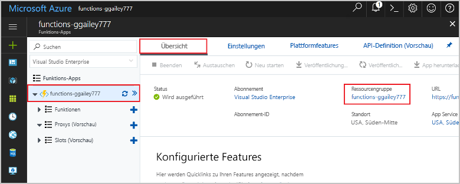

1. Drücken Sie in Visual Studio Code die F1-Taste, um die Befehlspalette zu öffnen. Suchen Sie in der Befehlspalette den Befehl `Azure Functions: Open in portal`, und wählen Sie ihn aus.

1. Wählen Sie Ihre Funktions-App aus, und drücken Sie die EINGABETASTE. Die Seite der Funktions-App wird im [Azure-Portal](https://portal.azure.com) geöffnet.

1. Wählen Sie auf der Registerkarte **Übersicht** den benannten Link unter **Ressourcengruppe** aus.

    

1. Prüfen Sie auf der Seite **Ressourcengruppe** die Liste mit den enthaltenen Ressourcen, und vergewissern Sie sich, dass es sich dabei um die Ressourcen handelt, die Sie löschen möchten.
 
1. Klicken Sie auf **Ressourcengruppe löschen**, und folgen Sie den Anweisungen.

   Der Löschvorgang kann einige Minuten dauern. Nach Abschluss des Vorgangs wird kurz eine Benachrichtigung angezeigt. Sie können auch am oberen Seitenrand auf das Glockensymbol klicken, um die Benachrichtigung anzuzeigen.