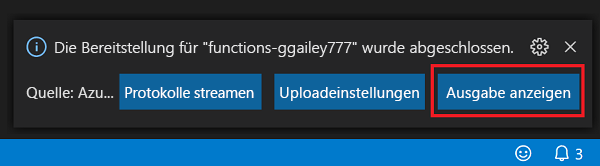

## Veröffentlichen des Projekts in Azure

In diesem Abschnitt erstellen Sie eine Funktions-App sowie zugehörige Ressourcen in Ihrem Azure-Abonnement und stellen anschließend Ihren Code bereit.

> [!IMPORTANT]
> Beim Veröffentlichen in einer vorhandenen Funktions-App wird der Inhalt dieser App in Azure überschrieben.

1. Wählen Sie auf der Aktivitätsleiste das Azure-Symbol und anschließend im Bereich **Azure: Funktionen** die Schaltfläche **Deploy to function app...** (In Funktions-App bereitstellen...) aus.

    

1. Geben Sie nach entsprechender Aufforderung Folgendes ein:

    - **Wählen Sie einen Ordner aus:** Wählen Sie einen Ordner in Ihrem Arbeitsbereich aus, oder navigieren Sie zu einem Ordner, der Ihre Funktions-App enthält. Diese Option wird nicht angezeigt, wenn Sie bereits eine gültige Funktions-App geöffnet haben.

    - **Wählen Sie das Abonnement aus:** Wählen Sie das zu verwendende Abonnement aus. Wenn Sie nur über ein Abonnement verfügen, wird diese Option nicht angezeigt.

    - **Select Function App in Azure:** (Wählen Sie die Funktions-App in Azure aus:) Wählen Sie die Option `- Create new Function App`. (Wählen Sie nicht die Option `Advanced` aus, diese wird im vorliegenden Artikel nicht behandelt.)
      
    - **Enter a globally unique name for the function app:** (Geben Sie einen global eindeutigen Namen für die Funktions-App ein:) Geben Sie einen Namen ein, der in einem URL-Pfad gültig ist. Der eingegebene Name wird überprüft, um sicherzustellen, dass er in Azure Functions eindeutig ist.
    
    ::: zone pivot="programming-language-python"
    - **Select a runtime:** (Wählen Sie eine Runtime aus:) Wählen Sie die lokal ausgeführte Python-Version aus. Sie können den Befehl `python --version` ausführen, um Ihre Version zu überprüfen.
    ::: zone-end

    ::: zone pivot="programming-language-javascript,programming-language-typescript"
    - **Select a runtime:** (Wählen Sie eine Runtime aus:) Wählen Sie die lokal ausgeführte Node.js-Version aus. Sie können den Befehl `node --version` ausführen, um Ihre Version zu überprüfen.
    ::: zone-end

    - **Wählen Sie einen Speicherort für neue Ressourcen aus:**  Wählen Sie eine [Region](https://azure.microsoft.com/regions/) in Ihrer Nähe aus, um eine bessere Leistung zu erzielen. 
    
1.  Nach Abschluss des Vorgangs werden in Ihrem Abonnement die folgenden Azure-Ressourcen erstellt, deren Namen auf dem Namen Ihrer Funktions-App basieren:
    
    - Eine Ressourcengruppe als logischen Container für verwandte Ressourcen.
    - Ein Azure Storage-Standardkonto, in dem Status- und andere Informationen zu Ihren Projekten verwaltet werden.
    - Ein Verbrauchsplan, der den zugrunde liegenden Host für Ihre serverlose Funktions-App definiert. 
    - Eine Funktions-App, die als Umgebung zum Ausführen Ihres Funktionscodes dient. Mit einer Funktions-App können Sie Funktionen zu logischen Einheiten gruppieren. Dies erleichtert die Verwaltung, Bereitstellung und Freigabe von Ressourcen im selben Hostingplan.
    - Eine mit der Funktions-App verbundene Application Insights-Instanz, die die Nutzung Ihrer serverlosen Funktion nachverfolgt.

    Nach der Erstellung der Funktions-App wird eine Benachrichtigung angezeigt, und das Bereitstellungspaket wird angewendet. 
    
1. Wählen Sie in dieser Benachrichtigungen **Ausgabe anzeigen** aus, um die Erstellungs- und Bereitstellungsergebnisse (auch für die von Ihnen erstellten Azure-Ressourcen) anzuzeigen. Wenn Sie die Benachrichtigung übersehen haben, wählen Sie das Glockensymbol in der unteren rechten Ecke aus, um sie erneut anzuzeigen.

    
