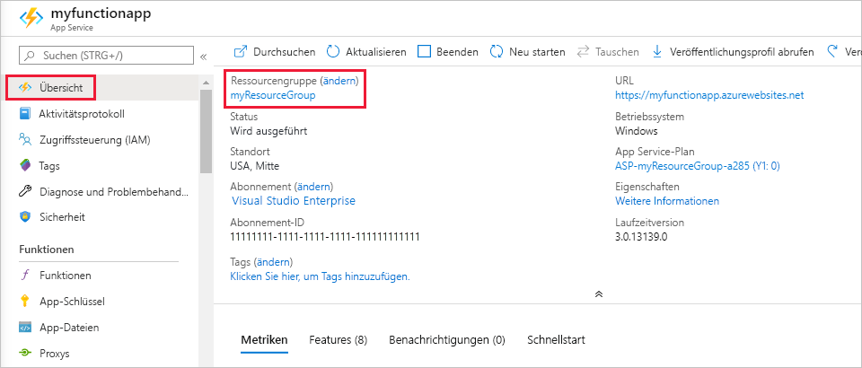

1. Navigieren Sie im Azure-Portal zur Seite **Ressourcengruppe**. 

   Von der Seite „Funktions-App“ aus gelangen Sie zu dieser Seite, indem Sie auf die Registerkarte **Übersicht** und anschließend unter **Ressourcengruppe** auf den Link klicken.

   

   Vom Dashboard aus gelangen Sie zu dieser Seite, indem Sie **Ressourcengruppen** und anschließend die Ressourcengruppe auswählen, die Sie für diesen Artikel verwendet haben.

2. Prüfen Sie auf der Seite **Ressourcengruppe** die Liste mit den enthaltenen Ressourcen, und vergewissern Sie sich, dass es sich dabei um die Ressourcen handelt, die Sie löschen möchten.
 
3. Klicken Sie auf **Ressourcengruppe löschen**, und folgen Sie den Anweisungen.

   Der Löschvorgang kann einige Minuten dauern. Nach Abschluss des Vorgangs wird kurz eine Benachrichtigung angezeigt. Sie können auch am oberen Seitenrand auf das Glockensymbol klicken, um die Benachrichtigung anzuzeigen.