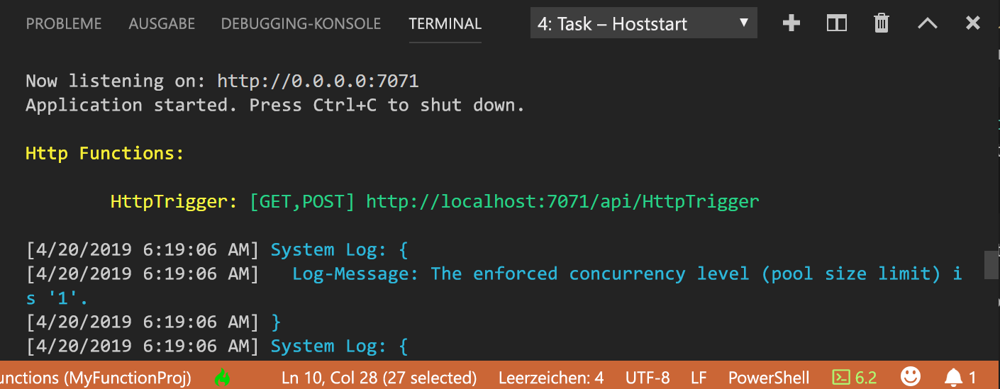
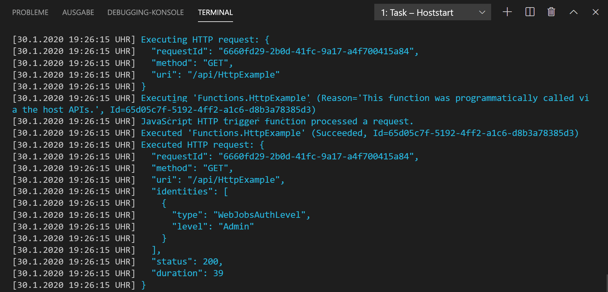

## <a name="run-the-function-locally"></a>Lokales Ausführen der Funktion

Azure Functions Core Tools arbeitet mit Visual Studio Code zusammen, um das lokale Ausführen und Debuggen von Azure Functions-Projekten zu ermöglichen.  

1. Wenn Sie Ihre Funktion debuggen möchten, fügen Sie im Funktionscode einen Aufruf des Cmdlets [`Wait-Debugger`](/powershell/module/microsoft.powershell.utility/wait-debugger?view=powershell-6) vor der Stelle ein, an der Sie den Debugger anfügen möchten. Drücken Sie anschließend F5, um das Funktions-App-Projekt zu starten und den Debugger anzufügen. Die Ausgabe der Core Tools wird im Bereich **Terminal** angezeigt.

1. Kopieren Sie im Bereich **Terminal** den URL-Endpunkt Ihrer über HTTP ausgelösten Funktion.

    

1. Fügen Sie anschließend die Abfragezeichenfolge `?name=<yourname>` an diese URL an, und verwenden Sie `Invoke-RestMethod` an einer zweiten PowerShell-Eingabeaufforderung, um die Anforderung auszuführen:

    ```powershell
    PS > Invoke-RestMethod -Method Get -Uri http://localhost:7071/api/HttpTrigger?name=PowerShell
    Hello PowerShell
    ```

    Die GET-Anforderung kann auch über einen Browser über die folgende URL ausgeführt werden.

    <http://localhost:7071/api/HttpExample?name=PowerShell>

    Wenn Sie den Endpunkt „HttpTrigger“ aufrufen, ohne einen Parameter vom Typ `name` zu übergeben (entweder als Abfrageparameter oder im Text), gibt die Funktion den Fehler `BadRequest` zurück. Wenn Sie den Code in „run.ps1“ überprüfen, sehen Sie, dass dieser Fehler beabsichtigt ist.

1. Informationen zur Anforderung werden in Bereich **Terminal** angezeigt.

    

1. Wenn Sie das Debuggen beenden möchten, drücken Sie STRG+C zum Beenden der Core Tools.

Nachdem Sie sichergestellt haben, dass die Funktion auf Ihrem lokalen Computer richtig ausgeführt wird, können Sie das Projekt in Azure veröffentlichen.

> [!NOTE]
> Denken Sie daran, alle Aufrufe von `Wait-Debugger` zu entfernen, bevor Sie Ihre Funktionen in Azure veröffentlichen. 