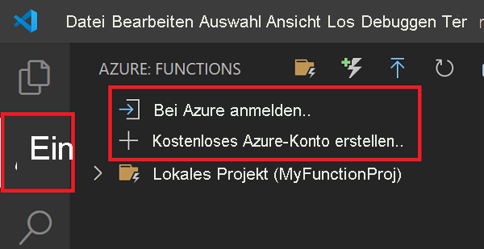

## Anmelden bei Azure

Bevor Sie Ihre App veröffentlichen können, müssen Sie sich bei Azure anmelden. 

1. Sollten Sie noch nicht angemeldet sein, wählen Sie auf der Aktivitätsleiste das Azure-Symbol und anschließend im Bereich **Azure: Funktionen** die Option **Bei Azure anmelden...** aus. Falls Sie über kein Konto verfügen, können Sie ein **kostenloses Azure-Konto erstellen**. 

    

    Sollten Sie bereits angemeldet sein, fahren Sie mit dem nächsten Abschnitt fort.

1. Wählen Sie im Browser nach entsprechender Aufforderung Ihr Azure-Konto aus, und melden Sie sich mit Ihren Azure-Anmeldeinformationen an. 

1. Wenn Sie sich erfolgreich angemeldet haben, können Sie das neue Browserfenster schließen. Die Abonnements, die zu Ihrem Azure-Konto gehören, werden auf der Seitenleiste angezeigt.
