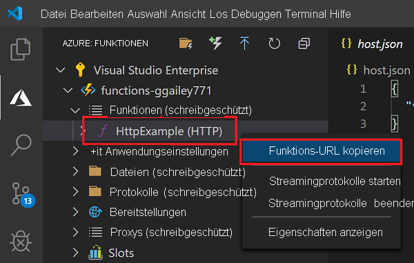

## <a name="run-the-function-in-azure"></a>Ausführen der Funktion in Azure

1. Zurück im Bereich **Azure: Funktionen** auf der Seitenleiste die neue Funktions-App unter Ihrem Abonnement. Erweitern Sie **Funktionen** , klicken Sie mit der rechten Maustaste (Windows), bzw. klicken Sie bei gedrückter <kbd>CTRL-TASTE</kbd> (macOS) auf **HttpExample** , und wählen Sie **Copy function URL** (Funktions-URL kopieren) aus.

    

1. Fügen Sie diese URL für die HTTP-Anforderung in die Adressleiste Ihres Browsers ein, fügen Sie die Abfragezeichenfolge `name` als `?name=Functions` am Ende der URL hinzu, und führen Sie dann die Anforderung aus. Die URL, über die Ihre per HTTP ausgelöste Funktion aufgerufen wird, sollte das folgende Format haben:

    ```http
    http://<FUNCTION_APP_NAME>.azurewebsites.net/api/httpexample?name=Functions
    ```

    Das folgende Beispiel zeigt die von der Funktion im Browser zurückgegebene Antwort auf die GET-Remoteanforderung:

    
