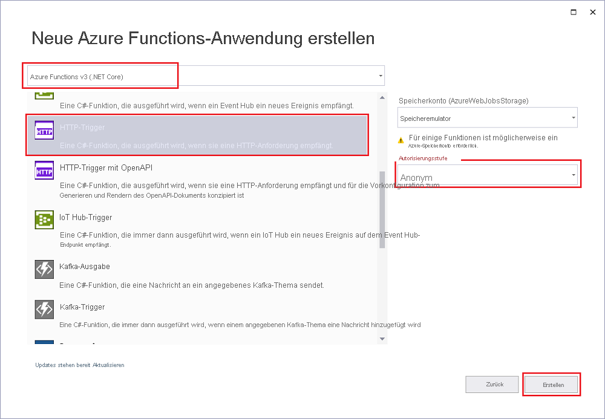

Mit der Azure Functions-Projektvorlage in Visual Studio wird ein Projekt erstellt, das Sie in einer Funktions-App in Azure veröffentlichen können. Sie können mit einer Funktions-App Funktionen zu logischen Einheiten gruppieren. Dies erleichtert die Verwaltung, Bereitstellung, Skalierung und Freigabe von Ressourcen.

1. Wählen Sie in Visual Studio im Menü **Datei** die Optionen **Neu** > **Projekt** aus.

1. Geben Sie unter **Neues Projekt erstellen** den Suchbegriff *functions* in das Suchfeld ein, und wählen Sie die Vorlage **Azure Functions** aus.

1. Geben Sie unter **Neues Projekt konfigurieren** im Feld **Projektname** einen Namen für Ihr Projekt ein, und wählen Sie anschließend **Erstellen** aus. Der Name der Funktions-App muss als C#-Namespace gültig sein, verwenden Sie daher keine Unterstriche, Bindestriche oder andere nicht alphanumerische Zeichen.

1. Konfigurieren Sie die Einstellungen für **Neues Projekt – &lt;Name Ihres Projekts&gt;** mit den Werten aus der folgenden Tabelle:

    | Einstellung      | Wert  | BESCHREIBUNG                      |
    | ------------ |  ------- |----------------------------------------- |
    | **Functions-Runtime** | **Azure Functions v2  (.NET Core)** | Durch diesen Wert wird ein Funktionsprojekt mit Version 2.x der Runtime von Azure Functions erstellt, die .NET Core unterstützt. Azure Functions 1.x unterstützt .NET Framework. Weitere Informationen finden Sie unter [Einstellen von Runtimeversionen von Azure Functions als Ziel](../articles/azure-functions/functions-versions.md).   |
    | **Funktionsvorlage** | **HTTP-Trigger** | Mit diesem Wert wird eine Funktion erstellt, die durch eine HTTP-Anforderung ausgelöst wird. |
    | **Speicherkonto**  | **Speicheremulator** | Da für eine Azure-Funktion ein Speicherkonto erforderlich ist, wird ein Speicherkonto zugewiesen oder erstellt, wenn Sie Ihr Projekt in Azure veröffentlichen. Von HTTP-Triggern wird keine Azure Storage-Kontoverbindungszeichenfolge verwendet. Für alle anderen Triggertypen ist dagegen eine gültige Azure Storage-Kontoverbindungszeichenfolge erforderlich.  |
    | **Zugriffsrechte** | **Anonym** | Die erstellte Funktion kann von jedem Client ausgelöst werden, ohne dass ein Schlüssel angegeben werden muss. Diese Autorisierungseinstellung erleichtert Ihnen das Testen Ihrer neuen Funktion. Weitere Informationen zu Schlüsseln und zur Autorisierung finden Sie unter [Autorisierungsschlüssel](../articles/azure-functions/functions-bindings-http-webhook-trigger.md#authorization-keys) sowie in der [Übersicht über HTTP-Trigger und -Bindungen in Azure Functions](../articles/azure-functions/functions-bindings-http-webhook.md). |
    

    
    

    Legen Sie die **Zugriffsrechte** auf **Anonym** fest. Bei Verwendung der Standardebene **Funktion** muss in Anforderungen für den Zugriff auf den Funktionsendpunkt der [Funktionsschlüssel](../articles/azure-functions/functions-bindings-http-webhook-trigger.md#authorization-keys) angegeben werden.

1. Wählen Sie **OK** aus, um das Funktionsprojekt und die per HTTP ausgelöste Funktion zu erstellen.
