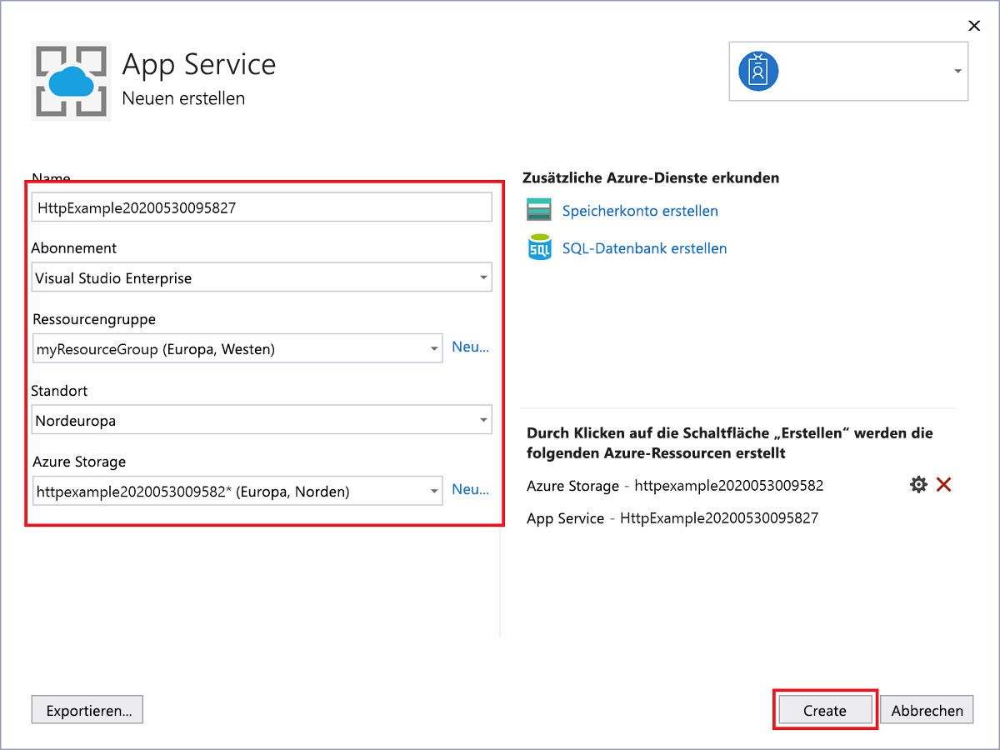

1. Klicken Sie im **Projektmappen-Explorer** mit der rechten Maustaste auf das Projekt, und wählen Sie **Veröffentlichen** aus. Wählen Sie unter **Ziel** die Option **Azure** und anschließend **Weiter** aus.

1. Wählen Sie für **Bestimmtes Ziel** die Option **Azure-Funktions-App (Windows)** aus, um eine Funktions-App zu erstellen, die unter Windows ausgeführt wird.

1. Wählen Sie unter **Functions-Instanz** die Option **Neue Azure Functions-Instanz erstellen...** aus. 

    :::image type="content" source="media/functions-vstools-publish/functions-visual-studio-publish-new-resource.png" alt-text="Erstellen einer neuen Funktions-App-Instanz":::

1. Erstellen Sie eine neue Instanz mit den Werten aus der folgenden Tabelle:

    | Einstellung      | Wert  | BESCHREIBUNG                                |
    | ------------ |  ------- | -------------------------------------------------- |
    | **Name** | Global eindeutiger Name | Name, der Ihre neue Funktions-App eindeutig identifiziert. Übernehmen Sie diesen Namen, oder geben Sie einen neuen Namen ein. Gültige Zeichen: `a-z`, `0-9` und `-`. |
    | **Abonnement** | Ihr Abonnement | Das zu verwendende Azure-Abonnement. Übernehmen Sie dieses Abonnement, oder wählen Sie in der Dropdownliste ein neues Abonnement aus. |
    | **[Ressourcengruppe](../articles/azure-resource-manager/management/overview.md)** | Name Ihrer Ressourcengruppe |  Die Ressourcengruppe, in der Ihre Funktions-App erstellt werden soll. Wählen Sie in der Dropdownliste eine vorhandene Ressourcengruppe aus, oder wählen Sie **Neu** aus, um eine neue Ressourcengruppe zu erstellen.|
    | **[Plantyp](../articles/azure-functions/functions-scale.md)** | Nutzung | Wenn Sie Ihr Projekt in einer Funktions-App veröffentlichen, die in einem [Verbrauchsplan](../articles/azure-functions/consumption-plan.md) ausgeführt wird, bezahlen Sie nur für die Ausführungen Ihrer Funktions-App. Für andere Hostingpläne fallen höhere Kosten an. |
    | **Location** | Standort des App-Diensts | Wählen Sie einen **Standort** in einer [Region](https://azure.microsoft.com/regions/) in Ihrer Nähe oder in der Nähe anderer Dienste aus, auf die Ihre Funktionen zugreifen. |
    | **[Azure Storage](../articles/azure-functions/storage-considerations.md)** | Universelles Speicherkonto | Für die Functions-Runtime wird ein Azure Storage-Konto benötigt. Wählen Sie **Neu** aus, um ein universelles Speicherkonto zu konfigurieren. Sie können auch ein vorhandenes Konto auswählen, das die [Anforderungen an das Speicherkonto](../articles/azure-functions/storage-considerations.md#storage-account-requirements) erfüllt.  |

    

1. Wählen Sie **Erstellen** aus, um eine Funktions-App und die zugehörigen Ressourcen in Azure zu erstellen. Der Status der Ressourcenerstellung wird links unten im Fenster angezeigt. 

1. Vergewissern Sie sich unter **Funktionsinstanz**, dass die Option **Aus Paketdatei ausführen** aktiviert ist. Ihre Funktions-App wird unter Verwendung der [ZIP-Bereitstellung](../articles/azure-functions/functions-deployment-technologies.md#zip-deploy) mit aktiviertem Modus [Run-From-Package](../articles/azure-functions/run-functions-from-deployment-package.md) bereitgestellt. Dies ist die empfohlene Bereitstellungsmethode für Ihr Funktionsprojekt, da damit eine bessere Leistung erzielt wird. 

    :::image type="content" source="media/functions-vstools-publish/functions-visual-studio-publish-profile-step-4.png" alt-text="Abschließen der Profilerstellung":::

1. Wählen Sie **Fertig stellen** und anschließend auf der Seite „Veröffentlichen“ die Option **Veröffentlichen** aus, um das Paket mit Ihren Projektdateien in der neuen Funktions-App in Azure bereitzustellen. 

    Nach Abschluss der Bereitstellung wird die Stamm-URL der Funktions-App in Azure auf der Registerkarte **Veröffentlichen** angezeigt. 
    
1.  Wählen Sie auf der Registerkarte „Veröffentlichen“ die Option **Im Cloud-Explorer verwalten** aus. Dadurch wird die Azure-Ressource für die neue Funktions-App im Cloud-Explorer geöffnet. 
    
    :::image type="content" source="media/functions-vstools-publish/functions-visual-studio-publish-complete.png" alt-text="Veröffentlichen einer Erfolgsmeldung":::
    
    Im Cloud-Explorer können Sie Visual Studio verwenden, um die Inhalte der Website anzuzeigen, die Funktions-App zu starten und anzuhalten und direkt zu Funktions-App-Ressourcen in Azure und im Azure-Portal zu navigieren. 
