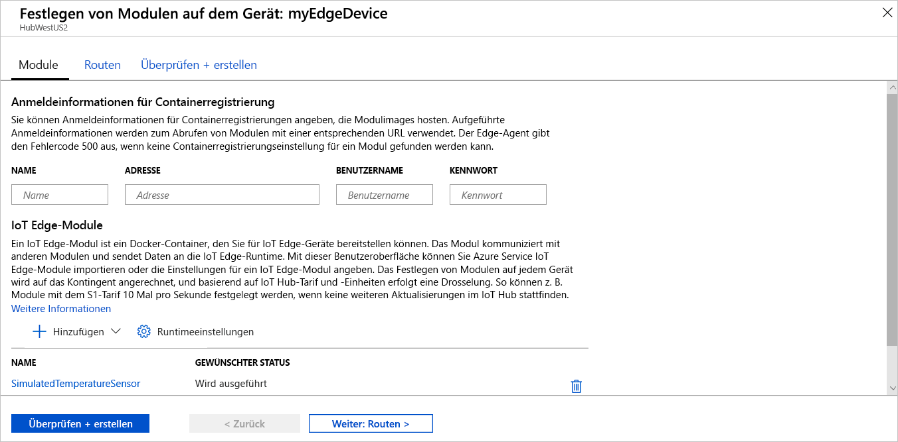

Eine der wichtigen Funktionen von Azure IoT Edge ist die Möglichkeit, Code aus der Cloud auf IoT Edge-Geräten bereitzustellen. Bei **IoT Edge-Modulen** handelt es sich um ausführbare Pakete, die als Container implementiert werden. In diesem Abschnitt stellen Sie ein fertig erstelltes Modul aus dem [Bereich mit den IoT Edge-Modulen im Azure Marketplace](https://azuremarketplace.microsoft.com/marketplace/apps/category/internet-of-things?page=1&subcategories=iot-edge-modules) direkt von Ihrer Azure IoT Hub-Instanz aus bereit.

Mit dem in diesem Abschnitt bereitgestellten Modul wird ein Sensor simuliert, und es werden Daten generiert. Der Code dieses Moduls ist nützlich, wenn Sie die ersten Schritte mit IoT Edge ausführen, weil Sie die simulierten Daten für die Entwicklung und das Testen nutzen können. Wenn Sie genau sehen möchten, was mit diesem Modul durchgeführt wird, können Sie den [Quellcode für den simulierten Temperatursensor anzeigen](https://github.com/Azure/iotedge/blob/027a509549a248647ed41ca7fe1dc508771c8123/edge-modules/SimulatedTemperatureSensor/src/Program.cs).

Führen Sie die folgenden Schritte aus, um über den Azure Marketplace Ihr erstes Modul bereitzustellen:

1. Melden Sie sich beim [Azure-Portal](https://portal.azure.com) an, und navigieren Sie zu Ihrem IoT Hub.

1. Wählen Sie im Menü im linken Bereich unter **Automatische Geräteverwaltung** die Option **IoT Edge** aus.

1. Klicken Sie in der Liste der Geräte auf die Geräte-ID des Zielgeräts.

1. Wählen Sie in der oberen Leiste **Module festlegen** aus.

1. Klicken Sie im Abschnitt **IoT Edge-Module** der Seite auf **Hinzufügen**.

1. Wählen Sie im Dropdownmenü die Option **Marketplace-Modul** aus.

   

1. Suchen Sie im **IoT Edge-Modul aus Marketplace** nach „Simulierter Temperatursensor“, und wählen Sie das Modul aus.

1. Beachten Sie, dass das SimulatedTemperatureSensor-Modul automatisch aufgefüllt wird. In den Tutorials verwenden Sie diese Seite, um Ihrer Bereitstellung weitere Module hinzuzufügen. Im Rahmen dieses Schnellstarts stellen Sie einfach dieses eine Modul bereit. Es sind keine Anmeldeinformationen erforderlich, da es öffentlich ist.

   

   Klicken Sie auf **Weiter: Routen**, um mit dem nächsten Schritt des Assistenten fortzufahren.

1. Auf der Registerkarte **Routen** des Assistenten definieren Sie, wie Nachrichten zwischen Modulen und dem IoT Hub übergeben werden. Nachrichten werden mit Name-Wert-Paaren erstellt. Im Rahmen des Schnellstarts sollen alle Nachrichten von allen Modulen an den IoT Hub (`$upstream`) gelangen. Wenn er nicht automatisch aufgefüllt wird, fügen Sie den folgenden Code für den **Wert** für **Name** `upstream` hinzu:

   ```sql
    FROM /messages/* INTO $upstream
   ```

   Klicken Sie auf **Weiter: Bewerten + erstellen**, um mit dem nächsten Schritt des Assistenten fortzufahren.

1. Auf der Registerkarte **Bewerten + erstellen** des Assistenten können Sie eine Vorschau der JSON-Datei anzeigen, in der alle Module definiert sind, die auf Ihrem IoT Edge-Gerät bereitgestellt werden. Beachten Sie, dass hier das Modul **SimulatedTemperatureSensor** ebenso wie zwei zusätzliche Systemmodule mit den Namen **edgeAgent** und **edgeHub** enthalten sind. Wählen Sie **Erstellen** aus, wenn Sie die Überprüfung abgeschlossen haben.

   Wenn Sie eine neue Bereitstellung an ein IoT Edge-Gerät übermitteln, wird nichts per Push auf Ihr Gerät übertragen. Stattdessen fragt das Gerät den IoT Hub regelmäßig nach neuen Anweisungen ab. Wenn das Gerät ein aktualisiertes Bereitstellungsmanifest findet, werden die Informationen zur neuen Bereitstellung verwendet, um die Modulimages per Pullvorgang aus der Cloud abzurufen. Anschließend wird die lokale Ausführung der Module gestartet. Dieser Vorgang kann einige Minuten in Anspruch nehmen.

1. Nachdem Sie die Bereitstellungsdetails des Moduls erstellt haben, werden Sie vom Assistenten zur Seite **IoT Edge** Ihres IoT Hubs zurück geführt. Wählen Sie Ihr Gerät in der Liste der IoT Edge-Geräte aus, um seine Details anzuzeigen.

1. Scrollen Sie auf der Detailseite des Geräts nach unten zur Registerkarte **Module**. Dort sollten drei Module aufgelistet sein: $edgeAgent, $edgeHub und SimulatedTemperatureSensor. Wenn mindestens ein Modul als in der Bereitstellung angegeben aufgeführt ist, vom Gerät aber nicht gemeldet wird, ist Ihr IoT Edge-Gerät noch mit dem Startvorgang beschäftigt. Warten Sie einige Minuten, und wählen Sie oben auf der Seite **Aktualisieren** aus.

   
