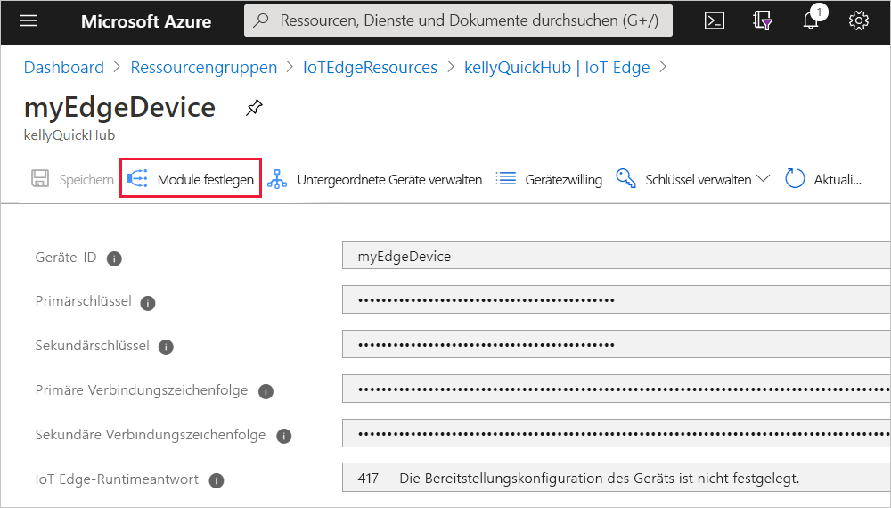
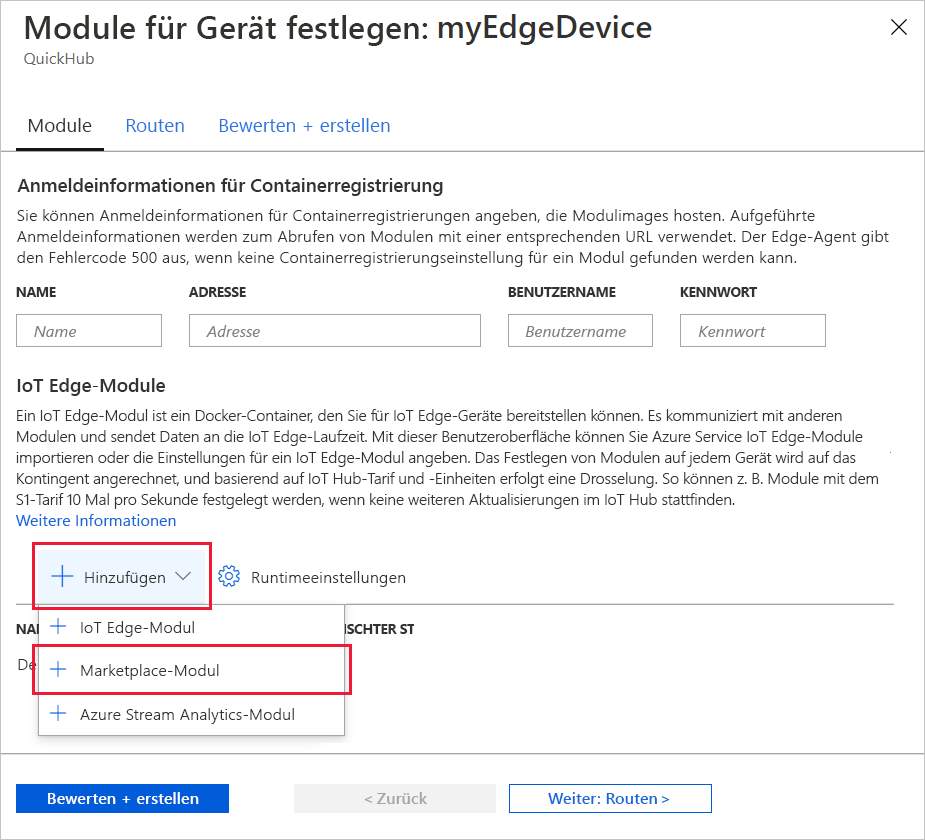
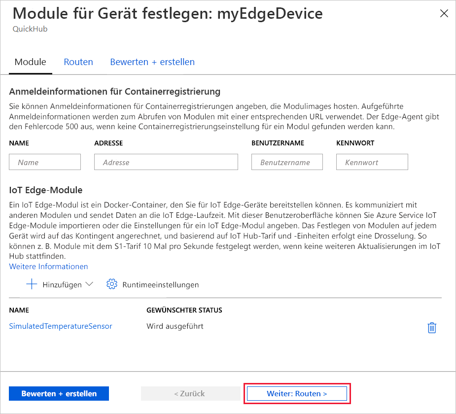
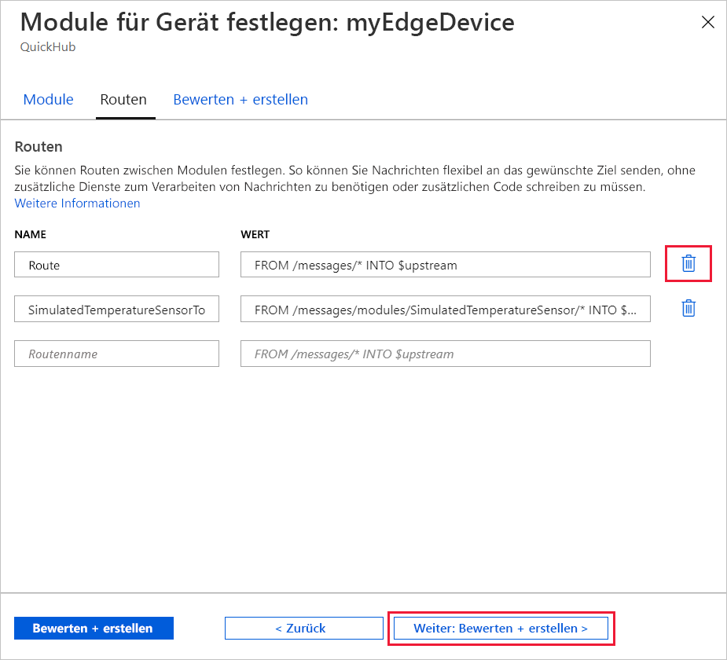
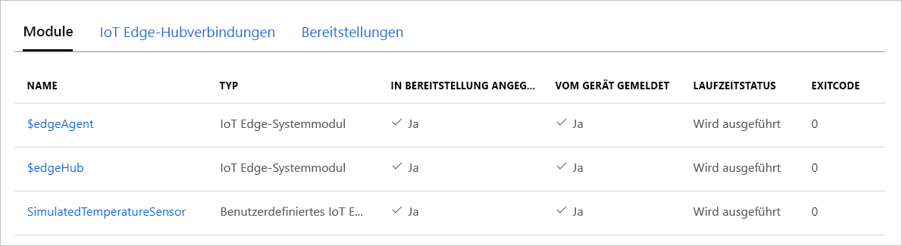

Eine wichtige Funktion von Azure IoT Edge ist die Möglichkeit, Code aus der Cloud auf IoT Edge-Geräten bereitzustellen. Bei *IoT Edge-Modulen* handelt es sich um ausführbare Pakete, die als Container implementiert werden. In diesem Abschnitt stellen Sie ein vorgefertigtes Modul aus dem [Abschnitt mit den IoT Edge-Modulen im Azure Marketplace](https://azuremarketplace.microsoft.com/marketplace/apps/category/internet-of-things?page=1&subcategories=iot-edge-modules) direkt über Ihre Azure IoT Hub-Instanz bereit.

Mit dem in diesem Abschnitt bereitgestellten Modul wird ein Sensor simuliert, und es werden Daten generiert. Der Code dieses Moduls ist nützlich, wenn Sie die ersten Schritte mit IoT Edge ausführen, weil Sie die simulierten Daten für die Entwicklung und das Testen nutzen können. Wenn Sie genau sehen möchten, was mit diesem Modul durchgeführt wird, können Sie den [Quellcode für den simulierten Temperatursensor anzeigen](https://github.com/Azure/iotedge/blob/027a509549a248647ed41ca7fe1dc508771c8123/edge-modules/SimulatedTemperatureSensor/src/Program.cs).

Führen Sie die folgenden Schritte aus, um über den Azure Marketplace Ihr erstes Modul bereitzustellen:

1. Melden Sie sich beim [Azure-Portal](https://portal.azure.com) an, und navigieren Sie zu Ihrer IoT Hub-Instanz.

1. Wählen Sie im Menü im linken Bereich unter **Automatische Geräteverwaltung** die Option **IoT Edge** aus.

1. Wählen Sie in der Liste der Geräte die Geräte-ID des Zielgeräts aus.

1. Wählen Sie in der oberen Leiste **Module festlegen** aus.

   

1. Öffnen Sie unter **IoT Edge-Module** das Dropdownmenü **Hinzufügen**, und wählen Sie **Marketplace-Modul** aus.

   

1. Suchen Sie im **Marketplace für IoT Edge-Module** nach dem Modul `Simulated Temperature Sensor`, und wählen Sie es aus.

   Das Modul wird dem Abschnitt mit den IoT Edge-Modulen mit dem gewünschten Status **Wird ausgeführt** hinzugefügt.

1. Klicken Sie auf **Weiter: Routen**, um mit dem nächsten Schritt des Assistenten fortzufahren.

   

1. Entfernen Sie auf der Registerkarte **Routen** die Standardroute **route**, und wählen Sie dann **Weiter: Überprüfen + erstellen** aus, um mit dem nächsten Schritt des Assistenten fortzufahren.

   >[!Note]
   >Routen werden mit Name-Wert-Paaren erstellt. Auf dieser Seite sollten zwei Routen angezeigt werden. Die Standardroute **route** sendet alle Nachrichten an IoT Hub (`$upstream`). Eine zweite Route mit dem Namen **SimulatedTemperatureSensorToIoTHub** wurde automatisch erstellt, als Sie das Modul aus dem Azure Marketplace hinzugefügt haben. Diese Route sendet alle vom Modul für simulierte Temperatur gesendeten Nachrichten an IoT Hub. Sie können die Standardroute löschen, weil sie in diesem Fall redundant ist.

   

1. Überprüfen Sie die JSON-Datei, und wählen Sie dann **Erstellen** aus. Die JSON-Datei definiert alle Module, die Sie auf Ihrem IoT Edge-Gerät bereitstellen. Sie sehen das Modul **SimulatedTemperatureSensor** sowie die beiden Laufzeitmodule **edgeAgent** und **edgeHub**.

   >[!Note]
   >Wenn Sie eine neue Bereitstellung an ein IoT Edge-Gerät übermitteln, wird nichts per Push auf Ihr Gerät übertragen. Stattdessen fragt das Gerät den IoT Hub regelmäßig nach neuen Anweisungen ab. Wenn das Gerät ein aktualisiertes Bereitstellungsmanifest findet, werden die Informationen zur neuen Bereitstellung verwendet, um die Modulimages per Pullvorgang aus der Cloud abzurufen. Anschließend wird die lokale Ausführung der Module gestartet. Dieser Vorgang kann einige Minuten dauern.

1. Nachdem Sie die Bereitstellungsdetails des Moduls erstellt haben, führt Sie der Assistent zur Seite „Gerätedetails“ zurück. Zeigen Sie den Bereitstellungsstatus auf der Registerkarte **Module** an.

   Dort sollten drei Module angezeigt werden: **$edgeAgent**, **$edgeHub** und **SimulatedTemperatureSensor**. Wenn unter **IN BEREITSTELLUNG ANGEGEBEN**, aber nicht unter **VOM GERÄT GEMELDET** für mindestens ein Modul **JA** angegeben ist, ist Ihr IoT Edge-Gerät noch mit dem Startvorgang beschäftigt. Warten Sie einige Minuten, und aktualisieren Sie dann die Seite.

   
