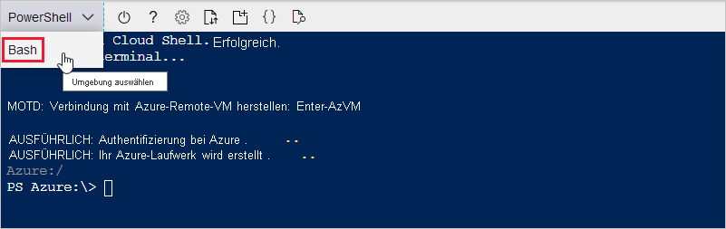

In den folgenden Abschnitten richten Sie ein Terminal ein und verwenden die Azure CLI zum Erstellen eines IoT-Hubs. Zum Konfigurieren eines Terminals, auf dem Azure CLI-Befehle ausgeführt werden, können Sie entweder den browserbasierten Azure Cloud Shell-Dienst oder ein lokales Terminal verwenden.
* Wenn Sie Cloud Shell verwenden möchten, fahren Sie mit dem nächsten Abschnitt fort: [Starten der Cloud Shell](#launch-the-cloud-shell). 
* Wenn Sie ein lokales Terminal verwenden möchten, überspringen Sie den nächsten Abschnitt, und wechseln Sie zu [Öffnen eines lokalen Terminals](#open-a-local-terminal).

## <a name="launch-the-cloud-shell"></a>Starten der Cloud Shell
In diesem Abschnitt erstellen Sie eine Cloud Shell-Sitzung und konfigurieren die Terminalumgebung.

Melden Sie sich unter https://portal.azure.com beim Azure-Portal an.  

Starten Sie die Cloud Shell wie folgt:

1. Wählen Sie im Azure-Portal oben rechts in der Menüleiste die Schaltfläche **Cloud Shell** aus. 

    

    > [!NOTE]
    > Falls Sie die Cloud Shell bisher noch nicht verwendet haben, werden Sie zum Erstellen von Speicher aufgefordert, der für die Nutzung der Cloud Shell erforderlich ist.  Wählen Sie ein Abonnement aus, in dem ein Speicherkonto und eine Microsoft Azure Files-Freigabe erstellt werden sollen. 

2. Wählen Sie in der Dropdownliste **Umgebung auswählen** Ihre bevorzugte CLI-Umgebung aus. In dieser Schnellstartanleitung wird die **Bash**-Umgebung verwendet. Alle folgenden CLI-Befehle funktionieren auch in der PowerShell-Umgebung. 

    

3. Überspringen Sie den nächsten Abschnitt, und wechseln Sie zu [Installieren der Azure IoT-Erweiterung](#install-the-azure-iot-extension). 

## <a name="open-a-local-terminal"></a>Öffnen eines lokalen Terminals
Wenn Sie sich für die Verwendung eines lokalen Terminals anstelle von Cloud Shell entschieden haben, schließen Sie diesen Abschnitt ab.  

1. Öffnen Sie ein lokales Terminal.
1. Führen Sie den Befehl [az login](/cli/azure/reference-index#az_login) aus:

   ```azurecli
   az login
   ```

    Die CLI öffnet Ihren Standardbrowser, sofern sie dazu in der Lage ist, und lädt eine Azure-Anmeldeseite.

    Öffnen Sie andernfalls die Browserseite https://aka.ms/devicelogin, und geben Sie den in Ihrem Terminal angezeigten Autorisierungscode ein.

    Falls kein Webbrowser verfügbar ist oder nicht geöffnet werden kann, verwenden Sie den Gerätecodefluss mit `az login --use-device-code`.

1. Melden Sie sich im Browser mit Ihren Anmeldeinformationen an.

    Weitere Informationen zu verschiedenen Authentifizierungsmethoden finden Sie unter [Anmelden mit der Azure CLI]( /cli/azure/authenticate-azure-cli ).

1. Gehen Sie zum nächsten Abschnitt: [Installieren der Azure IoT-Erweiterung](#install-the-azure-iot-extension). 

## <a name="install-the-azure-iot-extension"></a>Installieren der Azure IoT-Erweiterung
In diesem Abschnitt installieren Sie die Microsoft Azure IoT-Erweiterung für die Azure CLI in Ihrer CLI-Shell. Die IoT-Erweiterung fügt der Azure-Befehlszeilenschnittstelle spezifische Befehle für IoT Hub, IoT Edge und IoT Device Provisioning Service (DPS) hinzu.

> [!IMPORTANT]
> Die Funktionsweise der Terminalbefehle im weiteren Verlauf dieser Schnellstartanleitung ist in Cloud Shell oder einem lokalen Terminal identisch. Wählen Sie zum Ausführen eines Befehls die Option **Kopieren** aus, um einen Codeblock aus dieser Schnellstartanleitung zu kopieren. Fügen Sie ihn dann in Ihre CLI-Shell ein, und führen Sie ihn aus.

Führen Sie den Befehl [az extension add](/cli/azure/extension#az_extension_add) aus. 

   ```azurecli
   az extension add --name azure-iot
   ```
[!INCLUDE [iot-hub-cli-version-info](iot-hub-cli-version-info.md)]

## <a name="create-an-iot-hub"></a>Erstellen eines IoT-Hubs
In diesem Abschnitt verwenden Sie die Azure CLI zum Erstellen eines IoT-Hubs und einer Ressourcengruppe.  Eine Azure-Ressourcengruppe ist ein logischer Container, in dem Azure-Ressourcen bereitgestellt und verwaltet werden. Ein IoT-Hub fungiert als zentraler Nachrichtenhub für die bidirektionale Kommunikation zwischen Ihrer IoT-Anwendung und den Geräten. 

So erstellen Sie einen IoT-Hub und eine Ressourcengruppe:

1. Führen Sie den Befehl [az group create](/cli/azure/group#az_group_create) aus, um eine Ressourcengruppe zu erstellen. Mit dem folgenden Befehl wird eine Ressourcengruppe mit dem Namen *MyResourceGroup* am Standort *eastus* erstellt. 
    >[!NOTE]
    > Optional können Sie auch einen alternativen Standort festlegen. Führen Sie zum Anzeigen der verfügbaren Standorte `az account list-locations` aus. In diesem Tutorial wird *eastus* verwendet, wie im Beispielbefehl gezeigt. 

    ```azurecli
    az group create --name MyResourceGroup --location eastus
    ```

1. Führen Sie den Befehl [az iot hub create](/cli/azure/iot/hub#az_iot_hub_create) aus, um einen IoT-Hub zu erstellen. Es kann einige Minuten dauern, bis ein IoT-Hub erstellt wurde. 

    *YourIotHubName*: Ersetzen Sie diesen Platzhalter und die umgebenden geschweiften Klammern im folgenden Befehl durch den Namen, den Sie für Ihren IoT-Hub ausgewählt haben. Der Name eines IoT-Hubs muss in Azure global eindeutig sein. Verwenden Sie im weiteren Verlauf dieser Schnellstartanleitung den Namen des IoT-Hubs für alle Vorkommen dieses Platzhalters.

    ```azurecli
    az iot hub create --resource-group MyResourceGroup --name {YourIoTHubName}
    ```

## <a name="create-a-simulated-device"></a>Erstellen Sie ein simuliertes Gerät.
In diesem Abschnitt erstellen Sie ein simuliertes IoT-Gerät, das mit Ihrem IoT-Hub verbunden ist. 

So erstellen Sie ein simuliertes Gerät:
1. Führen Sie in der CLI-Shell den Befehl [az iot hub device-identity create](/cli/azure/ext/azure-iot/iot/hub/device-identity#ext-azure-iot-az-iot-hub-device-identity-create) aus. Die Identität des simulierten Geräts wird erstellt. 

    *YourIotHubName*: Ersetzen Sie diesen Platzhalter unten durch den Namen, den Sie für Ihren IoT-Hub ausgewählt haben. 

    *myDevice*. Sie können diesen Namen im weiteren Verlauf dieses Artikels direkt für die ID des simulierten Geräts verwenden. Optional können Sie auch einen anderen Namen nutzen. 

    ```azurecli
    az iot hub device-identity create --device-id myDevice --hub-name {YourIoTHubName} 
    ```

1.  Führen Sie den Befehl [az iot hub device-identity connection-string show](/cli/azure/ext/azure-iot/iot/hub/device-identity/connection-string#ext_azure_iot_az_iot_hub_device_identity_connection_string_show) aus. 

    ```azurecli
    az iot hub device-identity connection-string show --device-id myDevice --hub-name {YourIoTHubName}
    ```

    Die Ausgabe der Verbindungszeichenfolge hat folgendes Format:

    ```Output
    HostName=<your IoT Hub name>.azure-devices.net;DeviceId=<your device id>;SharedAccessKey=<some value>
    ```

1. Speichern Sie die Verbindungszeichenfolge an einem sicheren Ort. 

> [!NOTE]
> Lassen Sie die CLI-Shell geöffnet. Sie werden ihn später benötigen.