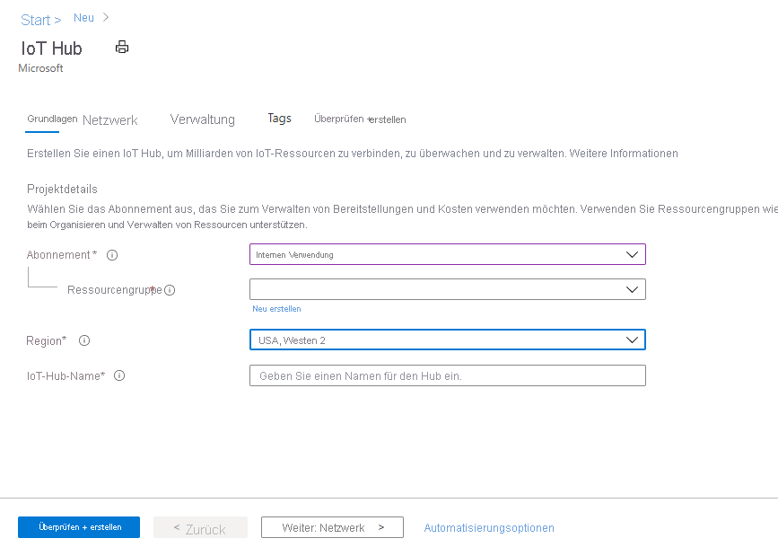
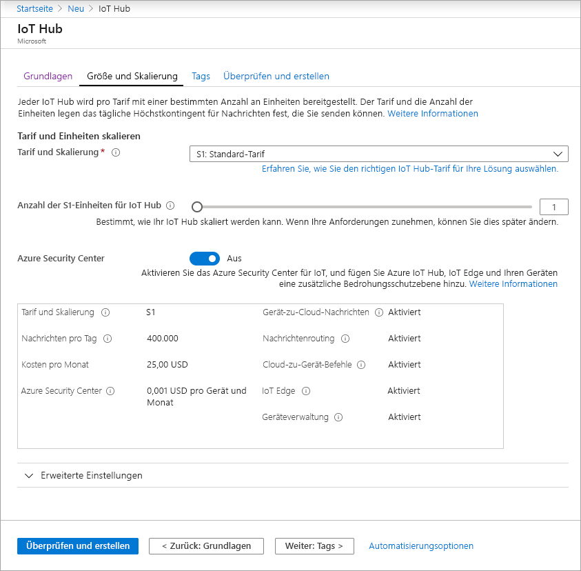
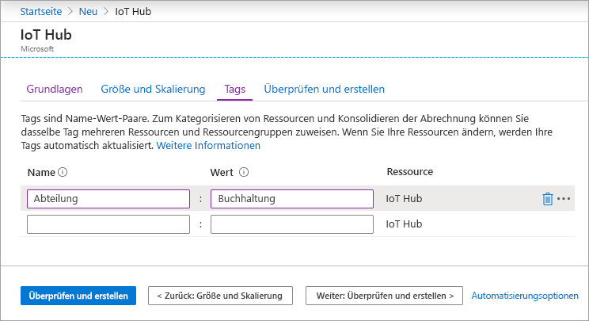
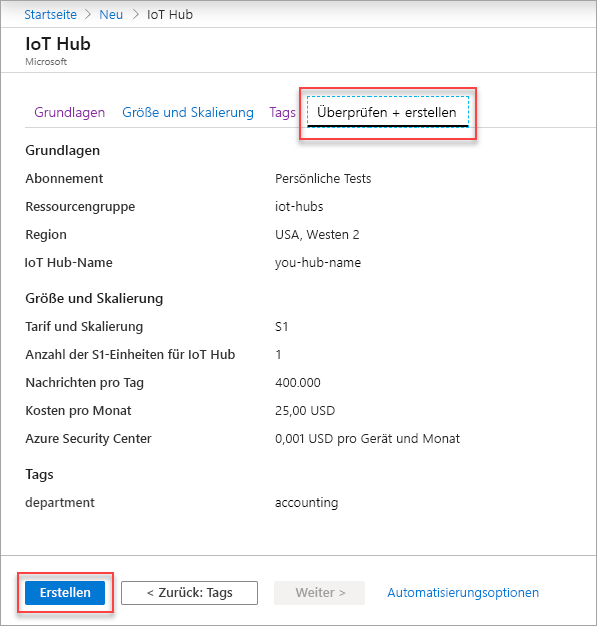

In diesem Abschnitt wird beschrieben, wie Sie über das [Azure-Portal](https://portal.azure.com) einen IoT-Hub erstellen:

1. Melden Sie sich beim [Azure-Portal](https://portal.azure.com) an.

1. Wählen Sie auf der Azure-Startseite die Schaltfläche **+ Ressource erstellen** aus, und geben Sie dann ins Feld **Marketplace durchsuchen** den Begriff *IoT Hub* ein.

1. Wählen Sie in den Suchergebnissen **IoT Hub** und dann **Erstellen** aus.

1. Füllen Sie auf der Registerkarte **Grundlegende Einstellungen** die Felder wie folgt aus:

   - **Abonnement**: Wählen Sie das Abonnement aus, das Sie für Ihren Hub verwenden möchten.

   - **Ressourcengruppe**: Wählen Sie eine vorhandene Ressourcengruppe aus, oder erstellen Sie eine neue. Wählen Sie zum Erstellen einer neuen Ressourcengruppe die Option **Neu erstellen** aus, und geben Sie den Namen ein, den Sie verwenden möchten. Wenn Sie eine vorhandene Ressourcengruppe verwenden möchten, wählen Sie die entsprechende Ressourcengruppe aus. Weitere Informationen finden Sie unter [Verwalten von Azure Resource Manager-Ressourcengruppen](../articles/azure-resource-manager/management/manage-resource-groups-portal.md).

   - **Region**: Wählen Sie die Region aus, in der sich Ihr Hub befinden soll. Wählen Sie den Standort aus, der Ihnen am nächsten ist. Einige Features, etwa [IoT Hub-Gerätestreams](../articles/iot-hub/iot-hub-device-streams-overview.md), sind nur in bestimmten Regionen verfügbar. Für diese eingeschränkten Features müssen Sie eine der unterstützten Regionen auswählen.

   - **IoT Hub-Name**: Geben Sie einen Namen für den Hub ein. Dieser Name muss global eindeutig sein. Wenn der eingegebene Name verfügbar ist, wird ein grünes Häkchen angezeigt.

   [!INCLUDE [iot-hub-pii-note-naming-hub](iot-hub-pii-note-naming-hub.md)]

   

1. Klicken Sie auf **Weiter: Größe und Skalierung**, um die Erstellung Ihres Hubs fortzusetzen.

   

   Sie können hier die Standardeinstellungen übernehmen. Sie können bei Bedarf die folgenden Felder anpassen: 

    - **Tarif und Skalierung**: Ihre ausgewählte Ebene. Ihnen stehen abhängig davon, wie viele Features Sie verwenden und wie viele Nachrichten Sie über Ihre Lösung pro Tag senden möchten, mehrere Tarife zur Auswahl. Der kostenlose Tarif ist für Test und Bewertung vorgesehen. Damit kann für 500 Geräte eine Verbindung mit dem Hub hergestellt werden, und bis zu 8.000 Nachrichten pro Tag sind möglich. Jedes Azure-Abonnement kann einen IoT-Hub im kostenlosen Tarif erstellen. 

      Wenn Sie eine Schnellstartanleitung für IoT Hub-Gerätestreams durcharbeiten, wählen Sie den Free-Tarif aus.

    - **IoT Hub-Einheiten**: Die Anzahl der pro Einheit und Tag zulässigen Nachrichten hängt von Ihrem Hubtarif ab. Beispiel: Wenn der Hub 700.000 eingehende Nachrichten unterstützen soll, wählen Sie zwei Einheiten des Tarifs S1.
    Einzelheiten zu den anderen Tarifoptionen finden Sie unter [Skalieren einer IoT Hub-Lösung](../articles/iot-hub/iot-hub-scaling.md).

    - **Azure Security Center**: Aktivieren Sie diese Option, um IoT und Ihren Geräten eine zusätzliche Ebene für den Bedrohungsschutz hinzuzufügen. Diese Option steht nicht für Hubs im Free-Tarif zur Verfügung. Weitere Informationen zu diesem Feature finden Sie in der [Dokumentation zu Azure Security Center für IoT](https://docs.microsoft.com/azure/asc-for-iot/).

    - **Erweiterte Einstellungen** > **Gerät-zu-Cloud-Partitionen**: Diese Eigenschaft setzt die Gerät-zu-Cloud-Nachrichten in Relation zur Anzahl von gleichzeitigen Lesern der Nachrichten. Die meisten Hubs benötigen nur vier Partitionen.

1.  Klicken Sie auf **Weiter: Tags**, um mit dem nächsten Bildschirm fortzufahren.

    Tags sind Name-Wert-Paare. Sie können das gleiche Tag mehreren Ressourcen und Ressourcengruppen zuweisen, um Ressourcen zu kategorisieren und die Abrechnung zu konsolidieren. Weitere Informationen finden Sie unter [Verwenden von Tags zum Organisieren von Azure-Ressourcen](../articles/azure-resource-manager/management/tag-resources.md).

    

1.  Klicken Sie auf **Weiter: Überprüfen + erstellen**, um Ihre Auswahl zu überprüfen. Die Anzeige entspricht in etwa dem folgenden Bildschirm, allerdings werden die Werte verwendet, die Sie beim Erstellen des Hubs ausgewählt haben. 

    

1.  Wählen Sie **Erstellen** aus, um Ihren neuen Hub zu erstellen. Das Erstellen des Hubs dauert einige Minuten.
