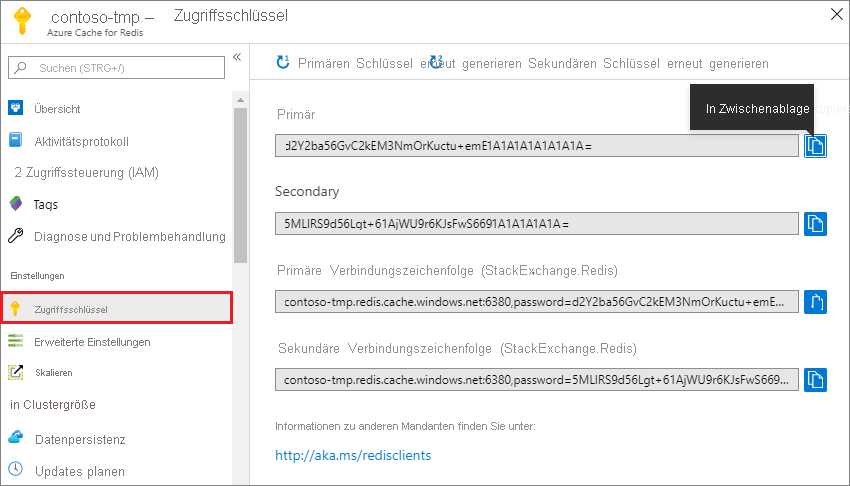
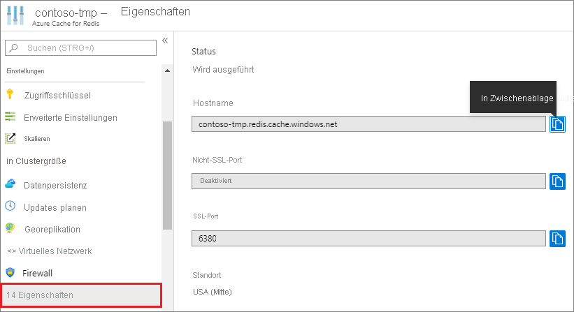

### Abrufen von Hostname, Ports und Zugriffsschlüsseln vom Azure-Portal

Um eine Verbindung mit einer Azure Cache for Redis-Instanz herzustellen, benötigen Cacheclients den Hostnamen, die Ports und einen Schlüssel für den Cache. Von einigen Clients wird unter Umständen mit etwas anderen Namen auf diese Elemente verwiesen. Sie können den Hostnamen, Ports und Zugriffsschlüssel vom [Azure-Portal](https://portal.azure.com) abrufen.

- Wählen Sie **Zugriffsschlüssel** aus, um die Zugriffsschlüssel aus dem linken Navigationsbereich des Cache abzurufen. 
  
  

- Wählen Sie **Eigenschaften** aus, um den Hostnamen und die Ports aus dem linken Navigationsbereich des Cache abzurufen. Der Hostname hat das Format *\<DNS name>.redis.cache.windows.net*.

  

