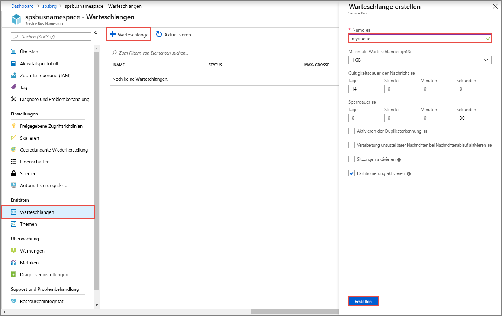

## Erstellen einer Warteschlange im Azure-Portal
1. Wählen Sie auf der Seite **Service Bus-Namespace** im linken Navigationsmenü die Option **Warteschlangen** aus.
1. Wählen Sie auf der Seite **Warteschlangen** auf der Symbolleiste die Option **+ Warteschlange** aus.
1. Geben Sie einen **Namen** für die Warteschlange ein, und lassen Sie die anderen Werte unverändert.
1. Wählen Sie jetzt **Erstellen**.
 
    

